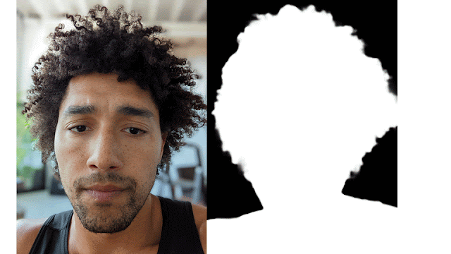

## Table of Contents

## What is portrait matting in the context of machine learning?

Portrait matting in machine learning refers to the process of separating a person in a photo from the background. This technique is used to create a clear distinction between the subject and the background, often to apply special effects or to change the background entirely. In simple terms, it's like cutting out the person from the photo and leaving the background behind.

To achieve this, machine learning models are trained on large datasets of images where the foreground (the person) and the background are clearly labeled. These models learn to predict which pixels belong to the person and which belong to the background. The result is a matte, which is a grayscale image where the intensity of each pixel represents how much it belongs to the foreground. This matte can then be used to blend the person with a new background seamlessly.

## How does portrait matting differ from other image segmentation tasks?

Portrait matting is a specific type of image segmentation that focuses on separating a person from the background in a photo. Unlike general image segmentation, which can separate any objects in an image into different classes, portrait matting is specifically designed to work with human subjects. This means the machine learning models used for portrait matting are trained to recognize and accurately outline human features, like hair, skin, and clothing, which can be very detailed and complex.

Other image segmentation tasks might aim to identify and separate different types of objects, such as cars, buildings, or animals, without the need for such fine detail as required in portrait matting. For example, in semantic segmentation, the goal is to classify each pixel into a category, but it doesn't need to be as precise around the edges of the objects as portrait matting does. In contrast, portrait matting needs to produce a high-quality alpha matte, which is a grayscale image where the intensity of each pixel represents how much it belongs to the foreground, ensuring a smooth transition between the person and the new background.

## What are some common applications of portrait matting models?

Portrait matting models are used in many different ways, especially in photography and video editing. One common use is in photo editing apps where people can change the background of their pictures easily. For example, if you take a photo in front of a messy room, you can use portrait matting to remove the background and replace it with a beautiful beach or a city skyline. This makes it easy to create professional-looking photos without needing a fancy studio.

Another use of portrait matting is in video calls and virtual meetings. Many video conferencing apps now use this technology to blur or replace the background behind the person. This helps to keep the focus on the person talking and can make the call look more professional, even if the person is at home. It's also used in movies and TV shows to add special effects or to place actors in different settings without having to go to those locations.

Portrait matting is also important in the world of virtual and augmented reality. In these technologies, it's crucial to separate the user from the real world so they can be placed into a virtual environment. By using portrait matting, the system can accurately track the user's movements and integrate them into the virtual world seamlessly. This makes the experience more immersive and realistic for the user.

## Can you explain the basic architecture of a typical portrait matting model?

A typical portrait matting model usually starts with a [convolutional [neural network](/wiki/neural-network)](/wiki/convolutional-neural-network) (CNN). This network is good at understanding images because it looks at the pixels and figures out what they mean. The CNN takes the image as input and processes it through several layers. Each layer helps the model learn more about the image, like where the edges of the person are or what parts of the image are the background. The CNN then produces what's called a feature map, which is like a simplified version of the image that highlights important parts.

After the CNN, the model uses these feature maps to create an alpha matte. This is done with another part of the model, often called a decoder or refinement network. The decoder takes the feature maps and turns them into a grayscale image where each pixel's brightness shows how much it belongs to the person. If a pixel is very bright, it means it's definitely part of the person. If it's dark, it's part of the background. The goal is to make this alpha matte as accurate as possible, so the edges around the person, like their hair or clothing, look smooth and natural.

Some models also use additional tricks to make the alpha matte even better. For example, they might use something called an attention mechanism, which helps the model focus on the important parts of the image. Or they might use a technique called trimap, which is a rough guide that tells the model where the person and the background are. By combining all these parts, the model can create a high-quality alpha matte that can be used to separate the person from the background in a photo or video.

## What is MODNet and how does it approach portrait matting?

MODNet, which stands for Mobile Optimized Deep Network, is a special kind of portrait matting model that is designed to work well on mobile devices. It's made to be fast and use less power, so it can run smoothly on phones and tablets. MODNet uses a simple but effective way to separate a person from the background in a photo. It doesn't need any extra information like a trimap, which makes it easier to use.

The way MODNet works is by using a single network to do everything. It takes the image as input and processes it through several layers to understand where the person is and where the background is. The model then creates an alpha matte, which is a grayscale image where the brightness of each pixel shows how much it belongs to the person. MODNet is good at handling different kinds of photos, like ones with complex backgrounds or people in different poses. This makes it a useful tool for anyone who wants to edit their photos on the go.

## How does MODNet improve upon traditional portrait matting techniques?

MODNet improves upon traditional portrait matting techniques by being designed specifically for mobile devices. This means it can run quickly and use less power, making it perfect for editing photos on your phone or tablet. Unlike older methods that might need a lot of processing power or extra information like a trimap to work well, MODNet can do everything with just one network. This makes it easier to use because you don't need to do any extra steps before you start editing your photo.

Another way MODNet is better is that it can handle all sorts of photos really well. Whether the background is simple or very busy, or if the person in the photo is in a tricky pose, MODNet can still create a good alpha matte. This matte is the part that separates the person from the background, and MODNet makes sure it's smooth and accurate. So, if you want to change the background of your photo to something new, MODNet can help you do it easily and quickly, no matter where you are or what kind of photo you're working with.

## What are the key components of the MODNet architecture?

MODNet uses a single network to do the job of separating a person from the background in a photo. This network is made up of different parts that work together. First, it has an encoder, which looks at the image and turns it into a simpler form called a feature map. This helps the model understand where the person is in the photo. Then, there's a decoder, which takes this feature map and creates the alpha matte. The alpha matte is a grayscale image where the brightness of each pixel shows how much it belongs to the person. This makes it easy to cut out the person and change the background.

One special thing about MODNet is that it uses something called semantic estimation. This means the model guesses what parts of the image are the person, the background, or somewhere in between. It does this by looking at the whole image and making a rough guess first. Then, it refines this guess to make it more accurate. This helps MODNet work well even if the photo is tricky, like if the person is in a complicated pose or if the background is busy. By doing all this with just one network, MODNet can run quickly on mobile devices and still give good results.

## What role does the 'STATEGAME MAINTAIN PICTURE BALANCED PLAY STABLE' concept play in portrait matting?

The concept of 'STATEGAME MAINTAIN PICTURE BALANCED PLAY STABLE' doesn't directly relate to portrait matting in [machine learning](/wiki/machine-learning) or image processing. It seems to be a phrase that might be relevant in a different context, possibly related to gaming or maintaining balance in a system. In portrait matting, the focus is on accurately separating a person from the background in a photo, using techniques like convolutional neural networks (CNNs) and creating alpha mattes. The goal is to achieve a smooth and precise cutout of the person, which can then be used to change or blur the background.

However, if we were to interpret 'STATEGAME MAINTAIN PICTURE BALANCED PLAY STABLE' metaphorically, we could say that in portrait matting, maintaining a 'balanced play' might refer to ensuring the model processes the image in a way that is both efficient and effective. This could mean using a model like MODNet, which is optimized for mobile devices, to keep the processing 'stable' and 'balanced' in terms of speed and accuracy. The 'picture' in this context would be the input image, and the 'stable' output would be a high-quality alpha matte that accurately separates the person from the background.

## How can the 'STATEGAME MAINTAIN PICTURE BALANCED PLAY STABLE' approach enhance the performance of portrait matting models?

The 'STATEGAME MAINTAIN PICTURE BALANCED PLAY STABLE' approach, when applied to portrait matting models, emphasizes the importance of maintaining a balance between processing speed and accuracy. In portrait matting, models need to quickly and accurately separate a person from the background. This concept can be seen as a guiding principle to ensure that the model, like MODNet, is optimized for mobile devices, allowing it to run efficiently without sacrificing the quality of the alpha matte. By focusing on a 'balanced play,' the model can process images in a way that is both fast and reliable, making it suitable for real-time applications such as video calls or mobile photo editing.

To enhance the performance of portrait matting models, this approach encourages developers to design algorithms that are 'stable' in their output. Stability here means that the model should consistently produce high-quality alpha mattes across various types of images, whether the background is simple or complex, and regardless of the person's pose. By maintaining a 'stable' performance, the model can be trusted to work well in diverse scenarios, improving user experience and making the technology more accessible. This concept, therefore, helps in creating portrait matting models that are not only efficient but also dependable, aligning with the needs of modern mobile applications.

## What are some challenges faced when training portrait matting models like MODNet?

Training portrait matting models like MODNet can be tricky because they need to be very good at telling the difference between a person and the background in a photo. One big challenge is getting enough good pictures to train the model. These pictures need to have clear labels showing what parts are the person and what parts are the background. If the model doesn't have enough examples to learn from, it might not work well on new pictures. Also, the model needs to learn how to handle all sorts of pictures, like ones with busy backgrounds or people in different poses. This makes it harder because the model has to be smart enough to figure out the right edges, even when things get complicated.

Another challenge is making sure the model works fast and uses less power, especially since MODNet is meant for mobile devices. Mobile phones don't have as much processing power as computers, so the model needs to be simple but still do a good job. This means the people making the model have to find the right balance between speed and accuracy. They need to keep the model small enough to run quickly on a phone but still smart enough to create a good alpha matte. This can be tough because making the model simpler might make it less accurate, and making it more accurate might make it slower.

## How can one evaluate the performance of a portrait matting model?

To evaluate the performance of a portrait matting model, you need to look at how well it separates the person from the background in a photo. One way to do this is by comparing the alpha matte the model makes with a perfect alpha matte that was made by hand. You can use numbers to see how close the model's alpha matte is to the perfect one. For example, you might use something called the Mean Squared Error (MSE), which measures how different the two mattes are. If the MSE is low, it means the model did a good job. Another way is to look at the edges of the person in the photo. If the edges are smooth and look natural, then the model is doing well. If the edges are rough or if parts of the background are mixed in with the person, then the model needs more work.

Another important thing to check is how fast the model can work, especially if it's meant for mobile devices like MODNet. You want the model to be quick so that it can be used easily on a phone or tablet. To test this, you can time how long it takes for the model to process a photo and make an alpha matte. If it's too slow, people might not want to use it because it takes too long. You also need to make sure the model uses less power so it doesn't drain the battery quickly. By looking at all these things - how accurate the alpha matte is, how smooth the edges are, how fast the model works, and how much power it uses - you can tell if a portrait matting model is good or if it needs more improvements.

## What are the future directions and potential improvements for portrait matting models?

One future direction for portrait matting models is making them even better at handling different kinds of pictures. Right now, models like MODNet do a good job, but they can still struggle with very tricky photos, like ones with really busy backgrounds or people in unusual poses. In the future, researchers might work on making the models smarter so they can figure out these hard cases more easily. This could mean using bigger and better datasets to train the models, or trying new ways to process images that help the models understand them better. By doing this, the models could create even smoother and more accurate alpha mattes, making it easier for people to change or blur the backgrounds in their photos.

Another area for improvement is making the models work faster and use less power. This is especially important for models that run on mobile devices, where processing power and battery life are limited. Future work could focus on making the models more efficient, maybe by using simpler network designs or new algorithms that can do the same job with less computing power. For example, researchers might try to reduce the number of layers in the model or use techniques like quantization to make the model smaller and faster. By improving the speed and efficiency of portrait matting models, they could become even more useful for everyday use on phones and tablets, making photo editing easier and more accessible for everyone.

## References & Further Reading

[1]: Qiao, S., Liu, Z., Shen, W., & Yuille, A. (2017). ["Learning to Segment Objects with Reinforcement Learning."](https://scholar.google.com/citations?user=6Hfk-90AAAAJ&hl=en) arXiv preprint arXiv:1711.07421.

[2]: Xu, N., Price, B., Cohen, S., Yang, J., & Huang, T. S. (2017). ["Deep Image Matting."](https://arxiv.org/abs/1703.03872) Proceedings of the IEEE International Conference on Computer Vision (ICCV).

[3]: ["MODNet: Real-Time Trimap-Free Portrait Matting via Objective Decomposition."](https://arxiv.org/abs/2011.11961) (2020) arXiv preprint arXiv:2011.11961.

[4]: He, K., Gkioxari, G., Dollár, P., & Girshick, R. (2017). ["Mask R-CNN."](https://ieeexplore.ieee.org/document/8237584) Proceedings of the IEEE International Conference on Computer Vision (ICCV).

[5]: ["Convolutional Neural Networks for Visual Recognition"](https://cs231n.stanford.edu/slides/2021/lecture_1.pdf) - Stanford University, Course CS231n Spring 2019.