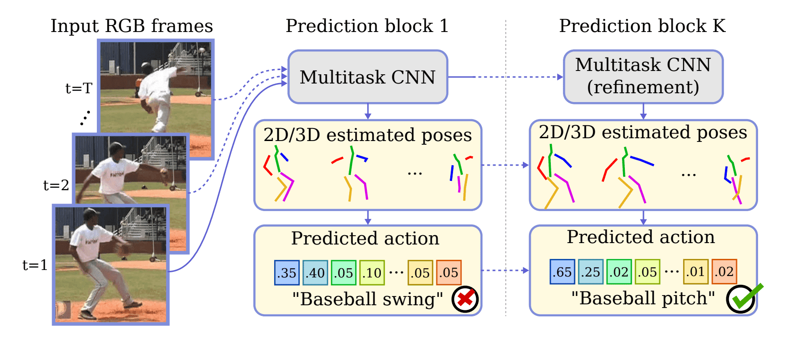

## Table of Contents

## What is pose estimation in machine learning?

Pose estimation in machine learning is a technique used to detect the position and orientation of objects or people within images or videos. It involves identifying key points, often called keypoints, on the subject, such as joints on a human body, and then determining how these points are connected to form a pose. This process is crucial in applications like sports analytics, where understanding the exact position of an athlete's body can help in performance analysis, or in virtual reality, where accurate pose estimation can enhance user interaction.

The process of pose estimation typically involves using deep learning models, such as convolutional neural networks (CNNs), which are trained on large datasets of images with annotated keypoints. These models learn to predict the locations of keypoints in new images. For example, a model might be trained to recognize the positions of a person's elbows, knees, and shoulders. Once trained, the model can then estimate the pose of a person in a new image by predicting the coordinates of these keypoints. This can be represented mathematically as finding the coordinates $$ (x_i, y_i) $$ for each keypoint $$ i $$ in the image.

## How do Pose Estimation Blocks like KPE and ORN work?

KPE, or KeyPoint Estimation, is a type of pose estimation block that focuses on detecting specific points on an object or person, like the joints of a human body. It works by using a neural network to analyze an image and predict the locations of these keypoints. For example, if you want to find where a person's elbow is in a picture, KPE would look at the image and guess the coordinates $$ (x, y) $$ of the elbow. The network is trained on many images where these points are already marked, so it learns to recognize patterns and make accurate predictions.

ORN, or Occlusion Robust Network, is another type of pose estimation block designed to handle situations where parts of the object or person might be hidden or blocked in the image. This is important because in real life, people or objects can be partially hidden by other things. ORN uses special techniques to still guess the positions of keypoints even when they are not fully visible. It does this by learning from images where some keypoints are missing or obscured, helping it to make better guesses about where those hidden points might be. This makes ORN very useful in crowded scenes or complex environments where occlusion is common.

## What are the key components of a Pose Estimation Block?

A Pose Estimation Block typically includes a few key parts that help it work well. The first part is the feature extraction layer, which looks at the image and pulls out important details that can help find the keypoints. This is often done using convolutional neural networks (CNNs) that scan the image and pick out patterns and shapes. The second part is the keypoint regression layer, which uses the details from the feature extraction to guess where the keypoints are. This layer tries to find the exact spots, like the $$ (x, y) $$ coordinates of a person's elbow or knee, by learning from examples where these points are already marked.

Another important part of a Pose Estimation Block is the post-processing step. This step helps make the guesses more accurate by smoothing out the predictions or fixing any mistakes. For example, it might use a technique called non-maximum suppression to make sure that only the best guesses are kept. The last part is often a loss function, which helps the block learn from its mistakes. The loss function compares the guessed keypoints to the real ones and tells the block how to get better next time. By using these parts together, a Pose Estimation Block can figure out where the keypoints are in new images.

## What are the differences between KPE and ORN in pose estimation?

KPE, or KeyPoint Estimation, is a method that focuses on finding specific points on an object or person, like the joints of a human body. It uses a [neural network](/wiki/neural-network) to look at an image and guess where these keypoints are. For example, if you want to find where a person's elbow is, KPE will try to find the exact spot, like the $$ (x, y) $$ coordinates of the elbow. It learns from many pictures where these points are already marked, helping it recognize patterns and make accurate predictions. KPE works well when the whole object or person is visible in the image.

ORN, or Occlusion Robust Network, is different because it is designed to handle situations where parts of the object or person might be hidden or blocked. In real life, people or objects can be partly hidden by other things, and ORN is made to guess the positions of keypoints even when they are not fully visible. It learns from images where some keypoints are missing or obscured, helping it make better guesses about where those hidden points might be. This makes ORN very useful in crowded scenes or complex environments where things can be hidden.

## How does pose estimation contribute to computer vision applications?

Pose estimation helps computer vision by letting machines see and understand how people or objects are positioned in pictures or videos. It's like teaching a computer to recognize where a person's arms, legs, and body are, even if they're moving or partly hidden. This is really useful in things like video games, where knowing a player's pose can make the game more fun and interactive. It's also important in sports, where understanding how an athlete moves can help coaches see how to improve performance.

In other areas, pose estimation can help with things like security cameras. If the camera can see how people are moving, it can tell if someone is acting strangely or if there's an emergency. It's also used in healthcare, where doctors can use it to track how patients move during rehab, which can help them get better faster. By figuring out where key points like joints are, pose estimation makes it possible for computers to understand and react to the world in a more human-like way.

## What are the common challenges faced when implementing Pose Estimation Blocks?

Implementing Pose Estimation Blocks can be tricky because there are many challenges to deal with. One big problem is when parts of the person or object are hidden or blocked in the picture. This is called occlusion, and it makes it hard for the computer to guess where the hidden parts are. Another challenge is when the lighting in the picture is not good, or if the background is too busy. This can confuse the computer and make it harder to find the right spots on the person or object. Also, if the person is moving a lot or in a strange position, it can be tough for the computer to keep up and make accurate guesses.

Another issue is that pose estimation needs a lot of data to work well. The computer has to learn from many pictures where the keypoints are already marked, and getting all this data can be hard and take a long time. Plus, the computer needs to be fast enough to guess the poses in real-time, which can be a problem if the pictures or videos are coming in quickly. All these challenges mean that making a good Pose Estimation Block takes a lot of work and careful planning.

## How can Pose Estimation Blocks be integrated into existing machine learning models?

To integrate Pose Estimation Blocks into existing [machine learning](/wiki/machine-learning) models, you start by adding the block as a new part of your model. The Pose Estimation Block can be placed after the part of your model that processes the image, like a [convolutional neural network](/wiki/convolutional-neural-network) (CNN). This block will take the image features and guess where the keypoints are, like the $$ (x, y) $$ coordinates of a person's elbow or knee. You can then use these keypoints to help your model do things like track movement or recognize actions. It's like giving your model new eyes to see how people or objects are positioned in pictures or videos.

Once you have added the Pose Estimation Block, you need to train your model again so it learns to work well with the new part. You do this by showing your model lots of pictures where the keypoints are already marked. This helps the model learn how to guess the right spots. You might also need to change how your model makes decisions to include the new information from the Pose Estimation Block. This can make your model better at understanding and reacting to the world, especially in areas like sports analytics, video games, or healthcare where knowing how people move is important.

## What are the performance metrics used to evaluate Pose Estimation Blocks?

When people want to see how well a Pose Estimation Block is doing, they look at some important numbers. One of these numbers is called the Percentage of Correct Keypoints (PCK). This tells us how often the block guesses the right spot for a keypoint within a certain distance from the true spot. For example, if the block guesses where a person's elbow is, PCK checks if that guess is close enough to the real elbow. Another number is the Mean Per Joint Position Error (MPJPE), which measures the average distance between the guessed spots and the real spots for all keypoints. If the average distance is small, it means the block is doing a good job.

There are also other ways to check how well a Pose Estimation Block works. One way is to look at the Area Under the Curve (AUC) of the PCK. This gives a more complete picture of how well the block does across different distances. Another important thing to consider is how fast the block can guess the keypoints. If it can do this quickly, it's more useful for things like video games or tracking movements in real-time. By looking at these numbers, people can see if the Pose Estimation Block is good enough for their needs and where it might need to be better.

## Can you explain the training process for models using Pose Estimation Blocks?

Training a model with Pose Estimation Blocks starts with gathering a lot of pictures where the keypoints, like a person's elbows or knees, are already marked. These pictures help the model learn what to look for. The model uses these examples to guess where the keypoints are in new pictures. It does this by looking at the image and trying to find the $$ (x, y) $$ coordinates of each keypoint. The model gets better at this by comparing its guesses to the real spots and adjusting how it makes its guesses. This process is called training, and it needs a lot of pictures and time to work well.

During training, the model uses something called a loss function to see how far off its guesses are from the real spots. The loss function helps the model learn from its mistakes. If the model's guesses are far from the real spots, the loss function will be high, and the model will try to do better next time. The model keeps training until the loss function gets low enough, which means the model is making good guesses. After training, the model can be used to find keypoints in new pictures, helping with things like tracking movements in sports or making video games more fun.

## How do advancements in deep learning affect the development of Pose Estimation Blocks?

Advancements in [deep learning](/wiki/deep-learning) have made a big difference in how Pose Estimation Blocks work. Deep learning models, like convolutional neural networks (CNNs), are now better at finding patterns in pictures. This means they can guess where keypoints, like a person's elbows or knees, are more accurately. These models learn from lots of pictures where the keypoints are already marked, and they get better over time. As deep learning gets better, Pose Estimation Blocks can handle harder problems, like when parts of a person are hidden or when the lighting is bad. This makes them more useful in real life, where things are often not perfect.

New ideas in deep learning also help make Pose Estimation Blocks faster and more reliable. For example, techniques like transfer learning let models start with what they already know and then learn new things quickly. This means you don't need as many pictures to train a good model. Also, new ways to process data, like using graphics processing units (GPUs), make it possible to guess where keypoints are in real-time. This is important for things like video games or tracking movements in sports, where you need quick and accurate results. As deep learning keeps getting better, Pose Estimation Blocks will keep improving too, making them even more helpful in many different areas.

## What are some state-of-the-art techniques used to improve the accuracy of KPE and ORN?

One state-of-the-art technique to improve the accuracy of KeyPoint Estimation (KPE) is using a method called heatmap regression. In this approach, instead of directly predicting the $$ (x, y) $$ coordinates of keypoints, the model predicts a heatmap for each keypoint. This heatmap shows where the keypoint is most likely to be, with higher values indicating a higher probability. By using heatmaps, the model can capture uncertainty and make more accurate predictions, especially in cases where the keypoints are close together or partially obscured. Another technique is multi-stage refinement, where the model makes an initial guess and then refines it through several stages, improving accuracy with each step.

For Occlusion Robust Networks (ORN), a key technique is using attention mechanisms. These help the model focus on the visible parts of the object or person, even when some parts are hidden. By paying more attention to what it can see, the model can make better guesses about where the hidden keypoints might be. Another important method is using synthetic data to train the model. By creating images where parts of the object are intentionally hidden, the model can learn to handle occlusion better. This makes ORN more effective in real-world scenarios where people or objects are often partly blocked by other things.

## How can Pose Estimation Blocks be optimized for real-time applications?

To make Pose Estimation Blocks work well in real-time, you need to make them faster and more efficient. One way to do this is by using smaller neural networks that can process images quickly. These smaller networks might not be as accurate as bigger ones, but they can guess where keypoints are fast enough for real-time use. Another way is to use special computer parts like graphics processing units (GPUs) that are good at handling lots of calculations at once. This helps the model process images faster, so it can keep up with things like video games or tracking movements in sports.

Another important thing is to use smart ways to process the data. For example, you can use a technique called model pruning to cut out parts of the neural network that don't help much with guessing where keypoints are. This makes the model smaller and faster. You can also use something called quantization, which makes the numbers the model uses smaller and easier to work with. By using these tricks, Pose Estimation Blocks can guess where keypoints are quickly and accurately, even when things are moving fast in real-time.