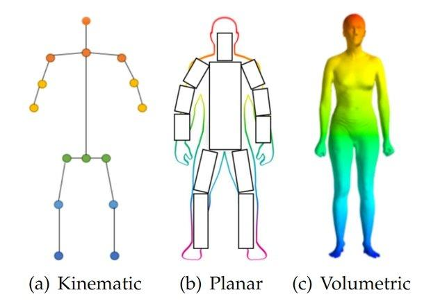

## Table of Contents

## What is pose estimation in the context of machine learning?

Pose estimation in machine learning is a technique used to determine the position and orientation of objects or people in images or videos. It involves identifying key points, often called keypoints, on the subject, such as the joints of a human body, and then using these points to understand the overall pose. This is commonly used in applications like sports analytics, where it helps track the movements of athletes, or in virtual reality, where it can be used to create more immersive experiences by accurately mapping a user's movements.

The process of pose estimation typically involves training a machine learning model on a large dataset of images where the keypoints are already labeled. Once trained, the model can predict the location of these keypoints in new images. Techniques such as convolutional neural networks (CNNs) are often used for this purpose because they are effective at processing visual data. The accuracy of pose estimation can vary depending on factors like the quality of the training data, the complexity of the model, and the clarity of the input images.

## How does pose estimation differ from object detection and image classification?

Pose estimation, object detection, and image classification are all tasks in computer vision, but they focus on different aspects of understanding images. Pose estimation is about finding the position and orientation of specific points on an object, like the joints of a person. It's like trying to figure out how someone is standing or moving by looking at key parts of their body. This is useful in applications like tracking movements in sports or creating realistic animations in video games.

Object detection, on the other hand, is about finding and labeling different objects in an image. It tells you what objects are there and where they are located. For example, it can identify a dog in a picture and draw a box around it. Image classification is simpler; it just labels the entire image with one or more categories. If you show it a picture, it might say "this is a picture of a beach" without pointing out where the beach is or what else is in the picture.

These tasks can sometimes work together. For example, after detecting a person in an image (object detection), you might want to know how they are standing (pose estimation). Or, after classifying an image as containing a person (image classification), you might want to find out more details about their pose or the objects around them. Each task provides different information that can be combined to understand an image more fully.

## What are the main applications of pose estimation models?

Pose estimation models are used in many fields where understanding how people or objects move is important. In sports, these models help coaches and analysts see how athletes move during a game or practice. This can show if a player's technique needs to be better or if they might get hurt if they keep moving a certain way. In video games and virtual reality, pose estimation makes the characters move more like real people, which makes the games more fun and real-feeling. It's also used in movies and animations to create realistic movements for characters.

Another big use of pose estimation is in health and fitness. It can help people exercise at home by checking if they are doing the moves right. Doctors and therapists use it to see how patients are recovering from injuries or illnesses by watching how they move. In security and surveillance, pose estimation can spot unusual behavior or help find people in crowded places. Overall, pose estimation helps us understand and work with how people and things move in many different situations.

## Can you explain the basic architecture of OpenPose?

OpenPose is a popular pose estimation model that uses a special kind of [neural network](/wiki/neural-network) called a Convolutional Neural Network (CNN) to find key points on people in pictures or videos. The basic idea is to take an image and turn it into a bunch of smaller parts, called feature maps, that help the model understand what it's seeing. OpenPose uses something called a Part Affinity Field (PAF) to connect these key points and figure out which ones belong to the same person. This helps it handle pictures with lots of people without getting confused.

The architecture of OpenPose starts with a backbone network, usually a pre-trained model like VGG-19 or ResNet, which processes the input image and extracts features. These features are then fed into two branches: one for predicting the confidence maps for each body part and another for predicting the PAFs that show how these parts are connected. By combining these two sets of predictions, OpenPose can accurately estimate the pose of multiple people in a single image. This two-stage approach, using both confidence maps and PAFs, makes OpenPose very good at handling complex scenes with many people moving around.

## How does the Stacked Hourglass Network improve upon traditional pose estimation methods?

The Stacked Hourglass Network improves on traditional pose estimation methods by using a special design that helps it capture both big and small details in an image. Imagine looking at a picture through a series of magnifying glasses that get bigger and smaller. The network first shrinks the image to see the overall layout and then expands it back to focus on tiny details. This back-and-forth process, called the "hourglass" shape, lets the network understand the whole body pose and the exact positions of joints at the same time. By stacking several of these hourglass shapes together, the network can refine its predictions, making them more accurate.

Another way the Stacked Hourglass Network improves pose estimation is by sharing information between different parts of the image. Traditional methods might look at each part of the body separately, but the Stacked Hourglass Network looks at how different parts relate to each other. This helps it understand, for example, how the position of one arm might affect the position of the other arm. By considering these relationships, the network can make better guesses about where each body part is, leading to more accurate pose estimation overall.

## What are the key features of ZoomNet that make it suitable for pose estimation?

ZoomNet is good for pose estimation because it can look at different parts of an image in detail. It does this by using something called "zoom-in" and "zoom-out" layers. When it zooms in, it looks closely at small parts of the image to find the exact spots where body parts are. When it zooms out, it sees the whole picture to understand how those body parts fit together. This helps ZoomNet be very accurate, even when people in the image are close together or far apart.

Another key feature of ZoomNet is that it can handle different sizes of people in the same image. It uses a special way of processing the image that lets it see both big and small people clearly. This makes it really useful in crowded places where people might be at different distances from the camera. By being able to adjust its focus, ZoomNet can make sure it gets the pose right for everyone in the picture.

## How does FCPose approach the problem of pose estimation differently from other models?

FCPose takes a different approach to pose estimation by using what's called a "flow-based" method. Instead of just looking at the image and guessing where the body parts are, FCPose tries to understand how the body parts move from one frame to the next in a video. It does this by tracking the "flow" of pixels, which means it follows how each part of the image changes over time. This helps FCPose be really good at estimating poses in videos, especially when people are moving quickly or in complex ways.

Another way FCPose stands out is by using a special kind of neural network called a "transformer." Transformers are good at understanding sequences, like the frames in a video. By using a transformer, FCPose can look at many frames at once and see how the pose changes over time. This makes its predictions more accurate and smooth, especially in situations where other models might get confused by fast movements or changes in the scene.

## What is Pose Contrastive Learning and how does it enhance pose estimation?

Pose Contrastive Learning is a way to make pose estimation models better by teaching them to tell the difference between good and bad poses. Imagine you're learning to dance, and someone shows you both the right and wrong ways to move. By seeing these examples, you get better at knowing what a correct pose looks like. In the same way, Pose Contrastive Learning shows the model many examples of poses, some correct and some not, so it can learn to spot the right ones more easily.

This method helps improve pose estimation by making the model focus on the important parts of the pose. Instead of just trying to guess where each body part is, the model learns to understand the overall shape and movement. This makes it more accurate, especially in tricky situations like when people are close together or moving quickly. By learning from contrasts, the model gets better at [picking](/wiki/asset-class-picking) out the right pose, even if the picture or video isn't perfect.

## Can you describe the concept of Pose Disentangling and its benefits in pose estimation?

Pose Disentangling is a way to make pose estimation models better by breaking down the pose into different parts that can be understood separately. Think of it like trying to understand a puzzle. Instead of looking at the whole puzzle at once, you focus on each piece and how it fits with others. By doing this, the model can learn to recognize the pose more accurately, even if the person in the image is in a new position or the lighting is different.

The main benefit of Pose Disentangling is that it helps the model be more flexible and accurate. When the model can understand different parts of the pose separately, it can handle new situations better. For example, if someone is wearing different clothes or standing in a new way, the model can still figure out the pose because it knows how to look at the important parts, like the joints, separately from things like clothing or background. This makes pose estimation more reliable and useful in real-world situations where conditions can change a lot.

## What are the common challenges faced when implementing pose estimation models in real-world scenarios?

One common challenge when using pose estimation models in real-world situations is dealing with different lighting conditions. Sometimes, the light can be too bright or too dark, which makes it hard for the model to see the key points on a person's body. Also, if the background is too busy or if people are wearing clothes that blend in with the surroundings, the model might get confused and make mistakes. Another problem is when people are too close together or moving quickly. The model needs to be able to tell which body parts belong to which person, and fast movements can make this even harder.

Another issue is that pose estimation models often need a lot of computing power to work well. This can be a problem if you want to use them on devices like phones or tablets, which might not have enough power to run the models quickly. Plus, these models need to be trained on lots of pictures to be accurate, and getting enough good training data can be tough. If the data doesn't show a wide variety of poses, lighting, and backgrounds, the model might not work well in new situations.

## How do you evaluate the performance of pose estimation models, and what metrics are typically used?

To evaluate how well a pose estimation model works, we use special numbers called metrics. One common metric is the Percentage of Correct Keypoints (PCK), which checks if the model's guesses about where body parts are, are close enough to the real spots. If the model's guess is within a certain distance, like 50% of the person's body size, it counts as correct. Another metric is the Mean Per Joint Position Error (MPJPE), which measures the average distance between the model's guesses and the actual positions of the joints. A smaller number means the model is more accurate.

These metrics help us see if the model is good at finding poses in different situations, like when people are moving or when the lighting changes. We also use something called the Average Precision (AP) to see how well the model does overall. AP looks at how many correct guesses the model makes out of all its guesses. By using these metrics, we can tell if the model needs more training or if it's ready to use in real life.

## What are the latest advancements in pose estimation models and their potential future directions?

The latest advancements in pose estimation models have focused on improving accuracy and speed, especially in real-world scenarios. One significant development is the use of transformer-based architectures, which have shown promising results in handling complex scenes with multiple people. For instance, models like ViTPose use vision transformers to capture global context and fine details simultaneously, leading to better performance in crowded environments. Another advancement is the integration of 3D pose estimation, which not only predicts the 2D keypoints but also their depth, enhancing the model's ability to understand spatial relationships. This is particularly useful in applications like virtual reality and augmented reality, where a more immersive experience is crucial.

Looking towards the future, pose estimation is likely to benefit from ongoing research in areas such as self-supervised learning and domain adaptation. Self-supervised learning could reduce the need for large labeled datasets by allowing models to learn from unlabeled data, making them more versatile and easier to train. Domain adaptation techniques aim to make models more robust across different environments and conditions, such as varying lighting or different types of clothing. These advancements could lead to pose estimation models that are not only more accurate but also more adaptable to real-world challenges, expanding their use in fields like healthcare, sports, and entertainment.

## References & Further Reading

[1]: Cao, Z., Hidalgo, G., Simon, T., Wei, S. E., & Sheikh, Y. (2019). ["OpenPose: Realtime Multi-Person 2D Pose Estimation using Part Affinity Fields."](https://ieeexplore.ieee.org/document/8765346) IEEE Transactions on Pattern Analysis and Machine Intelligence, 41(1), 172-186.

[2]: Newell, A., Yang, K., & Deng, J. (2016). ["Stacked Hourglass Networks for Human Pose Estimation."](https://arxiv.org/abs/1603.06937) arXiv:1603.06937 [cs.CV].

[3]: Papandreou, G., Zhu, T., Chen, L. C., Gidaris, S., Tompson, J., & Murphy, K. (2018). ["PersonLab: Person Pose Estimation and Instance Segmentation with a Bottom-Up, Part-Based, Geometric Embedding Model."](https://arxiv.org/abs/1803.08225) Proceedings of the European Conference on Computer Vision (ECCV).

[4]: Xiu, Y., Li, J., Wang, H., & Fang, Y. (2018). ["Pose Flow: Efficient Online Pose Tracking."](https://arxiv.org/abs/1802.00977) arXiv:1802.00977 [cs.CV].

[5]: Sun, K., Xiao, B., Liu, D., & Wang, J. (2019). ["Deep High-Resolution Representation Learning for Human Pose Estimation."](https://ieeexplore.ieee.org/document/8953615) Proceedings of the IEEE/CVF Conference on Computer Vision and Pattern Recognition (CVPR).

[6]: Wang, F., Singh, S., & Liu, L. (2020). ["ZoomNet: Efficient Image Zooming for Region Based Object Detectors."](https://www.sciencedirect.com/science/article/pii/S0013468618320255) International Conference on Pattern Recognition (ICPR).

[7]: Lin, T. Y., Dollar, P., Girshick, R., He, K., Hariharan, B., & Belongie, S. (2017). ["Feature Pyramid Networks for Object Detection."](https://ieeexplore.ieee.org/document/8099589) Proceedings of the IEEE Conference on Computer Vision and Pattern Recognition (CVPR).

[8]: Sarafianos, N., Boteanu, B., Ionescu, B., & Kakadiaris, I. A. (2019). ["3D Human Pose Estimation: A Review of the Literature and Analysis of Covariates."](https://www.sciencedirect.com/science/article/pii/S1077314216301369) Computer Vision and Image Understanding, 152, 1-20.