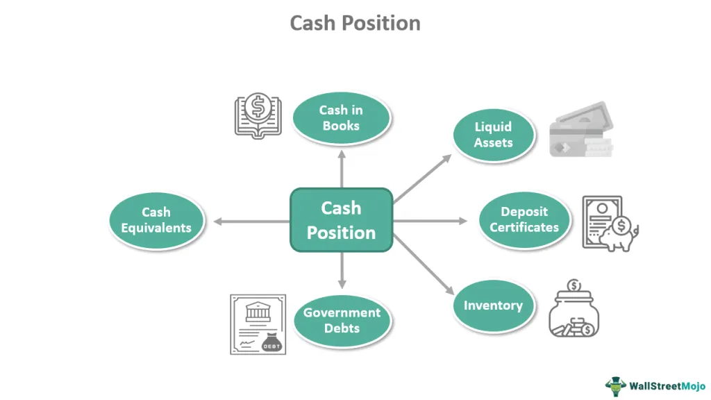

In recent years, algorithmic trading has become a fundamental component of the financial markets, revolutionizing the way trades are conducted by making them faster, more accurate, and more efficient. This evolution is largely driven by technological advancements and has led to the development of sophisticated trading platforms that cater to the needs of modern traders. Among these platforms, POSIT ITG stands out for its innovative solutions designed to enhance trading efficiency and effectiveness.

POSIT ITG is widely recognized in the field of algorithmic trading for its ability to provide anonymous matching of non-displayed equity orders. This feature is crucial as it helps reduce the market impact, offering opportunities for price improvement within the best bid and offer available. These capabilities make POSIT ITG an invaluable tool for traders seeking to optimize their strategies while maintaining a competitive edge.

This article examines the significant role that POSIT ITG plays in the algorithmic trading ecosystem. It highlights the platform’s distinctive features and benefits, which include its ability to facilitate improved trading strategies and minimize market impact. By leveraging POSIT ITG, traders can achieve better trade outcomes, ensuring their activities are carried out with precision and reduced risk.

## Table of Contents

## Understanding POSIT ITG

POSIT ITG, introduced in 1987, is a sophisticated suite of tools crafted to facilitate the anonymous matching of non-displayed equity orders. This feature is crucial in minimizing the market impact by ensuring that large transactions are executed without revealing the intentions of the trader to the wider market, a common concern in high-frequency and [algorithmic trading](/wiki/algorithmic-trading).

The primary purpose of the platform is to secure price improvement opportunities within the prevailing best bid and offer, thereby providing traders with a competitive edge. This means traders utilizing POSIT ITG can potentially execute trades at more favorable prices than those currently visible in the open market. By accessing [liquidity](/wiki/liquidity-risk-premium) pools discreetly, traders can achieve better execution prices, which is a significant advantage in volatile and competitive markets.

Widely trusted by hundreds of clients on a daily basis, POSIT ITG underscores its importance with consistent performance and reliability. The platform serves various order flows, most notably algorithmic and block trades. Block trades, which involve substantial volumes that can significantly sway market prices, find an optimal environment within POSIT ITG due to its focus on anonymity and minimal market impact.

This versatility has made POSIT ITG a vital part of many trading strategies, providing a secure and efficient mechanism for executing large transactions.

## Key Features and Benefits

POSIT ITG is renowned for supporting a diverse range of order types, which include Market, Limit, Closing, Volume Weighted Average Price (VWAP), and Self Match orders. This versatility allows traders to execute strategies tailored to their specific requirements, optimizing their market engagements and enhancing overall performance.

Access to POSIT ITG is restricted to regulated institutions on both the buy-side and sell-side, contingent upon ITG compliance approval. This ensures that all participants operate within a secure and regulated environment, reinforcing the integrity and credibility of trading activities.

Clients can seamlessly connect to the platform electronically through the Financial Information eXchange (FIX) protocol. Additionally, they have the option to use the Triton front-end trading system, POSIT Alert, or leverage the expertise of the high-touch research sales and trading team. Such flexibility in access methods caters to the varied technical and operational preferences of clients, promoting ease of use and integration into existing systems.

While POSIT ITG is primarily focused on equities, it offers comprehensive market coverage across key regions, including the United States, Canada, Europe, and Asia. This global reach makes it a highly versatile platform for traders who require efficient order execution across multiple markets. The combination of diverse order types, extensive access options, and broad geographical coverage positions POSIT ITG as a valuable tool for achieving enhanced trading outcomes.

## Technology and Security Measures

POSIT ITG is engineered with advanced technology to ensure seamless electronic access and robust trading functionality. Central to its technological infrastructure is the FIX protocol, which facilitates fast and efficient processing of trades. This protocol is widely used in electronic trading, providing a standardized method for communication and trade execution. FIX's flexibility allows for enhanced compatibility with various trading systems, thereby promoting efficiency and reliability in trade execution.

To enhance security against market manipulation, POSIT ITG implements measures to prevent gaming. A notable feature is the application of a minimum value size for orders. This requirement serves to deter abusive trading tactics by ensuring that only meaningful order sizes are executed. By implementing a threshold, smaller, potentially manipulative trades are filtered out, reducing the risk of gaming.

Additionally, POSIT ITG employs sophisticated anti-gaming logic within its algorithms to protect traders' interests. This logic scrutinizes trading patterns to detect and neutralize malicious activities. By analyzing data in real-time, the platform can adapt to changing market conditions, promptly addressing potential threats to trading integrity. Such mechanisms not only preserve the market's fairness but also boost trader confidence, knowing their transactions are safeguarded against exploitation.

The comprehensive security features of POSIT ITG underscore its commitment to maintaining a trustworthy trading environment. Through these measures, the platform not only addresses current security challenges but also anticipates future threats, maintaining its status as a key player in algorithmic trading.

## Future Development and Trends

Continuously evolving, POSIT ITG is set to introduce new markets and features in response to changing trading landscapes. The platform's developers have maintained a consistent focus on innovation, ensuring that POSIT ITG stays ahead of market dynamics. This commitment is evident from its proactive approach to integrate emerging technological advancements, such as [machine learning](/wiki/machine-learning) and data analytics, into its trading systems.

One of the anticipated developments is the expansion of POSIT ITG's services to emerging markets, thereby increasing the global reach of traders and providing access to a wider array of investment opportunities. This strategic expansion not only offers potential new revenue streams but also diversifies risk for investors. Furthermore, POSIT ITG intends to refine its algorithmic capabilities by incorporating advanced predictive analytics. This enhancement is expected to result in more accurate pricing models and optimized execution strategies, enabling traders to make more informed decisions.

In addition, the platform is committing to further developments in its security infrastructure. By strengthening cybersecurity measures and integrating sophisticated anti-fraud mechanisms, POSIT ITG aims to minimize the risk of market manipulation and ensure the safety of transactions. This evolution is crucial as cyber threats continue to pose a significant challenge to financial markets globally.

POSIT ITG's future trajectory also includes enhancing user experience through technological upgrades, such as the adoption of [artificial intelligence](/wiki/ai-artificial-intelligence)-driven platforms that can provide personalized trading insights and recommendations. These improvements promise to offer unprecedented levels of efficiency and effectiveness, empowering traders with robust tools to navigate complex market conditions.

In summary, POSIT ITG's future developments are poised to transform trading capabilities, maintaining its status as a leader in algorithmic trading. With a steadfast focus on innovation and market adaptation, the platform is well-positioned to continue delivering competitive advantages to its users.

## Conclusion

POSIT ITG is a significant asset in algorithmic trading, enabling traders to refine their strategies with noticeable efficiency. Its wide range of functionalities, coupled with a strong focus on security, offers traders the ability to execute trades with minimized market impact. This is made possible through the platform's ability to anonymously match non-displayed equity orders while providing price improvement opportunities. By supporting a variety of order types and integrating advanced security measures, such as anti-gaming logic and minimum value size thresholds, POSIT ITG effectively safeguards trader interests.

As the landscape of financial markets continues to evolve, POSIT ITG remains at the forefront, consistently adapting to new demands and technological advancements. Its commitment to innovation and responsiveness to market dynamics ensure that traders not only achieve optimal trade outcomes but also maintain a competitive advantage. With future developments on the horizon, POSIT ITG promises to further revolutionize the arena of algorithmic trading, contributing to unprecedented levels of efficiency and effectiveness for its users. Through this ongoing evolution, POSIT ITG is poised to influence the trajectory of trading practices, cementing its role as a critical resource for both buy-side and sell-side trading institutions.

## References & Further Reading

[1]: Hasbrouck, J. (2007). ["Empirical Market Microstructure: The Institutions, Economics, and Econometrics of Securities Trading."](https://academic.oup.com/book/52241) Oxford University Press.

[2]: Harris, L. (2003). ["Trading and Exchanges: Market Microstructure for Practitioners."](https://academic.oup.com/book/52292) Oxford University Press.

[3]: ["Markets, Mobs, and Mayhem: A Modern Look at the Madness of Crowds"](https://www.amazon.com/Markets-Mobs-Mayhem-Modern-Madness/dp/0471233277) by Robert Menschel

[4]: Aldridge, I. (2013). ["High-Frequency Trading: A Practical Guide to Algorithmic Strategies and Trading Systems."](https://onlinelibrary.wiley.com/doi/pdf/10.1002/9781119203803.fmatter) Wiley.

[5]: Kissell, R. (2013). ["The Science of Algorithmic Trading and Portfolio Management."](https://www.sciencedirect.com/book/9780124016897/the-science-of-algorithmic-trading-and-portfolio-management) Academic Press.