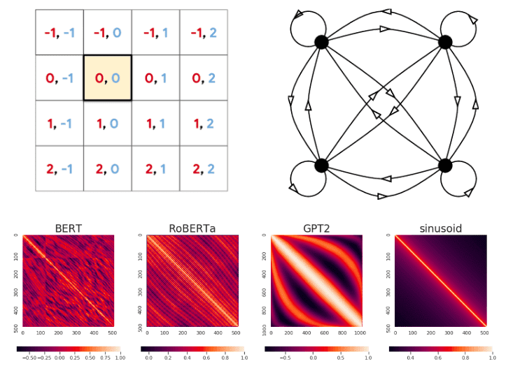

## Table of Contents

## What are position embeddings in the context of machine learning?

Position embeddings are a way to help machine learning models understand the order or position of words or items in a sequence. Imagine you're reading a sentence; the meaning can change based on the order of the words. For example, "The cat chased the mouse" means something different from "The mouse chased the cat." Position embeddings add extra information to each word, telling the model where it is in the sentence. This helps the model understand the context better and make more accurate predictions.

In technical terms, position embeddings are vectors added to the input embeddings of items in a sequence. These vectors are designed to capture the positional information. A common method to create these embeddings is using sine and cosine functions. For instance, the position encoding for position $$pos$$ and dimension $$2i$$ or $$2i+1$$ can be calculated as: $$PE(pos, 2i) = \sin(pos / 10000^{2i/d_{model}})$$ and $$PE(pos, 2i+1) = \cos(pos / 10000^{2i/d_{model}})$$ where $$d_{model}$$ is the dimension of the model. This approach ensures that each position gets a unique encoding, and the model can learn to use this information effectively.

## Why are position embeddings important in sequence-based models like transformers?

Position embeddings are crucial in sequence-based models like transformers because they help the model understand the order of words or items in a sequence. Without position embeddings, a transformer would treat a sentence like a bag of words, where the order doesn't matter. This is a problem because the meaning of a sentence often depends on the specific arrangement of its words. For example, "The dog bit the man" and "The man bit the dog" have different meanings, and position embeddings help the model distinguish between these two sentences.

In transformers, position embeddings are added to the input embeddings of each word or token. This addition allows the model to consider both the content and the position of each item in the sequence. A common way to create these embeddings is by using sine and cosine functions. For instance, the position encoding for position $$pos$$ and dimension $$2i$$ or $$2i+1$$ can be calculated as: $$PE(pos, 2i) = \sin(pos / 10000^{2i/d_{model}})$$ and $$PE(pos, 2i+1) = \cos(pos / 10000^{2i/d_{model}})$$ where $$d_{model}$$ is the dimension of the model. By including position embeddings, transformers can better capture the nuances of language and improve their performance on tasks like translation, text generation, and more.

## What is the difference between absolute and relative position encodings?

Absolute position encodings give each position in a sequence a unique identifier. This means that every word or token in a sentence gets a special number that tells the model exactly where it is. For example, in the sentence "The cat sat on the mat," "The" might get position 1, "cat" position 2, and so on. This can be done using formulas like $$PE(pos, 2i) = \sin(pos / 10000^{2i/d_{model}})$$ and $$PE(pos, 2i+1) = \cos(pos / 10000^{2i/d_{model}})$$ where $$pos$$ is the position and $$d_{model}$$ is the model's dimension. Absolute position encodings help the model understand the exact location of each word, which can be useful in many tasks.

Relative position encodings, on the other hand, focus on the relationships between positions rather than their absolute locations. Instead of telling the model that a word is at position 3, relative position encodings might tell the model that a word is two positions away from another word. This can be especially helpful in tasks where the distance between words matters more than their exact positions. For instance, in the sentence "The cat sat on the mat," relative encodings would help the model understand that "cat" is one word away from "sat," which can be more important for understanding the meaning than knowing "cat" is at position 2.

## How do absolute position encodings work in transformer models?

In transformer models, absolute position encodings help the model understand where each word is in a sentence. Imagine you're reading a book, and you need to know which word comes first, second, and so on. Absolute position encodings give each word a special number that tells the model its exact spot. For example, in the sentence "The cat sat on the mat," "The" might get the number 1, "cat" the number 2, and so on. This is done using math formulas like $$PE(pos, 2i) = \sin(pos / 10000^{2i/d_{model}})$$ and $$PE(pos, 2i+1) = \cos(pos / 10000^{2i/d_{model}})$$ where $$pos$$ is the position and $$d_{model}$$ is the size of the model. These numbers are added to the word's own number, helping the model see both what the word is and where it is.

By using absolute position encodings, transformers can better understand the order of words, which is important for tasks like translating languages or writing stories. If the model knows that "The" is at the start and "mat" is at the end, it can make better guesses about what the sentence means. This way, the model can tell the difference between sentences like "The dog bit the man" and "The man bit the dog," because it knows the exact positions of "dog" and "man." This makes the model smarter and more useful for understanding and working with language.

## Can you explain the concept of relative position encodings and their advantages?

Relative position encodings focus on the distances between words in a sentence rather than their exact spots. Imagine you're reading "The cat sat on the mat." Instead of telling the model that "cat" is at position 2, relative encodings would tell it that "cat" is one word away from "sat." This helps the model understand how words relate to each other, which can be more important for understanding meaning than knowing their exact positions.

The main advantage of relative position encodings is that they can help the model better capture the relationships between words. For example, in the sentence "The dog chased the cat," knowing that "chased" is one word away from "dog" and "cat" helps the model understand the action better than knowing "chased" is at position 3. This can make the model more effective at tasks like understanding and generating language, especially when the order of words matters a lot.

## What is ALiBi and how does it differ from traditional position embeddings?

ALiBi, which stands for Attention with Linear Biases, is a new way to help transformer models understand the order of words in a sentence. Instead of adding numbers to each word to show where it is, like traditional position embeddings do, ALiBi changes how the model looks at words. It adds a little bit to the attention scores between words, making the model pay more attention to words that are closer together. For example, if you have the sentence "The cat sat on the mat," ALiBi makes the model focus more on "cat" and "sat" being next to each other than on "cat" being at position 2.

The main difference between ALiBi and traditional position embeddings is how they handle the position information. Traditional position embeddings, like the ones used in many transformer models, use formulas like $$PE(pos, 2i) = \sin(pos / 10000^{2i/d_{model}})$$ and $$PE(pos, 2i+1) = \cos(pos / 10000^{2i/d_{model}})$$ to give each word a special number based on its position. These numbers are added to the word's own number to help the model understand where it is in the sentence. On the other hand, ALiBi doesn't use these special numbers. Instead, it adjusts the attention scores directly, making the model focus more on nearby words without adding extra numbers to the words themselves. This can make the model simpler and sometimes better at understanding sentences.

## How do rotary embeddings function and what benefits do they offer?

Rotary embeddings, or RoPE, are a way to help transformer models understand the order of words in a sentence. They work by rotating the vectors that represent words in a special way. Imagine you have a word like "cat" and its vector is like an arrow pointing in a certain direction. RoPE rotates this arrow based on where "cat" is in the sentence. This rotation helps the model see how close or far away "cat" is from other words like "sat" or "mat." The rotation is done using a formula like $$R_{\theta} = \begin{pmatrix} \cos \theta & -\sin \theta \\ \sin \theta & \cos \theta \end{pmatrix}$$ where $$\theta$$ depends on the position of the word.

The main benefit of rotary embeddings is that they help the model focus on the relationships between words. By rotating the vectors, RoPE makes it easier for the model to see how words are connected to each other. This can make the model better at tasks like understanding and generating language, especially when the order of words matters a lot. Another advantage is that rotary embeddings can work well even with very long sentences, which can be a problem for other types of position embeddings.

## What are conditional positional encodings and in what scenarios are they useful?

Conditional positional encodings are a way to help machine learning models understand where words are in a sentence, but they do it a bit differently. Instead of giving each word a fixed number based on its spot, conditional positional encodings change depending on what's going on in the sentence. For example, if a word like "not" changes the meaning of the sentence, the model can use conditional encodings to pay more attention to that word and how it affects the others. This can be done by adjusting the position information based on certain conditions or rules.

These encodings are useful in scenarios where the order of words matters a lot, but the exact position might not be as important as how words relate to each other. For instance, in tasks like understanding questions or commands, where certain words can change the meaning a lot, conditional positional encodings help the model focus on these important words. By using these encodings, the model can better understand the context and make more accurate predictions, especially in situations where traditional position encodings might not be enough.

## Can you describe the FoPE method and its application in machine learning models?

FoPE, which stands for Fourier Position Encodings, is a way to help machine learning models understand where words are in a sentence. It uses special math called Fourier transforms to give each word a number that shows its spot. Imagine you're reading a book, and you want to know which word comes first, second, and so on. FoPE helps the model by turning the position of each word into a special code that it can understand. This code is made using a formula like $$PE(pos, k) = \cos\left(\frac{2\pi k pos}{N}\right)$$ where $$pos$$ is the position of the word, $$k$$ is a frequency, and $$N$$ is the length of the sequence. By using this method, the model can better see the order of words and make sense of what it's reading.

FoPE is useful in many kinds of machine learning models, especially those that deal with language. For example, in a model that translates languages, knowing the exact spot of each word can help it make better guesses about what the sentence means. FoPE is good at handling long sentences too, which can be tricky for other methods. By using Fourier transforms, FoPE gives the model a way to understand the order of words that is both accurate and flexible. This makes it a helpful tool for tasks like understanding and generating text, where the order of words matters a lot.

## How do different position embedding techniques impact the performance of transformer models?

Different position embedding techniques can greatly affect how well transformer models work. Absolute position embeddings, which give each word a special number based on where it is in the sentence, help the model understand the exact spot of each word. For example, in the sentence "The cat sat on the mat," absolute embeddings would tell the model that "cat" is at position 2. This can be useful for tasks where knowing the exact order of words is important, like translating languages or understanding the structure of a sentence. However, these embeddings can struggle with very long sentences because they rely on fixed positions.

Relative position embeddings focus on the distances between words instead of their exact spots. For instance, instead of telling the model that "cat" is at position 2, relative embeddings would say that "cat" is one word away from "sat." This helps the model better understand how words relate to each other, which can be more important for understanding meaning than knowing their exact positions. Relative embeddings can make the model more effective at tasks like understanding and generating language, especially when the order of words matters a lot. Techniques like ALiBi and rotary embeddings (RoPE) also help by adjusting how the model looks at words based on their positions, making it easier to handle long sentences and focus on important relationships between words.

Conditional positional encodings and Fourier position encodings (FoPE) offer other ways to help models understand where words are in a sentence. Conditional encodings change based on what's happening in the sentence, which can be useful when certain words like "not" change the meaning a lot. FoPE uses special math called Fourier transforms to give each word a number that shows its spot, which can be good for handling long sentences. By using these different techniques, transformer models can be more flexible and accurate in understanding and working with language, depending on the task at hand.

## What are the challenges and limitations of implementing various position embedding methods?

Different position embedding methods each have their own challenges and limitations. Absolute position embeddings, which give each word a special number based on its spot in the sentence, can struggle with very long sentences. This is because they rely on fixed positions, and as sentences get longer, the model might find it hard to keep track of where each word is. For example, if you have a sentence like "The cat sat on the mat and then the dog barked loudly," absolute embeddings might not help the model understand the relationship between "cat" and "dog" as well as it could with shorter sentences. Another limitation is that absolute embeddings might not capture the relationships between words as well as other methods, which can be important for understanding meaning.

Relative position embeddings, which focus on the distances between words rather than their exact spots, also have their challenges. One issue is that they can be more complex to implement because they need to calculate the distances between every pair of words in the sentence. This can make the model slower and use more memory, especially for long sentences. For instance, in the sentence "The cat sat on the mat," relative embeddings need to know that "cat" is one word away from "sat," which can be tricky to manage for every word in a long text. Additionally, while relative embeddings are good at capturing the relationships between words, they might not be as effective in tasks where knowing the exact position of a word is more important.

Other methods like ALiBi, rotary embeddings (RoPE), conditional positional encodings, and Fourier position encodings (FoPE) each have their own unique challenges. ALiBi, which adjusts attention scores based on word positions, can be complex to implement and might not work as well for all types of tasks. RoPE, which rotates word vectors based on their positions, can be harder to understand and implement, and might not be suitable for all models. Conditional positional encodings, which change based on what's happening in the sentence, can be tricky to define and might not capture all the nuances of language. FoPE, which uses Fourier transforms to encode positions, can be computationally intensive and might not be as effective for shorter sentences. Each method requires careful consideration of the specific task and the model's needs to ensure the best performance.

## What future developments can we expect in the field of position embeddings for machine learning?

In the future, we might see new ways to help machine learning models understand where words are in a sentence. Researchers might come up with new types of position embeddings that are even better at handling long sentences and understanding the relationships between words. For example, they might find ways to mix different types of position embeddings, like using both absolute and relative embeddings together, to make models even smarter. They could also use new math formulas, like $$PE(pos, k) = \cos\left(\frac{2\pi k pos}{N}\right)$$, to create more flexible and accurate position encodings.

Another thing we might see is position embeddings that can change based on what the model is trying to do. For instance, if the model is translating a language, it might use one type of position embedding, but if it's writing a story, it might use a different type. This could make the models more useful for different tasks. Also, as computers get faster and better, we might be able to use more complex position embeddings without making the models too slow. This could help the models understand language even better and make them more helpful for people.