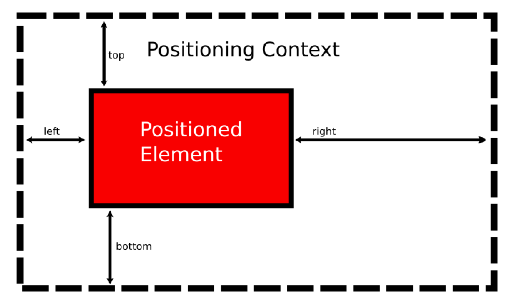

## Table of Contents

## What is the basic definition of 'Position in Context'?

'Position in Context' refers to where something is located or placed within a specific situation or environment. Imagine you are in a room full of people. Your position in context would be where you are standing or sitting in relation to others and the objects around you. It's not just about the physical spot but also about how that spot relates to everything else in the room.

Understanding 'Position in Context' is important because it helps us make sense of our surroundings and interactions. For example, if you are at a dinner table, your position in context would include where you sit in relation to others, which can affect conversations and social dynamics. It's a way to describe and understand the relationships and interactions between different elements within a given context.

## How does 'Position in Context' differ from absolute positioning?

'Position in Context' and absolute positioning are two different ways to describe where something is. 'Position in Context' is about where something is in relation to other things around it. For example, if you're at a party, your 'Position in Context' might be next to the dance floor or near the snacks. It's all about how your spot connects with the people and things nearby.

Absolute positioning, on the other hand, is about exact coordinates or a specific, fixed spot. It doesn't care about what's around it. Think of a map with grid lines. If you say you're at point A3, that's absolute positioning. It tells you exactly where you are, no matter what else is happening around that spot.

Understanding the difference is important because 'Position in Context' helps us see how things interact and relate, while absolute positioning gives us a clear, unchanging location. Both are useful, but they serve different purposes depending on what you need to know.

## Can you explain 'Position in Context' with a simple example?

Imagine you are at a family picnic in a park. Your 'Position in Context' is where you are sitting in relation to everyone else. If you are sitting next to your grandma and across from your little cousin, that's your position in context. It's not just about where you are, but how you are connected to the people around you.

This idea helps us understand how our spot affects our interactions. For example, sitting next to your grandma might mean you talk to her more during the picnic. Your position in context shows how your place at the picnic influences your experience and relationships with others.

## What are the common applications of 'Position in Context' in user interfaces?

In user interfaces, 'Position in Context' is used to make things easier to use and understand. Imagine you are using a website with a sidebar. The sidebar's position in context means it's placed on the side of the main content, making it easy to access without getting in the way. This helps users quickly find tools or navigation options without losing their place on the page.

Another common use is in apps, like social media. When you see a post, the comments section is often right below it. This placement in context makes it clear that the comments are related to the post above. It helps users engage with content more naturally, as they can read a post and then immediately see and add comments without searching around the app.

## How does 'Position in Context' affect user experience in digital products?

'Position in Context' plays a big role in making digital products easy and enjoyable to use. When things are placed in a way that makes sense, users can find what they need quickly. For example, if a search bar is at the top of a website, it's easy to spot and use. This helps users feel more at home on the site because everything is where they expect it to be. When things are out of place, it can be confusing and frustrating, which makes the user experience worse.

In apps, like a messaging app, the position of the send button is important. If it's right next to where you type your message, it's easy to hit 'send' without looking around. This makes chatting with friends smooth and fun. When the design takes into account how users interact with different parts of the app, it creates a better flow and keeps users happy and engaged.

## What are the technical challenges in implementing 'Position in Context'?

Implementing 'Position in Context' in digital products can be tricky because it involves making sure everything is placed just right for users. One challenge is dealing with different screen sizes. A website that looks perfect on a computer might look messy on a phone if the elements aren't adjusted properly. Designers have to think about how to keep the position of buttons, menus, and content clear and useful on all devices. This means using flexible layouts and testing on many different screens to make sure everything works well.

Another challenge is keeping the user's context in mind as they move through the product. For example, if someone is reading an article and wants to see comments, those comments should be easy to find without losing their place in the article. This requires smart design and sometimes coding that can change the layout based on what the user is doing. It's a balance between making things look good and making sure they're easy to use, which can be hard to get right.

## How can 'Position in Context' be optimized for mobile devices?

When optimizing 'Position in Context' for mobile devices, it's important to think about the smaller screen size. Elements like buttons and menus need to be placed where users can easily reach them with their thumbs. For example, putting the main navigation at the bottom of the screen can make it easier to use one-handed. Also, the content should be organized so that important parts, like the search bar or main actions, are right where users expect to find them, even on a smaller screen.

Another key aspect is making sure the layout adjusts to different mobile devices. This means using flexible design techniques that can shift elements around based on the screen size. For instance, if a user is reading an article, the comments section should appear close to the article without taking up too much space. By testing the app on various phones and tablets, designers can make sure that the 'Position in Context' stays helpful and clear, no matter the device.

## What role does 'Position in Context' play in responsive design?

In responsive design, 'Position in Context' helps make sure that elements on a website or app look good and work well on different devices. When a user switches from a computer to a phone, the layout needs to change so that everything stays easy to use. For example, a menu might move from the top of the screen on a computer to the bottom on a phone, where it's easier to reach with a thumb. This keeps the user's experience smooth and helps them find what they need without getting lost.

Keeping 'Position in Context' in mind is important because it helps users understand how different parts of the site or app relate to each other. If a button or a link is placed in a way that makes sense with the content around it, users can navigate more naturally. For instance, if you're reading an article and want to see comments, having those comments right below the article keeps everything in context. By adjusting the layout to fit different screens, responsive design makes sure that the 'Position in Context' always feels right, no matter what device someone is using.

## How do advanced algorithms enhance 'Position in Context' functionality?

Advanced algorithms can make 'Position in Context' work better by figuring out where to put things on a screen in a smart way. For example, if you're using a website on your phone, the algorithm can move buttons and menus to spots that are easy for your thumb to reach. It does this by looking at how people usually use their phones and where they touch the screen most often. This makes the website easier to use because everything is placed in a way that feels natural and helpful.

These algorithms also help keep things in context as you move around a website or app. They can change the layout based on what you're doing, so if you're reading an article and want to see comments, the comments will show up right below the article without making you scroll too much. By using data about how people use the site, the algorithms can make sure that the 'Position in Context' stays clear and useful, no matter what device you're using.

## What are some innovative uses of 'Position in Context' in emerging technologies?

In virtual reality (VR), 'Position in Context' helps create a more realistic experience. When you move around in a VR world, the things you see and interact with change based on where you are. For example, if you walk closer to a virtual object, it gets bigger and looks more detailed. This makes you feel like you're really in that world because everything around you reacts to your movements. It's like being in a video game where the world changes as you explore it, making the experience more fun and immersive.

In augmented reality (AR), 'Position in Context' is used to blend digital information with the real world. Imagine using an AR app on your phone to see information about a building you're looking at. The app knows where you are and what you're pointing at, so it can show you the building's history or interesting facts right on your screen. This makes learning about the world around you easier and more interactive because the information appears exactly where it's relevant. It's like having a smart guide that shows you things based on where you are and what you're looking at.

## How can 'Position in Context' be integrated with other positioning technologies for better results?

'Position in Context' can be made even better when it works together with other positioning technologies like GPS. For example, if you are using a navigation app on your phone, GPS can tell the app where you are on the map. But 'Position in Context' can help the app show you things around you in a way that makes sense. It can put the directions right on your screen where you can see them easily, based on where you are looking or what you are doing. This makes the app more helpful because it combines your exact location with how you are using the app.

In smart homes, 'Position in Context' can team up with indoor positioning systems. These systems know where you are inside your house. If you are in the kitchen, the smart home system can show you recipes or cooking tips on a nearby screen or through a smart speaker. 'Position in Context' helps make sure these tips appear in a way that fits with what you are doing. By working together, these technologies can make your home smarter and more helpful by giving you information exactly when and where you need it.

## What future developments are expected in the field of 'Position in Context'?

In the future, 'Position in Context' is expected to become even smarter and more helpful. As technology keeps getting better, we might see more devices and apps that understand where you are and what you're doing, and then show you the right information at the right time. For example, if you're walking in a city, your phone might know where you are and show you nearby restaurants or shops that fit what you like, all without you having to ask. This could make exploring new places easier and more fun because everything you need to know pops up exactly when you need it.

Another big change could be in how 'Position in Context' works with other new technologies. Think about combining it with things like artificial intelligence (AI) and the Internet of Things (IoT). Your home might learn your routines and then change the way it shows you information based on where you are and what you're doing. If you're in the living room, your smart TV might suggest shows you like, or if you're in the kitchen, your smart fridge could show recipes based on what food you have. By working together, these technologies could make everyday life smoother and more connected.

## What does 'Position' mean in the context of trading?

In trading, a position signifies the quantity of a specific asset that a trader holds. These positions can be categorized into two primary types: long and short. A long position is when a trader purchases an asset with the expectation that its price will increase over time. Conversely, a short position involves selling an asset with the anticipation that its price will decline, thereby allowing the trader to repurchase it at a lower price in the future.

Understanding the dynamics of positions is integral to both risk assessment and the formulation of strategies aimed at maximizing profits or minimizing losses in algorithmic trading. Analyzing positions involves evaluating the potential risk exposure and determining appropriate position sizes based on this assessment. For instance, position sizing can be mathematically represented as:

$$
\text{Position Size} = \frac{\text{Amount to Risk}}{\text{Stop Loss Distance}}
$$

where "Amount to Risk" is the total capital a trader is willing to risk on a particular trade, and "Stop Loss Distance" refers to the difference in price between the entry point and the stop loss level.

Additionally, in algorithmic trading, automation plays a crucial role in managing these positions efficiently by integrating rule-based systems that adjust positions according to predefined risk and return objectives. Position management tools like stop-loss orders and profit targets are embedded into algorithms to help control automatic decision-making processes. This systematic approach ensures that trades comply with the trader's broader market insights and conditions, offering a disciplined framework for navigating intricate market dynamics.

Overall, the adept management of trading positions not only shields traders from undue risks but also provides a structured pathway for capitalizing on market opportunities, thus enhancing the efficacy of algorithmic strategies.

## References & Further Reading

[1]: Bergstra, J., Bardenet, R., Bengio, Y., & Kégl, B. (2011). ["Algorithms for Hyper-Parameter Optimization."](https://proceedings.neurips.cc/paper/2011/file/86e8f7ab32cfd12577bc2619bc635690-Paper.pdf) Advances in Neural Information Processing Systems 24.

[2]: ["Advances in Financial Machine Learning"](https://www.amazon.com/Advances-Financial-Machine-Learning-Marcos/dp/1119482089) by Marcos Lopez de Prado

[3]: ["Evidence-Based Technical Analysis: Applying the Scientific Method and Statistical Inference to Trading Signals"](https://www.amazon.com/Evidence-Based-Technical-Analysis-Scientific-Statistical/dp/0470008741) by David Aronson

[4]: ["Machine Learning for Algorithmic Trading"](https://github.com/stefan-jansen/machine-learning-for-trading) by Stefan Jansen

[5]: ["Quantitative Trading: How to Build Your Own Algorithmic Trading Business"](https://books.google.com/books/about/Quantitative_Trading.html?id=j70yEAAAQBAJ) by Ernest P. Chan