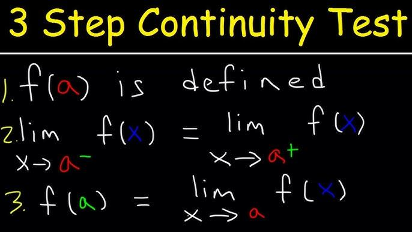

## Table of Contents

## What is a position limit in financial markets?

A position limit in financial markets is a rule that stops traders from holding too much of a certain financial product. This rule helps to keep the market fair and stops one person or group from having too much control over the price of that product. For example, if there's a position limit on a type of stock, it means a trader can only own a certain amount of that stock.

These limits are set by financial regulators or the exchanges themselves. They want to make sure that the market stays stable and that no one can manipulate prices. Position limits are common in markets like futures and options, where big trades can affect prices a lot. By having these limits, regulators hope to prevent big swings in prices and protect smaller traders.

## Why are position limits important for market regulation?

Position limits are important for market regulation because they help keep the market fair and stable. Without these limits, a few big traders could buy up a lot of a certain product, like a stock or a future, and then control its price. This could lead to unfair advantages and make the market less trustworthy. By setting a cap on how much of a product someone can own, regulators make sure that no single trader can have too much power over the market.

These limits also help prevent big price swings that can hurt smaller traders. If one person or group owns too much of a product and then decides to sell it all at once, the price could drop a lot very quickly. This sudden change can be bad for other people who are trading that product. Position limits help to avoid these big changes by spreading out the ownership of the product among more traders. This way, the market stays more balanced and safer for everyone involved.

## How do position limits help prevent market manipulation?

Position limits help prevent market manipulation by stopping one person or group from owning too much of a certain financial product. If someone owns a lot of something, like a stock or a future, they could try to control its price. For example, they might buy a lot to make the price go up, then sell it all to make the price go down. This is unfair because it can trick other people in the market. By setting a limit on how much someone can own, regulators make sure that no one can do this.

These limits also keep the market stable and fair for everyone. If someone owned too much of a product and then sold it all at once, the price could drop a lot very quickly. This sudden change can hurt other traders who might lose money because they weren't expecting it. Position limits help avoid these big changes by making sure that the ownership of the product is spread out among more people. This way, the market stays more balanced and safer for everyone who is trading.

## What are the different types of position limits?

There are two main types of position limits: spot month position limits and aggregate position limits. Spot month position limits are rules that say how much of a product someone can own during the delivery month, which is when the product has to be handed over. This helps stop people from controlling the price when it's time to actually get the product. Aggregate position limits, on the other hand, are about the total amount of a product someone can own across all months. This helps make sure no one can own too much of the product overall, which could affect the market's fairness.

Both types of limits are important for keeping the market stable and fair. Spot month limits protect the market during the critical time when the product is delivered, while aggregate limits look at the bigger picture and prevent someone from having too much control over the product's price at any time. By using these limits, regulators can help stop market manipulation and make sure that everyone has a fair chance to trade.

## Who sets the position limits and how are they enforced?

Position limits are set by financial regulators or the exchanges where the trading happens. In the United States, for example, the Commodity Futures Trading Commission (CFTC) is the main group that sets these limits for futures and options. Exchanges like the Chicago Mercantile Exchange (CME) also have their own rules about position limits. These groups decide on the limits based on what they think will keep the market fair and stable. They look at things like how much of a product is traded and how easy it is to control the price.

Enforcing position limits is important to make sure traders follow the rules. Regulators and exchanges watch trading activity closely to see if anyone is going over the limits. If someone does go over the limit, they might get a warning, have to pay a fine, or even be banned from trading for a while. The exchanges use computer systems to keep track of positions and make sure everyone is following the rules. By keeping an eye on things and taking action when needed, regulators help keep the market fair for everyone.

## How do position limits vary across different financial instruments?

Position limits can be different for different types of financial products, like stocks, futures, and options. For example, futures and options often have strict position limits because they can be easier to control and manipulate. The limits for these products might be set based on how many contracts someone can own. Stocks might have position limits too, but they are often set by the company itself or by rules from the stock exchange. These limits might be about how many shares someone can own, especially if the company wants to stop one person from having too much control.

The way position limits are set can also change depending on the product. For futures, there might be different limits for the spot month, which is the month when the product is delivered, and for all the other months combined. This helps keep the market stable when it's time to actually get the product. For options, the limits might depend on whether they are call options, which give the right to buy, or put options, which give the right to sell. Each type of financial product has its own rules because they all work a little differently in the market.

## What are the consequences of exceeding a position limit?

If a trader goes over a position limit, they can get into trouble. The people who watch the market, like regulators or the exchange, might give them a warning first. This is to tell them they need to fix it and get back under the limit. If the trader keeps going over the limit, they might have to pay a fine. This is like a punishment to make sure they follow the rules next time.

If the trader still doesn't follow the rules, they could be banned from trading for a while. This means they can't buy or sell anything on the market during that time. It's a big deal because it stops them from making money. All these rules are there to keep the market fair and stop one person from having too much power over prices.

## How can traders monitor their positions relative to limits?

Traders can keep an eye on their positions by using special computer programs called trading platforms. These platforms show how much of a product, like stocks or futures, a trader owns at any time. They also tell the trader how close they are to the position limit set by the regulators or the exchange. By checking these platforms often, traders can make sure they don't go over the limit and get into trouble.

Sometimes, traders also get alerts from the trading platform if they are getting close to the limit. This is like a warning that helps them know when to stop buying more of the product. By paying attention to these alerts and keeping track of their positions, traders can stay within the rules and avoid fines or bans from trading.

## What are the best practices for managing positions within limits?

To manage positions within limits, traders should always keep an eye on their trading platforms. These platforms show how much of a product a trader owns and how close they are to the limit. By checking this often, traders can make sure they don't go over the limit. It's also a good idea to set up alerts on the platform. These alerts will let the trader know when they are getting close to the limit, so they can stop buying more of the product in time.

Another good practice is to plan trades carefully. Traders should know the position limits for each product they are trading and make sure their buying and selling plans fit within these limits. If a trader is close to the limit, they might need to sell some of their holdings to stay under it. By planning ahead and staying informed, traders can avoid the trouble of going over the limit and facing fines or bans from trading.

## How do position limits affect trading strategies?

Position limits can change how traders plan their moves in the market. When there are strict limits on how much of a product a trader can own, they have to be careful not to go over them. This means they might have to spread their trades over more products or use different trading strategies to keep their positions within the rules. For example, instead of buying a lot of one stock, a trader might buy smaller amounts of several stocks to stay under the limit.

These limits also make traders think more about the timing of their trades. If a trader knows they are close to the limit for a certain product, they might decide to sell some of it before buying more. This helps them stay under the limit and avoid getting into trouble. By always keeping an eye on their positions and planning their trades carefully, traders can work within the limits and still try to make money in the market.

## What are the global differences in position limit regulations?

Position limit rules can be different in different countries. In the United States, the Commodity Futures Trading Commission (CFTC) sets limits for futures and options to keep the market fair. In Europe, the European Securities and Markets Authority (ESMA) makes the rules for the European Union. Each country might have its own rules too. For example, in the UK, the Financial Conduct Authority (FCA) watches over trading and sets limits. These rules can change based on what each country thinks is best for their market.

Even though the main goal is the same—to stop people from controlling prices and keep the market stable—the way these limits are set and enforced can be different. Some places might have stricter limits than others. For example, a country with a smaller market might have tighter rules to make sure no one can easily control prices. Also, how these rules are watched and enforced can vary. Some places might check more often and give bigger fines for breaking the rules. Traders need to know the rules in each place they trade to stay out of trouble.

## How have position limits evolved with the advent of new financial technologies?

Position limits have changed a lot because of new financial technologies. Before, traders had to check their positions by hand or use simple computer programs. Now, with better technology, they can use fancy trading platforms that keep track of their positions all the time. These platforms can even send alerts when a trader is getting close to a limit. This makes it easier for traders to stay within the rules and helps regulators watch the market better.

Also, with new tech like high-frequency trading and algorithms, markets can move very fast. This means position limits need to be watched more closely to stop people from trying to control prices quickly. Regulators are using new tools to keep an eye on trading and make sure everyone follows the rules. As technology keeps changing, position limits will probably keep evolving too, to make sure the market stays fair and stable for everyone.

## What are Position Limits and How Do They Ensure Market Stability?

Position limits serve as a foundational mechanism to uphold stability and discipline in futures markets. By imposing restrictions on the maximum number of futures contracts or options a single trader or entity can hold, position limits deter market dominance and potential manipulation by any single market participant. This measure is crucial in preserving the competitive and transparent nature of trading markets.

These limits are calculated based on the deliverable supply of the underlying asset. The primary objective is to avert excessive speculation and minimize unwarranted price deviations that do not reflect the genuine market environment. Deliverable supply refers to the amount of the underlying asset that is readily available for delivery at any given time, forming the benchmark for determining position limits. The formula for setting position limits $P$ can be expressed as:

$$
P = f(D, R)
$$

where $D$ denotes deliverable supply, and $R$ represents regulatory adjustments based on market conditions.

Position limits are actively monitored and enforced on an intraday basis throughout the trading period. This continuous oversight ensures that any irregular trading activities are promptly detected and addressed. Regulators utilize sophisticated monitoring systems, like real-time data analytics, to track compliance with these limits.

Furthermore, regulatory frameworks often provide exemptions to these limits for bona fide hedging activities. Such exemptions enable businesses with genuine exposures to price fluctuations, like agricultural firms or energy companies, to hedge their risks without breaching position limits. These exemptions are governed by strict criteria to ensure that they are used for legitimate risk management purposes only and not for speculative gains.

The rigorous application and effective enforcement of position limits are vital to sustaining orderly and balanced financial markets. By preventing concentration and fostering a level playing field, they contribute significantly to market integrity and investor confidence. As markets evolve, regulators continue to refine these measures to address emerging challenges while maintaining market stability.

## References & Further Reading

[1]: Hull, J. C. (2017). ["Options, Futures, and Other Derivatives."](https://www.semanticscholar.org/paper/Options%2C-Futures%2C-and-Other-Derivatives-Hull/89bdee500c8623864fc9eb7a471546aa713acc44) Pearson.

[2]: Lopez de Prado, M. (2018). ["Advances in Financial Machine Learning."](https://www.amazon.com/Advances-Financial-Machine-Learning-Marcos/dp/1119482089) Wiley.

[3]: Aronson, D. R. (2007). ["Evidence-Based Technical Analysis: Applying the Scientific Method and Statistical Inference to Trading Signals."](https://onlinelibrary.wiley.com/doi/book/10.1002/9781118268315) Wiley.

[4]: Chan, E. (2009). ["Quantitative Trading: How to Build Your Own Algorithmic Trading Business."](https://github.com/ftvision/quant_trading_echan_book) Wiley.

[5]: CFTC. (2010). ["Commodity Futures Trading Commission & Securities Exchange Commission, Findings regarding the market events of May 6, 2010."](https://comments2.cftc.gov/Handlers/PdfHandler.ashx?id=25600)

[6]: Markham, J. W. (2015). ["The History of Commodity Futures Trading and its Regulation."](https://uknowledge.uky.edu/cgi/viewcontent.cgi?article=1931&context=klj) Marquette Law Review.