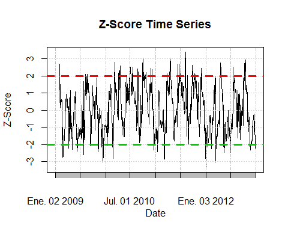

In today's dynamic financial markets, futures trading represents a critical component of investment strategies for both individual traders and institutional investors. The futures market is characterized by its complexity, stemming from its reliance on derivatives, necessity for stringent regulation, and the integration of advanced technologies such as algorithmic trading. This environment requires a comprehensive understanding to effectively participate and innovate within the market framework.

This article explores key aspects of futures trading, focusing on several core themes. The role of financial regulation is essential for maintaining market stability and integrity. Regulatory bodies enforce rules to prevent excessive speculation and manipulation, ensuring that markets function fairly and transparently. Integral to these regulations are position limits, which control the number of contracts a trader can hold, thus preventing market domination and ensuring prices reflect genuine supply and demand dynamics.

Algorithmic trading technologies have significantly transformed futures markets, enabling trades to be executed at unprecedented speeds and scales. While these technologies enhance market efficiency by narrowing spreads and boosting liquidity, they also introduce risks such as flash crashes and heightened volatility. As such, understanding the implications of these technologies is crucial for developing effective trading strategies and regulatory frameworks.

Through an analysis of these interconnected topics, we aim to clarify the mechanisms that protect market integrity and ensure fair trading practices. Understanding these elements is vital for traders, financial professionals, and regulators to navigate and optimize their strategies in the ever-evolving financial landscape. This knowledge is not merely academic; it is practical and actionable, providing stakeholders the insights they need to make informed decisions.

Whether you are a novice trader exploring the complexities of futures markets or an experienced professional seeking to refine your strategies, this article offers valuable perspectives and insights. Join us as we explore the intricacies of futures trading and its regulatory environment, providing a foundation from which all market participants can strive for success.

## Table of Contents

## Understanding Futures Trading

Futures contracts are financial derivatives that play an essential role in facilitating both speculation and risk management on the future prices of various assets. These contracts establish standardized agreements between two parties, obligating the buyer to purchase and the seller to deliver a specific quantity of a commodity or a financial instrument at a predetermined price on a specified future date. The standardization ensures that the key terms such as quantity, quality, and delivery time and location are clearly defined, thus promoting liquidity and ease of trading.

Futures trading occurs on regulated exchanges, which provide a structured and transparent platform for these transactions. These exchanges, such as the Chicago Mercantile Exchange (CME) and the Intercontinental Exchange (ICE), are instrumental in maintaining the integrity of the market through standardized contracts and centralized clearing processes, which reduce the risk of counterparty default.

A notable feature of futures trading is the use of leverage. Leverage allows traders to control a large position with a relatively small amount of capital, providing the opportunity for large profits. However, it also amplifies potential losses, rendering futures trading a high-risk, high-reward strategy. For example, if a trader controls a futures contract worth $100,000 with a margin requirement of 10%, they only need to commit $10,000. Any price movement in the underlying asset will proportionately affect the margin capital, leading to significant gains or losses.

The participants in the futures market are diverse, ranging from individual retail traders to large institutional investors. Individual traders seek to profit from price movements, whereas institutional players, such as hedge funds and multinational corporations, may use futures contracts to hedge against potential adverse price fluctuations in the commodities or financial instruments pertinent to their business operations or investment portfolios. For instance, an airline company might use futures contracts to lock in fuel prices to manage the risk of price increases.

Overall, futures trading is a fundamental component of global financial markets, offering a mechanism for price discovery, risk management, and speculative opportunity. The standardized nature of these instruments and the regulated exchanges on which they are traded ensure that market participants can engage in these activities with a degree of confidence that enhances the overall efficiency and resilience of the marketplaces.

## The Role of Financial Regulation in Futures Trading

Financial regulation plays a pivotal role in ensuring the stability and integrity of futures trading markets. At the heart of these regulatory efforts is the goal of curbing excessive speculation and preventing market manipulation that could lead to financial instability. In the United States, the Commodity Futures Trading Commission (CFTC) serves as the primary regulatory body overseeing futures markets. The CFTC is tasked with the implementation and enforcement of regulations designed to foster transparent and fair trading environments.

One of the key legislative frameworks governing futures markets is the Dodd-Frank Wall Street Reform and Consumer Protection Act. Enacted in response to the 2008 financial crisis, the Dodd-Frank Act aims to enhance transparency and reduce systemic risks associated with derivatives trading. The act introduced several critical reforms, including mandatory clearing and reporting requirements for certain derivatives. These measures are intended to improve market transparency and ensure that potential risks are more visible to regulators and market participants alike.

Position limits form another essential tool within the regulatory framework of futures trading. These limits set a maximum number of contracts that can be held by a single trader or entity, thereby preventing any undue influence over market prices. The rationale behind position limits is to avert price distortion and maintain orderly market conditions by ensuring no single participant can dominate the market. Position limits are carefully calibrated based on factors such as the deliverable supply of the underlying asset.

Regulatory bodies often grant exemptions to position limits for bona fide hedging activities. Such exemptions allow businesses that use futures contracts to manage genuine business risks to operate within the market without infringing on regulatory thresholds. This flexibility is crucial for enabling companies to conduct essential risk management activities while still adhering to the broader goal of maintaining market stability.

By enforcing these regulatory measures, financial authorities aim to instill confidence among market participants. The presence of robust regulations assures participants that the trading environment is equitable and safeguards against fraudulent practices. As financial markets evolve, regulators continue to adapt and develop policies to address emerging challenges, ensuring that futures trading remains a robust and reliable component of the global financial system.

## Position Limits: Ensuring Market Stability

Position limits serve as a foundational mechanism to uphold stability and discipline in futures markets. By imposing restrictions on the maximum number of futures contracts or options a single trader or entity can hold, position limits deter market dominance and potential manipulation by any single market participant. This measure is crucial in preserving the competitive and transparent nature of trading markets.

These limits are calculated based on the deliverable supply of the underlying asset. The primary objective is to avert excessive speculation and minimize unwarranted price deviations that do not reflect the genuine market environment. Deliverable supply refers to the amount of the underlying asset that is readily available for delivery at any given time, forming the benchmark for determining position limits. The formula for setting position limits $P$ can be expressed as:

$$
P = f(D, R)
$$

where $D$ denotes deliverable supply, and $R$ represents regulatory adjustments based on market conditions.

Position limits are actively monitored and enforced on an intraday basis throughout the trading period. This continuous oversight ensures that any irregular trading activities are promptly detected and addressed. Regulators utilize sophisticated monitoring systems, like real-time data analytics, to track compliance with these limits.

Furthermore, regulatory frameworks often provide exemptions to these limits for bona fide hedging activities. Such exemptions enable businesses with genuine exposures to price fluctuations, like agricultural firms or energy companies, to hedge their risks without breaching position limits. These exemptions are governed by strict criteria to ensure that they are used for legitimate risk management purposes only and not for speculative gains.

The rigorous application and effective enforcement of position limits are vital to sustaining orderly and balanced financial markets. By preventing concentration and fostering a level playing field, they contribute significantly to market integrity and investor confidence. As markets evolve, regulators continue to refine these measures to address emerging challenges while maintaining market stability.

## Algorithmic Trading in Futures Markets

Algorithmic trading, or algo trading, involves the use of sophisticated computer algorithms to automate and execute trading orders. These algorithms are designed based on pre-defined criteria, allowing trades to be conducted with minimal human intervention. In the futures markets, [algorithmic trading](/wiki/algorithmic-trading) is especially prevalent due to its ability to swiftly process vast amounts of data and execute trades at optimal speeds. This capability enhances market efficiency by narrowing bid-ask spreads and increasing overall [liquidity](/wiki/liquidity-risk-premium). The rapid execution and processing allow traders to capitalize on fleeting market opportunities that would otherwise be missed with manual trading.

However, the rise of algorithmic trading has also introduced several challenges and risks, paramount among them being the potential for flash crashes and increased market [volatility](/wiki/volatility-trading-strategies). Flash crashes are characterized by abrupt, deep price drops followed by a swift recovery. Such incidents, often triggered by a cascade of automated sell orders, highlight the susceptibility of markets to algorithm-induced disturbances. Moreover, the increased speed and [volume](/wiki/volume-trading-strategy) of trades associated with algorithmic techniques can exacerbate market volatility, complicating the task of ensuring stable markets.

To address these risks, regulators such as the Commodity Futures Trading Commission (CFTC) in the United States are actively developing and updating frameworks to monitor and manage the implications of high-frequency and algorithmic trading. These regulatory efforts include measures such as imposing circuit breakers to halt trading upon significant market disturbances, mandating richer disclosures about algorithmic strategies, and conducting stress tests on trading systems to identify vulnerabilities.

For traders utilizing algorithmic methods, compliance with regulatory requirements is essential. Ensuring adherence to all relevant regulations and position limits helps maintain market integrity. Algorithm developers need to incorporate risk management protocols within their trading systems, such as volatility filters and execution throttling, to mitigate the impacts of algorithmic anomalies.

Overall, while algorithmic trading plays a critical role in enhancing the efficiency and functionality of futures markets, it necessitates a balanced approach involving rigorous oversight and robust compliance mechanisms to safeguard against systemic risks. The dynamic interplay of technology, regulation, and market forces continues to shape the landscape of algorithmic trading in futures markets.

## Conclusion

The convergence of futures trading, financial regulation, position limits, and algorithmic trading shapes a multifaceted environment that balances complexity with order. Effective regulation and vigilant market oversight are essential in protecting the interests of all stakeholders, ensuring that financial markets remain stable and transparent. This stability is achieved by implementing rules that prevent excessive speculation and market manipulation while fostering fair and efficient trading practices.

As technology continues to transform financial markets, the role of regulators must evolve to address the unique challenges and opportunities presented by algorithmic trading. This involves developing frameworks that manage the risks associated with high-frequency trading and algorithmic execution, ensuring these technological advancements contribute positively to market efficiency rather than detract from it.

For traders and investors, staying abreast of current regulatory requirements and technological advancements is crucial in aligning their strategies with industry best practices. Knowledge of how financial regulations, position limits, and technological innovations interact provides a strategic advantage, allowing market participants to make informed decisions and manage risks effectively.

Ultimately, a comprehensive understanding of these interconnected elements equips market participants to successfully navigate the dynamic and evolving landscape of futures trading, fostering a trading environment that is both robust and equitable.

## References & Further Reading

[1]: Hull, J. C. (2017). ["Options, Futures, and Other Derivatives."](https://www.semanticscholar.org/paper/Options%2C-Futures%2C-and-Other-Derivatives-Hull/89bdee500c8623864fc9eb7a471546aa713acc44) Pearson.

[2]: Lopez de Prado, M. (2018). ["Advances in Financial Machine Learning."](https://www.amazon.com/Advances-Financial-Machine-Learning-Marcos/dp/1119482089) Wiley.

[3]: Aronson, D. R. (2007). ["Evidence-Based Technical Analysis: Applying the Scientific Method and Statistical Inference to Trading Signals."](https://onlinelibrary.wiley.com/doi/book/10.1002/9781118268315) Wiley.

[4]: Chan, E. (2009). ["Quantitative Trading: How to Build Your Own Algorithmic Trading Business."](https://github.com/ftvision/quant_trading_echan_book) Wiley.

[5]: CFTC. (2010). ["Commodity Futures Trading Commission & Securities Exchange Commission, Findings regarding the market events of May 6, 2010."](https://comments2.cftc.gov/Handlers/PdfHandler.ashx?id=25600)

[6]: Markham, J. W. (2015). ["The History of Commodity Futures Trading and its Regulation."](https://uknowledge.uky.edu/cgi/viewcontent.cgi?article=1931&context=klj) Marquette Law Review.