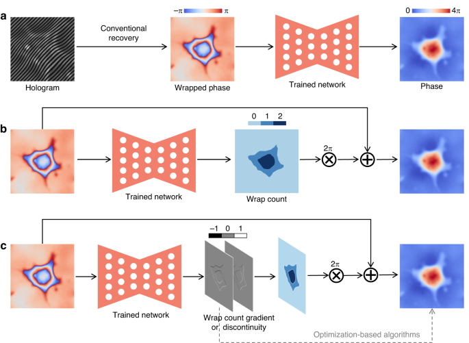

## Table of Contents

## What is a Position Recovery Model in machine learning?

A Position Recovery Model in machine learning is a type of model used to predict or recover the position of an object or a set of objects based on given data. Imagine you have a robot that moves around and you want to know where it is at any time. The position recovery model helps you figure out the robot's location by using information like sensor data, past positions, or other relevant data. This is particularly useful in fields like robotics, autonomous vehicles, and tracking systems, where knowing the precise location of objects is crucial for performance and safety.

These models often use techniques from statistics and machine learning, such as Kalman filters or particle filters, to estimate positions. For example, a Kalman filter might use a series of measurements over time, combined with a mathematical model of how the object moves, to predict where it will be next. This can be represented with a simple formula like $$ \hat{x}_{k} = F_k \hat{x}_{k-1} + K_k (z_k - H_k \hat{x}_{k-1}) $$, where $$ \hat{x}_k $$ is the estimated position at time k, $$ F_k $$ is the state transition model, $$ K_k $$ is the Kalman gain, $$ z_k $$ is the measurement at time k, and $$ H_k $$ is the measurement model. By continuously updating these estimates, the model can provide a more accurate prediction of the object's position over time.

## How do Position Recovery Models differ from other types of machine learning models?

Position Recovery Models are specialized machine learning models designed to predict or estimate the location of objects based on data like sensor readings or past positions. Unlike general machine learning models that might focus on classification or regression tasks, Position Recovery Models are specifically tailored for spatial tracking and navigation. They often incorporate time-series data and use algorithms like Kalman filters or particle filters to refine their predictions over time. For example, a Kalman filter might use a formula like $$ \hat{x}_{k} = F_k \hat{x}_{k-1} + K_k (z_k - H_k \hat{x}_{k-1}) $$ to update its estimate of an object's position based on new measurements.

In contrast, other types of machine learning models might not be concerned with spatial data at all. For instance, a model used for image classification would focus on identifying objects within an image, while a regression model might predict a continuous value like house prices based on features like size and location. Position Recovery Models, however, are unique in their focus on the dynamic aspect of position over time, making them essential in applications like robotics and autonomous vehicles where knowing the exact location of moving objects is critical.

## What are the primary applications of Position Recovery Models?

Position Recovery Models are mainly used in robotics and autonomous vehicles. They help robots and self-driving cars know where they are and where they need to go. For example, a robot in a warehouse might use these models to navigate around and find the right items to pick up. The model uses data from sensors, like cameras or GPS, to figure out the robot's position. By using formulas like $$ \hat{x}_{k} = F_k \hat{x}_{k-1} + K_k (z_k - H_k \hat{x}_{k-1}) $$, the model can make better guesses about where the robot is over time.

Another big use for Position Recovery Models is in tracking systems. These models can help track the movement of animals, people, or vehicles. For example, scientists might use them to follow the paths of migrating birds. The model takes in data from tracking devices and uses it to predict where the birds will go next. This helps researchers learn more about animal behavior and migration patterns.

Position Recovery Models are also useful in augmented reality and virtual reality. In these applications, the models help keep track of where the user's head or hands are moving. This makes the virtual experience feel more real and smooth. For example, in a VR game, the model might use data from sensors in the VR headset to adjust what the user sees as they move around. This makes the game more immersive and enjoyable.

## Can you explain the basic working principle behind PRNet+?

PRNet+ is a type of Position Recovery Model that helps predict where things are. It uses a special way to guess the position of an object by looking at data from sensors and past positions. Imagine you have a robot that moves around. PRNet+ helps the robot know where it is by using information like what the robot's cameras see or where it was before. It does this by mixing what it already knows with new information to make a better guess. The model uses a formula like $$ \hat{x}_{k} = F_k \hat{x}_{k-1} + K_k (z_k - H_k \hat{x}_{k-1}) $$ to update its guess about where the robot is.

PRNet+ is smart because it keeps learning as it gets more data. It starts with a guess about where something is and then uses new sensor data to make that guess better. For example, if a robot sees a new wall, PRNet+ will use that information to adjust its idea of where the robot is. This makes it really good for things like self-driving cars or robots that need to know exactly where they are all the time. By constantly updating its guesses, PRNet+ helps make sure that the robot or car stays on the right path.

## What are the key components of a Position Recovery Model?

The key components of a Position Recovery Model include a state transition model, a measurement model, and an estimation algorithm. The state transition model, often represented by $$ F_k $$, describes how the object's position changes over time. This could be based on the object's speed, direction, or other movement rules. The measurement model, represented by $$ H_k $$, connects the real-world sensor data to the model's internal representation of the object's position. This helps the model understand what the sensors are seeing and how it relates to the object's actual location. The estimation algorithm, like a Kalman filter or particle filter, uses these models to update the object's estimated position, often with a formula like $$ \hat{x}_{k} = F_k \hat{x}_{k-1} + K_k (z_k - H_k \hat{x}_{k-1}) $$. This formula takes the previous estimate, the new measurement, and adjusts the estimate to be more accurate.

Another important part of a Position Recovery Model is the handling of uncertainty. Because sensors can be inaccurate and the world can be unpredictable, the model needs to account for these uncertainties. The Kalman gain, $$ K_k $$, in the formula mentioned earlier, helps balance the trust in the model's prediction versus the new measurement. If the sensors are very reliable, the model will trust them more; if they're less reliable, it will rely more on its predictions. This balance is crucial for the model to keep making good guesses about where the object is. By constantly updating its understanding of the object's position and the uncertainties involved, the Position Recovery Model can provide reliable tracking and navigation for applications like robotics and autonomous vehicles.

## How is data typically preprocessed for use in Position Recovery Models?

Data preprocessing for Position Recovery Models involves cleaning and organizing the data to make it useful for tracking where things are. Sensors on robots or self-driving cars gather information like distances, angles, or GPS coordinates. This data often has errors or noise, so the first step is to clean it up. For example, if a sensor gives a reading that's way off from what's expected, the model might ignore it or correct it using a formula like $$ z_k = H_k x_k + v_k $$, where $$ z_k $$ is the sensor reading, $$ H_k $$ is how the sensor sees the world, $$ x_k $$ is the real position, and $$ v_k $$ is the error or noise. After cleaning, the data might need to be put into a format that the model can understand, like turning raw sensor readings into numbers that represent positions.

Once the data is cleaned and formatted, it's important to make sure it's lined up with time. Position Recovery Models often use time-series data, so each piece of data needs to be tagged with when it was recorded. This helps the model understand how things are moving over time. For example, if a robot's camera takes pictures at different times, the model needs to know the exact time of each picture to track the robot's path correctly. Sometimes, data from different sensors needs to be combined or "fused" to give a better picture of where the object is. This might involve using algorithms to blend the data in a way that makes the most sense, helping the model make better guesses about the object's position using formulas like $$ \hat{x}_{k} = F_k \hat{x}_{k-1} + K_k (z_k - H_k \hat{x}_{k-1}) $$.

## What metrics are used to evaluate the performance of Position Recovery Models?

To see how well a Position Recovery Model works, people use different ways to measure it. One common way is to check the "Mean Absolute Error" (MAE), which looks at how far off the model's guess is from the real position on average. If the model guesses a robot is at position 5 but it's really at 6, the error is 1. The MAE is the average of all these errors. Another way is to use "Root Mean Square Error" (RMSE), which is a bit like MAE but it puts more weight on bigger mistakes. The formula for RMSE is $$ \text{RMSE} = \sqrt{\frac{1}{n} \sum_{i=1}^{n} (y_i - \hat{y}_i)^2} $$, where $$ y_i $$ is the real position and $$ \hat{y}_i $$ is the guessed position.

Another important measure is "Accuracy", which checks how often the model's guesses are close enough to the real position. For example, if the model needs to be within 1 meter of the real position to be considered correct, accuracy tells us what percentage of the time it gets that right. "Precision" and "Recall" can also be used, especially if the model is trying to find specific spots or landmarks. Precision tells us how many of the model's positive guesses are correct, while recall tells us how many of the actual positive spots the model found. All these measures help us understand if the Position Recovery Model is good at guessing where things are and if it can be trusted in real situations like guiding robots or self-driving cars.

## What are the common challenges faced when implementing Position Recovery Models?

Implementing Position Recovery Models can be tricky because of a few common problems. One big challenge is dealing with noisy data. Sensors on robots or cars can give readings that aren't perfect, which makes it hard for the model to guess where things are. The model has to clean up this data and figure out what's real and what's just noise. Another challenge is keeping track of time. The model needs to know exactly when each piece of data was recorded to understand how things move over time. If the timing is off, the model's guesses can be wrong.

Another issue is making the model work well in different places. A model that works great in a lab might not do as well in a busy city or a dark forest. The model has to be able to adapt to new environments and still make good guesses about where things are. This can be tough because the world is full of surprises, and the model needs to handle them well. Using formulas like $$ \hat{x}_{k} = F_k \hat{x}_{k-1} + K_k (z_k - H_k \hat{x}_{k-1}) $$ helps, but it's still a challenge to get everything just right.

## How does PRNet+ improve upon previous Position Recovery Models?

PRNet+ is a newer and better version of Position Recovery Models. It does a better job at guessing where things are by using a smart way to mix old guesses with new information. For example, if a robot is moving around, PRNet+ uses data from its sensors and where it was before to make a more accurate guess about where it is now. It does this with a formula like $$ \hat{x}_{k} = F_k \hat{x}_{k-1} + K_k (z_k - H_k \hat{x}_{k-1}) $$. This formula helps PRNet+ to adjust its guesses over time, making it more reliable than older models.

One of the big improvements in PRNet+ is how it handles different places and situations. Older models might work well in a lab but not in a busy city or a dark forest. PRNet+ is designed to adapt better to new environments. It keeps learning and getting better as it gets more data. This makes it really useful for things like self-driving cars or robots that need to know exactly where they are, no matter where they are.

## What advanced techniques can be used to enhance the accuracy of Position Recovery Models?

One advanced technique to make Position Recovery Models more accurate is using something called sensor fusion. This means combining data from different sensors, like cameras, GPS, and radar, to get a better idea of where things are. By mixing all this information together, the model can make smarter guesses. For example, if a camera sees a wall but the GPS says the robot is somewhere else, the model can use a formula like $$ \hat{x}_{k} = F_k \hat{x}_{k-1} + K_k (z_k - H_k \hat{x}_{k-1}) $$ to figure out which sensor is more reliable and adjust its guess accordingly. This helps the model be more accurate, especially in tricky situations where one sensor might not be enough.

Another technique is using machine learning to help the model learn from past data. This can be done with neural networks, which are good at finding patterns in data. The model can use this to predict where things will be next, even if the data is a bit messy or if the environment changes. For example, if a robot has been in a warehouse before, the model can remember how it moved last time and use that to make better guesses now. This makes the model more adaptable and accurate over time, which is really helpful for things like self-driving cars or robots that need to navigate new places.

## How can Position Recovery Models be integrated with other AI systems?

Position Recovery Models can be integrated with other AI systems to make them work better together. For example, a robot might use a Position Recovery Model to know where it is, and then use another AI system to decide where to go next. The Position Recovery Model can share its guesses about the robot's location with the other AI system, which can then use this information to plan the best path. This is helpful in places like warehouses where robots need to move around a lot. By working together, these systems can make the robot more efficient and accurate.

Another way to integrate Position Recovery Models with other AI systems is in self-driving cars. The car might use a Position Recovery Model to keep track of where it is on the road, and then use another AI system to recognize traffic signs and other cars. The Position Recovery Model can use a formula like $$ \hat{x}_{k} = F_k \hat{x}_{k-1} + K_k (z_k - H_k \hat{x}_{k-1}) $$ to update its guess about the car's position, and then share this with the other AI system. This helps the car make better decisions about when to turn, stop, or speed up, making the ride safer and smoother for everyone inside.

## What are the future research directions for Position Recovery Models like PRNet+?

One future direction for research in Position Recovery Models like PRNet+ is improving their ability to work in different environments. Right now, these models do well in places they know, like labs or warehouses, but they can struggle in new or changing places like busy cities or forests. Researchers are working on making these models smarter so they can adapt better to new situations. They might use machine learning techniques, like neural networks, to help the model learn from new data and make better guesses about where things are. This could involve using a formula like $$ \hat{x}_{k} = F_k \hat{x}_{k-1} + K_k (z_k - H_k \hat{x}_{k-1}) $$ to update the model's estimates based on new information from different sensors.

Another important area for future research is making Position Recovery Models more accurate by combining data from different sensors. This is called sensor fusion, and it can help the model make better guesses about where things are, even if one sensor is not working well. For example, if a robot's camera sees a wall but the GPS says it's somewhere else, the model can use data from both to figure out the right position. Researchers are looking into new ways to mix this data together, maybe using advanced algorithms or machine learning to make the model's guesses more reliable. This could be especially useful for self-driving cars or robots that need to navigate tricky environments.