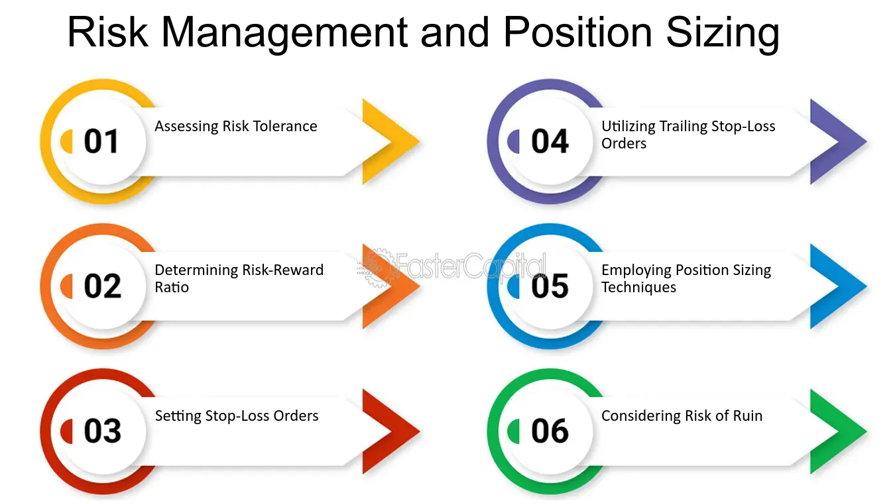

## Table of Contents

## What is position risk?

Position risk is the chance that the value of an investment might go down because of changes in the market or other factors. When you buy a stock, a bond, or any other financial asset, there is always a risk that its price could drop. This risk depends on many things, like how the economy is doing, news about the company, or even big events happening around the world.

Managing position risk is important for anyone who invests. One way to do this is by not putting all your money into one type of investment. Instead, you can spread your money across different kinds of assets, like stocks, bonds, and real estate. This is called diversification. By doing this, if one investment loses value, the others might still do well and help balance out your losses.

## Why is understanding position risk important for investors?

Understanding position risk is important for investors because it helps them know how much they could lose if things go wrong. When you invest, you want your money to grow, but there's always a chance it could shrink instead. Knowing the risks helps you make smarter choices about where to put your money. If you understand the risks, you can pick investments that match how much risk you're okay with taking.

Also, understanding position risk lets investors plan better. They can use strategies to protect their money, like not putting all their eggs in one basket. This means spreading money across different types of investments. If one investment goes down, the others might still do well, which can help keep your overall losses small. By knowing the risks, investors can feel more confident and make decisions that help them reach their financial goals.

## How does position risk differ from other types of financial risks?

Position risk is about the chance that the value of a specific investment might go down. It's tied to the ups and downs of the market and can be affected by things like news about a company or big events around the world. For example, if you own shares in a company and that company does poorly, the value of your shares might drop. Position risk is something investors can manage by spreading their money across different types of investments, which is called diversification.

Other types of financial risks include market risk, credit risk, and liquidity risk. Market risk is similar to position risk but looks at the overall market instead of a single investment. It's the risk that the whole market could go down, affecting all kinds of investments. Credit risk is the chance that someone you've lent money to, like a company or government, might not pay you back. Liquidity risk is about not being able to quickly sell an investment without losing money. Each of these risks needs different ways to manage them, but understanding position risk helps investors focus on the risks of their specific investments.

## What are the common methods to measure position risk?

One common way to measure position risk is by using something called Value at Risk (VaR). VaR helps you figure out the most money you could lose over a certain time, like a day or a week, with a certain level of confidence, say 95%. For example, if your VaR is $1,000 at a 95% confidence level over a day, it means there's a 5% chance you could lose more than $1,000 in a day. This method is useful because it gives you a clear number to think about, but it's not perfect because it doesn't tell you how bad things could get if they go beyond that number.

Another method is to look at the Beta of an investment. Beta measures how much an investment's price moves compared to the overall market. If a stock has a Beta of 1, it moves the same as the market. A Beta higher than 1 means the stock is more sensitive to market changes, and a Beta lower than 1 means it's less sensitive. This helps investors understand how much risk they're taking on compared to the market as a whole. Both VaR and Beta are useful tools, but they work best when used together to get a full picture of position risk.

## Can you explain the concept of Value at Risk (VaR) in relation to position risk?

Value at Risk (VaR) is a way to measure how much money you could lose from an investment over a certain time. It helps you understand the risk of your position by giving you a number that tells you the most you might lose with a certain level of confidence. For example, if your VaR is $1,000 at a 95% confidence level over a day, it means there's a 5% chance you could lose more than $1,000 in that day. This number helps you see the risk you're taking and plan how to manage it.

VaR is useful because it gives you a clear idea of what might happen to your investment. But it's not perfect. It doesn't tell you how bad things could get if they go beyond that number. So, if you lose more than your VaR, you won't know how much more. That's why it's good to use VaR along with other ways to measure risk, like Beta, to get a full picture of how risky your investment might be.

## How does diversification affect position risk?

Diversification is when you spread your money across different types of investments. This helps lower your position risk because if one investment goes down in value, the others might still do well. Imagine you have all your money in one company's stock. If that company does badly, you could lose a lot. But if you also have money in other stocks, bonds, or even real estate, a drop in one won't hurt as much because the others might balance it out.

By diversifying, you're not putting all your eggs in one basket. This means you're less likely to lose a big chunk of your money all at once. It's like having a safety net. Even if one investment doesn't do well, your overall investment portfolio can still be okay. Diversification doesn't get rid of risk completely, but it makes it easier to handle because it spreads out the risk across many different investments.

## What role does leverage play in increasing or decreasing position risk?

Leverage is when you borrow money to invest more than you have. It can make your position risk bigger because if the investment goes down, you lose more than just your own money. Imagine you use leverage to buy more stock. If the stock price drops, not only do you lose what you put in, but you also have to pay back the money you borrowed. This can make your losses much bigger than if you had just used your own money.

On the other hand, leverage can also make your gains bigger if the investment goes up. If the stock price rises, you make money on the extra shares you bought with borrowed money. But remember, using leverage is like playing with fire. It can help you make more money, but it can also burn you if things go wrong. So, it's important to be careful and understand the risks before using leverage.

## How can stop-loss orders be used to manage position risk?

Stop-loss orders are a tool that helps you manage the risk of losing money on your investments. A stop-loss order is like setting a safety net. You tell your broker to sell your investment if its price drops to a certain level. This way, you can limit how much money you lose. For example, if you buy a stock at $50 and set a stop-loss order at $45, your broker will sell the stock automatically if it falls to $45. This stops you from losing more than $5 if the stock keeps going down.

Using stop-loss orders can help you sleep better at night because you know you have a plan to cut your losses. But remember, stop-loss orders are not perfect. Sometimes, the price of your investment might drop quickly and go below your stop-loss level before coming back up. This can happen during times when the market is very busy or if there's big news. So, while stop-loss orders can help manage position risk, they should be used carefully and as part of a bigger plan to protect your money.

## What are some advanced strategies for mitigating position risk in a portfolio?

One advanced strategy for mitigating position risk is using options. Options are like contracts that give you the right, but not the obligation, to buy or sell an asset at a certain price before a certain date. By buying put options, you can protect your investments. If the price of your investment goes down a lot, you can use the put option to sell it at a higher price than the market. This can help limit your losses. Another way to use options is by selling covered calls. If you own a stock, you can sell someone the right to buy it from you at a higher price. If the stock stays below that price, you keep the money from selling the option, which can help balance out any small drops in the stock's value.

Another strategy is to use a technique called delta hedging. Delta hedging is when you buy or sell other investments to balance out the risk of your main investment. For example, if you own a stock and you think it might go down, you can buy a put option or sell a future contract on that stock. This can help protect your position if the stock price drops. Delta hedging needs to be done carefully and often, because the balance can change as the market moves. It's a bit like riding a bike—you need to keep adjusting to stay on [course](/wiki/best-algorithmic-trading-courses).

Lastly, you can use something called portfolio insurance. This is when you use financial products to protect your whole portfolio, not just one investment. One way to do this is by using dynamic hedging, which means you keep buying and selling options or futures to make sure your portfolio is protected as the market changes. This can be complex and needs a lot of attention, but it can help you manage the risk of your entire portfolio. By using these advanced strategies, you can better protect your investments and feel more confident about managing your position risk.

## How do different asset classes influence the level of position risk?

Different asset classes can affect the level of position risk in different ways. Stocks, for example, can be very risky because their prices can go up and down a lot. If you buy a stock in a company that does well, you might make a lot of money. But if the company does badly, you could lose a lot too. Bonds, on the other hand, are usually less risky than stocks. When you buy a bond, you're lending money to a company or government, and they promise to pay you back with interest. So, bonds are more stable, but they usually don't grow as fast as stocks.

Real estate is another asset class that can affect position risk. Owning property can be less risky than stocks because property prices don't change as quickly. But real estate can still be risky because it's hard to sell quickly if you need money fast. Commodities, like gold or oil, can be very risky because their prices can change a lot based on what's happening around the world. By understanding how different asset classes work, you can choose the ones that fit your risk level and help you manage your position risk better.

## Can you discuss the impact of market volatility on position risk?

Market [volatility](/wiki/volatility-trading-strategies) is when the prices of investments go up and down a lot in a short time. This can make position risk bigger because if the market is moving a lot, the value of your investment can change quickly. Imagine you own a stock and the market gets very volatile. The price of your stock might drop a lot in one day, which means you could lose more money than you expected. When the market is volatile, it's harder to predict what will happen next, so your position risk goes up.

To handle this, you might want to use strategies like diversification, where you spread your money across different types of investments. If one investment goes down because of market volatility, others might not be affected as much, which can help balance out your losses. Another way is to use stop-loss orders, which automatically sell your investment if it drops to a certain price, to limit how much you lose. Understanding and managing position risk during times of high market volatility can help you protect your money and make smarter investment choices.

## What are the latest regulatory considerations regarding position risk management?

Regulators around the world are paying more attention to how investors manage their position risk. They want to make sure that big investors, like banks and investment funds, don't take too many risks that could hurt the whole market. For example, after the 2008 financial crisis, rules were made stricter to stop banks from taking too much risk with their investments. These rules, like the Basel III framework, ask banks to keep more money on hand to cover losses if their investments go bad. This is to make the financial system safer for everyone.

Regulators also want to make sure that investors have good ways to measure and manage their position risk. They encourage the use of tools like Value at Risk (VaR) and stress testing, which help investors see how bad things could get if the market goes down. Some countries have rules that say big investors need to report how they are managing their risks regularly. This helps regulators keep an eye on things and step in if they see problems coming. By doing this, they hope to keep the markets stable and protect people's money.

## What are the common risks associated with position sizing?

Position sizing in [algorithmic trading](/wiki/algorithmic-trading) is fraught with numerous risks, each capable of significantly impacting profitability and overall trading success. Understanding and managing these risks is paramount for traders seeking to safeguard their portfolios against potential losses.

**Volatility Risk:** 

Volatility risk is a primary concern in position sizing, arising from the inherent unpredictability of asset prices. Rapid price fluctuations can undermine the profitability of positions, especially if the size of the position is not adequately adjusted for changes in market volatility. Volatility can be measured using various metrics such as historical volatility or implied volatility. For instance, the standard deviation ($\sigma$) of historical returns is commonly used to gauge the volatility of an asset:

$$
\sigma = \sqrt{\frac{1}{N-1}\sum_{i=1}^{N}(R_i - \bar{R})^2}
$$

where $R_i$ is the return on day $i$, $\bar{R}$ is the average return, and $N$ is the number of observations.

**Market Liquidity Risk:**

Market [liquidity](/wiki/liquidity-risk-premium) risk refers to the challenges associated with executing trades at desired prices, a scenario often exacerbated by adverse market conditions. Low liquidity can lead to slippage, where the execution price of a trade deviates from its expected price, potentially turning a profitable trade into a loss. Traders must evaluate the liquidity of the assets they are engaging with, considering the average daily trading [volume](/wiki/volume-trading-strategy) and the bid-ask spread. A significant spread can imply a costlier trade, impacting the overall strategy.

**Systemic Risk:**

Systemic risk in algorithmic trading can amplify broader financial risks, as seen in historical events like the Flash Crash of 2010. During such incidents, algorithmic trading systems, if not properly managed, can contribute to market disorders by executing large volumes of trades at rapid speeds. This can destabilize market conditions further and lead to cascading failures across markets. Effective risk management involves implementing measures such as circuit breakers and rigorous stress testing of trading algorithms to mitigate potential systemic threats. 

In summary, traders should continuously analyze and adapt their position sizing strategies to account for these risks. Advanced tools and methodologies, along with vigilant market monitoring, are essential to manage volatility, ensure adequate liquidity, and guard against systemic disruptions.

## What are Position Sizing Strategies to Mitigate Risk?

Position sizing strategies are fundamental to managing risk and enhancing the robustness of algorithmic trading strategies. They assist traders in balancing their portfolios to minimize the impact of adverse market movements and optimize the risk-reward ratio. Here, we examine several effective position sizing strategies: Equally Weighted Position Sizing, Volatility-Scaled Positioning, and Risk Parity.

**Equally Weighted Position Sizing**

The Equally Weighted Position Sizing strategy is straightforward, dividing capital equally among all positions in a portfolio. This method promotes diversification by spreading the investment across different assets, reducing reliance on any single asset's performance. The simplicity of this approach makes it attractive, especially for novice traders or those dealing with a large number of assets, as it minimizes the decision-making complexity. The primary drawback, however, is its lack of consideration for each asset's risk profile, which can potentially impair capital preservation if not coupled with other risk management measures.

**Volatility-Scaled Positioning**

Volatility-Scaled Positioning adjusts the size of each position according to its volatility. The underlying principle is to allocate more capital to less volatile assets and less capital to more volatile ones, thereby equalizing the risk contribution of each position to the overall portfolio. This can be mathematically represented as:

$$
w_i = \frac{\frac{1}{\sigma_i}}{\sum_{j=1}^{n} \frac{1}{\sigma_j}}
$$

where $w_i$ is the weight of the i-th asset, $\sigma_i$ is the volatility of the i-th asset, and n is the total number of assets. By employing this strategy, traders can mitigate the risk of substantial losses due to heavy investment in highly volatile assets, thus maintaining a more stable risk-adjusted return.

**Risk Parity**

Risk Parity seeks to distribute capital such that each asset contributes equally to the overall portfolio risk. Unlike equally weighted strategies, Risk Parity takes into account the variability and correlation of asset returns, aiming to balance exposure and risk contribution. The risk contribution of each asset is considered through its marginal contribution to portfolio risk and is adjusted until all risks are equalized. This is particularly beneficial in diversified portfolios, as it prevents overexposure to high-risk assets and enhances stability. The Risk Parity approach can be implemented using complex algorithms that dynamically adjust positions based on changing market conditions and asset correlations, ensuring that the portfolio remains balanced and risks are evenly distributed.

In summary, each of these position sizing strategies offers unique advantages for mitigating risk in algorithmic trading. The choice of strategy should align with the trader's risk tolerance, market outlook, and the specific characteristics of their trading portfolio. By strategically managing position sizes, traders can enhance their resilience to market fluctuations and improve their potential for sustained profitability.

## What are Advanced Position Sizing Techniques?

The Kelly Criterion is a mathematical formulation used to determine the optimal size of a series of bets to maximize logarithmic wealth. This approach relies on probabilistic metrics, using the formula:

$$
f^* = \frac{bp - q}{b}
$$

where $f^*$ is the fraction of the capital to be wagered, $b$ is the odds received on the wager (net odds to 1), $p$ is the probability of winning, and $q$ is the probability of losing ($q = 1-p$). When applied to trading, the Kelly Criterion aims to maximize the expected growth of a portfolio by carefully managing position sizes based on expected returns and probabilities of success. While it theoretically offers a framework for optimal capital allocation, traders often apply a fractional Kelly approach to mitigate the risk of overleveraging.

Maximum Drawdown Control addresses the need to curtail losses during adverse market movements. It focuses on keeping drawdowns—the maximum loss from a peak to a subsequent trough—as low as possible. Traders who focus on drawdown control might reduce their positions or [exit](/wiki/exit-strategy) trades entirely once a specified drawdown threshold is reached. This method hinges on the principle of capital preservation, stressing the importance of maintaining trading viability by avoiding sequences of devastating losses.

Notional Target Positioning involves allocating capital based on the strength of trading signals, ensuring that the size of a position is proportional to the perceived strength of an opportunity. This technique prioritizes the avoidance of overleveraging, particularly in volatile market conditions where rapid fluctuations can amplify losses. By confining exposure in environments with heightened risk, traders aim to safeguard their capital while still capitalizing on favorable conditions.

Employing these techniques requires robust data analytics and a comprehensive understanding of market conditions. Integrating statistical models and [backtesting](/wiki/backtesting) in a trading strategy provides insights into the potential efficacy of various approaches, ensuring that the methods employed are aligned with the ever-present goal of augmenting risk-adjusted returns.

## What is the impact of position sizing on trading performance?

In algorithmic trading, position sizing is a critical [factor](/wiki/factor-investing) influencing trading performance. By determining how much capital to allocate to each trade, effective position sizing optimizes risk-adjusted returns and preserves capital. This involves aligning the sizing strategy with the trader's risk tolerance and market outlook, ensuring that trading outcomes are both consistent and reliable.

A methodical sizing strategy is essential for navigating the complexities of the financial markets. Traders must assess their risk tolerance—essentially how much risk they are willing to bear for potential returns—and tailor their strategies accordingly. For instance, a risk-averse trader might allocate smaller capital portions to trades that exhibit higher volatility, thereby reducing exposure to potential losses. Conversely, a trader with a higher risk tolerance might allocate more capital to such trades, anticipating higher returns despite the increased risk.

Backtesting is a fundamental practice in validating the effectiveness of position sizing strategies. By simulating trades over historical data, traders can observe how different position sizing methods perform across various market conditions. This enables traders to make informed adjustments before applying strategies in live markets. For example, backtesting might reveal that a particular strategy performs well in bull markets but underperforms in bear markets. Knowing this, traders can adapt their approach to mitigate risks in unfavorable conditions.

To illustrate, consider a strategy employing the Kelly Criterion, which uses probabilistic metrics to determine the optimal position sizes for maximizing exponential portfolio growth. The formula for the Kelly Criterion is:

$$
f^* = \frac{bp - q}{b}
$$

where $f^*$ is the fraction of the capital to wager, $b$ is the odds received on the wager, $p$ is the probability of winning, and $q$ is the probability of losing. By applying this formula during backtesting, traders can adjust the allocations based on the calculated optimal fractions, thus enhancing their overall trading performance.

In summary, effective position sizing, supported by rigorous backtesting, is pivotal for optimizing trading outcomes. By aligning strategies with risk tolerance and market dynamics, traders can achieve a balanced approach that not only targets superior returns but also ensures the protection of capital under varying market conditions.

## References & Further Reading

[1]: ["Advances in Financial Machine Learning"](https://www.amazon.com/Advances-Financial-Machine-Learning-Marcos/dp/1119482089) by Marcos Lopez de Prado

[2]: ["Evidence-Based Technical Analysis: Applying the Scientific Method and Statistical Inference to Trading Signals"](https://www.amazon.com/Evidence-Based-Technical-Analysis-Scientific-Statistical/dp/0470008741) by David Aronson

[3]: ["Machine Learning for Algorithmic Trading"](https://github.com/stefan-jansen/machine-learning-for-trading) by Stefan Jansen

[4]: ["Quantitative Trading: How to Build Your Own Algorithmic Trading Business"](https://books.google.com/books/about/Quantitative_Trading.html?id=j70yEAAAQBAJ) by Ernest P. Chan

[5]: Hull, J. (2012). ["Risk Management and Financial Institutions"](https://books.google.com/books/about/Risk_Management_and_Financial_Institutio.html?id=1J1QDwAAQBAJ)

[6]: Avellaneda, M., & Stoikov, S. (2008). ["High-frequency trading in a limit order book."](https://math.nyu.edu/~avellane/HighFrequencyTrading.pdf) Quantitative Finance, 8(3), 217-224.

[7]: Mitra, G., & Leal, J. (2013). ["The Handbook of News Analytics in Finance"](https://onlinelibrary.wiley.com/doi/book/10.1002/9781118467411)

[8]: Thorp, E. O. (2008). ["The Kelly Criterion in Blackjack, Sports Betting, and the Stock Market."](http://www.eecs.harvard.edu/cs286r/courses/fall12/papers/Thorpe_KellyCriterion2007.pdf) The Kelly Capital Growth Investment Criterion: Theory and Practice. 

[9]: Aldridge, I. (2013). ["High-Frequency Trading: A Practical Guide to Algorithmic Strategies and Trading Systems"](https://onlinelibrary.wiley.com/doi/pdf/10.1002/9781119203803.fmatter)