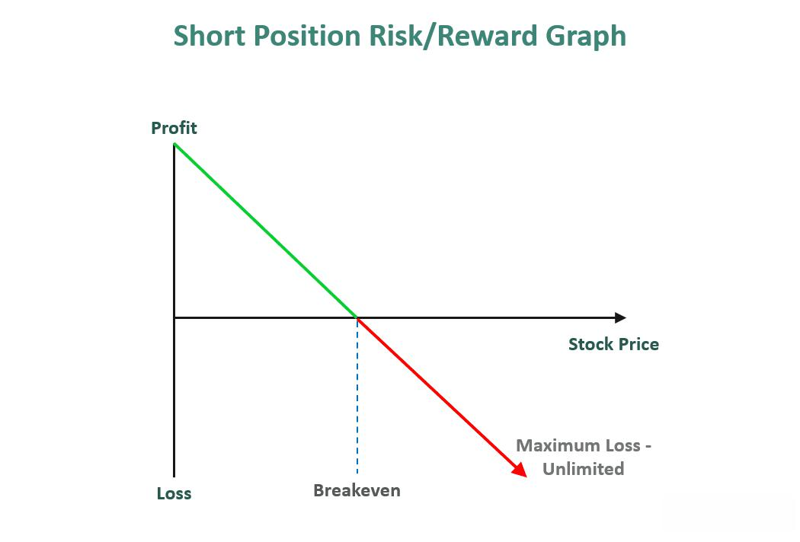

In the fast-paced world of algorithmic trading, managing risk is crucial for sustaining profitability and minimizing losses. Algorithmic trading, which uses sophisticated mathematical models to automate trading strategies, heavily relies on the effective management of position risk. Position risk involves the strategic allocation of capital across trades to tackle market volatility effectively. This allocation is fundamental to safeguarding assets against sudden market shifts that can lead to significant financial losses.

Position risk management allows traders to better guard against systemic risks and optimize their trading strategies. Systemic risks, which pertain to factors affecting the entire market rather than individual assets, can be particularly challenging to mitigate without a well-thought-out risk management strategy. Effective position risk management typically includes the use of statistical and mathematical models to predict potential market movements and adjust positions accordingly. By accurately assessing the risk associated with different trades, traders can make informed decisions that balance potential rewards with acceptable levels of risk.

This article explores the significance of position risk in algorithmic trading, shedding light on potential threats and best practices for mitigation. Understanding the intricacies of position risk and implementing robust strategies to manage it is essential not only for protecting investments but also for achieving consistent trading performance. As such, traders must continuously refine their approaches to stay ahead in the ever-evolving landscape of the financial markets.

## Table of Contents

## Understanding Position Risk in Algo Trading

Position risk is a critical element in the domain of [algorithmic trading](/wiki/algorithmic-trading), representing the vulnerability of a trading position to fluctuations in the market. Such fluctuations can lead to potential losses if not managed effectively. The significance of position risk management is underscored by its role in distinguishing profitable trading strategies from unprofitable ones.

Key components of position risk in algorithmic trading include leverage use, market depth, and asset correlation. Leverage, while potentially amplifying returns, equally magnifies losses, affecting the overall exposure to risk. High leverage can lead traders to face large losses in adverse market movements, necessitating careful leverage management to maintain a balanced risk exposure.

Market depth refers to the market's capacity to sustain large order volumes without significant price changes. Inadequate market depth can hinder the execution of large trades at desired prices, leading to slippage and unexpected losses. Thus, understanding and accounting for market depth is essential to mitigate position risk.

Asset correlation also plays a vital role in risk management. Positive correlation among assets can result in simultaneous adverse price movements across related positions, increasing overall portfolio risk. Conversely, incorporating negatively correlated or uncorrelated assets can diversify and reduce systemic exposure, ensuring more stable returns.

Effective management of position risk is pivotal, as it directly influences the profitability and sustainability of trading algorithms. Traders often employ quantitative models and simulations to forecast potential risks and determine optimal position sizes, balancing the potential rewards against the inherent risks of market [volatility](/wiki/volatility-trading-strategies). Proper risk assessment and strategic allocation of capital enable traders to capitalize on market opportunities while safeguarding against significant losses.

## Common Risks Associated with Position Sizing

Position sizing in algorithmic trading is fraught with numerous risks, each capable of significantly impacting profitability and overall trading success. Understanding and managing these risks is paramount for traders seeking to safeguard their portfolios against potential losses.

**Volatility Risk:** 

Volatility risk is a primary concern in position sizing, arising from the inherent unpredictability of asset prices. Rapid price fluctuations can undermine the profitability of positions, especially if the size of the position is not adequately adjusted for changes in market volatility. Volatility can be measured using various metrics such as historical volatility or implied volatility. For instance, the standard deviation ($\sigma$) of historical returns is commonly used to gauge the volatility of an asset:

$$
\sigma = \sqrt{\frac{1}{N-1}\sum_{i=1}^{N}(R_i - \bar{R})^2}
$$

where $R_i$ is the return on day $i$, $\bar{R}$ is the average return, and $N$ is the number of observations.

**Market Liquidity Risk:**

Market [liquidity](/wiki/liquidity-risk-premium) risk refers to the challenges associated with executing trades at desired prices, a scenario often exacerbated by adverse market conditions. Low liquidity can lead to slippage, where the execution price of a trade deviates from its expected price, potentially turning a profitable trade into a loss. Traders must evaluate the liquidity of the assets they are engaging with, considering the average daily trading [volume](/wiki/volume-trading-strategy) and the bid-ask spread. A significant spread can imply a costlier trade, impacting the overall strategy.

**Systemic Risk:**

Systemic risk in algorithmic trading can amplify broader financial risks, as seen in historical events like the Flash Crash of 2010. During such incidents, algorithmic trading systems, if not properly managed, can contribute to market disorders by executing large volumes of trades at rapid speeds. This can destabilize market conditions further and lead to cascading failures across markets. Effective risk management involves implementing measures such as circuit breakers and rigorous stress testing of trading algorithms to mitigate potential systemic threats. 

In summary, traders should continuously analyze and adapt their position sizing strategies to account for these risks. Advanced tools and methodologies, along with vigilant market monitoring, are essential to manage volatility, ensure adequate liquidity, and guard against systemic disruptions.

## Position Sizing Strategies to Mitigate Risk

Position sizing strategies are fundamental to managing risk and enhancing the robustness of algorithmic trading strategies. They assist traders in balancing their portfolios to minimize the impact of adverse market movements and optimize the risk-reward ratio. Here, we examine several effective position sizing strategies: Equally Weighted Position Sizing, Volatility-Scaled Positioning, and Risk Parity.

**Equally Weighted Position Sizing**

The Equally Weighted Position Sizing strategy is straightforward, dividing capital equally among all positions in a portfolio. This method promotes diversification by spreading the investment across different assets, reducing reliance on any single asset's performance. The simplicity of this approach makes it attractive, especially for novice traders or those dealing with a large number of assets, as it minimizes the decision-making complexity. The primary drawback, however, is its lack of consideration for each asset's risk profile, which can potentially impair capital preservation if not coupled with other risk management measures.

**Volatility-Scaled Positioning**

Volatility-Scaled Positioning adjusts the size of each position according to its volatility. The underlying principle is to allocate more capital to less volatile assets and less capital to more volatile ones, thereby equalizing the risk contribution of each position to the overall portfolio. This can be mathematically represented as:

$$
w_i = \frac{\frac{1}{\sigma_i}}{\sum_{j=1}^{n} \frac{1}{\sigma_j}}
$$

where $w_i$ is the weight of the i-th asset, $\sigma_i$ is the volatility of the i-th asset, and n is the total number of assets. By employing this strategy, traders can mitigate the risk of substantial losses due to heavy investment in highly volatile assets, thus maintaining a more stable risk-adjusted return.

**Risk Parity**

Risk Parity seeks to distribute capital such that each asset contributes equally to the overall portfolio risk. Unlike equally weighted strategies, Risk Parity takes into account the variability and correlation of asset returns, aiming to balance exposure and risk contribution. The risk contribution of each asset is considered through its marginal contribution to portfolio risk and is adjusted until all risks are equalized. This is particularly beneficial in diversified portfolios, as it prevents overexposure to high-risk assets and enhances stability. The Risk Parity approach can be implemented using complex algorithms that dynamically adjust positions based on changing market conditions and asset correlations, ensuring that the portfolio remains balanced and risks are evenly distributed.

In summary, each of these position sizing strategies offers unique advantages for mitigating risk in algorithmic trading. The choice of strategy should align with the trader's risk tolerance, market outlook, and the specific characteristics of their trading portfolio. By strategically managing position sizes, traders can enhance their resilience to market fluctuations and improve their potential for sustained profitability.

## Advanced Position Sizing Techniques

The Kelly Criterion is a mathematical formulation used to determine the optimal size of a series of bets to maximize logarithmic wealth. This approach relies on probabilistic metrics, using the formula:

$$
f^* = \frac{bp - q}{b}
$$

where $f^*$ is the fraction of the capital to be wagered, $b$ is the odds received on the wager (net odds to 1), $p$ is the probability of winning, and $q$ is the probability of losing ($q = 1-p$). When applied to trading, the Kelly Criterion aims to maximize the expected growth of a portfolio by carefully managing position sizes based on expected returns and probabilities of success. While it theoretically offers a framework for optimal capital allocation, traders often apply a fractional Kelly approach to mitigate the risk of overleveraging.

Maximum Drawdown Control addresses the need to curtail losses during adverse market movements. It focuses on keeping drawdowns—the maximum loss from a peak to a subsequent trough—as low as possible. Traders who focus on drawdown control might reduce their positions or [exit](/wiki/exit-strategy) trades entirely once a specified drawdown threshold is reached. This method hinges on the principle of capital preservation, stressing the importance of maintaining trading viability by avoiding sequences of devastating losses.

Notional Target Positioning involves allocating capital based on the strength of trading signals, ensuring that the size of a position is proportional to the perceived strength of an opportunity. This technique prioritizes the avoidance of overleveraging, particularly in volatile market conditions where rapid fluctuations can amplify losses. By confining exposure in environments with heightened risk, traders aim to safeguard their capital while still capitalizing on favorable conditions.

Employing these techniques requires robust data analytics and a comprehensive understanding of market conditions. Integrating statistical models and [backtesting](/wiki/backtesting) in a trading strategy provides insights into the potential efficacy of various approaches, ensuring that the methods employed are aligned with the ever-present goal of augmenting risk-adjusted returns.

## The Impact of Position Sizing on Trading Performance

In algorithmic trading, position sizing is a critical [factor](/wiki/factor-investing) influencing trading performance. By determining how much capital to allocate to each trade, effective position sizing optimizes risk-adjusted returns and preserves capital. This involves aligning the sizing strategy with the trader's risk tolerance and market outlook, ensuring that trading outcomes are both consistent and reliable.

A methodical sizing strategy is essential for navigating the complexities of the financial markets. Traders must assess their risk tolerance—essentially how much risk they are willing to bear for potential returns—and tailor their strategies accordingly. For instance, a risk-averse trader might allocate smaller capital portions to trades that exhibit higher volatility, thereby reducing exposure to potential losses. Conversely, a trader with a higher risk tolerance might allocate more capital to such trades, anticipating higher returns despite the increased risk.

Backtesting is a fundamental practice in validating the effectiveness of position sizing strategies. By simulating trades over historical data, traders can observe how different position sizing methods perform across various market conditions. This enables traders to make informed adjustments before applying strategies in live markets. For example, backtesting might reveal that a particular strategy performs well in bull markets but underperforms in bear markets. Knowing this, traders can adapt their approach to mitigate risks in unfavorable conditions.

To illustrate, consider a strategy employing the Kelly Criterion, which uses probabilistic metrics to determine the optimal position sizes for maximizing exponential portfolio growth. The formula for the Kelly Criterion is:

$$
f^* = \frac{bp - q}{b}
$$

where $f^*$ is the fraction of the capital to wager, $b$ is the odds received on the wager, $p$ is the probability of winning, and $q$ is the probability of losing. By applying this formula during backtesting, traders can adjust the allocations based on the calculated optimal fractions, thus enhancing their overall trading performance.

In summary, effective position sizing, supported by rigorous backtesting, is pivotal for optimizing trading outcomes. By aligning strategies with risk tolerance and market dynamics, traders can achieve a balanced approach that not only targets superior returns but also ensures the protection of capital under varying market conditions.

## Conclusion

Managing position risk is a critical aspect of successful algorithmic trading, necessitating a strategic approach and careful planning. Effective position risk management allows traders to mitigate potential losses by adapting to market dynamics and optimizing their strategies accordingly. The implementation of sophisticated position sizing techniques is fundamental to enhancing resilience against the inevitable market volatilities encountered in trading.

Sophisticated methods such as the Kelly Criterion or Risk Parity enable traders to allocate capital optimally, maximizing growth potential while controlling for risk exposure. These techniques are aligned with the trader’s risk tolerance and contribute to a more stable performance by balancing the portfolio’s overall risk.

Continuous monitoring and refinement of position sizing strategies are essential to ensure their effectiveness remains intact as market conditions evolve. By employing backtesting practices, traders can validate their strategic approaches across various scenarios, further enhancing their adaptability and robustness. This iterative process is vital for maintaining an edge in a fast-evolving trading landscape, where market conditions can shift rapidly.

Ultimately, a meticulous approach to managing position risk, coupled with an agile strategy that evolves through continual evaluation and refinement, supports sustained profitability and capital preservation in algorithmic trading.

## References & Further Reading

[1]: ["Advances in Financial Machine Learning"](https://www.amazon.com/Advances-Financial-Machine-Learning-Marcos/dp/1119482089) by Marcos Lopez de Prado

[2]: ["Evidence-Based Technical Analysis: Applying the Scientific Method and Statistical Inference to Trading Signals"](https://www.amazon.com/Evidence-Based-Technical-Analysis-Scientific-Statistical/dp/0470008741) by David Aronson

[3]: ["Machine Learning for Algorithmic Trading"](https://github.com/stefan-jansen/machine-learning-for-trading) by Stefan Jansen

[4]: ["Quantitative Trading: How to Build Your Own Algorithmic Trading Business"](https://books.google.com/books/about/Quantitative_Trading.html?id=j70yEAAAQBAJ) by Ernest P. Chan

[5]: Hull, J. (2012). ["Risk Management and Financial Institutions"](https://books.google.com/books/about/Risk_Management_and_Financial_Institutio.html?id=1J1QDwAAQBAJ)

[6]: Avellaneda, M., & Stoikov, S. (2008). ["High-frequency trading in a limit order book."](https://math.nyu.edu/~avellane/HighFrequencyTrading.pdf) Quantitative Finance, 8(3), 217-224.

[7]: Mitra, G., & Leal, J. (2013). ["The Handbook of News Analytics in Finance"](https://onlinelibrary.wiley.com/doi/book/10.1002/9781118467411)

[8]: Thorp, E. O. (2008). ["The Kelly Criterion in Blackjack, Sports Betting, and the Stock Market."](http://www.eecs.harvard.edu/cs286r/courses/fall12/papers/Thorpe_KellyCriterion2007.pdf) The Kelly Capital Growth Investment Criterion: Theory and Practice. 

[9]: Aldridge, I. (2013). ["High-Frequency Trading: A Practical Guide to Algorithmic Strategies and Trading Systems"](https://onlinelibrary.wiley.com/doi/pdf/10.1002/9781119203803.fmatter)