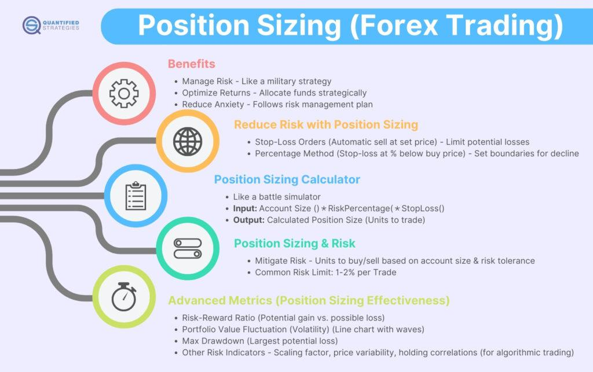

Understanding the nuances of forex and algorithmic trading is essential for traders looking to maximize their profit potential. The ever-evolving financial markets demand a strategic approach to navigating both the opportunities and risks involved in trading. One critical aspect that often determines a trader's success is position sizing. This strategic method involves determining the amount of capital to allocate to each trade. Position sizing is integral to balancing risk and reward effectively, ensuring that traders can optimize their returns while minimizing potential losses.

Proper position sizing is not merely about determining the size of a single trade but encompasses a broader strategy of risk management and capital allocation. By employing disciplined position sizing techniques, traders can adjust their exposure to market volatility, maintaining consistent risk levels across multiple trades and market conditions. This approach allows traders to safeguard their investments while pursuing gains, contributing to sustained trading success.



In this article, we will explore various position sizing techniques and their significance in forex and algorithmic trading. These techniques serve as the foundation for risk management strategies that help traders navigate the complexities of the financial markets. We will discuss practical methods that traders can use to achieve consistent profitability by applying disciplined and informed position sizing strategies. This guide aims to equip traders with the knowledge needed to enhance their trading performance, ensuring a rational and structured approach to risk-taking.

By understanding and implementing effective position sizing, traders can enhance their financial strategies and better capitalize on market opportunities. Proper position sizing is key to maintaining the discipline required to succeed in the competitive and dynamic trading environments of forex and algorithmic strategies. This introduction sets the stage for an in-depth exploration of the techniques that traders can utilize to optimize their trading outcomes.

## Table of Contents

## The Importance of Position Sizing

Position sizing is a fundamental component of trading strategies, determining the proportion of capital allocated to each trade. It plays a crucial role in balancing potential profits with risk exposure. Proper position sizing allows traders to manage risk effectively while optimizing returns under varying market conditions.

Effective position sizing strategies serve as a risk management tool, essential for navigating the inherent volatility associated with forex and algorithmic trading. By distributing capital appropriately across trades, traders can mitigate the likelihood of catastrophic losses and enhance their chances of maintaining a profitable portfolio. Position sizing requires an understanding of one's risk tolerance, which involves setting clear parameters for how much an individual is willing to risk per trade. For instance, many traders adopt a rule of risking no more than 1-2% of their total capital on any single trade. This systematic approach helps to ensure that no single loss can significantly impact the overall trading account.

Without proper position sizing, traders face the danger of either over-leveraging or under-utilizing their available capital. Over-leveraging occurs when a trader takes on a position size too large relative to their account balance, exposing them to excessive risk. This can lead to substantial losses if the trade moves unfavorably. Conversely, under-utilizing capital by taking positions that are too small may result in missed opportunities, where potential profits are not fully realized. Both scenarios lead to suboptimal trading outcomes.

Consistency in position sizing is essential. Traders need to maintain a disciplined approach in their trading activities to ensure they adhere to their predefined risk parameters. This consistency helps in reducing the emotional impact of trading decisions, fostering a more systematic approach to trading. Being consistent also means that traders can evaluate their strategies over time, assessing their effectiveness and making necessary adjustments.

Position sizing also has significant implications for trading psychology. By managing position sizes carefully, traders can better control their emotions and maintain discipline, preventing impulsive decision-making driven by greed or fear. When traders are confident that their risk is limited, they are more likely to adhere to their trading plans and execute strategies without hesitation.

In sum, position sizing is not merely a technical aspect of trading but a strategic tool that intertwines with risk management and psychological discipline. It requires traders to calculate their exposure thoughtfully, consider market conditions, and remain consistent in their approach. Mastery of position sizing can lead to controlled risk-taking and contribute significantly to sustainable trading success.

## Popular Position Sizing Strategies

Position sizing strategies are crucial for controlling risk and enhancing profitability in both [forex](/wiki/forex-system) and [algorithmic trading](/wiki/algorithmic-trading). These approaches guide traders in determining the appropriate amount of capital to allocate to each trade, balancing potential profits with risk exposure. Here, we discuss some popular position sizing strategies:

**Fixed Fractional Method**: This strategy involves allocating a fixed percentage of the trader's total capital to every trade. For example, if a trader decides to risk 2% of their total capital, they ensure that each position does not exceed this threshold. This systematic approach to risk management helps in protecting the trading account from catastrophic losses. It inherently adjusts the trade size as the trader's account balance fluctuates, providing a scalable method that maintains consistent risk relative to account size.

**Fixed Ratio Method**: Proposed by Ryan Jones, the fixed ratio strategy involves increasing position sizes based on the accumulation of trading profits, not just account equity. It considers profit obtained from previous trades as a part of the risk capital. The ratio or delta chosen dictates how quickly position sizes will grow. For instance, with a delta of $1,000, a trader increases their position size each time their profit accumulates to this amount. This method allows for dynamic growth of trade sizes while controlling risk.

**Kelly Criterion**: The Kelly Criterion is a formula used to determine the optimal size of a series of bets to maximize the logarithm of wealth over time. The formula is:
$$
f^* = \frac{bp - q}{b}
$$
where $f^*$ represents the fraction of the capital to risk, $b$ is the odds received on the wager, $p$ is the probability of winning, and $q$ is the probability of losing (which is $1 - p$). By applying this concept to trading, traders can theoretically optimize their bet sizes based on estimated probabilities and risk-reward ratios. However, the strategy requires accurate probability estimates, which can be challenging in real-world trading.

**Volatility-Based Position Sizing**: This method involves adjusting trade sizes according to market volatility, with the goal of maintaining a consistent level of risk across trades. Traders often use the Average True Range (ATR) indicator to measure volatility and set position sizes. For example, a trader might decide to risk a fixed dollar amount or percentage of their account for every 1 ATR move in the market. This approach helps in smoothing out equity curves and adjusting to changing market conditions.

**Optimal f Method**: Developed by Ralph Vince, the Optimal f method focuses on maximizing account growth by using historical performance data to determine the optimal fraction of capital to risk per trade. It calculates this by finding the fraction that would have maximized returns in past trades, considering the trade-off between a high growth rate and the risk of large drawdowns. While potentially leading to higher profits, it requires precise historical data analysis and can result in high variability in returns.

These strategies provide traders with varied tools to manage their exposure effectively. Understanding and applying these techniques require careful consideration of individual trading goals, risk tolerance, and market conditions, which will ultimately guide traders in optimizing their position sizing practices.

## Algorithmic Trading and Position Sizing

Algorithmic trading leverages position sizing algorithms to both maximize performance and mitigate risk effectively. Automated trading systems are increasingly adopting these techniques, allowing traders to systematically manage their risk exposure and make informed decisions based on quantitative insights.

Backtesting is a critical tool in refining position sizing strategies within algorithmic trading. By replaying historical market data, traders assess the performance of different position sizing methods, identifying which strategies yield optimal results under various market conditions. These insights lead to the development of robust systems that can adapt to changing dynamics and achieve consistent profitability.

Monte Carlo simulations further enhance the effectiveness of position sizing in algorithmic trading. These simulations enable traders to evaluate potential outcomes by generating a vast number of possible scenarios, based on historical data. By analyzing the distribution of outcomes, traders can identify the most effective position sizing strategies, helping them to anticipate and adjust for future market [volatility](/wiki/volatility-trading-strategies).

An integral component of algorithmic trading is the continuous adjustment of position sizes against real-time market data and volatility. Algorithms can be programmed to respond immediately to shifts in market conditions, adapting position sizes to maintain a consistent risk profile. This dynamic approach to position sizing ensures that trading strategies remain effective even as market volatility fluctuates.

A robust position sizing strategy provides a safeguard against market changes, enabling algorithmic trading systems to withstand unexpected events and maintain performance. Position sizing acts as both a risk management tool and a performance enhancer, enabling traders to optimize their strategies over time for maximum profitability. 

In conclusion, effective position sizing within algorithmic trading is essential to maintaining a competitive edge in the markets. By integrating [backtesting](/wiki/backtesting), simulations, and real-time data analysis, traders can create automated systems that are both resilient and profitable, ensuring sustained success in ever-evolving trading environments.

## Risk Management in Forex Trading

Forex trading is characterized by its high leverage, which underscores the necessity of effective risk management through strategic position sizing. By employing position sizing, traders can balance the potential for profit with their acceptable level of risk, thereby preserving their trading capital over the long term.

Traders must establish precise risk parameters, typically limiting their exposure by risking only a small percentage of their account equity on any single trade. This percentage can vary, but a common guideline is to risk no more than 1-2% of the account equity per trade. This conservative approach minimizes the impact of a single loss, thereby contributing to a more stable equity curve.

In addition to careful position sizing, the use of stop-loss orders is crucial. Stop-loss orders automatically close a trade at a predetermined price, capping potential losses. By setting these orders in conjunction with well-defined position sizes, traders can safeguard their capital and maintain control over their risk exposure.

Managing exposure effectively also enables traders to withstand fluctuations in the market and curb emotional reactions. Emotional responses, such as panic or overconfidence, often lead to impulsive decisions that can jeopardize trading performance. By adhering to a disciplined approach in setting position sizes and stop-loss levels, traders can maintain a more objective and calculated trading demeanor.

Sustaining long-term profitability in forex trading necessitates a delicate balance between risk and reward. Traders should strive for a risk-to-reward ratio that favors significant positive outcomes relative to potential losses. A commonly aimed for ratio is 1:2, meaning the potential profit of a trade should be at least twice the potential loss. This ratio helps ensure that even if a trader encounters more losing trades than winning ones, the overall profitability can still be maintained due to the higher rewards from winning trades.

In summary, effective risk management in forex trading revolves around the strategic implementation of position sizing, risk parameters, stop-loss orders, and a balanced risk-to-reward ratio. These components work collectively to enhance the resilience and profitability of a trading strategy in the high-leverage environment of the forex market.

## Advanced Tools and Resources

Platforms and tools such as MetaTrader 5 and QuantConnect are essential for traders looking to implement advanced position sizing strategies. MetaTrader 5, a widely used trading platform, offers sophisticated charting tools, automated trading capabilities, and a comprehensive environment where traders can develop and test position sizing algorithms. With its integrated development environment, MetaEditor, traders can write custom scripts using MQL5, allowing for precise control over trade execution and position management.

QuantConnect, on the other hand, provides an open-source algorithmic trading platform that supports multiple asset classes, including forex. Its robust infrastructure enables traders to design, backtest, and deploy strategies using programming languages like Python and C#. QuantConnect's versatile API allows users to implement dynamic position sizing models, enabling traders to adjust their positions based on market conditions or predetermined criteria. Here is a simple example of a position sizing strategy in Python using QuantConnect:

```python
# Define an algorithm class
class PositionSizingAlgorithm(QCAlgorithm):
    def Initialize(self):
        # Set start and end date for backtesting
        self.SetStartDate(2020, 1, 1)
        self.SetEndDate(2022, 1, 1)

        # Set cash allocation
        self.SetCash(100000)

        # Add a forex pair asset
        self.AddForex("EURUSD", Resolution.Daily)

        # Set initial position sizing
        self.position_size = 0.01  # 1% of portfolio

    def OnData(self, data):
        if not data.Bars.ContainsKey("EURUSD"):
            return

        if not self.Portfolio.Invested:
            # Calculate the number of units to buy
            quantity = self.position_size * self.Portfolio.TotalPortfolioValue / data["EURUSD"].Close
            self.SetHoldings("EURUSD", quantity)
```

Risk management software like Riskalyze and Tradervue facilitates the assessment and optimization of position sizes. Riskalyze uses advanced risk assessment technology to provide a quantifiable measure of risk, helping traders make informed decisions about their position sizes relative to their risk tolerance. Tradervue, with its powerful journaling and analytics features, helps traders track their trades, measure performance, and adjust their position sizing strategies accordingly.

Educational resources and trading communities are invaluable for traders seeking to refine their skills and strategies. Platforms like Babypips.com offer free courses on forex trading and risk management, emphasizing the importance of position sizing. Online forums and communities, such as those found on Reddit or TradingView, allow traders to share insights, discuss strategies, and gain feedback from peers, fostering an environment of continuous learning and improvement.

Incorporating the right technology in trading practices enhances risk management capabilities. By leveraging sophisticated tools and resources, traders can optimize their position sizing strategies, ensuring that trades align with their risk management goals and maximizing their potential for sustained success in the dynamic forex market.

## Conclusion

Position sizing is fundamental to achieving success in both forex trading and algorithmic strategies. It serves as a strategic tool for traders, allowing them to better control risk exposure and optimize returns. By implementing appropriate position sizing techniques, traders can significantly enhance their trading strategies, leading to improved profitability. 

Understanding and managing risk is essential for sustained trading success. Traders must apply position sizing techniques thoughtfully to balance potential rewards against the risks involved. This involves determining the right amount of capital to allocate to each position, considering factors such as volatility and market conditions. One common method is the Fixed Fractional strategy, where a constant percentage of the trading account is risked on each trade. This approach helps ensure that the risk remains proportional to the account size, adapting automatically to changes in capital.

As trading environments continue to evolve, it is crucial for traders to maintain flexibility in their position sizing strategies. Market conditions can change rapidly, influenced by economic events, geopolitical factors, or shifts in investor sentiment. Consequently, traders need to be prepared to adjust their position sizes accordingly to remain aligned with their risk management objectives and to seize potential opportunities.

Traders who master the art of position sizing find themselves better equipped to capitalize on market opportunities. They can deploy their capital more effectively, maximizing growth potential while safeguarding against significant losses. This balance between risk and reward is crucial, and traders who excel in position sizing can achieve more consistent and sustainable trading outcomes. By continuously refining their strategies and adapting to changing market dynamics, traders can enhance their competitive edge and improve their overall trading performance.

## References & Further Reading

[1]: Jones, R. (1999). ["The Trading Game: Playing by the Numbers to Make Millions"](https://www.amazon.com/Trading-Game-Playing-Numbers-Millions/dp/0471316989) by Ryan Jones.

[2]: Vince, R. (1992). ["The Mathematics of Money Management: Risk Analysis Techniques for Traders"](https://archive.org/download/mathematics_202103/Mathematics%20Of%20Money%20Management.%20Ralph%20Vince.pdf) by Ralph Vince.

[3]: Tharp, V. K. (2008). ["Trade Your Way to Financial Freedom"](https://www.amazon.com/Trade-Your-Way-Financial-Freedom/dp/007147871X) by Van K. Tharp.

[4]: Elder, A. (2014). ["Trading for a Living: Psychology, Trading Tactics, Money Management"](https://www.amazon.com/Trading-Living-Psychology-Tactics-Management/dp/0471592242) by Alexander Elder.

[5]: Pring, M. J. (2002). ["Technical Analysis Explained: The Successful Investor's Guide to Spotting Investment Trends and Turning Points"](https://www.amazon.com/Technical-Analysis-Explained-Fifth-Successful/dp/0071825177) by Martin J. Pring.