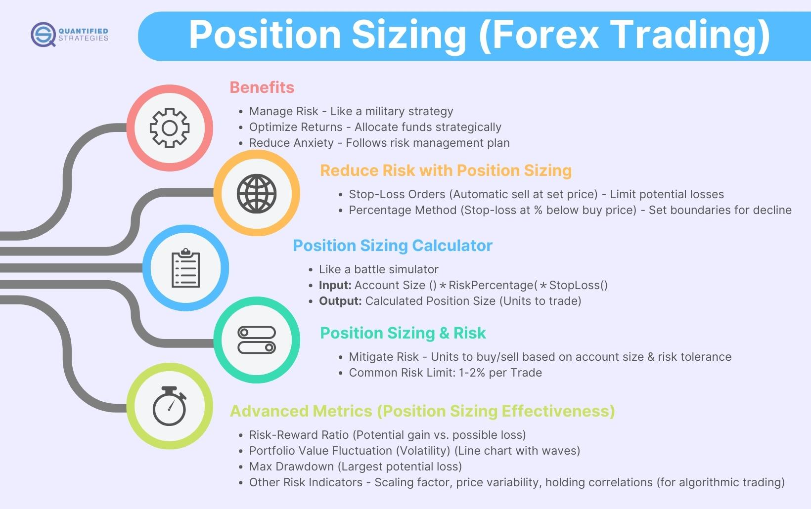

Position sizing is a critical component in investment and trading, playing an essential role in risk management and the optimization of returns. At its core, position sizing refers to the determination of the number of units, shares, or contracts to be invested in a particular trade or investment. This decision has considerable implications for a trader or investor's exposure to risk and potential to capitalize on market opportunities.

The importance of position sizing cannot be overstated. By managing risk, practitioners can avoid catastrophic financial losses while ensuring they remain in a position to benefit from favorable market movements. Effective position sizing enables traders to limit their exposure to any single market event, thereby reducing the overall volatility and enhancing the stability of their portfolio returns. Moreover, proper position sizing supports the maximization of returns by strategically allocating investment capital where it can generate the most value, based on an individual's risk tolerance and market outlook.



In recent years, algorithmic trading has transformed the landscape of financial markets. Algorithms, through the use of computational models, execute preprogrammed trading instructions at a speed and frequency that surpasses human capability. These algorithms often incorporate sophisticated position sizing strategies to manage risk and optimize returns, taking into account various market variables and historical data. The proliferation of algorithmic trading underscores its growing significance in modern markets, as it allows traders to automate and refine the decision-making process, enhancing efficiency and precision.

This article will explore the nuanced role of position sizing in trading and investment. It will cover definitions and explanations of key concepts, varied strategies and methodologies employed, and their respective advantages and disadvantages. Additionally, the article will examine how algorithmic trading platforms integrate position sizing techniques, the practical application of these strategies, and the challenges and psychological considerations faced by traders. Through a comprehensive understanding of position sizing, traders and investors can better navigate the complexities of financial markets, striving towards improved returns and risk management.

## Table of Contents

## What is Position Sizing?

Position sizing is a fundamental concept in trading and investment that dictates how much capital to allocate to each trade or investment. It is a key element of risk management, aimed at maximizing returns while managing potential losses. Proper position sizing helps investors control the amount of risk taken per trade relative to their overall portfolio.

The importance of position sizing is closely tied to account size and risk tolerance. Account size dictates the absolute capital available for trading, which in turn influences the maximum potential investment in a single position. Risk tolerance, which varies among investors, determines how much of that capital they are willing to risk on a particular trade. Position sizing allows traders to adjust the proportion of their investment in a way that aligns with their risk tolerance. For instance, a trader with a $100,000 account who is willing to risk 1% per trade would risk $1,000 on a specific trade. The risk per trade is calculated by considering both the entry point and the stop-loss level, ensuring that a trader does not risk more than their predetermined amount.

In the context of [day trading](/wiki/day-trading-spy) and currency trading, position sizing remains crucial but may require different considerations due to the nature of these markets. Day trading involves buying and selling financial instruments within the same trading day, which necessitates quick decision-making and adherence to strict risk management protocols. Position sizing in day trading often involves adjusting exposure based on real-time changes in market [volatility](/wiki/volatility-trading-strategies) and [liquidity](/wiki/liquidity-risk-premium). In this environment, traders may employ short-term metrics and technical analysis to determine optimal position sizes.

Currency trading, or [forex](/wiki/forex-system) trading, presents unique challenges and opportunities for position sizing due to the high leverage typically available in these markets. Leverage can amplify both profits and losses, making precise control over position sizing even more critical. Forex traders must account for factors such as pip value (the change in value of a currency pair) and lot size (the number of currency units involved in a trade) when calculating position sizes. Adequate position sizing ensures that even with high leverage, traders do not overexpose their account to significant risk.

In summary, position sizing is an essential tool for managing risk and optimizing returns in trading. It directly relates to the investor's account size and risk tolerance, with varied applications in day trading and currency trading. It ensures that traders maintain a balanced approach to risk, enabling them to withstand market fluctuations and protect their capital.

## Types of Position Sizing Strategies

Position sizing is a critical aspect of risk management in trading and investment. It refers to determining the size of a position in a financial asset based on various strategies, thereby influencing the risk-return profile of a portfolio. Several position sizing strategies are popular among traders and investors, each with its distinct principles, advantages, and drawbacks.

### Overview of Various Position Sizing Strategies

Position sizing strategies help traders manage their risk exposure while aiming to maximize returns. The choice of strategy often depends on individual financial goals, risk tolerance, and trading style. Below are some widely recognized position sizing strategies:

#### Fixed Fractional Position Sizing

Fixed fractional position sizing involves allocating a fixed percentage of the trading capital to each trade. This approach is straightforward and helps in managing risk by maintaining consistency in the proportion of capital at risk.

**Pros:**
- Simplicity: Easy to implement and understand.
- Risk Management: Maintains a consistent level of risk relative to account size.
- Compounding: Profits can be reinvested, potentially leading to compounded growth.

**Cons:**
- Limited Flexibility: Does not adapt to varying market conditions or volatility.
- Underutilization: May result in smaller position sizes during periods of favorable market conditions.

**Example:**  
Assume a trader with a $10,000 account decides to risk 2% per trade. The position size for each trade would be $200. If the trader encounters a series of losses, the reduced account size automatically lowers the position size, thus limiting further losses.

#### Fixed Ratio Position Sizing

Fixed ratio position sizing is based on a predefined metric known as the Delta. It emphasizes increasing the position size with the target profit, thereby tying position growth to trade success.

**Benefits:**
- Progressive Growth: Allows position sizes to grow with trading success.
- Tailored Risk: Enables traders to adjust risk exposure based on profitability.

**Metrics:**
- $\text{Position Size Increase} = \Delta \times$ Number of units for a particular profit target.

**Example:**  
If a trader sets a Delta value of $1,000, then for every $1,000 of profit, the trader increases the position size by one additional unit. This allows the strategy to grow aggressively as profits increase.

#### Kelly Criterion

The Kelly Criterion is a mathematical formula used to calculate the optimal size of a series of bets. When applied to trading, it aims to maximize the expected logarithmic wealth.

**Calculations:**
- The formula for the Kelly Criterion is:  
$$
  f^* = \frac{bp - q}{b}

$$
  Where:
  - $f^*$ is the fraction of the capital to bet.
  - $b$ is the odds received on the wager (profit per unit).
  - $p$ is the probability of winning.
  - $q$ is the probability of losing ($q = 1 - p$).

**Application:**
- **Dynamic Positioning:** Adjusts position sizes based on calculated probabilities and potential outcomes.
- **Optimized Growth:** Theoretically maximizes potential returns without increasing risk unnecessarily.

**Example in Python:**

```python
def kelly_criterion(prob_win, profit_ratio):
    prob_loss = 1 - prob_win
    return (prob_win * profit_ratio - prob_loss) / profit_ratio

# Example variables
prob_win = 0.6  # Probability of winning
profit_ratio = 2.0  # Profit per unit

optimal_fraction = kelly_criterion(prob_win, profit_ratio)
print(f"Optimal position size as a fraction of capital: {optimal_fraction:.2%}")
```

The primary advantage of the Kelly Criterion is its potential to maximize profit while minimizing risk. However, it necessitates accurate input data, and misestimating probabilities can lead to increased risk.

Understanding these position sizing strategies allows investors and traders to refine their approaches, ensuring better alignment with their financial objectives and tolerance for risk. Each strategy has its unique merits and potential drawbacks, calling for a tailored approach based on individual circumstances and market conditions.

## Algorithmic Trading and Position Sizing

Algorithmic trading platforms have revolutionized the financial markets by integrating sophisticated mathematical models and computational algorithms to execute high-speed, high-frequency trades. Position sizing, a crucial component in managing risk and optimizing performance, is effectively utilized within these platforms to adapt to volatile market conditions and meet predetermined investment objectives.

**How Algorithmic Trading Platforms Utilize Position Sizing**

Algorithmic trading systems manage position sizing by incorporating financial models that quantify risk and reward. These systems use real-time data feeds to make split-second decisions on the size of trades to be executed. By determining the capital allocated to each trade based on market indicators and historical performance metrics, algorithms help traders maximize profits while mitigating potential losses.

A typical algorithm might involve assessing the maximum drawdown or volatility of a given asset-class and adjusting trade sizes depending on market conditions. Algorithms can calculate the optimal position size using formulas like the Kelly Criterion, which balances the proportion of capital invested in a trade to the expected return and associated risk:

$$
f^* = \frac{bp - q}{b}
$$

Where:
- $f^*$ is the fraction of capital to risk,
- $b$ is the odds received on the bet,
- $p$ is the probability of winning,
- $q$ is the probability of losing, which is $1-p$.

**Benefits of Automating Position Sizing in Trading Systems**

Automating position sizing offers various benefits, including consistency in execution, reduction of human error, and elimination of emotional biases that can interfere with rational decision-making. Algorithms can rapidly analyze an extensive array of variables that humans may find challenging to consider in real-time, leading to more informed and strategic decisions. This automation ensures adherence to a trading strategy's preset parameters, enabling disciplined risk management.

Another significant advantage is the ability of algorithms to backtest and simulate strategies across historical data, optimizing for various scenarios and improving risk-adjusted returns. Traders can fine-tune position sizing rules by evaluating past performance and making necessary adjustments for future trades.

**Examples of Platforms and Tools Supporting Position Sizing Strategies**

Several platforms and tools provide robust support for implementing sophisticated position sizing strategies. For instance, MetaTrader 5, a widely-used trading platform, offers automated trading capabilities with its built-in development environment, MQL5, allowing traders to code custom algorithms for precise position sizing based on defined criteria.

QuantConnect is another platform offering [algorithmic trading](/wiki/algorithmic-trading) solutions, supporting multiple asset classes and enabling custom position sizing through its open-source Lean Algorithm Framework. It allows traders to write algorithms in Python or C# and backtest them against historical data across global markets.

Furthermore, tools like the R Trader or CQG Integrated Client provide comprehensive technical analysis and algorithmic capabilities, including automated position sizing, supporting the accurate execution of trades in diverse market conditions.

In summary, algorithmic trading platforms leverage advanced computational techniques to determine optimal position sizes, maximizing returns and effectively managing risk. Through automation, traders benefit from enhanced decision-making, consistent strategy adherence, and the capacity to navigate complex market dynamics with precision and speed.

## Applying Position Sizing Techniques

Position sizing is a critical component of portfolio management, effectively balancing risk and potential returns. Implementing position sizing strategies involves using precise calculations to determine the size of a trade or investment within a portfolio, based on different risk management techniques.

### Example Calculations for Different Strategies

1. **Fixed Fractional Position Sizing**: This strategy involves risking a fixed percentage of the total account size on each trade. For instance, if an investor decides to risk 2% of a $100,000 account on each trade, and the stop loss is set at $500, the position size can be calculated using:
$$
   \text{Position Size} = \frac{\text{Risk per Trade}}{\text{Per Share Risk}}

$$
   In Python, it might be represented as:
   ```python
   account_size = 100000
   risk_per_trade = 0.02 * account_size
   per_share_risk = 500
   position_size = risk_per_trade / per_share_risk
   print(position_size)
   ```

2. **Fixed Ratio Position Sizing**: This strategy increases the position size as the account equity grows. Suppose you have a starting capital of $50,000 with a Delta of $2,500 (amount of profit needed to add one more contract/lot). For a given profit G:
$$
   \text{Position Size} = \left( \frac{G}{\text{Delta}} \right) + 1

$$

3. **Kelly Criterion**: This method aims to maximize long-term growth by considering the probability of winning and the payoff ratio. The formula is:
$$
   f^* = \frac{bp - q}{b}

$$
   Where:
   - $f^*$ is the fraction of the portfolio to bet;
   - $b$ is the odds received on the wager (i.e., payoff ratio);
   - $p$ is the probability of winning;
   - $q$ is the probability of losing ( $q = 1-p$ ).

### Comparison of Risk and Returns

The risk and return profiles of these strategies vary significantly:

- **Fixed Fractional Position Sizing** provides consistency and simplicity. It scales position sizes according to account changes, maintaining a consistent risk level.

- **Fixed Ratio Strategy** benefits from controlled risk as the account grows, reducing overexposure. This approach is less aggressive than others as it scales with performance gains.

- **Kelly Criterion** offers a theoretically optimal growth rate but can result in significant volatility. It assumes precise control over win probabilities and payoffs, making it suitable mainly for skilled traders confident in their estimates and calculations.

In conclusion, applying position sizing techniques effectively can significantly influence the risk and return outcomes of a portfolio. By choosing appropriate strategies and adjusting them over time, investors can manage risks more effectively while optimizing potential returns.

## Challenges and Considerations

Position sizing is a crucial aspect of trading and investment, yet it presents several challenges and considerations that can impact its effectiveness. One common pitfall in position sizing decisions is underestimating the influence of market volatility. Volatility refers to the degree of variation in the price of a financial instrument over time. High volatility can lead to rapid changes in the value of positions, increasing the potential for significant losses if not properly managed. Traders who fail to adapt their position sizing strategies to changing volatility levels may expose themselves to undue risk. A well-known method to adjust for volatility is to scale position sizes inversely proportional to the expected volatility, often measured by indicators such as the Average True Range (ATR).

Psychological factors also play a significant role in trading decisions and can impact position sizing. Cognitive biases, such as overconfidence and loss aversion, may lead traders to make suboptimal position sizing choices. Overconfidence might result in taking on larger positions than justified by the trader's risk tolerance, while loss aversion can cause traders to reduce position sizes excessively following a loss, potentially missing out on profitable opportunities. To mitigate these risks, traders should develop a disciplined approach by adhering to predefined risk management rules and continuously reviewing their psychological responses to market conditions.

Implementing a consistent, objective position sizing strategy can help traders overcome these challenges. However, it requires careful planning, regular risk assessment, and a willingness to adjust strategies as market conditions and personal circumstances evolve.

## Conclusion

Position sizing is a critical component in trading and investment, serving as a fundamental tool for understanding and controlling risk while striving to optimize returns. By determining the appropriate amount of capital to allocate to each trade, investors can safeguard against significant losses, especially during periods of market volatility. This careful approach allows traders to not only preserve their capital but also to take advantage of profitable opportunities with a controlled risk exposure.

The optimization of returns involves striking a balance between taking calculated risks and avoiding undue exposure that could jeopardize an investor's portfolio. Position sizing strategies, such as Fixed Fractional, Fixed Ratio, and the Kelly Criterion, provide structured methods to achieve this balance by incorporating factors such as account size, risk tolerance, and expected returns into decision-making processes. These strategies empower traders to systematically manage their investments, aligning position sizes with their financial goals and risk appetites.

Beyond risk management, position sizing serves as a strategic tool for improving trade outcomes. By refining position sizing techniques and adapting them to changing market conditions, traders can enhance their performance. For instance, during volatile markets, adjusting position sizes can help mitigate the impact of sudden price swings, safeguarding portfolios from unwelcome shocks.

Continuous refinement and assessment of position sizing strategies are crucial. As markets evolve and personal financial circumstances change, so too should the tactics employed in position sizing. Traders are encouraged to remain vigilant, test new methods, and adjust existing strategies to ensure that they are always aligned with their objectives.

To conclude, position sizing is paramount in maintaining a disciplined, risk-aware approach to trading and investing. By consistently applying and refining these strategies, traders can optimize their potential returns while effectively managing risks, ensuring long-term sustainability and success in the financial markets.

## Frequently Asked Questions

### Frequently Asked Questions

**What is the difference between position sizing and diversification?**

Position sizing refers to determining the amount of capital to allocate to a particular trade or investment. It involves strategies and calculations aimed at optimizing the size of each position to manage risk and potential returns effectively. The primary goal is to limit exposure to losses from any single trade relative to the total portfolio size and to enhance potential returns by making calculated decisions about the trade size.

Diversification, on the other hand, involves spreading investments across different assets, sectors, or geographic regions. The central idea of diversification is to reduce risk by ensuring that the performance of one asset or sector does not have an overly dominant effect on the entire portfolio. By holding a variety of investments, the positive performance of some can offset the negative performance of others.

In summary, while position sizing is about optimizing the risk-return ratio of individual trades or investments through strategic capital allocation, diversification is about spreading risk across a range of different investments.

**Can position sizing reduce the impact of market downturns?**

Position sizing can indeed mitigate the impact of market downturns by limiting the potential losses from individual positions. By controlling the size of each investment relative to the portfolio, traders can ensure that a downturn in a particular security or sector does not disproportionately harm their overall portfolio. Position sizing should be part of a broader risk management strategy that might also include stop-loss orders, hedging, and portfolio diversification.

For example, using a fixed fractional position sizing strategy, a trader could decide to risk only a specific percentage (say 2%) of their portfolio on any single trade. This limits the potential loss per trade during a market downturn, thereby preserving capital for future opportunities when the market recovers.

**How do professional traders adjust position sizes in volatile markets?**

Professional traders often adjust their position sizes in volatile markets by using dynamic risk management techniques. A common method is volatility-based position sizing, where the position size is inversely related to market volatility. The more volatile the market, the smaller the position size, to maintain consistent risk exposure. This can be mathematically expressed as:

$$
\text{Position Size} = \frac{\text{Risk Tolerance}}{\text{Volatility Measure}}
$$

Here, "Risk Tolerance" is the dollar amount or percentage of equity the trader is willing to risk, and "Volatility Measure" could be reflected using standard deviation, Average True Range (ATR), or other metrics. 

Professional traders may also leverage algorithmic trading systems to automate this process, allowing them to rapidly adjust to changing market conditions without manual intervention. By employing these strategies, traders can maintain a balanced approach, reducing the financial impact during periods of heightened market instability.

## References & Further Reading

[1]: Tharp, V. (2008). ["Trade Your Way to Financial Freedom"](https://www.amazon.com/Trade-Your-Way-Financial-Freedom/dp/007147871X). McGraw-Hill Education.

[2]: Kritzman, M. (2003). ["The Portable Financial Analyst: What Practitioners Need to Know"](https://archive.org/details/portablefinancia0000krit_s2h9). Wiley.

[3]: Kahneman, D. (2011). ["Thinking, Fast and Slow"](https://link.springer.com/article/10.1007/s00362-013-0533-y). Farrar, Straus and Giroux.

[4]: Aronson, D. R. (2006). ["Evidence-Based Technical Analysis: Applying the Scientific Method and Statistical Inference to Trading Signals"](https://www.amazon.com/Evidence-Based-Technical-Analysis-Scientific-Statistical/dp/0470008741). Wiley.

[5]: Lopez de Prado, M. (2018). ["Advances in Financial Machine Learning"](https://www.amazon.com/Advances-Financial-Machine-Learning-Marcos/dp/1119482089). Wiley.