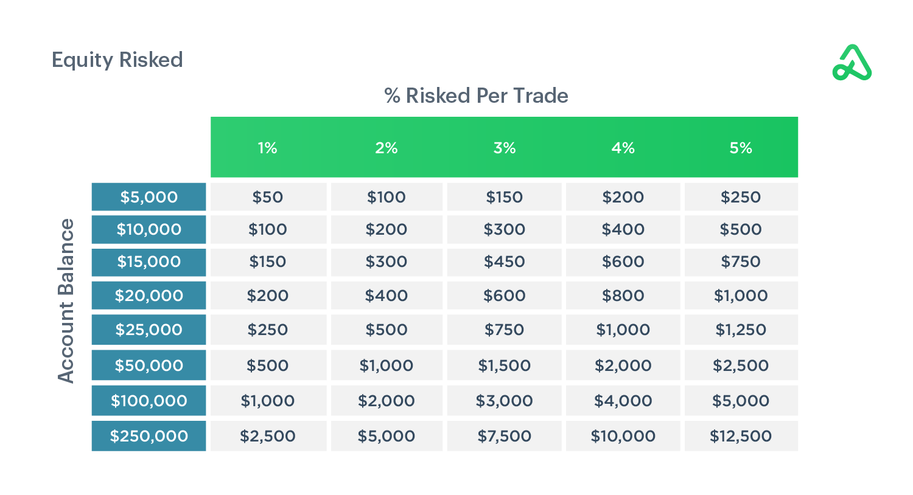

## Table of Contents

## What is position sizing in investment?

Position sizing in investment is about deciding how much money to put into a specific investment. It's an important part of managing risk. When you choose the right position size, you make sure that you don't lose too much money if the investment goes down. It helps you keep your overall investment plan safe and balanced.

Think of it like this: if you have $1000 to invest, you wouldn't want to put all of it into one stock. Instead, you might decide to put $200 into five different stocks. This way, if one stock does badly, you only lose a small part of your money. By choosing the right position size, you can protect yourself and still have a chance to make good returns.

## Why is position sizing important for managing risk?

Position sizing is important for managing risk because it helps you control how much money you could lose on any single investment. If you put too much money into one investment and it goes down, you could lose a lot. But if you spread your money out across different investments, a drop in one won't hurt as much. This way, you can keep your overall investment safe even if one part doesn't do well.

It also helps you stick to your investment plan. When you decide how much to invest in each thing, you're making a plan that matches your goals and how much risk you're okay with. If you follow your position sizes, you won't be tempted to put too much money into something just because it looks good at the moment. This keeps your investments balanced and helps you avoid big losses.

## How does position sizing differ from asset allocation?

Position sizing and asset allocation are both important parts of managing your investments, but they focus on different things. Position sizing is about deciding how much money to put into one specific investment. It's like figuring out how many slices of a pie you want to eat. You might decide to put a small amount of money into a stock because it's risky, or a bigger amount into a bond because it's safer. This helps you control the risk for each investment.

Asset allocation, on the other hand, is about dividing your total money among different types of investments, like stocks, bonds, and real estate. It's like deciding how to split up the whole pie among different people. You might decide to put 60% of your money into stocks, 30% into bonds, and 10% into real estate. This helps you balance the overall risk and return of your entire investment portfolio.

Both position sizing and asset allocation work together to help you manage your investments better. Position sizing focuses on the risk of each individual investment, while asset allocation looks at the big picture and helps you spread out your money across different types of investments. By using both, you can create a plan that matches your goals and how much risk you're willing to take.

## What are the common methods of position sizing?

One common method of position sizing is the fixed percentage method. This means you decide to put the same percentage of your money into each investment. For example, if you have $10,000 and you decide to use 2% for each investment, you'll put $200 into every new investment. This method helps you keep your risk the same no matter how much money you have. If your total money grows, the amount you put into each investment will grow too, but it will always be 2% of your total.

Another method is the dollar amount method. With this, you decide to put a fixed amount of money into each investment, no matter how much money you have in total. For example, you might decide to always put $500 into each new investment. This method is simple and easy to follow, but it doesn't change with your total money. So if your money grows, you'll still be putting the same $500 into each new investment, which might be too much or too little depending on your total.

A third method is the [volatility](/wiki/volatility-trading-strategies)-based method. This one is a bit more complicated. You look at how much the price of an investment goes up and down, which is called volatility. If an investment is very volatile, you might decide to put less money into it because it's riskier. If it's not very volatile, you might put more money into it. This method tries to match the amount of money you put into an investment with how risky it is. It can help you balance your risk better, but it takes more work to figure out.

## How can a beginner start implementing position sizing in their portfolio?

If you're a beginner, starting with position sizing can seem hard, but it's really about keeping your investments safe. A good way to start is by using the fixed percentage method. This means you decide to put the same percentage of your money into each investment. For example, if you have $1,000 and you choose a 2% position size, you'll put $20 into each new investment. This method helps you keep your risk the same no matter how much money you have. If your total money grows, the amount you put into each investment will grow too, but it will always be 2% of your total.

Once you're comfortable with the fixed percentage method, you can try other methods like the dollar amount method or the volatility-based method. The dollar amount method is simple: you decide to put a fixed amount of money into each investment, like $100. This is easy to follow, but it doesn't change with your total money. The volatility-based method is a bit more complicated. You look at how much the price of an investment goes up and down. If it's very volatile, you put less money into it because it's riskier. If it's not very volatile, you put more money into it. This method can help you balance your risk better, but it takes more work to figure out. Start with what feels right for you and learn as you go.

## What role does the Kelly Criterion play in position sizing?

The Kelly Criterion is a way to figure out how much money to put into an investment. It uses math to help you decide the best amount so you can grow your money as fast as possible while keeping risk low. The idea is to find a balance where you don't lose too much if things go wrong, but you still make good money if things go right. To use the Kelly Criterion, you need to know two things: how likely you are to make money with the investment, and how much money you could make or lose. Once you have these numbers, the Kelly Criterion gives you a percentage of your money to put into the investment.

Using the Kelly Criterion can be helpful, but it's not perfect for everyone. It can be hard to know the exact numbers you need, like how likely you are to make money or how much you could make or lose. Also, the Kelly Criterion can sometimes suggest putting a lot of money into one investment, which can be too risky for some people. So, many people use a smaller version of the Kelly Criterion, called "Fractional Kelly," where they put in less money than the full amount suggested. This way, they can still use the Kelly Criterion to help with position sizing but keep their risk lower.

## How can volatility be used to determine position sizes?

Volatility is how much the price of an investment goes up and down. When you use volatility to decide how much money to put into an investment, you're trying to match the amount of money with how risky the investment is. If an investment's price moves a lot, it's more volatile and riskier. So, you might decide to put less money into it to keep your risk low. On the other hand, if an investment's price doesn't move much, it's less volatile and less risky. You might decide to put more money into it because it's safer.

To use volatility for position sizing, you need to look at how much the price of the investment has changed in the past. You can use numbers like the standard deviation or the average true range to measure this. Once you know how volatile the investment is, you can decide how much of your money to put into it. If you're using the volatility-based method, you might decide to put a smaller percentage of your money into a very volatile investment, and a bigger percentage into a less volatile one. This way, you can balance your risk and still have a chance to make good returns.

## What are the psychological aspects of position sizing?

Position sizing isn't just about numbers and math. It's also about how you feel and think about your investments. When you decide how much money to put into something, you might feel scared or excited. If you're scared, you might put in less money than you should, even if the investment is a good one. If you're excited, you might put in too much money and take too much risk. Understanding your feelings can help you make better choices and stick to your plan.

One big feeling that can affect position sizing is fear of losing money. If you're worried about losing money, you might choose to put very little into each investment, even if they are safe. This can make your money grow slower than it could. On the other hand, if you're feeling too confident, you might put too much money into one investment and risk losing a lot if it goes wrong. It's important to balance your feelings with the facts and numbers so you can make smart choices about how much money to put into each investment.

## How does position sizing affect portfolio diversification?

Position sizing plays a big role in how you spread out your investments, which is called portfolio diversification. When you decide how much money to put into each investment, you're choosing how to balance your risks. If you put too much money into one investment, you're not diversifying well. Your whole portfolio could be hurt if that one investment goes down. But if you use position sizing to put a smaller amount of money into many different investments, you're spreading out your risk. This way, if one investment does badly, it won't hurt your whole portfolio as much.

Good position sizing helps you keep your portfolio balanced and safe. By putting a small percentage of your money into each investment, you can own a lot of different things like stocks, bonds, and real estate. This makes your portfolio more diverse and less likely to lose a lot of money all at once. When you size your positions right, you're making sure that no single investment can hurt you too much. This helps you feel more secure and can lead to better returns over time because you're not putting all your eggs in one basket.

## What advanced techniques can be used for position sizing in algorithmic trading?

In algorithmic trading, one advanced technique for position sizing is using the Kelly Criterion. This method uses math to figure out the best amount of money to put into each trade. It looks at how likely you are to make money and how much you could make or lose. The Kelly Criterion can help you grow your money fast while keeping risk low. But it can be hard to get the right numbers, and it might suggest putting a lot of money into one trade, which can be too risky. So, many traders use a smaller version called "Fractional Kelly," where they put in less money than the full amount suggested. This way, they can still use the Kelly Criterion but keep their risk lower.

Another advanced technique is using volatility to decide how much money to put into each trade. This means looking at how much the price of an investment goes up and down. If an investment is very volatile, you might put less money into it because it's riskier. If it's not very volatile, you might put more money into it. This helps balance your risk and can lead to better returns. To do this, you can use numbers like the standard deviation or the average true range to measure volatility. Then, you can decide how much of your money to put into each trade based on how volatile it is. This method can be more complicated, but it helps you make smarter choices about how much to invest.

A third technique is using [machine learning](/wiki/machine-learning) to help with position sizing. Machine learning can look at a lot of data and find patterns that are hard for people to see. It can use past data to predict how much money to put into each trade. This can be very helpful in algorithmic trading because it can learn from what worked and what didn't in the past. But machine learning needs a lot of good data to work well, and it can be hard to understand why it makes the choices it does. Still, it's a powerful tool that can help you make better decisions about position sizing and manage your risk more effectively.

## How can position sizing strategies be backtested and optimized?

Backtesting and optimizing position sizing strategies means checking how well they would have worked in the past and making them better. You do this by using old data to see how your strategy would have done if you used it before. For example, you might look at stock prices from the last 10 years and see how much money you would have made or lost if you used your position sizing strategy during that time. This helps you see if your strategy is good or if it needs changes. You can use computer programs to do this [backtesting](/wiki/backtesting), which makes it easier and faster.

Once you've backtested your strategy, you can try to make it better by changing things like the percentage of money you put into each trade or how you measure risk. This is called optimizing. You might find that putting 2% of your money into each trade works better than 1% or 3%. Or you might find that using a different way to measure how risky an investment is helps you make more money. By trying different things and seeing how they would have worked in the past, you can find the best way to size your positions. Remember, though, that just because something worked in the past doesn't mean it will work in the future, so keep testing and adjusting your strategy as you go.

## What are the potential pitfalls and common mistakes in position sizing?

One common mistake in position sizing is putting too much money into one investment. This can happen if you're feeling too excited or confident about a particular stock or trade. When you put a big part of your money into one thing, you're not spreading out your risk. If that investment goes down, you could lose a lot of money. It's better to put smaller amounts into different investments so that if one goes bad, it doesn't hurt your whole portfolio.

Another pitfall is not adjusting your position sizes when your total money changes. If your money grows, you might still be putting the same amount into each new investment, which could be too small now. On the other hand, if your money goes down, putting the same amount into each investment could be too risky. You should change your position sizes as your total money changes to keep your risk balanced. Also, not considering the risk of each investment can lead to problems. If you put the same amount of money into a very risky investment as you do into a safe one, you're not managing your risk well. Always think about how risky each investment is when deciding how much money to put into it.

## What are the Types of Position Sizing Strategies?

Position sizing is a critical aspect of risk management in trading and investment. It refers to determining the size of a position in a financial asset based on various strategies, thereby influencing the risk-return profile of a portfolio. Several position sizing strategies are popular among traders and investors, each with its distinct principles, advantages, and drawbacks.

### Overview of Various Position Sizing Strategies

Position sizing strategies help traders manage their risk exposure while aiming to maximize returns. The choice of strategy often depends on individual financial goals, risk tolerance, and trading style. Below are some widely recognized position sizing strategies:

#### Fixed Fractional Position Sizing

Fixed fractional position sizing involves allocating a fixed percentage of the trading capital to each trade. This approach is straightforward and helps in managing risk by maintaining consistency in the proportion of capital at risk.

**Pros:**
- Simplicity: Easy to implement and understand.
- Risk Management: Maintains a consistent level of risk relative to account size.
- Compounding: Profits can be reinvested, potentially leading to compounded growth.

**Cons:**
- Limited Flexibility: Does not adapt to varying market conditions or volatility.
- Underutilization: May result in smaller position sizes during periods of favorable market conditions.

**Example:**  
Assume a trader with a $10,000 account decides to risk 2% per trade. The position size for each trade would be $200. If the trader encounters a series of losses, the reduced account size automatically lowers the position size, thus limiting further losses.

#### Fixed Ratio Position Sizing

Fixed ratio position sizing is based on a predefined metric known as the Delta. It emphasizes increasing the position size with the target profit, thereby tying position growth to trade success.

**Benefits:**
- Progressive Growth: Allows position sizes to grow with trading success.
- Tailored Risk: Enables traders to adjust risk exposure based on profitability.

**Metrics:**
- $\text{Position Size Increase} = \Delta \times$ Number of units for a particular profit target.

**Example:**  
If a trader sets a Delta value of $1,000, then for every $1,000 of profit, the trader increases the position size by one additional unit. This allows the strategy to grow aggressively as profits increase.

#### Kelly Criterion

The Kelly Criterion is a mathematical formula used to calculate the optimal size of a series of bets. When applied to trading, it aims to maximize the expected logarithmic wealth.

**Calculations:**
- The formula for the Kelly Criterion is:  
$$
  f^* = \frac{bp - q}{b}

$$
  Where:
  - $f^*$ is the fraction of the capital to bet.
  - $b$ is the odds received on the wager (profit per unit).
  - $p$ is the probability of winning.
  - $q$ is the probability of losing ($q = 1 - p$).

**Application:**
- **Dynamic Positioning:** Adjusts position sizes based on calculated probabilities and potential outcomes.
- **Optimized Growth:** Theoretically maximizes potential returns without increasing risk unnecessarily.

**Example in Python:**

```python
def kelly_criterion(prob_win, profit_ratio):
    prob_loss = 1 - prob_win
    return (prob_win * profit_ratio - prob_loss) / profit_ratio

# Example variables
prob_win = 0.6  # Probability of winning
profit_ratio = 2.0  # Profit per unit

optimal_fraction = kelly_criterion(prob_win, profit_ratio)
print(f"Optimal position size as a fraction of capital: {optimal_fraction:.2%}")
```

The primary advantage of the Kelly Criterion is its potential to maximize profit while minimizing risk. However, it necessitates accurate input data, and misestimating probabilities can lead to increased risk.

Understanding these position sizing strategies allows investors and traders to refine their approaches, ensuring better alignment with their financial objectives and tolerance for risk. Each strategy has its unique merits and potential drawbacks, calling for a tailored approach based on individual circumstances and market conditions.

## What is Algorithmic Trading and how does Position Sizing work?

Algorithmic trading platforms have revolutionized the financial markets by integrating sophisticated mathematical models and computational algorithms to execute high-speed, high-frequency trades. Position sizing, a crucial component in managing risk and optimizing performance, is effectively utilized within these platforms to adapt to volatile market conditions and meet predetermined investment objectives.

**How Algorithmic Trading Platforms Utilize Position Sizing**

Algorithmic trading systems manage position sizing by incorporating financial models that quantify risk and reward. These systems use real-time data feeds to make split-second decisions on the size of trades to be executed. By determining the capital allocated to each trade based on market indicators and historical performance metrics, algorithms help traders maximize profits while mitigating potential losses.

A typical algorithm might involve assessing the maximum drawdown or volatility of a given asset-class and adjusting trade sizes depending on market conditions. Algorithms can calculate the optimal position size using formulas like the Kelly Criterion, which balances the proportion of capital invested in a trade to the expected return and associated risk:

$$
f^* = \frac{bp - q}{b}
$$

Where:
- $f^*$ is the fraction of capital to risk,
- $b$ is the odds received on the bet,
- $p$ is the probability of winning,
- $q$ is the probability of losing, which is $1-p$.

**Benefits of Automating Position Sizing in Trading Systems**

Automating position sizing offers various benefits, including consistency in execution, reduction of human error, and elimination of emotional biases that can interfere with rational decision-making. Algorithms can rapidly analyze an extensive array of variables that humans may find challenging to consider in real-time, leading to more informed and strategic decisions. This automation ensures adherence to a trading strategy's preset parameters, enabling disciplined risk management.

Another significant advantage is the ability of algorithms to backtest and simulate strategies across historical data, optimizing for various scenarios and improving risk-adjusted returns. Traders can fine-tune position sizing rules by evaluating past performance and making necessary adjustments for future trades.

**Examples of Platforms and Tools Supporting Position Sizing Strategies**

Several platforms and tools provide robust support for implementing sophisticated position sizing strategies. For instance, MetaTrader 5, a widely-used trading platform, offers automated trading capabilities with its built-in development environment, MQL5, allowing traders to code custom algorithms for precise position sizing based on defined criteria.

QuantConnect is another platform offering [algorithmic trading](/wiki/algorithmic-trading) solutions, supporting multiple asset classes and enabling custom position sizing through its open-source Lean Algorithm Framework. It allows traders to write algorithms in Python or C# and backtest them against historical data across global markets.

Furthermore, tools like the R Trader or CQG Integrated Client provide comprehensive technical analysis and algorithmic capabilities, including automated position sizing, supporting the accurate execution of trades in diverse market conditions.

In summary, algorithmic trading platforms leverage advanced computational techniques to determine optimal position sizes, maximizing returns and effectively managing risk. Through automation, traders benefit from enhanced decision-making, consistent strategy adherence, and the capacity to navigate complex market dynamics with precision and speed.

## How can one apply position sizing techniques?

Position sizing is a critical component of portfolio management, effectively balancing risk and potential returns. Implementing position sizing strategies involves using precise calculations to determine the size of a trade or investment within a portfolio, based on different risk management techniques.

### Example Calculations for Different Strategies

1. **Fixed Fractional Position Sizing**: This strategy involves risking a fixed percentage of the total account size on each trade. For instance, if an investor decides to risk 2% of a $100,000 account on each trade, and the stop loss is set at $500, the position size can be calculated using:
$$
   \text{Position Size} = \frac{\text{Risk per Trade}}{\text{Per Share Risk}}

$$
   In Python, it might be represented as:
   ```python
   account_size = 100000
   risk_per_trade = 0.02 * account_size
   per_share_risk = 500
   position_size = risk_per_trade / per_share_risk
   print(position_size)
   ```

2. **Fixed Ratio Position Sizing**: This strategy increases the position size as the account equity grows. Suppose you have a starting capital of $50,000 with a Delta of $2,500 (amount of profit needed to add one more contract/lot). For a given profit G:
$$
   \text{Position Size} = \left( \frac{G}{\text{Delta}} \right) + 1

$$

3. **Kelly Criterion**: This method aims to maximize long-term growth by considering the probability of winning and the payoff ratio. The formula is:
$$
   f^* = \frac{bp - q}{b}

$$
   Where:
   - $f^*$ is the fraction of the portfolio to bet;
   - $b$ is the odds received on the wager (i.e., payoff ratio);
   - $p$ is the probability of winning;
   - $q$ is the probability of losing ( $q = 1-p$ ).

### Comparison of Risk and Returns

The risk and return profiles of these strategies vary significantly:

- **Fixed Fractional Position Sizing** provides consistency and simplicity. It scales position sizes according to account changes, maintaining a consistent risk level.

- **Fixed Ratio Strategy** benefits from controlled risk as the account grows, reducing overexposure. This approach is less aggressive than others as it scales with performance gains.

- **Kelly Criterion** offers a theoretically optimal growth rate but can result in significant volatility. It assumes precise control over win probabilities and payoffs, making it suitable mainly for skilled traders confident in their estimates and calculations.

In conclusion, applying position sizing techniques effectively can significantly influence the risk and return outcomes of a portfolio. By choosing appropriate strategies and adjusting them over time, investors can manage risks more effectively while optimizing potential returns.

## What are Frequently Asked Questions?

### Frequently Asked Questions

**What is the difference between position sizing and diversification?**

Position sizing refers to determining the amount of capital to allocate to a particular trade or investment. It involves strategies and calculations aimed at optimizing the size of each position to manage risk and potential returns effectively. The primary goal is to limit exposure to losses from any single trade relative to the total portfolio size and to enhance potential returns by making calculated decisions about the trade size.

Diversification, on the other hand, involves spreading investments across different assets, sectors, or geographic regions. The central idea of diversification is to reduce risk by ensuring that the performance of one asset or sector does not have an overly dominant effect on the entire portfolio. By holding a variety of investments, the positive performance of some can offset the negative performance of others.

In summary, while position sizing is about optimizing the risk-return ratio of individual trades or investments through strategic capital allocation, diversification is about spreading risk across a range of different investments.

**Can position sizing reduce the impact of market downturns?**

Position sizing can indeed mitigate the impact of market downturns by limiting the potential losses from individual positions. By controlling the size of each investment relative to the portfolio, traders can ensure that a downturn in a particular security or sector does not disproportionately harm their overall portfolio. Position sizing should be part of a broader risk management strategy that might also include stop-loss orders, hedging, and portfolio diversification.

For example, using a fixed fractional position sizing strategy, a trader could decide to risk only a specific percentage (say 2%) of their portfolio on any single trade. This limits the potential loss per trade during a market downturn, thereby preserving capital for future opportunities when the market recovers.

**How do professional traders adjust position sizes in volatile markets?**

Professional traders often adjust their position sizes in volatile markets by using dynamic risk management techniques. A common method is volatility-based position sizing, where the position size is inversely related to market volatility. The more volatile the market, the smaller the position size, to maintain consistent risk exposure. This can be mathematically expressed as:

$$
\text{Position Size} = \frac{\text{Risk Tolerance}}{\text{Volatility Measure}}
$$

Here, "Risk Tolerance" is the dollar amount or percentage of equity the trader is willing to risk, and "Volatility Measure" could be reflected using standard deviation, Average True Range (ATR), or other metrics. 

Professional traders may also leverage algorithmic trading systems to automate this process, allowing them to rapidly adjust to changing market conditions without manual intervention. By employing these strategies, traders can maintain a balanced approach, reducing the financial impact during periods of heightened market instability.

## References & Further Reading

[1]: Tharp, V. (2008). ["Trade Your Way to Financial Freedom"](https://www.amazon.com/Trade-Your-Way-Financial-Freedom/dp/007147871X). McGraw-Hill Education.

[2]: Kritzman, M. (2003). ["The Portable Financial Analyst: What Practitioners Need to Know"](https://archive.org/details/portablefinancia0000krit_s2h9). Wiley.

[3]: Kahneman, D. (2011). ["Thinking, Fast and Slow"](https://link.springer.com/article/10.1007/s00362-013-0533-y). Farrar, Straus and Giroux.

[4]: Aronson, D. R. (2006). ["Evidence-Based Technical Analysis: Applying the Scientific Method and Statistical Inference to Trading Signals"](https://www.amazon.com/Evidence-Based-Technical-Analysis-Scientific-Statistical/dp/0470008741). Wiley.

[5]: Lopez de Prado, M. (2018). ["Advances in Financial Machine Learning"](https://www.amazon.com/Advances-Financial-Machine-Learning-Marcos/dp/1119482089). Wiley.