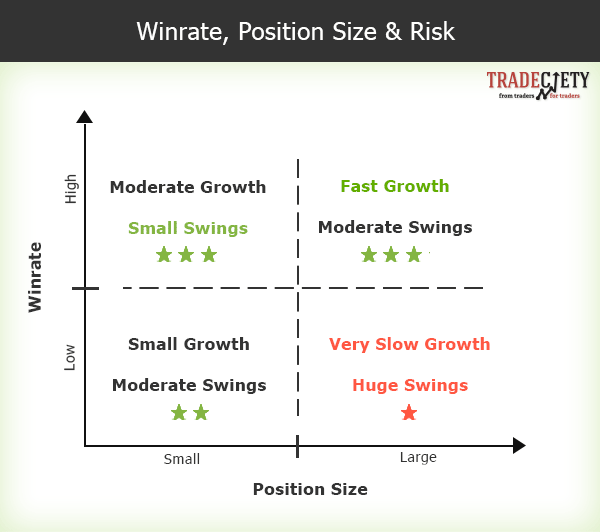

## Table of Contents

## What is position sizing in trading?

Position sizing in trading is about deciding how much of your money to use for a single trade. It's important because it helps you manage risk. If you put too much money into one trade and it goes wrong, you could lose a lot. But if you use position sizing, you can control how much you might lose.

To do position sizing, you need to think about how much you are willing to risk on each trade. This could be a small percentage of your total money, like 1% or 2%. Then, you figure out how many shares or contracts to buy based on that risk. This way, even if the trade doesn't go as planned, you won't lose too much of your money.

## Why is position sizing important for traders?

Position sizing is important for traders because it helps them manage how much they might lose on a single trade. If a trader uses too much of their money on one trade and it fails, they could lose a big part of their money. By using position sizing, traders can decide to risk only a small amount, like 1% or 2% of their total money. This way, even if the trade goes wrong, they won't lose too much.

Another reason position sizing is important is that it helps traders stay in the game longer. Trading can be risky, and if you lose a lot of money quickly, you might not have enough left to keep trading. By controlling the size of each trade, traders can keep their losses small and have more chances to make money over time. This means they can learn from their mistakes and improve their trading skills without running out of money.

## How does position sizing affect risk management?

Position sizing directly affects risk management by helping traders control how much money they put at risk on each trade. If a trader decides to risk only a small part of their money, like 1% or 2%, they can limit their potential losses. This means that even if a trade goes wrong, they won't lose a lot of money. By choosing the right size for each position, traders can make sure they don't bet too much on any single trade, which is a key part of managing risk.

Using position sizing also helps traders stay in the market longer. Trading can be risky, and if a trader loses a big part of their money quickly, they might not have enough left to keep trading. By keeping the size of each trade small, traders can make sure their losses are small too. This way, they can keep trading, learn from their mistakes, and have more chances to make money over time. Position sizing is a simple but powerful tool that helps traders manage their risks and stay in the game.

## What are the common methods of position sizing?

One common method of position sizing is the fixed fractional method. This means you decide to risk a certain part of your money on each trade, like 1% or 2%. For example, if you have $10,000 and you want to risk 1%, you would only risk $100 on each trade. This way, you can make sure that even if you lose, you won't lose a big part of your money. It's simple and helps you keep your losses small.

Another method is the fixed dollar amount method. In this method, you decide to risk a certain amount of money on each trade, no matter how much money you have. For example, you might decide to risk $100 on every trade. This method can be easier to use because you always know how much you're risking, but it doesn't change with your account size. So, if your account grows or shrinks, you're still risking the same amount.

The third method is the volatility-based method. This method looks at how much a stock or other investment moves up and down. You might use something called the Average True Range (ATR) to measure this. If a stock moves a lot, you might decide to buy fewer shares to keep your risk the same. If it moves less, you might buy more shares. This way, your position size changes based on how risky the investment is, helping you manage your risk better.

## How do you calculate position size using the fixed fractional method?

To calculate position size using the fixed fractional method, first decide how much of your money you want to risk on each trade. A common choice is 1% or 2%. For example, if you have $10,000 and you want to risk 1%, you would risk $100 on each trade. Next, you need to know how much you could lose on the trade. This is called the stop-loss level. If you think the stock might drop $2 before you sell, then you would buy 50 shares ($100 risk divided by $2 per share).

Once you know your risk amount and the stop-loss level, you can figure out how many shares to buy. Divide the amount you're willing to risk by the amount you could lose per share. Using the example above, if you're willing to risk $100 and your stop-loss level is $2 per share, you would buy 50 shares. This way, even if the stock drops to your stop-loss level, you'll only lose $100, which is 1% of your $10,000. This method helps you keep your losses small and manage your risk better.

## What is the Kelly Criterion and how is it used in position sizing?

The Kelly Criterion is a way to figure out how much money to bet or invest. It helps you decide the best size for your bets or trades so you can grow your money as fast as possible without taking too much risk. The idea is to use a part of your money that matches the difference between how likely you are to win and how likely you are to lose, while also thinking about how much you could win or lose. It's like a formula that tells you the best amount to bet to make the most money over time.

To use the Kelly Criterion in position sizing, you need to know a few things: how likely you are to win, how likely you are to lose, how much you could win, and how much you could lose. Once you have these numbers, you can put them into the Kelly formula. The formula will give you a number between 0 and 1, which tells you what part of your money to use for the trade. For example, if the Kelly Criterion says to use 0.1, you would bet or invest 10% of your money. This method can help you grow your money faster than if you bet too little or too much, but it can be risky if your guesses about winning and losing are wrong.

## How can position sizing be adjusted based on market volatility?

Position sizing can be adjusted based on market volatility by using the volatility-based method. This method looks at how much a stock or other investment moves up and down. You can use something called the Average True Range (ATR) to measure this. If a stock is moving a lot, it's more risky, so you might decide to buy fewer shares to keep your risk the same. If the stock is moving less, it's less risky, so you might buy more shares. This way, your position size changes based on how risky the investment is, helping you manage your risk better.

For example, if you usually risk 1% of your money on each trade, you would look at the ATR to see how much the stock moves. If the ATR is high, meaning the stock is very volatile, you might decide to buy fewer shares than you would if the ATR was low. This means you're adjusting your position size to match the risk level of the market. By doing this, you can keep your risk at a level you're comfortable with, even when the market is moving a lot.

## What role does position sizing play in portfolio diversification?

Position sizing helps with portfolio diversification by making sure you don't put too much of your money into one investment. If you spread your money across different investments, you lower the risk that one bad trade can hurt your whole portfolio. By using position sizing, you can decide how much to invest in each stock or asset, making sure you're not betting too much on any single one. This way, even if one investment goes down, the others might still do well and balance out your losses.

For example, if you have $10,000 and you decide to risk 1% on each trade, you'll be investing $100 at a time. If you're buying different stocks or assets, you'll be spreading that $100 across them. This means you're not putting all your eggs in one basket. By adjusting the size of your positions based on how risky each investment is, you can make sure your portfolio stays balanced and diversified, which helps you manage risk and potentially grow your money over time.

## How does position sizing differ between day trading and long-term investing?

Position sizing in [day trading](/wiki/day-trading-spy) and long-term investing is different because of how often you trade and how long you hold onto your investments. In day trading, you buy and sell stocks within the same day, sometimes many times. Because you're making quick trades, you need to be careful about how much money you put into each trade. Day traders often use smaller position sizes to limit their risk, since they might make many trades in a day. They might risk a small percentage of their money, like 1% or less, on each trade to make sure they don't lose too much if a trade goes wrong.

In long-term investing, you hold onto your investments for a longer time, like months or years. Because you're not trading as often, you might be willing to put more money into each investment. Long-term investors might use a larger position size because they're more focused on the growth of their investments over time rather than quick profits. They might still use position sizing to manage risk, but they might risk a bit more, like 2% to 5% of their money, on each investment, since they're looking at the bigger picture and not worried about daily ups and downs.

## What are the psychological impacts of position sizing on trading decisions?

Position sizing can have a big effect on how traders feel and make choices. If a trader uses a big position size, they might feel more worried and stressed. They might be scared of losing a lot of money, which can make them second-guess their trades or even stop trading altogether. On the other hand, if they use a smaller position size, they might feel more calm and confident. They know that even if a trade goes wrong, they won't lose much, so they can focus better on their trading plan and make better decisions.

Using the right position size can also help traders stick to their trading rules. When traders risk too much, they might get too excited or too scared, which can make them do things they wouldn't normally do, like holding onto a losing trade for too long or selling a winning trade too soon. By keeping their position sizes small, traders can keep their emotions in check and follow their plan more easily. This way, they can trade more consistently and avoid making big mistakes because of how they feel.

## How can backtesting help in optimizing position sizing strategies?

Backtesting can help traders find the best way to size their positions by letting them see how their strategies would have worked in the past. Traders can use old market data to test different position sizes and see which ones made the most money and had the least risk. For example, they might try risking 1% of their money on each trade and see how it does over time. Then, they can try 2% or even 0.5% and compare the results. This way, they can learn which position size works best for their trading style and goals.

By using backtesting, traders can also see how different position sizes affect their emotions and decisions. They can watch how they would have felt if they used a bigger or smaller position size in the past. This can help them pick a position size that keeps them calm and focused, so they can stick to their trading plan better. Backtesting gives traders a safe way to try out different position sizes without losing real money, helping them find the best balance between making money and managing risk.

## What advanced techniques can be used to refine position sizing for expert traders?

Expert traders can use something called the Monte Carlo simulation to refine their position sizing. This is a fancy way of testing their trading plan by running it many times with different made-up market conditions. It helps them see how their plan might work in the future and how different position sizes could affect their profits and losses. By using this method, traders can find the best position size that balances making money with keeping risk low. It's like playing out many different "what if" scenarios to make sure their strategy can handle all kinds of market ups and downs.

Another advanced technique is using adaptive position sizing. This means changing the size of your trades based on how well you're doing. If you're making money, you might decide to risk a bit more on each trade. If you're losing money, you might risk less. This can help you grow your money faster when things are going well and protect your money when things aren't going so well. It's like having a smart system that adjusts your bets to fit the current situation, making sure you're always playing it safe but also taking advantage of good opportunities.

## What Terms Are Used in Position Sizing?

In the context of position sizing, understanding a few key terms is vital to applying effective strategies in trading. These terms include Account Risk, Trade Risk, and Proper Position Size. Each plays a significant role in determining how much capital a trader should allocate to each trade, aiming for an optimal balance between risk and profitability.

### Account Risk
Account Risk refers to the maximum percentage of the total trading account that a trader is willing to risk on a single trade. It represents the acceptable loss for any given trade, ensuring that no single loss has a devastating impact on the overall trading capital. Typically, traders opt for a conservative approach, setting this risk at 1-2% of their total account value.

#### Formula
$$
\text{Account Risk} = \text{Account Balance} \times \frac{\text{Risk Percentage}}{100}
$$

### Trade Risk
Trade Risk is the amount of a trader's account they are willing to lose on a particular trade. It is determined by the difference between the entry price and the stop-loss price of the asset being traded, multiplied by the number of units (shares, contracts, etc.) being traded.

#### Formula
$$
\text{Trade Risk} = (\text{Entry Price} - \text{Stop-Loss Price}) \times \text{Number of Units}
$$

### Proper Position Size
Proper Position Size is the quantity of units (shares, contracts, etc.) that a trader should trade to ensure that the risk on a single trade does not exceed the Account Risk. Calculating the proper position size is crucial for maintaining disciplined risk management.

#### Formula
$$
\text{Position Size} = \frac{\text{Account Risk}}{\text{Trade Risk}}
$$

### Example Calculation
Suppose a trader has an account balance of $10,000 and is willing to risk 2% of the account on each trade. They enter a stock at a price of $50, with a stop-loss set at $48. The calculations would proceed as follows:

1. **Calculate Account Risk**:
$$
   \text{Account Risk} = \$10,000 \times 0.02 = \$200

$$

2. **Calculate Trade Risk**:
$$
   \text{Trade Risk per Unit} = \$50 - \$48 = \$2

$$

3. **Determine Proper Position Size**:
$$
   \text{Position Size} = \frac{\$200}{\$2} = 100 \text{ shares}

$$

In this example, the proper position size would be 100 shares. By adhering to these calculations, traders can systematically manage risk and maintain consistent control over their trading activities, avoiding emotional decisions and potential large losses. Understanding and implementing these terms effectively allows traders to optimize their position sizing strategies, enhancing overall trading efficacy.

## What are common techniques of position sizing?

Position sizing is an essential component of a trading strategy as it helps manage risk and maximize potential returns. This section discusses the common techniques used in position sizing: Fixed Units, Fixed Sum, Fixed Percentage, and Fixed Fraction.

### Fixed Units

The fixed units method involves trading a constant number of shares or contracts per trade. This approach is straightforward and easy to implement, making it appealing for new traders. However, it does not consider variations in price or [volatility](/wiki/volatility-trading-strategies), which can expose traders to inconsistent risk across different trades.

For example, a trader who decides to trade 100 shares per position will execute this number regardless of the stock’s price. While this simplifies the trading process, it can lead to overexposure if the shares are expensive or if the market becomes highly volatile.

### Fixed Sum

The fixed sum method allocates a fixed dollar amount to each trade. This technique offers more risk control than fixed units as it accounts for the price of each asset being traded. The idea is to invest the same amount of capital in each trade, rather than the same number of units, thus providing some standardization in risk.

For instance, with a fixed sum of $1,000 per trade, a trader can calculate the number of shares to purchase by dividing the fixed sum by the current price of the stock:

$$
\text{Number of Shares} = \frac{\text{Fixed Sum}}{\text{Stock Price}}
$$

This method ensures that the trader is not overly invested in high-priced stocks compared to lower-priced ones.

### Fixed Percentage

The fixed percentage method involves using a constant percentage of the available capital for each trade. This approach dynamically adjusts the position size as the account’s capital changes, maintaining a proportional level of risk as the trader’s equity grows or shrinks.

For example, if a trader decides to risk 2% of their $50,000 account on each trade, the position size would be calculated as:

$$
\text{Position Size in Dollars} = \text{Account Balance} \times \text{Percentage Risk}
$$

Thus, the trader would allocate $1,000 for the trade. This method allows for consistent risk exposure relative to account size and can accommodate account growth or drawdowns over time.

### Fixed Fraction

The fixed fraction technique adjusts position size based on the risk associated with each trade. It involves determining a certain fraction of the account to risk on a given trade, based on the trade’s risk profile. This approach takes both the trader’s risk appetite and the risk/reward ratio of the trade into consideration.

If a trader risks 1% of their capital per trade, and the trade risk (the difference between entry price and stop-loss price) is $2 per share, the position size can be calculated using the formula:

$$
\text{Position Size} = \frac{\text{Account Balance} \times \text{Fraction Risk}}{\text{Trade Risk}}
$$

For a $50,000 account, this would result in:

$$
\text{Position Size} = \frac{50,000 \times 0.01}{2} = 250 \text{ shares}
$$

By adjusting the position size based on the risk of each trade, the fixed fraction method helps ensure that individual trades do not jeopardize overall portfolio stability.

Understanding and implementing these common techniques of position sizing can significantly influence a trader’s ability to manage risk and achieve consistent results. By choosing the appropriate method, traders can maintain discipline and improve overall trading performance.

## What are some not-so-common techniques of position sizing?

The not-so-common techniques of position sizing involve sophisticated mathematical models and strategies designed to optimize the allocation of capital in trades, aimed at maximizing returns while managing risks efficiently.

The Kelly Criterion is one such strategy that involves a mathematical formula used to determine the ideal size of a series of bets. In trading, this translates to calculating the percentage of capital to allocate to a trade to achieve optimal long-term growth. The Kelly Criterion is defined as follows:

$$
f^* = \frac{bp - q}{b}
$$

In this formula:
- $f^*$ is the fraction of the capital to be wagered or invested.
- $b$ is the odds received on the trade (i.e., net odds received on a wager).
- $p$ is the probability of winning the trade.
- $q$ is the probability of losing, calculated as $1 - p$.

The criterion suggests that traders bet a fraction of their capital proportional to their perceived edge over the market, balancing potential gains against potential risks. This ensures a higher geometric growth rate of capital over a series of trades, highlighting its effectiveness for long-term investors.

Optimal F, introduced by Ralph Vince, differs from the Kelly Criterion by focusing on maximizing the return for a predetermined level of risk, rather than optimizing bet size purely for growth. It calculates the fraction of the portfolio to risk where the maximum growth rate aligns precisely with individual risk tolerance levels. Determining the Optimal F involves [backtesting](/wiki/backtesting) historical data to find the risk fraction that yields the best return without exceeding the trader’s risk threshold.

The Constant Proportion Portfolio Insurance (CPPI) strategy and the Time Invariant Protection Portfolio (TIPP) method are advanced portfolio management techniques balancing risk by adjusting asset exposure dynamically. 

CPPI involves setting a floor level of wealth that the investor wants to protect and investing the surplus (cushion) in a risky asset with a multiplication [factor](/wiki/factor-investing) (known as the multiplier). The allocation to the risky asset at any point in time can be expressed as:

$$
\text{Investment in Risky Asset} = \text{Multiplier} \times (\text{Portfolio Value} - \text{Floor})
$$

This strategy enables the investor to participate in the growth of risky assets while simultaneously protecting a predefined portion of their capital.

TIPP, on the other hand, is designed to maintain the portfolio's value relative to a predetermined benchmark. It seeks to protect the portfolio's value by adjusting asset allocations based on market movements and predefined rules, ensuring stability and protection against downside risk while granting exposure to potential upside benefits.

Both CPPI and TIPP require continuous monitoring and adjustment to ensure alignment with the investor’s risk-return profile and market dynamics. These cutting-edge methods provide versatility and protection, making them suitable choices for sophisticated [algorithmic trading](/wiki/algorithmic-trading) strategies looking for a balanced approach to risk management.

## References & Further Reading

[1]: Tharp, V. K. (1998). ["Trade Your Way to Financial Freedom"](https://www.amazon.com/Trade-Your-Way-Financial-Freedom/dp/007147871X). McGraw-Hill Education.

[2]: Vince, R. (1992). ["The Mathematics of Money Management: Risk Analysis Techniques for Traders"](https://books.google.com/books/about/The_Mathematics_of_Money_Management.html?id=iUSzmtLJ3AgC). Wiley.

[3]: Kelly, J. L. (1956). ["A New Interpretation of Information Rate."](https://www.princeton.edu/~wbialek/rome/refs/kelly_56.pdf) Bell System Technical Journal.

[4]: Van Tharp Institute. ["Position Sizing."](https://vantharpinstitute.com/product/definitive-guide-to-position-sizing-strategies/)

[5]: Vince, R. (1990). ["Portfolio Management Formulas: Mathematical Trading Methods for the Futures, Options, and Stock Markets"](https://www.amazon.com/Portfolio-Management-Formulas-Mathematical-Trading/dp/0471527564). Wiley.