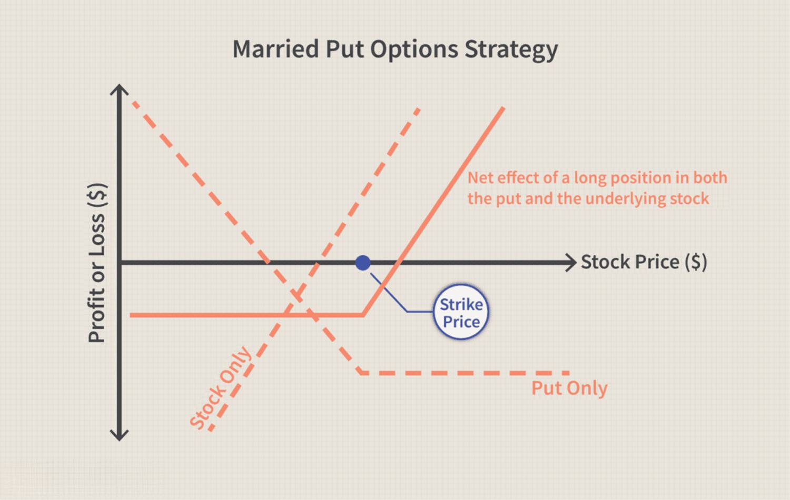

Position trading and algo trading are two distinctive approaches that have gained traction among traders. Each method presents its own unique methodologies and strategies, offering both advantages and disadvantages tailored to various trading preferences.

Position trading focuses on a long-term outlook, where traders maintain their positions over extended periods. This strategy capitalizes on the ability to recognize and benefit from significant market trends. Unlike the rapid and frequent transactions typical of day trading, position trading allows traders to look beyond daily fluctuations, aiming to capture sizable profits from long-term market movements.



In contrast, algorithmic trading, or algo trading, is grounded in technology and automation. By employing software to execute trades based on predefined algorithms, traders can mitigate human errors and biases. This method thrives on speed and accuracy, leveraging computational power to process a large volume of trades efficiently. 

This article will explore these two trading methodologies and shed light on how traders can align their strategies with their investment objectives and risk tolerances. We will first examine position trading, understanding its key aspects and implementation. Following that, we will discuss the intricacies and potential of algorithmic trading, clarifying its role in modern trading practices.

## Table of Contents

## Understanding Position Trading

Position trading is a long-term strategy in which traders maintain positions for extended durations, aiming to benefit from significant market trends. Unlike the rapid pace of day trading, where positions are typically closed within the same day, position traders focus on achieving long-term gains by predicting ongoing movement trends in the market. This approach thrives on the anticipation of sustained trends rather than short-term price fluctuations.

One of the key attributes of position trading is patience. Traders adopting this strategy are prepared to overlook short-term market noise, holding their positions through potential interim volatilities. A keen understanding of trend identification is also crucial, as position traders must distinguish between temporary price movements and genuine market trends. Minimal trading activity characterizes this approach, as frequent trades are not necessary once a position is established based on a perceived trend.

Position trading is often compared with swing trading and the buy-and-hold strategy. While swing trading involves holding positions for several days or weeks to capture short-to-medium-term movements, position trading is rooted in the expectation of trend continuation over potentially months or even years. In contrast to the buy-and-hold strategy, which often depends on the inherent growth of an asset over time, position trading is more actively engaged in analyzing and exploiting market trends.

For position traders to be successful, a comprehensive analysis of market trends is imperative. This involves scrutinizing market indicators, economic factors, and even geopolitical events that could influence long-term market directions. Furthermore, traders must possess the resolve to endure short-term [volatility](/wiki/volatility-trading-strategies) and are often required to reassess their positions as market conditions evolve.

Overall, position trading serves as an effective strategy for traders aiming to capitalize on extended market trends, requiring a combination of patience, strategic trend identification, and the discipline to maintain positions over longer periods amidst variable market dynamics.

## Position Trading Strategies

Position trading strategies focus on capitalizing on long-term market trends by sustaining positions over extended periods. Several approaches are utilized by traders to maximize their returns while minimizing potential risks.

**Trend Following**: This strategy revolves around identifying and capitalizing on strong market trends. Traders enter a position aligned with the trend and maintain it until there are clear signs of a potential reversal. By following the momentum, traders aim to profit from sustained price movements. Trend following requires a keen understanding of trend indicators and the patience to remain in the trade through market fluctuations.

**Breakout Trading**: Here, traders anticipate significant price movements by monitoring key support and resistance levels. A breakout occurs when the price moves beyond these defined boundaries, signaling a potential new trend. Traders enter positions once the breakout is confirmed, expecting continued movement in the breakout direction. Effective breakout trading relies on accurately identifying genuine breakouts to avoid false signals.

**Fundamental Analysis**: This involves assessing a company’s intrinsic value through detailed analysis of its earnings, market position, and industry prospects. By evaluating financial statements, economic conditions, and industry trends, position traders make informed decisions about potential long-term investments. Fundamental analysis provides insights into the underlying forces driving market trends beyond technical patterns.

**Technical Analysis**: Traders using this approach rely on price charts and technical indicators such as moving averages, trendlines, and oscillators to validate trends and make entry and exit decisions. For instance, the moving average crossover system involves buying when a short-term moving average crosses above a longer-term one, indicating a bullish trend, and selling when the opposite occurs. This method allows traders to systematically assess price movements and identify optimal positions.

**Risk Management**: To protect investments, position traders implement robust risk management practices, including the use of stop-loss orders. Stop-loss orders automatically trigger a sale if the asset’s price falls below a predetermined level, minimizing losses from adverse market moves. Effective risk management ensures that potential losses are contained, preserving capital for future trading opportunities. Additionally, traders often diversify their portfolios to spread risk across various assets or sectors.

Position trading strategies require a balance of technical and fundamental analyses, along with a firm grasp of market dynamics and disciplined risk management. By combining these elements, traders can enhance their potential for achieving significant long-term returns.

## Pros and Cons of Position Trading

Position trading offers a range of advantages that make it appealing to certain types of investors. One significant benefit is the reduced time required for market monitoring compared to [day trading](/wiki/day-trading-spy). Since position traders hold assets over longer periods, they do not need to be constantly glued to their screens, analyzing short-term market fluctuations. This long-term focus also translates to fewer transactions, thereby reducing transaction costs, which can add up significantly with more frequent trading strategies.

Another notable advantage is the potential for large profits. By capitalizing on sustained price movements, position traders can earn substantial returns if they successfully identify and hold on to assets through long-term trends. This strategy can be particularly rewarding when market analysis correctly forecasts impending [momentum](/wiki/momentum) shifts that result in significant price changes.

However, position trading is not without its drawbacks. A noteworthy disadvantage is the substantial patience required, as holding positions over long periods often means enduring market fluctuations and volatility without reacting impulsively. This approach necessitates that capital be tied up for extended periods, which can limit a trader's [liquidity](/wiki/liquidity-risk-premium) and flexibility to invest in other opportunities that may arise.

Position traders also face exposure to market risks, such as economic downturns and geopolitical events, which can negatively impact long-term positions. These external factors can introduce levels of risk that may not be as prevalent for those engaging in short-term trading strategies. Given that funds are committed for lengthy durations, opportunity costs must be considered, as traders are less able to reallocate capital to potentially more profitable ventures as market conditions change. 

Thus, while position trading can yield significant gains and offer a less hands-on investment approach, it requires a high level of commitment and a tolerance for long-term risk and uncertainties.

## What is Algo Trading?

Algorithmic trading uses computer software to execute trades at speeds and frequencies that a human trader cannot match. This approach operates on pre-defined criteria, often based on mathematical models and data analysis, to automate trading decisions. The primary objective is to remove human error and emotional bias, ensuring trades are executed as planned without deviation.

A distinguishing feature of algo trading is its ability to operate at multiple levels of automation. High-frequency trading ([HFT](/wiki/high-frequency-trading-strategies)) represents one spectrum, involving rapid buying and selling, often within milliseconds, to capitalize on small price discrepancies. On the other end, there are strategies which require minimal human oversight, allowing for more deliberate pace and assessment.

Key components in an [algorithmic trading](/wiki/algorithmic-trading) system include:

1. **Strategy Formulation**: Developing a trading strategy is the first step, often utilizing both fundamental and technical analysis. This involves quantifying market hypotheses into actionable trading rules or algorithms. For example, a basic moving average crossover strategy can be expressed as:
$$
   \text{If } \text{SMA}_{\text{short}} > \text{SMA}_{\text{long}}, \text{ then buy}

$$
   Here, $\text{SMA}_{\text{short}}$ and $\text{SMA}_{\text{long}}$ are the short-term and long-term simple moving averages, respectively.

2. **Backtesting**: Before live trading, strategies are applied to historical market data to evaluate their performance. This step helps in refining the strategy and understanding potential outcomes. A typical backtesting workflow in Python might look like:

   ```python
   def backtest(strategy, data):
       results = []
       for price in data:
           signal = strategy(price)
           results.append(execute_trade(signal))
       return evaluate_performance(results)
   ```

3. **Implementation and Monitoring**: Once a strategy shows promise, it is implemented in a live trading environment. Constant monitoring is essential to ensure the system operates as intended and adapts to any emergence of market anomalies or technical glitches.

Algorithmic trading's versatility allows it to be applied across various financial markets, including stocks, commodities, and [forex](/wiki/forex-system). This flexibility enables traders to manage a diversified portfolio with precision. However, it is imperative for traders to remain vigilant as the success of algo trading depends heavily on the quality of data inputs, the robustness of the model, and the ever-changing market dynamics. Hence, frequent strategy evaluations and updates are critical to sustain profitability.

## Pros and Cons of Algo Trading

Algorithmic trading, or algo trading, is characterized by its ability to execute trades with increased speed and accuracy. This method utilizes pre-defined mathematical models and automated systems to make trading decisions, thereby eliminating the human errors and emotional biases that can often affect traditional trading. By automating the process, algo trading allows for quick adaptation to market conditions, enabling traders to engage in diverse strategies and rigorous [backtesting](/wiki/backtesting).

**Pros of Algo Trading**

1. **Increased Speed and Accuracy**: Algorithmic trading systems are capable of analyzing and processing vast amounts of market data in milliseconds, executing trades faster than any human trader could. This speed ensures that traders can capitalize on fleeting market opportunities, which can be crucial in volatile markets.

2. **Elimination of Human Emotions**: One of the significant advantages of algorithmic trading is the reduction of emotional decision-making. Algorithms execute trades based solely on data-driven insights, reducing the risk of decisions influenced by fear, greed, or other emotions that can lead to poor trading outcomes.

3. **Diversification and Backtesting**: Algorithms can simultaneously manage multiple trading strategies across different asset classes and markets, enabling diversification that is difficult to achieve manually. Furthermore, these strategies can be backtested using historical data to validate their effectiveness and refine them before implementation in live trading scenarios.

4. **Reduced Transaction Costs**: Due to the capability to process a large number of trades with minimal delay, algo trading can lead to reduced transaction costs. Trades are executed swiftly and precisely, often allowing for better price execution and lower spreads.

**Cons of Algo Trading**

1. **High Dependency on Technology**: Algorithmic trading relies heavily on advanced computing systems and robust technology infrastructure. Any technical failure or system downtime can result in missed opportunities or incorrect trades, posing a significant risk to traders.

2. **Need for Technical Expertise**: Developing, implementing, and maintaining algorithmic trading systems require specialized knowledge and skills in programming, financial markets, and quantitative analysis. This necessity can be a barrier for individual traders without a technical background.

3. **Substantial Startup Costs**: Establishing an algorithmic trading setup involves considerable initial investment in technology, data feeds, software development, and possibly co-location services near exchanges to minimize latency. These costs can be prohibitive for smaller traders.

4. **Regulatory Compliance**: The use of automated and algorithmic trading systems is subject to strict regulatory scrutiny to ensure market fairness and prevent manipulative practices. Traders must adhere to extensive compliance requirements, which can involve additional time and resources.

5. **Potential for Over-optimization**: Over-optimization, commonly referred to as "curve fitting," occurs when a strategy is overly tailored to past data, resulting in poor performance in future, unseen market conditions. Traders must exercise caution during the backtesting phase to avoid this pitfall, ensuring that their algorithms are robust and adaptable rather than only effective in historical contexts.

Ultimately, while algorithmic trading offers numerous advantages in speed, efficiency, and strategic depth, it also requires careful consideration of technological, financial, and regulatory challenges. This balance is essential for sustaining successful trading operations over the long term.

## Conclusion

Both position trading and algorithmic trading offer distinct advantages and challenges, catering to varying preferences and expertise levels among traders. Position trading is most suitable for individuals who prefer a less hands-on approach, allowing them to capitalize on long-term market trends while enduring short-term market fluctuations. This style of trading requires a patient mindset and the ability to tolerate the capital being tied up for extended periods.

In contrast, algorithmic trading appeals to those inclined towards technology-driven solutions that offer enhanced speed and efficiency. By leveraging software to execute trades based on pre-defined criteria, algorithmic trading minimizes human error and biases, potentially leading to increased profitability through swift and accurate execution. However, it demands significant technical expertise and an understanding of the underlying algorithms and requires ongoing monitoring due to the dynamic nature of market conditions.

Ultimately, the choice of trading strategy should be aligned with a trader's investment goals, risk tolerance, and personal interests in market analysis. Employing a diversified investment portfolio incorporating both position and algorithmic trading strategies may provide a more comprehensive approach to mitigating risks and capitalizing on opportunities across different market environments. This combination allows traders to balance the stability of long-term investments with the potential high efficiency and speed offered by technology-driven trading.

## References & Further Reading

[1]: Bergstra, J., Bardenet, R., Bengio, Y., & Kégl, B. (2011). ["Algorithms for Hyper-Parameter Optimization."](https://dl.acm.org/doi/10.5555/2986459.2986743) Advances in Neural Information Processing Systems 24.

[2]: ["Advances in Financial Machine Learning"](https://www.amazon.com/Advances-Financial-Machine-Learning-Marcos/dp/1119482089) by Marcos Lopez de Prado

[3]: ["Evidence-Based Technical Analysis: Applying the Scientific Method and Statistical Inference to Trading Signals"](https://www.amazon.com/Evidence-Based-Technical-Analysis-Scientific-Statistical/dp/0470008741) by David Aronson

[4]: ["Machine Learning for Algorithmic Trading"](https://github.com/stefan-jansen/machine-learning-for-trading) by Stefan Jansen

[5]: ["Quantitative Trading: How to Build Your Own Algorithmic Trading Business"](https://www.amazon.com/Quantitative-Trading-Build-Algorithmic-Business/dp/1119800064) by Ernest P. Chan