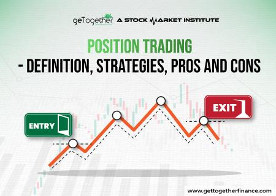

## Table of Contents

## What is position trading and how does it differ from other trading styles?

Position trading is a type of trading where you hold onto stocks, currencies, or other investments for a longer time, usually weeks or months. The main goal is to make money from big price changes over time, not from quick ups and downs. Position traders look at the big picture, like overall trends and patterns in the market, to decide when to buy and sell.

Position trading is different from other styles like day trading and swing trading. Day traders buy and sell within the same day, trying to make quick profits from small price changes. Swing traders hold their investments for a few days to a couple of weeks, aiming to catch medium-term price swings. Position trading takes more patience and a focus on long-term trends, while day and swing trading need more attention to short-term market moves.

## What are the key strategies used in position trading?

In position trading, one key strategy is to look at the big picture. Traders study long-term trends and patterns in the market. They use tools like moving averages, trend lines, and charts to spot where the market might be heading. By understanding these trends, position traders try to buy when prices are low and sell when they go up. They are not worried about small daily changes but focus on where the price might be in a few months.

Another important strategy is to manage risk carefully. Position traders often use stop-loss orders to limit how much they can lose if the market moves against them. They also might spread their money across different investments to reduce risk. Patience is crucial in position trading. Traders need to be ready to hold onto their investments for a long time, even if the market goes up and down in the short term. This means they need to trust their analysis and stick to their plan, even when it's tough.

## How do position traders identify potential entry and exit points?

Position traders use different tools to find good times to buy and sell. They look at long-term charts and use things like moving averages to see where the market is going. A moving average is just a line that shows the average price over time. If the price is above this line, it might be a good time to buy. If it's below, it might be time to sell. They also watch for patterns, like when the price keeps going up or down over time. This helps them decide when to get into a trade.

Once in a trade, position traders need to know when to get out. They set a target price where they want to sell and make a profit. They also use stop-loss orders to limit their losses. A stop-loss order is like a safety net that automatically sells the investment if the price drops too much. Position traders also keep an eye on big news or changes in the market that could affect their investments. By watching these things, they can decide if it's time to sell and take their profits or cut their losses.

## What are the advantages of position trading for beginners?

Position trading is good for beginners because it does not need them to watch the market all the time. Unlike [day trading](/wiki/day-trading-spy), where you have to make quick decisions, position trading lets you take your time. You can look at the big picture and make choices over weeks or months. This means you can learn and understand the market without feeling rushed. It's easier for beginners to handle because they can focus on long-term trends instead of worrying about small daily changes.

Another advantage is that position trading can help beginners learn how to manage risk better. They can use tools like stop-loss orders to protect their money if the market goes the wrong way. This teaches them how to limit their losses and not lose too much. Also, since position trading involves holding investments for a longer time, beginners can see how their decisions play out over time. This helps them gain experience and confidence in their trading skills without the pressure of making quick trades.

## What are the common pitfalls that beginner position traders should avoid?

One common mistake that beginner position traders make is not having a clear plan. They might jump into trades without doing enough research or understanding the long-term trends. This can lead to bad decisions and losing money. It's important for beginners to take their time, study the market, and have a solid strategy before they start trading.

Another pitfall is getting too emotional. When the market goes up and down, it's easy to feel scared or too excited. Beginners might sell too soon when they see a small profit, or they might hold onto a losing trade hoping it will turn around. This can lead to missed opportunities and bigger losses. It's crucial for beginners to stick to their plan and not let their feelings control their trading decisions.

Lastly, beginners often forget to manage their risk properly. They might put all their money into one trade, which is very risky. It's better to spread out their investments and use tools like stop-loss orders to limit losses. By managing risk well, beginners can protect their money and learn from their trades without facing big losses.

## How can intermediate traders refine their position trading strategies?

Intermediate traders can refine their position trading strategies by paying more attention to technical analysis. They should use more advanced tools like Fibonacci retracement levels, Bollinger Bands, and Relative Strength Index (RSI) to get a better understanding of market trends. These tools can help them find more precise entry and [exit](/wiki/exit-strategy) points. By combining these indicators with their knowledge of long-term trends, intermediate traders can make smarter trading decisions and increase their chances of success.

Another way intermediate traders can improve is by diversifying their portfolio and managing risk more effectively. They should spread their investments across different assets to reduce the impact of any single trade going wrong. Using more sophisticated risk management techniques, like adjusting stop-loss orders based on market [volatility](/wiki/volatility-trading-strategies), can also help protect their capital. By refining their approach to risk, intermediate traders can handle the ups and downs of the market better and build a more robust trading strategy.

## What role do fundamental analysis and technical analysis play in position trading?

Fundamental analysis helps position traders understand the big picture of an investment. It looks at things like a company's earnings, the economy, and news that can affect the price over time. By studying these things, position traders can see if a stock or currency is a good long-term buy. For example, if a company is doing well and the economy is strong, a position trader might decide to buy and hold that stock for months, expecting its price to go up. Fundamental analysis helps traders make smart choices based on the health and future of what they are investing in.

Technical analysis, on the other hand, helps position traders find the best times to buy and sell. It uses charts and tools like moving averages and trend lines to spot patterns in price movements. Position traders use these patterns to decide when to get into a trade and when to get out. For instance, if a stock's price is above its moving average, it might be a good time to buy. Technical analysis helps traders time their moves better, so they can buy low and sell high. By combining fundamental and technical analysis, position traders can make well-informed decisions and improve their chances of success.

## How do advanced position traders manage risk and leverage?

Advanced position traders manage risk by using a variety of strategies. They spread their money across different investments to avoid losing everything if one trade goes bad. They also use stop-loss orders, but they adjust these orders based on how much the market is moving. If the market is very up and down, they might set their stop-loss further away to give their trade more room to move. They also keep a close eye on how much they could lose in each trade and make sure it's not too much of their total money. By doing all these things, advanced traders can protect their money and keep trading even when the market is tough.

Leverage is another tool advanced position traders use, but they are careful with it. Leverage lets them control a bigger investment with less money, which can make their profits bigger. But it can also make their losses bigger if the market goes against them. So, they use leverage wisely, only taking on as much as they can handle. They might use less leverage when the market is risky and more when they feel confident. By managing leverage carefully, advanced traders can use it to their advantage without putting their money at too much risk.

## What are the tax implications of position trading?

When you make money from position trading, you have to pay taxes on your profits. The tax you pay depends on how long you hold your investment. If you hold it for more than a year, it's called a long-term capital gain, and the tax rate is usually lower. If you hold it for less than a year, it's a short-term capital gain, and you pay taxes at your regular income tax rate, which can be higher. So, position traders can sometimes save on taxes by holding their investments for over a year.

Position traders also need to keep good records of all their trades. This includes when they bought and sold, how much they paid, and how much they got when they sold. These records help them figure out their gains and losses at tax time. If they have losses, they can use these to lower their taxes. They can deduct losses from their gains, and if they have more losses than gains, they can use up to $3,000 of those losses to reduce their other income. Keeping track of everything makes tax time easier and helps position traders pay the right amount of taxes.

## How does position trading adapt to different market conditions?

Position trading works well in different market conditions because it focuses on long-term trends instead of short-term changes. When the market is going up, position traders can buy and hold onto their investments for a long time, waiting for the price to keep going up. They use tools like moving averages to see if the trend is strong and likely to continue. If the market is going down, position traders might wait for the right time to buy when prices are low, expecting them to go back up later. They are patient and look for big moves over time, so they can make money even when the market is not moving much day to day.

In times when the market is very up and down, position traders need to be careful. They might use stop-loss orders to protect their money if the market suddenly drops. They also keep an eye on big news or changes that could affect their investments. By understanding the bigger picture and not getting too worried about short-term changes, position traders can still find good opportunities. They adjust their strategies based on what the market is doing, always looking for the best times to buy and sell over the long term.

## What psychological factors should expert position traders consider?

Expert position traders need to think about their feelings when they trade. It's easy to get too excited when the market goes up or too scared when it goes down. These feelings can make traders do things they didn't plan, like selling too soon or holding onto a losing trade too long. To be good at position trading, experts need to stay calm and stick to their plan. They should not let their emotions control their decisions. By keeping a clear head, they can make better choices and follow their long-term strategy.

Another important thing for expert position traders is to be patient. Position trading means holding onto investments for a long time, sometimes months. This can be hard when the market goes up and down a lot. Traders might feel like they want to sell and take their money out, but if they believe in their long-term plan, they need to wait. Being patient helps them catch the big moves in the market and make more money over time. By staying patient and not giving in to short-term worries, expert position traders can do well in the long run.

## How can position trading be integrated with other investment strategies for portfolio diversification?

Position trading can be mixed with other ways of investing to make a more varied portfolio. For example, someone might use position trading for some of their money, focusing on long-term trends in stocks or currencies. At the same time, they could use other strategies like swing trading or day trading for different parts of their portfolio. Swing trading might help them catch medium-term price swings, while day trading could be used to make quick profits from short-term changes. By spreading their money across different trading styles, they can balance the risks and rewards better.

Another way to mix position trading with other investments is by adding things like bonds, real estate, or even mutual funds to the portfolio. These other investments can help smooth out the ups and downs of the market. For instance, if the stock market goes down, the value of bonds might stay steady or even go up, helping to protect the overall value of the portfolio. By combining position trading with these other types of investments, traders can have a more stable and diversified portfolio. This approach can help them make money over the long term while also managing risk better.

## What is Algo Trading?

Algorithmic trading uses computer software to execute trades at speeds and frequencies that a human trader cannot match. This approach operates on pre-defined criteria, often based on mathematical models and data analysis, to automate trading decisions. The primary objective is to remove human error and emotional bias, ensuring trades are executed as planned without deviation.

A distinguishing feature of algo trading is its ability to operate at multiple levels of automation. High-frequency trading ([HFT](/wiki/high-frequency-trading-strategies)) represents one spectrum, involving rapid buying and selling, often within milliseconds, to capitalize on small price discrepancies. On the other end, there are strategies which require minimal human oversight, allowing for more deliberate pace and assessment.

Key components in an [algorithmic trading](/wiki/algorithmic-trading) system include:

1. **Strategy Formulation**: Developing a trading strategy is the first step, often utilizing both fundamental and technical analysis. This involves quantifying market hypotheses into actionable trading rules or algorithms. For example, a basic moving average crossover strategy can be expressed as:
$$
   \text{If } \text{SMA}_{\text{short}} > \text{SMA}_{\text{long}}, \text{ then buy}

$$
   Here, $\text{SMA}_{\text{short}}$ and $\text{SMA}_{\text{long}}$ are the short-term and long-term simple moving averages, respectively.

2. **Backtesting**: Before live trading, strategies are applied to historical market data to evaluate their performance. This step helps in refining the strategy and understanding potential outcomes. A typical backtesting workflow in Python might look like:

   ```python
   def backtest(strategy, data):
       results = []
       for price in data:
           signal = strategy(price)
           results.append(execute_trade(signal))
       return evaluate_performance(results)
   ```

3. **Implementation and Monitoring**: Once a strategy shows promise, it is implemented in a live trading environment. Constant monitoring is essential to ensure the system operates as intended and adapts to any emergence of market anomalies or technical glitches.

Algorithmic trading's versatility allows it to be applied across various financial markets, including stocks, commodities, and [forex](/wiki/forex-system). This flexibility enables traders to manage a diversified portfolio with precision. However, it is imperative for traders to remain vigilant as the success of algo trading depends heavily on the quality of data inputs, the robustness of the model, and the ever-changing market dynamics. Hence, frequent strategy evaluations and updates are critical to sustain profitability.

## References & Further Reading

[1]: Bergstra, J., Bardenet, R., Bengio, Y., & Kégl, B. (2011). ["Algorithms for Hyper-Parameter Optimization."](https://dl.acm.org/doi/10.5555/2986459.2986743) Advances in Neural Information Processing Systems 24.

[2]: ["Advances in Financial Machine Learning"](https://www.amazon.com/Advances-Financial-Machine-Learning-Marcos/dp/1119482089) by Marcos Lopez de Prado

[3]: ["Evidence-Based Technical Analysis: Applying the Scientific Method and Statistical Inference to Trading Signals"](https://www.amazon.com/Evidence-Based-Technical-Analysis-Scientific-Statistical/dp/0470008741) by David Aronson

[4]: ["Machine Learning for Algorithmic Trading"](https://github.com/stefan-jansen/machine-learning-for-trading) by Stefan Jansen

[5]: ["Quantitative Trading: How to Build Your Own Algorithmic Trading Business"](https://www.amazon.com/Quantitative-Trading-Build-Algorithmic-Business/dp/1119800064) by Ernest P. Chan