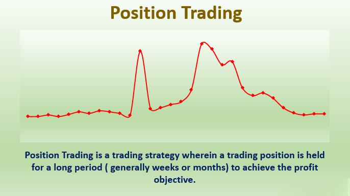

Position trading is an investment strategy that involves holding financial securities for longer periods, ranging from weeks to several months, with the primary objective of capitalizing on significant market movements. This approach contrasts with short-term trading methods that seek to exploit smaller, more immediate price fluctuations. Position trading relies on the identification and analysis of long-term market trends and patterns.

In algorithmic trading, position trading strategies are executed through automated systems programmed to respond to market data according to pre-defined rules. These algorithms evaluate sectors of interest and implement trading strategies without the need for constant human intervention, reducing the impact of emotional biases on decision-making. The use of technological advancements allows traders to capture market opportunities with greater precision and discipline.



This article will explore a range of position trading strategies within algorithmic trading, explaining how they work and how they can be effectively implemented. It will cover the benefits and challenges associated with position trading while comparing it to other trading styles. An examination of backtested strategies will provide insights into the effectiveness of algorithmic position trading approaches, offering a clear understanding of how traders can utilize this strategy for substantial market gains. In this context, we will provide an in-depth look at position trading to illustrate its potential as a powerful tool for capturing enduring trends in the financial markets.

## Table of Contents

## Understanding Position Trading

Position trading involves holding financial instruments for extended periods, typically spanning weeks to months, with the objective of capitalizing on long-term market trends. This strategy contrasts with the rapid transactions seen in day trading, adopting instead a more patient and strategic approach. The fundamental principle of position trading is to benefit from substantial price movements that unfold over time rather than short-term fluctuations.

In algorithmic trading, position trading strategies are designed to identify and take advantage of these long-term trends using automated systems. These algorithms are built to analyze large datasets and recognize patterns or indicators signaling potential trend shifts. By executing trades automatically when predefined conditions are met, algorithms eliminate human emotion from the decision-making process, thus maintaining consistency and discipline in the trading strategy.

To effectively implement position trading, traders employ a combination of fundamental and technical analysis. Fundamental analysis involves assessing the intrinsic value of an asset by examining factors such as economic indicators, company performance, and industry conditions. Technical analysis, on the other hand, studies price movements and patterns on charts to predict future price directions. Algorithms can incorporate these analyses to continuously monitor the market, adjust positions, and optimize trading outcomes based on data-driven insights.

This integration of fundamental and technical analysis in algorithmic systems ensures that position trading strategies remain robust and adaptable to changing market conditions. As a result, traders can better manage risk and make informed decisions, thereby enhancing the potential for substantial long-term gains.

## How Position Trading Works in Algo Trading

In [algorithmic trading](/wiki/algorithmic-trading), position trading harnesses the power of algorithms to manage and execute trades over extended periods. These algorithms function by continuously monitoring the markets to identify and respond to predefined conditions, such as specific trend indicators or fundamental changes.

### Monitoring Market Conditions

The essence of algo-based position trading lies in its ability to monitor market signals efficiently. Algorithms are designed to detect long-term trends by analyzing vast amounts of market data. This analysis often involves various technical indicators, including moving averages, trend lines, and support/resistance levels, as well as fundamental indicators like economic reports and company financials.

For instance, a simple moving average crossover strategy might look for instances where a short-term moving average crosses above a long-term moving average, indicating the potential for a new upward trend. The use of such indicators helps ensure trades are based on robust data rather than transient market noise.

```python
import pandas as pd

def moving_average_crossover(data, short_window, long_window):
    data['Short_MA'] = data['Close'].rolling(window=short_window).mean()
    data['Long_MA'] = data['Close'].rolling(window=long_window).mean()

    data['Signal'] = 0
    data['Signal'][short_window:] = np.where(data['Short_MA'][short_window:] 
                                              > data['Long_MA'][short_window:], 1.0, 0.0)
    data['Position'] = data['Signal'].diff()

    return data
```

In this example, the algorithm calculates short and long-term moving averages to generate trading signals.

### Executing and Monitoring Trades

Once the specified market conditions trigger a trading signal, algorithms facilitate the execution of trades in a disciplined and systematic manner. Automation in execution eliminates the emotional biases often present in manual trading, such as fear and greed, which can cloud judgment and decision-making.

The algorithms are also programmed to handle order types such as limit orders and stop-loss orders effectively. A limit order can ensure a trade is executed at a desired price or better, while a stop-loss order safeguards against excessive losses by selling an asset once it falls below a preset level.

Moreover, these systems continuously monitor open positions, adjusting strategy parameters and trade orders in response to evolving market conditions. This ability to adapt ensures the trading strategy remains aligned with the current market environment, optimizing both entry and [exit](/wiki/exit-strategy) points.

### Enhancing Efficiency and Effectiveness

The efficiency of algo-based position trading is enhanced by the systematic nature of algorithm execution. The consistent application of predefined rules enables traders to maintain discipline, avoiding the pitfalls of emotional trading. Additionally, algorithms can analyze large datasets with speed and precision unmatched by human traders, identifying profitable opportunities more effectively.

In summary, position trading through algorithmic systems offers the dual advantage of data-driven decision making and the mitigation of emotional biases. By automating the identification of market trends and the execution of trades, these systems provide a disciplined, systematic approach to capturing significant price movements over the long term.

## Best Timeframes for Position Trading

Position trading primarily relies on longer timeframes for analysis, focusing on daily, weekly, or monthly charts to identify and capitalize on sustained market trends. These extended periods allow for a more comprehensive view of prevailing market conditions, smoothing out short-term [volatility](/wiki/volatility-trading-strategies) and highlighting significant price movements that align with the trader's strategy. By observing these longer timeframes, traders can discern broader patterns and trends that are crucial for successful position trading.

Selecting the appropriate timeframe is contingent on the specific asset class and market conditions. Daily timeframes are particularly popular as they provide a detailed yet manageable view that balances granularity with trend clarity. This balance is essential for properly monitoring market dynamics, considering economic indicators, and tracking news events that affect the asset’s price over time. Weekly and monthly charts, on the other hand, provide a more panoramic view, capturing significant economic cycles and fundamental shifts that might influence long-term price movements.

Backtesting is vital when employing these timeframes to ensure that a strategy remains robust under varying market conditions. Through [backtesting](/wiki/backtesting), traders can apply their strategies to historical data to evaluate potential success and identify any weaknesses. This process involves setting up an algorithm to simulate trades based on past data, allowing traders to gauge performance metrics such as average returns, maximum drawdown, and the consistency of trades across different cycles. Below is a simple Python example of backtesting a position trading strategy using historical price data for daily timeframes:

```python
import pandas as pd
import numpy as np

# Load historical price data
data = pd.read_csv('historical_data.csv', parse_dates=['Date'])
data.set_index('Date', inplace=True)

# Calculate a simple moving average (SMA) as a trend indicator
data['SMA'] = data['Close'].rolling(window=50).mean()

# Identify buy/sell signals
data['Signal'] = 0
data.loc[data['Close'] > data['SMA'], 'Signal'] = 1
data.loc[data['Close'] < data['SMA'], 'Signal'] = -1

# Calculate returns
data['Return'] = data['Close'].pct_change()
data['Strategy_Return'] = data['Return'] * data['Signal'].shift(1)

# Compute cumulative returns
cumulative_returns = (1 + data['Strategy_Return']).cumprod() - 1

# Output strategy performance
print('Total Strategy Return: {:.2f}%'.format(cumulative_returns.iloc[-1] * 100))

```

In this script, a simple moving average (SMA) is used as a trend indicator, generating buy signals when the price is above the SMA and sell signals when below. By shifting the signals to avoid look-ahead bias, the strategy return is calculated and then compounded to assess the strategy's effectiveness over time. Such backtesting practices are indispensable for confirming the theoretical viability of a position trading strategy before implementation in live markets.

## Examples of Position Trading Strategies

Position traders primarily aim to benefit from significant market movements by adopting strategies that hold positions over an extended timeframe. One common approach is the [momentum](/wiki/momentum) strategy. In this strategy, traders identify and follow assets that exhibit strong price trends, operating under the belief that these trends will continue. This strategy can be effectively implemented using algorithmic trading systems, which can automate the identification of momentum by calculating indicators such as the Relative Strength Index (RSI) or the Moving Average Convergence Divergence (MACD). For instance, a trader might program an algorithm to enter long positions when the 50-day moving average crosses above the 200-day moving average, thus signaling the onset of a bullish trend.

Another popular strategy among position traders is range trading. In this approach, traders look to capitalize on assets that trade within well-defined channels, exhibiting consistent highs and lows. Algorithms can be deployed to automate this process by setting buy orders at the lower boundary of the channel and sell orders at the upper boundary. The system might use Bollinger Bands or Fibonacci retracement levels to define these boundaries, thereby enforcing discipline and reducing emotional biases in trading.

Exchange-Traded Funds (ETFs) offer another avenue for position trading. Traders might adopt a strategy of executing long trades on ETFs that display positive momentum, rotating the portfolio composition monthly according to performance rankings. This could involve analyzing factors such as sector performance, macroeconomic indicators, or even geopolitical events that favor certain sectors over others. Algorithms can be programmed to rank ETFs based on these performance indicators and adjust positions accordingly.

Here is a basic example of how one might implement such a ranking system in Python:

```python
import pandas as pd
import yfinance as yf  # For more datasets, visit: https://paperswithbacktest.com/datasets

# Load ETF data
etfs = ['SPY', 'DIA', 'QQQ']
data = {etf: yf.Ticker(etf).history(period='1y') for etf in etfs}

# Calculate returns
returns = {etf: data[etf]['Close'].pct_change().sum() for etf in etfs}

# Rank ETFs by returns
ranking = pd.DataFrame.from_dict(returns, orient='index', columns=['Return']).rank(ascending=False)

# Select top ETF based on returns
top_etf = ranking.idxmin()

print(f'Top performing ETF: {top_etf}')
```

This script downloads historical price data for a selection of ETFs, calculates their returns over the past year, and ranks them to identify the top performer. This example illustrates how algorithms can streamline decision-making processes and ensure consistency in strategy execution.

In conclusion, by leveraging momentum and range trading strategies through algorithmic systems, position traders can optimize their approach to capturing significant market trends over time.

## Position Trading vs. Swing Trading

Position trading and swing trading are two distinct approaches within the larger field of trading, each suited for different objectives and market conditions. Position trading is characterized by long-term holding periods, lasting several months, to take advantage of major market trends. This strategy is typically employed by traders looking to capture the broader movements of the market, minimizing the need for frequent transactions and the constant monitoring associated with shorter-term trading methods.

In contrast, swing trading occupies a middle ground between [day trading](/wiki/day-trading-spy) and longer-term investing. It operates over a shorter timeframe, typically a few days to weeks. The primary objective of swing trading is to capitalize on market "swings" or fluctuations that occur over the short term. Swing traders rely extensively on technical analysis, employing tools like candlestick patterns, moving averages, and momentum indicators to identify entry and exit points as market momentum shifts.

Risk management is a key differentiator between these two styles. Position trading inherently requires a different risk management strategy due to the longer duration that trades remain open. These trades are exposed to broader market volatility, and as a result, position traders must account for potential significant fluctuations in price that could occur over weeks or months. This often involves setting wider stop-loss limits and being willing to endure periodic drawdowns in pursuit of larger trends.

Here's a brief illustration using Python to differentiate between the basic strategies of a position and a swing trader:

```python
# Example strategies for Position Trading and Swing Trading

# Libraries
import numpy as np

# Sample historical price data
price_data = np.array([100, 105, 102, 110, 115, 120, 125, 121, 130, 128, 135])

# Position Trading Strategy - focuses on long-term trends
def position_trading(price_data, ma_long=5):
    ma = np.convolve(price_data, np.ones(ma_long)/ma_long, mode='valid')
    buy_sell_signals = []
    for i in range(1, len(ma)):
        if price_data[i] > ma[i-1] and price_data[i-1] < ma[i-2]:
            buy_sell_signals.append("Buy")
        elif price_data[i] < ma[i-1] and price_data[i-1] > ma[i-2]:
            buy_sell_signals.append("Sell")
        else:
            buy_sell_signals.append("Hold")
    return buy_sell_signals

# Swing Trading Strategy - focuses on short-term changes
def swing_trading(price_data, ma_short=3):
    ma = np.convolve(price_data, np.ones(ma_short)/ma_short, mode='valid')
    buy_sell_signals = []
    for i in range(1, len(ma)):
        if price_data[i] > ma[i-1]:
            buy_sell_signals.append("Buy")
        elif price_data[i] < ma[i-1]:
            buy_sell_signals.append("Sell")
        else:
            buy_sell_signals.append("Hold")
    return buy_sell_signals

# Execute strategies
position_signals = position_trading(price_data)
swing_signals = swing_trading(price_data)

print("Position Trading Signals:", position_signals)
print("Swing Trading Signals:", swing_signals)
```

The code illustrates basic moving average-based strategies where position trading utilizes a longer moving average to capture broader trends, whereas swing trading uses a shorter moving average to catch quick price movements. In practice, both strategies can be tailored with various indicators and risk management techniques to better fit specific market conditions and trader preferences.

## Position Trading Strategy Backtest

Backtesting involves applying a position trading strategy to historical market data to assess its likely effectiveness. This process enables traders to evaluate how a strategy might perform in real-world trading conditions before committing actual capital. By simulating trades over past data, traders can gain insights into potential returns, risk levels, and the overall viability of a strategy.

One example of a position trading strategy that benefits from backtesting is the sector rotation strategy using Exchange-Traded Funds (ETFs). In this strategy, the trader identifies the best-performing sectors and reallocates investments each month to those ETFs that show strong trends. This approach leans heavily on trend-following principles, shifting capital to sectors with positive momentum and potentially optimizing returns over time.

To conduct a robust backtest, the strategy is programmed to execute trades based on predetermined rules. Python, a popular programming language for financial modeling, can be used for this purpose. Below is a basic outline of how a sector rotation backtest might be implemented in Python using historical price data.

```python
import pandas as pd
import numpy as np

# Load historical price data for ETFs
data = pd.read_csv('etf_prices.csv', index_col='Date', parse_dates=True)

# Calculate returns for each ETF
returns = data.pct_change()

# Define the lookback period for momentum calculation
lookback_period = 20

# Calculate momentum score by rolling sum of returns
momentum_scores = returns.rolling(window=lookback_period).sum()

# Select top performing ETFs based on momentum scores
top_n = 3  # Number of top ETFs to select
positions = momentum_scores.apply(lambda x: x.nlargest(top_n).index, axis=1)

# Simulate portfolio value over time
initial_capital = 100000
portfolio_value = [initial_capital]
for date in positions.index:
    selected_etfs = positions.loc[date]
    daily_return = data.loc[date, selected_etfs].mean() 
    new_value = portfolio_value[-1] * (1 + daily_return)
    portfolio_value.append(new_value)

# Convert to time series data
portfolio_series = pd.Series(portfolio_value, index=returns.index.insert(0, returns.index[0] - pd.Timedelta(days=1)))

# Calculate key metrics
total_return = (portfolio_series[-1] / initial_capital) - 1
annualized_return = (1 + total_return) ** (252 / len(portfolio_series)) - 1
max_drawdown = (portfolio_series.cummax() - portfolio_series).max()

print(f"Total Return: {total_return:.2%}")
print(f"Annualized Return: {annualized_return:.2%}")
print(f"Max Drawdown: {max_drawdown:.2%}")
```

Successful backtests can reveal insights into average gains, drawdowns, and strategy consistency across different market conditions. For instance, evaluating the total return and maximum drawdown helps in understanding the profitability and risk associated with the strategy. Additionally, backtests can expose potential weaknesses, such as heightened sensitivity to market volatility or periods of underperformance. By uncovering these characteristics, traders can tweak and refine their strategy to enhance performance or reduce risk. Regular backtesting and strategy analysis are key components of successful algorithmic trading, serving as a proactive step to ensure that the implemented strategies align with the trader's risk tolerance and financial goals.

## Common Pitfalls and Mistakes

One potential mistake in position trading is the failure to adequately account for transaction costs and slippage. These costs can significantly erode profits over time, particularly in markets with high volatility or low [liquidity](/wiki/liquidity-risk-premium). Transaction costs include brokerage fees, taxes, and any other costs incurred when initiating or closing a trade. Slippage occurs when there is a difference between the expected price of a trade and the actual price at which the trade is executed. To mitigate these issues, it's essential to choose a brokerage with competitive pricing and ensure that trading algorithms are optimized to process information quickly and execute trades efficiently.

Another common pitfall is overfitting strategies to historical data during backtesting. Overfitting occurs when a model is excessively complex and learns not only the underlying market phenomena but also the noise within the dataset. This can lead to strategies that appear to perform well on historical data but fail in live trading environments. To avoid overfitting, traders should use techniques such as cross-validation and incorporate out-of-sample testing in their strategy development process. Regularization techniques like L1 (Lasso) or L2 (Ridge) can also be applied to maintain simplicity in the models.

Managing position sizes appropriately is crucial to controlling risk effectively. Using overly large positions can lead to significant drawdowns, especially during adverse market conditions. It is advisable to employ a risk management framework to determine optimal position sizes. For instance, the Kelly Criterion can be used to calculate the proportion of capital to allocate to a given position:

$$
f^* = \frac{bp - q}{b}
$$

Here, $f^*$ is the fraction of the capital to be wagered, $b$ is the odds received on the wager, $p$ is the probability of winning, and $q$ is the probability of losing, calculated as $1 - p$. While the Kelly Criterion offers a theoretical framework for optimizing bet sizes, traders often use fractional Kelly strategies to mitigate risk further.

By being mindful of these common mistakes and implementing robust risk management and testing protocols, traders can enhance the effectiveness of their position trading strategies.

## Conclusion

Position trading, when integrated with algorithmic trading, offers a unique combination of short-term strategy speed and the stability typically associated with long-term investing. By leveraging technology, traders can significantly reduce emotional bias, allowing for more disciplined and precise execution of strategies. The automation present in algorithmic trading ensures consistent application of trading rules, critical for success in position trading, which relies on capturing long-term market trends.

The success of position trading is highly dependent on the careful development and testing of strategies. Backtesting, for example, plays a crucial role in evaluating a strategy’s effectiveness under different market conditions and timeframes. It is essential to use extensive historical data to test potential strategies, ensuring they are robust and adaptable to various market scenarios. Python, with libraries like Pandas and Backtrader, can be used effectively for developing and backtesting trading strategies:

```python
import backtrader as bt

class MyStrategy(bt.Strategy):
    def __init__(self):
        self.sma = bt.ind.SimpleMovingAverage(self.data.close, period=50)

    def next(self):
        if self.data.close[-1] < self.sma[-1] and self.data.close[0] > self.sma[0]:
            self.buy()
        elif self.data.close[-1] > self.sma[-1] and self.data.close[0] < self.sma[0]:
            self.sell()

data = bt.feeds.YahooFinanceData(dataname='AAPL', fromdate='2017-01-01', todate='2022-12-31')
cerebro = bt.Cerebro()
cerebro.addstrategy(MyStrategy)
cerebro.adddata(data)
cerebro.run()
cerebro.plot()
```

The above code demonstrates a simple strategy using moving averages to capture upward or downward trends in a stock's price. By automating the position-taking process, traders can maintain focus on [trend following](/wiki/trend-following) without succumbing to market volatility or noise, which is crucial in longer-timeframe position trading strategies.

Ultimately, algorithmic position trading can be a powerful tool for those looking to exploit enduring market trends. By blending the strategic patience associated with position trading and the executional precision of algorithmic methods, traders can enhance their potential for achieving substantial returns while effectively managing risk. Such an approach, when underpinned by rigorous testing and careful management, provides traders with the versatility needed to adapt to evolving markets.

## FAQs on Position Trading in Algo Trading

Q: What is a positional trading strategy?  
A: A positional trading strategy involves holding trades open for an extended duration, typically ranging from several weeks to multiple months. This approach aims to capitalize on substantial market movements over a longer period, distinguishing it from shorter-term trading strategies like swing trading or day trading.

Q: Is position trading beginner-friendly?  
A: Yes, position trading is generally considered to be beginner-friendly. It offers traders more time to analyze and make informed decisions, unlike the rapid pace demanded by day trading or even swing trading. This extended timeframe allows traders to thoroughly evaluate both fundamental aspects of an asset and technical indicators, fostering a more measured approach to market entry and exit.

Q: What analysis is used?  
A: Position trading strategies commonly utilize both fundamental and technical analyses. Fundamental analysis involves assessing the intrinsic value of an asset based on economic indicators, financial statements, and broader economic conditions. Technical analysis, on the other hand, focuses on price patterns, trend lines, and momentum indicators to identify long-term trends and potential entry and exit points in the market. The combination of these analyses helps traders identify trends that are likely to sustain over longer periods.

Q: How are orders best handled?  
A: Effectively managing orders in positional trading often involves the use of limit orders and stop-losses. Limit orders allow traders to set a predefined price at which they are willing to buy or sell, ensuring that trades are executed at desirable levels without the need to constantly monitor the market. Stop-loss orders are crucial for managing risk, as they automatically close a trade if the price moves unfavorably beyond a certain threshold, thus limiting potential losses. By utilizing these tools, traders can control exposure and optimize their entry and exit strategies.

## References & Further Reading

[1]: ["Advances in Financial Machine Learning"](https://www.amazon.com/Advances-Financial-Machine-Learning-Marcos/dp/1119482089) by Marcos Lopez de Prado

[2]: ["Evidence-Based Technical Analysis: Applying the Scientific Method and Statistical Inference to Trading Signals"](https://www.amazon.com/Evidence-Based-Technical-Analysis-Scientific-Statistical/dp/0470008741) by David Aronson

[3]: ["Machine Learning for Algorithmic Trading"](https://github.com/stefan-jansen/machine-learning-for-trading) by Stefan Jansen

[4]: ["Quantitative Trading: How to Build Your Own Algorithmic Trading Business"](https://books.google.com/books/about/Quantitative_Trading.html?id=j70yEAAAQBAJ) by Ernest P. Chan

[5]: Bergstra, J., Bardenet, R., Bengio, Y., & Kégl, B. (2011). ["Algorithms for Hyper-Parameter Optimization."](https://dl.acm.org/doi/10.5555/2986459.2986743) Advances in Neural Information Processing Systems 24.