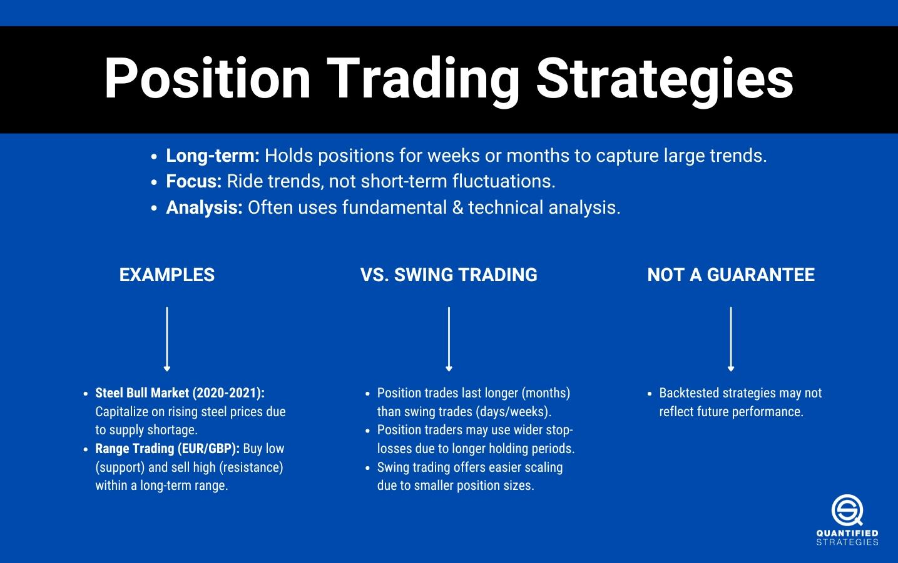

## Table of Contents

## What is position trading and how does it differ from other trading strategies?

Position trading is a type of trading where you hold onto a stock or other investment for a longer time, usually weeks or months. The idea is to make money from big changes in the price of the investment over time. People who do position trading look at the big picture, like the overall health of a company or the economy, to decide when to buy and sell. They are not worried about small, day-to-day price changes.

Position trading is different from other trading strategies like day trading and swing trading. Day traders buy and sell within the same day, trying to make quick profits from small price movements. They watch the market closely all day. Swing traders hold their investments for a few days to a couple of weeks, aiming to catch short-term trends. Unlike position traders, both day traders and swing traders focus more on short-term price movements and need to be more active in watching the market. Position trading is more about patience and less about quick action.

## What are the key principles of a position trading strategy?

The key principles of a position trading strategy start with understanding the bigger picture. Position traders focus on long-term trends and the overall health of a company or the economy. They look at things like a company's earnings, industry trends, and economic reports to make their decisions. They are not bothered by small daily price changes because they believe that over time, the price will move in the direction of the big trends they have identified.

Another important principle is patience. Position traders hold onto their investments for weeks or even months, waiting for the right moment to buy or sell. They do not get easily swayed by short-term market movements or news. Instead, they stick to their long-term plan and only make changes when their analysis of the big picture changes. This means they need to be comfortable with holding onto an investment even if it goes through ups and downs in the short term.

Lastly, risk management is crucial. Position traders need to set clear rules for when to cut their losses or take profits. They might use stop-loss orders to limit how much they can lose if the market moves against them. They also need to decide in advance how much they are willing to invest in any single trade. By managing their risk carefully, position traders can protect their money and stay in the game for the long haul.

## How do position traders identify potential entry and exit points?

Position traders look for entry points by studying the big picture. They pay attention to long-term trends, like how a company is doing over time or what's happening in the economy. They might use charts that show price movements over months or years to spot trends. If they see that a stock's price is starting to go up and they think it will keep going up, that could be a good time to buy. They also look at things like a company's earnings reports or news about the industry to help them decide.

For [exit](/wiki/exit-strategy) points, position traders also think about the long-term picture. They set goals for how much they want to make from a trade and decide ahead of time when they will sell. If the price of their investment reaches the goal they set, they might sell to take their profit. If the price starts to go down a lot and they think the trend is changing, they might sell to cut their losses. They might use a stop-loss order, which is like an automatic sell order if the price drops to a certain level, to help them manage their risk.

Position traders need to be patient and stick to their plan. They don't get too excited about short-term price changes. Instead, they focus on whether the big trends they are following are still going in the direction they expected. If the big picture changes, that's when they might decide it's time to get out of a trade.

## What types of financial instruments are best suited for position trading?

Position trading works well with stocks because they can have big trends that last for a long time. Traders look at a company's earnings, news, and the overall economy to decide when to buy and sell. Stocks can go up or down over months or years, which fits with the long-term approach of position trading. A position trader might buy a stock when they think it's going to start a long upward trend and hold onto it for weeks or months.

Another good choice for position trading is exchange-traded funds (ETFs). ETFs are like baskets of stocks or other investments, and they can follow trends in the market or in specific industries. They are often less risky than individual stocks because they are more diversified. Position traders can use ETFs to bet on big trends in the market, like if they think a certain industry or the whole economy is going to do well over time.

Futures and [forex](/wiki/forex-system) markets can also be used for position trading, but they are a bit more complicated. Futures are agreements to buy or sell something at a future date, and forex is about trading different currencies. These markets can have big trends that last for months, which can be good for position trading. But they also have more risk and need more knowledge to trade well. Position traders in these markets need to understand the bigger economic forces that move these prices over time.

## How important is fundamental analysis in position trading?

Fundamental analysis is very important in position trading. This is because position traders hold onto their investments for a long time, often weeks or months. They need to understand the big picture, like how well a company is doing or what's happening in the economy. By looking at things like a company's earnings, industry news, and economic reports, position traders can spot trends that might last a long time. This helps them decide when to buy or sell, based on whether they think the price will keep going up or down over time.

Using [fundamental analysis](/wiki/fundamental-analysis), position traders can make better decisions about which stocks or other investments to buy. For example, if a company's earnings are growing and the industry is doing well, a position trader might decide to buy the stock and hold it for a while. They believe that over time, the stock's price will go up as the company keeps doing well. On the other hand, if they see that a company is struggling or the economy is getting worse, they might decide to sell their investment to avoid losing money. So, fundamental analysis is key to figuring out the long-term trends that position traders rely on.

## What role does technical analysis play in a position trading strategy?

Technical analysis can help position traders, even though they focus more on the long-term trends. It involves looking at charts and patterns to see how prices have moved in the past. Position traders can use technical analysis to find good times to buy or sell. For example, they might see that a stock's price has been going up over time, but it keeps hitting a certain high point and then dropping back down. If the price breaks through that high point, it could be a sign that the stock is about to start a new, bigger upward trend. That might be a good time for a position trader to buy.

Even though position traders hold onto their investments for weeks or months, they can still use technical analysis to set their entry and exit points. They might use things like moving averages to help them see the bigger trend. A moving average is a line on a chart that shows the average price over a certain time. If the price stays above the moving average, it can be a sign that the trend is strong and likely to continue. Position traders can also use technical indicators like the Relative Strength Index (RSI) to see if a stock is overbought or oversold. This can help them decide when to buy or sell, even if they are thinking about the long term.

## How can risk management be effectively implemented in position trading?

Risk management is very important for position traders because they hold onto their investments for a long time. One way to manage risk is by using stop-loss orders. A stop-loss order is like an automatic sell order that kicks in if the price of an investment drops to a certain level. This helps position traders limit how much they can lose if the market moves against them. They can set the stop-loss level based on their analysis of the long-term trend, so they don't get caught in big drops.

Another way to manage risk is by deciding how much money to put into each trade. Position traders should not put all their money into one investment. Instead, they should spread their money out over different investments. This way, if one investment goes down a lot, they won't lose everything. They can also set clear goals for how much they want to make from a trade and when they will sell to take their profit. By sticking to these rules, position traders can protect their money and stay in the game for the long haul.

## What are the common challenges faced by position traders and how can they be overcome?

Position traders often face challenges because they hold onto their investments for a long time. One big challenge is dealing with big price drops while they wait for their long-term trend to play out. It can be hard to stay calm and stick to their plan when the price goes down a lot. To overcome this, position traders need to use good risk management. They can use stop-loss orders to limit their losses and make sure they don't put all their money into one investment. By spreading their money out, they can handle big price drops better.

Another challenge is figuring out when to buy and sell. Since position traders focus on long-term trends, they need to be good at understanding the big picture. They have to look at things like a company's earnings, news about the industry, and the overall economy. To overcome this, they can use both fundamental and technical analysis. Fundamental analysis helps them see the long-term health of a company or the economy, while technical analysis can help them find good entry and exit points. By combining these two types of analysis, position traders can make better decisions about when to buy and sell.

## Can position trading be combined with other trading strategies, and if so, how?

Position trading can be combined with other trading strategies like swing trading and [day trading](/wiki/day-trading-spy). For example, a trader might use position trading to hold onto an investment for the long term, but also use swing trading to catch shorter trends within that long-term trend. They could buy a stock because they think it will go up over the next few months, but also sell some of it after a few days or weeks if the price goes up a lot in the short term. This way, they can make money from both the long-term trend and the shorter swings in price.

Another way to combine position trading with other strategies is by using day trading to manage risk. A position trader might hold onto a stock for a long time, but use day trading to buy and sell smaller amounts of the same stock within the same day. If the price starts to drop a lot, they can sell some of their shares quickly to limit their losses. This helps them stick to their long-term plan while also protecting their money from big short-term drops. By combining different trading strategies, traders can make the most of their investments and handle the ups and downs of the market better.

## How does one develop a personalized position trading strategy?

To develop a personalized position trading strategy, you first need to understand what you want to achieve. Think about your financial goals and how much risk you are comfortable with. Are you looking to grow your money over time, or are you okay with taking bigger risks for the chance of bigger rewards? Once you know your goals and risk level, you can start to look at the big picture. This means studying long-term trends in the market, like how well companies are doing, what's happening in different industries, and how the economy is doing. Use fundamental analysis to understand these trends and decide which investments might do well over time.

Next, you need to figure out how you will enter and exit your trades. Look at charts and use technical analysis to find good times to buy and sell. You might see that a stock's price is starting to go up and think it will keep going up for a while, so that could be a good time to buy. Decide ahead of time where you will sell to take your profit or cut your losses. Using stop-loss orders can help you manage your risk by automatically selling if the price drops too much. Also, think about how much money you will put into each trade. Don't put all your money into one investment; spread it out to lower your risk. By combining your understanding of the big picture with clear rules for entering and exiting trades, you can create a personalized position trading strategy that works for you.

## What are some advanced techniques used by expert position traders?

Expert position traders often use advanced techniques to make their strategies better. One technique is called sector rotation. This means they look at which parts of the economy, like technology or healthcare, are doing well at different times. They move their money from one sector to another to catch the big trends. Another technique is using options to protect their investments. Options are like insurance for their stocks. They can buy options that let them sell their stocks at a certain price if the market goes down a lot. This way, they can still make money from the long-term trend but not lose too much if the price drops suddenly.

Another advanced technique is called [pair trading](/wiki/pair-trading). This is when expert position traders buy one stock and sell another stock at the same time. They do this because they think one stock will do better than the other over time. This can help them make money even if the whole market is going down. They also use something called [backtesting](/wiki/backtesting). This means they look at how their strategy would have worked in the past. By doing this, they can see if their ideas are good and make changes to their strategy before they use it for real. These advanced techniques help expert position traders make better decisions and manage their risk more carefully.

## How does one evaluate the performance of a position trading strategy over time?

To evaluate the performance of a position trading strategy over time, you need to look at how well it makes money and how much risk it takes. One way to do this is by checking the returns. Returns are how much money you make from your trades. You can compare the returns of your strategy to what you could have made if you just put your money in a savings account or in a broad market index like the S&P 500. If your strategy is making more money than these other options, it's doing well. Another thing to look at is how much your returns go up and down. This is called [volatility](/wiki/volatility-trading-strategies). If your returns are all over the place, your strategy might be too risky. You want a strategy that gives you good returns without too much risk.

Another way to evaluate your strategy is by looking at how often you make money and how often you lose money. This is called the win rate and the loss rate. A good position trading strategy should have more wins than losses over time. You also need to look at how much you make when you win and how much you lose when you lose. If you make a lot more when you win than you lose when you lose, that's a good sign. It's also important to check if your strategy still works as the market changes. You can do this by backtesting, which means looking at how your strategy would have done in the past. If it worked well in the past, it might keep working well in the future. By looking at all these things, you can see if your position trading strategy is doing a good job over time.

## What are the common pitfalls and mistakes?

One potential mistake in position trading is the failure to adequately account for transaction costs and slippage. These costs can significantly erode profits over time, particularly in markets with high volatility or low [liquidity](/wiki/liquidity-risk-premium). Transaction costs include brokerage fees, taxes, and any other costs incurred when initiating or closing a trade. Slippage occurs when there is a difference between the expected price of a trade and the actual price at which the trade is executed. To mitigate these issues, it's essential to choose a brokerage with competitive pricing and ensure that trading algorithms are optimized to process information quickly and execute trades efficiently.

Another common pitfall is overfitting strategies to historical data during backtesting. Overfitting occurs when a model is excessively complex and learns not only the underlying market phenomena but also the noise within the dataset. This can lead to strategies that appear to perform well on historical data but fail in live trading environments. To avoid overfitting, traders should use techniques such as cross-validation and incorporate out-of-sample testing in their strategy development process. Regularization techniques like L1 (Lasso) or L2 (Ridge) can also be applied to maintain simplicity in the models.

Managing position sizes appropriately is crucial to controlling risk effectively. Using overly large positions can lead to significant drawdowns, especially during adverse market conditions. It is advisable to employ a risk management framework to determine optimal position sizes. For instance, the Kelly Criterion can be used to calculate the proportion of capital to allocate to a given position:

$$
f^* = \frac{bp - q}{b}
$$

Here, $f^*$ is the fraction of the capital to be wagered, $b$ is the odds received on the wager, $p$ is the probability of winning, and $q$ is the probability of losing, calculated as $1 - p$. While the Kelly Criterion offers a theoretical framework for optimizing bet sizes, traders often use fractional Kelly strategies to mitigate risk further.

By being mindful of these common mistakes and implementing robust risk management and testing protocols, traders can enhance the effectiveness of their position trading strategies.

## References & Further Reading

[1]: ["Advances in Financial Machine Learning"](https://www.amazon.com/Advances-Financial-Machine-Learning-Marcos/dp/1119482089) by Marcos Lopez de Prado

[2]: ["Evidence-Based Technical Analysis: Applying the Scientific Method and Statistical Inference to Trading Signals"](https://www.amazon.com/Evidence-Based-Technical-Analysis-Scientific-Statistical/dp/0470008741) by David Aronson

[3]: ["Machine Learning for Algorithmic Trading"](https://github.com/stefan-jansen/machine-learning-for-trading) by Stefan Jansen

[4]: ["Quantitative Trading: How to Build Your Own Algorithmic Trading Business"](https://books.google.com/books/about/Quantitative_Trading.html?id=j70yEAAAQBAJ) by Ernest P. Chan

[5]: Bergstra, J., Bardenet, R., Bengio, Y., & Kégl, B. (2011). ["Algorithms for Hyper-Parameter Optimization."](https://dl.acm.org/doi/10.5555/2986459.2986743) Advances in Neural Information Processing Systems 24.