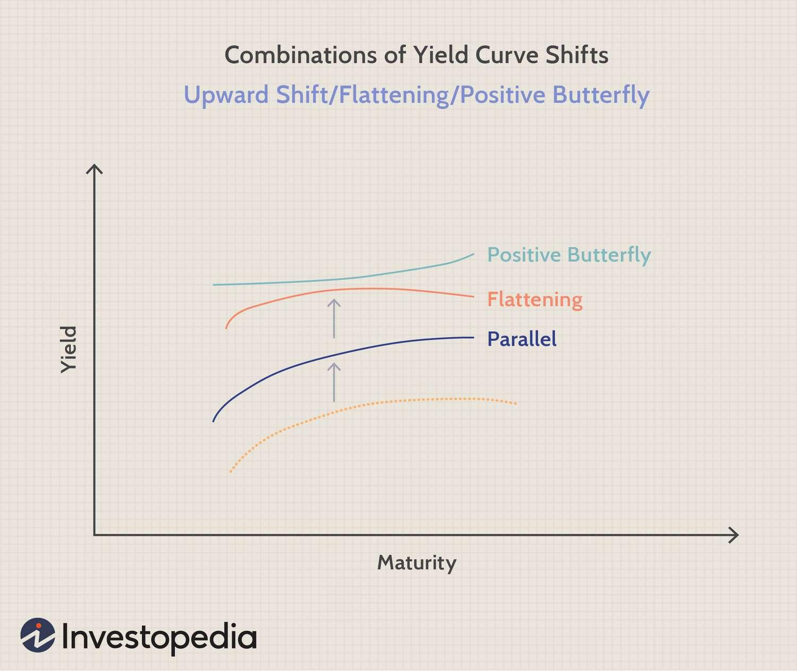

Fixed income trading is a crucial component of the financial markets, offering investors a steady income stream through investments like bonds, treasury bills, and other debt instruments. These securities are typically characterized by a fixed interest payment until maturity, making them attractive for risk-averse investors seeking stable returns and portfolio diversification. Fixed income trading plays a significant role in the financial ecosystem by providing liquidity and aiding in price discovery for debt instruments.

Within fixed income trading, strategies revolve around interest rates and yield curves—graphs depicting the yields on bonds over differing maturity periods. The shape of the yield curve can indicate economic conditions, with traditional shapes being normal, inverted, or flat. Trading strategies often seek to exploit changes in yield curve shapes to generate returns.



A positive butterfly trading strategy is one such tactic employed in fixed income trading. It involves analyzing the convexity in the yield curve, where short and long maturities move in opposite directions to the intermediate maturities. Essentially, it capitalizes on the yield curve's curvature changes, typically characterized by short and long-term rates rising more than intermediate ones, thus creating a 'smile' in the curve's shape. When interest rates are expected to undergo certain shifts due to macroeconomic factors or monetary policy changes, traders may deploy a positive butterfly strategy to optimize their bond portfolios.

The evolution of algorithmic trading has significantly impacted the implementation of fixed income strategies, including the positive butterfly strategy. Algorithmic trading uses complex algorithms and computers to execute trades at high speed and volume, analyzing vast datasets for decision-making. Algorithms can efficiently identify yield curve anomalies, manage risk, and execute trades precisely, improving the timing and potential profitability of strategies like the positive butterfly. This automation aids traders in navigating the complexities of the fixed income market, making algorithms indispensable for modern trading practices.

## Table of Contents

## Understanding Fixed Income Trading

Fixed income trading involves the buying and selling of fixed income securities, which are financial instruments that provide returns in the form of regular interest payments and the repayment of principal at maturity. The primary types of fixed income securities include government bonds, corporate bonds, and municipal bonds. These securities play a crucial role in investment portfolios by offering diversification, reducing risk, and providing a steady income stream, especially for risk-averse investors such as retirees or institutional investors seeking stability.

Fixed income trading differs from trading in stocks or commodities in several key ways. While stocks represent equity ownership in a company and can offer higher returns in exchange for higher risk, fixed income securities provide a predictable income stream through interest payments and the eventual return of the invested capital. Commodities trading, on the other hand, involves buying and selling raw materials and primary agricultural products, which can be volatile and subject to factors like weather, geopolitical tensions, and supply and demand shifts.

One of the central concepts in fixed income trading is the yield curve, which represents the relationship between interest rates and the maturities of debt securities. The yield curve is a powerful tool for traders and investors because it helps in understanding the market's expectations for future [interest rate](/wiki/interest-rate-trading-strategies) changes and economic activity. A normal upward-sloping yield curve indicates that longer-term securities have higher yields than short-term ones, reflecting the increased risks associated with time. Conversely, an inverted yield curve, where short-term interest rates are higher than long-term ones, can be a predictor of economic recession.

Interest rates are a fundamental component of fixed income trading, influencing the pricing, yield, and value of bonds. When interest rates rise, existing bonds with lower interest payments become less attractive, decreasing their market value. Conversely, when interest rates fall, bonds with higher fixed rates become more valuable. This inverse relationship between interest rates and bond prices is essential for traders to grasp in order to navigate the fixed income market effectively.

Moreover, understanding the dynamics of interest rates and yield curves is vital for executing strategies that capitalize on expected moves in these parameters. For instance, traders might engage in strategies based on anticipated changes in interest rate policy by central banks or potential shifts in economic growth forecasts. By analyzing the yield curve and interest rate trends, investors can make informed decisions about the duration and risk profile of their fixed income portfolios.

## What is a Positive Butterfly Strategy?

A positive butterfly strategy is a specific approach within yield curve analysis, focusing on the movements and shape changes of the yield curve itself. To understand this strategy, it is crucial to first comprehend the concept of the yield curve, which plots the interest rates of bonds having equal credit quality but differing maturity dates. 

In the context of yield curve movements, a positive butterfly occurs when the short-term and long-term yields shift upwards more than the medium-term yields, causing the wings of the curve (short-term and long-term) to rise relative to the belly (mid-term). This transformation implies that short and long maturity interest rates have increased at a faster rate compared to intermediate maturities. Mathematically, the transformation can be perceived as an increase in concavity of the curve.

To contrast, a negative butterfly involves the opposite mechanism. In a negative butterfly scenario, the short-term and long-term yields decrease relative to the medium-term yields. Thus, the mid-term rates rise more sharply than both the short and long-term rates, which results in a swifter increase in the yield curve’s convexity.

The formation of a positive butterfly is often linked to specific market conditions. Typically, this occurs in environments where there is heightened anticipation of economic expansion leading to stronger inflationary pressures. As investors foresee higher inflation, they expect central banks to increase interest rates, making long and short-term yields rise more sharply in response to anticipated monetary policy adjustments. The positive butterfly scenario suggests that the market’s expectation for monetary tightening might be more pronounced in the near and far ends of the yield spectrum. Understanding these dynamics is crucial for traders looking to harness such strategies for optimizing bond portfolios.

## Implementing Positive Butterfly Strategies in Algo Trading

Algorithmic trading plays a pivotal role in the execution and optimization of yield curve strategies, such as a positive butterfly strategy, within the fixed income market. Utilizing sophisticated algorithms allows traders to identify subtle patterns in yield curve movements and execute trades with increased precision and speed.

A positive butterfly strategy focuses on exploiting specific changes in the yield curve's shape, particularly when the short and long-term yields change more than the medium-term yields, creating a convex pattern. In [algorithmic trading](/wiki/algorithmic-trading), this strategy involves detecting such yield curve deformations promptly and executing trades that capitalize on identified opportunities.

Key Tools and Techniques:

1. **Data Analysis and Machine Learning**: Algorithmic trading systems employ data analysis techniques and machine learning models to predict yield curve shifts. Techniques such as regression analysis, Principal Component Analysis (PCA), and clustering can help identify patterns indicative of a forthcoming positive butterfly formation. Machine learning models are trained on historical data to enhance the accuracy of these predictions.

   ```python
   from sklearn.decomposition import PCA
   import numpy as np

   # Sample data representing yield curve changes
   yield_data = np.array([...])

   # Applying PCA to identify principal components
   pca = PCA(n_components=3)
   principal_components = pca.fit_transform(yield_data)
   ```

2. **Algorithmic Strategy Implementation**: Once potential positive butterfly formations are identified, algorithms can be programmed to execute trades automatically. These algorithms often include rules for entering and exiting trades, position sizing, and risk management to optimize the strategy's performance.

3. **Automation and Execution**: High-frequency trading (HFT) systems execute trades in milliseconds, ensuring that market opportunities discovered through the positive butterfly strategy are capitalized upon before they are eroded by market self-correction. Such automation reduces human error and improves execution efficiency.

Benefits and Challenges:

The primary advantage of employing algorithmic trading for fixed income strategies like the positive butterfly is the ability to process vast amounts of data rapidly and objectively. This objective analysis, coupled with swift execution, enables traders to maintain a competitive edge in the market by responding faster to favorable conditions.

Nevertheless, challenges do exist. Successfully implementing a positive butterfly strategy using algorithms requires robust infrastructure, as real-time data processing and execution demand significant computational resources. Moreover, the models must be regularly updated to reflect changing market conditions, which requires continuous development and testing.

Algorithms must also contend with potential market risks, such as [liquidity](/wiki/liquidity-risk-premium) issues and slippage, which can diminish strategy effectiveness. Additionally, regulatory compliance is critical, as strict guidelines govern automated trading activities.

In conclusion, leveraging algorithmic trading for positive butterfly strategies in fixed income markets enhances detection and execution capabilities, though it necessitates substantial technological investment and continuous innovation to surmount the associated challenges.

## Advantages and Disadvantages of Positive Butterfly Strategies

Positive butterfly strategies in fixed income trading offer a nuanced approach to managing and optimizing bond portfolios. These strategies, centered around movements in the yield curve, can provide traders with significant opportunities, but they also come with particular risks and challenges.

A positive butterfly strategy is beneficial because it allows traders to capitalize on movements where the short and long ends of the yield curve move together, while the middle remains comparatively stable or rises less dramatically. This configuration typically occurs in environments where interest rates have a non-parallel shift, leading to diverging changes across different bond maturities. By targeting bonds at the wings (short and long maturities), traders can potentially achieve higher returns. If the expectation is accurate, the price movements can enhance the yield of a bond portfolio.

Moreover, a well-timed positive butterfly strategy can increase the convexity of a portfolio, which in turn can improve returns in a steepening yield curve environment. Convexity is a measure of the sensitivity of the duration of a bond to changes in interest rates. Greater convexity can be advantageous in volatile markets as it more accurately reflects the price impact of changing yields.

However, the strategy is not without risks. One significant risk involves misjudging the market conditions that lead to a positive butterfly formation. Yield curve movements can be volatile and unpredictable, and any miscalculation can result in substantial losses. Additionally, the costs associated with implementing these trades, including transaction costs and the potential impact of liquidity, can erode the strategy's effectiveness.

Traders must also consider that positive butterfly strategies may not perform well in flattening yield curve environments, where the middle and ends of the curve could move more in tandem, reducing the relative advantage. The reliance on specific market conditions limits the flexibility of this strategy compared to others, such as [carry](/wiki/carry-trading) trade or duration management, which may provide more consistent results across varying interest rate environments.

For comparison, carry trades involve exploiting the differential in interest yields between two bonds, while duration management revolves around adjusting the sensitivity of a bond portfolio to interest rate changes. These strategies are generally more straightforward and may offer more consistent outcomes, albeit potentially with lower overall returns compared to a successfully executed positive butterfly strategy.

In summary, positive butterfly strategies can be a potent tool for fixed income traders, offering the potential for higher yields and improved portfolio convexity under suitable conditions. However, these benefits come with significant risks and require precise market timing and analysis. As such, traders must weigh these factors carefully against other strategies and tailor their approach to the specific dynamics of the market.

## Case Studies and Real-World Applications

Fixed income trading strategies, particularly the positive butterfly strategy, have been employed in various scenarios to optimize bond portfolios and manage interest rate risks. Historical cases illustrate the effectiveness of this approach in navigating complex yield curve dynamics.

### Historical Implementations

A prime example of successful positive butterfly strategy implementation occurred during periods of economic recovery when the yield curve steepened at the short end while flattening at the long end. A notable instance was observed in 2009, following the global financial crisis, where traders anticipated an economic recovery would eventually lead to increased short-term interest rates, while long-term rates remained stable due to continued quantitative easing. In this context, traders structured positions that would benefit from the anticipated changes in the yield curve, effectively applying a positive butterfly strategy.

In another case, the positive butterfly strategy was beneficial during the sovereign debt crisis in Europe. As investors sought safety in long-duration bonds, the long end of the yield curve steepened, while medium-term interest rates remained relatively flat. Portfolio managers capitalized on these movements by adjusting their bond portfolios to benefit from the convexity effects inherent in the developing yield curve shape.

### Institutional Utilization

Institutional investors, such as pension funds and insurance companies, often employ positive butterfly strategies to manage the interest rate risk of their liability-driven investments. These entities typically have long-duration liabilities and thus can gain from yield curve movements by adjusting the duration and convexity of their asset portfolios. By using positive butterfly strategies, these institutions can potentially enhance returns or hedge against unfavorable yield curve shifts without significantly altering the overall risk profile.

### Lessons Learned

Several insights have been gleaned from past implementations of positive butterfly strategies:

1. **Sensitivity to Macroeconomic Indicators**: Successful use of this strategy requires a keen understanding of macroeconomic indicators and monetary policy directions, as these factors critically influence yield curve movements.

2. **Leverage on Technology**: The adoption of algorithmic trading techniques has enhanced the ability to quickly react to market dynamics and identify potential yield curve opportunities. Algorithms can process large datasets and run simulations to predict the optimal times to employ the positive butterfly strategy.

3. **Risk Management**: Although this strategy can potentially optimize returns, it requires vigilant risk management practices. Traders must account for potential shifts in the economic climate and adjust their strategies accordingly.

4. **Diversification**: Implementing positive butterfly strategies within a diversified portfolio can reduce idiosyncratic risks associated with specific bond sectors or issuers. It allows for exploiting yield curve opportunities while maintaining overall portfolio stability.

By examining these implementations and lessons, traders and institutional investors can better understand the intricacies of positive butterfly strategies and apply them effectively in current trading practices. This approach not only optimizes returns but also offers a robust mechanism to navigate changing financial landscapes.

## Conclusion

In summary, fixed income trading plays a crucial role in financial markets, with strategies like the positive butterfly offering distinctive advantages. This strategy, focusing on yield curve movements, allows traders to optimize bond portfolios by capitalizing on specific changes in interest rates. One of the key insights discussed is how algorithmic trading enhances the implementation of such strategies, utilizing advanced analytical tools to efficiently navigate complex market conditions.

Positive butterfly strategies are effective in specific market conditions, providing opportunities for portfolio optimization. However, they also come with inherent risks that require careful consideration. Algorithmic trading presents both benefits and challenges, offering precision and speed while necessitating robust models to manage risk and complexity.

Looking to the future, it is evident the integration of algorithmic approaches in fixed income trading will continue to grow. These algorithms hold the potential to refine strategies and better predict yield curve shifts, making them indispensable tools for modern trading environments. Traders and institutional investors should consider adopting these advanced techniques to stay competitive and responsive to evolving market dynamics. Adopting algorithmic methods will not only enhance the execution of positive butterfly strategies but will also pave the way for greater innovation and efficiency in fixed income trading.

## References & Further Reading

[1]: ["Fixed Income Securities: Tools for Today's Markets"](https://www.amazon.com/Fixed-Income-Securities-Markets-Finance/dp/1119835550) by Bruce Tuckman and Angel Serrat 

[2]: "Understanding the Yield Curve: What It Is and How It Works", Investopedia. (https://www.investopedia.com/terms/y/yieldcurve.asp)

[3]: ["Advanced Fixed Income Analytics"](https://www.amazon.com/Advanced-Fixed-Income-Analytics-Wesley/dp/1883249341) by Jessica James, Jonathan Golub, and Lukas Polwito. 

[4]: ["Algorithmic Trading: Winning Strategies and Their Rationale"](https://www.amazon.com/Algorithmic-Trading-Winning-Strategies-Rationale-ebook/dp/B00CY5HC0U) by Ernest P. Chan

[5]: ["Interest Rate Markets: A Practical Approach to Fixed Income Markets and Analysis"](https://www.amazon.com/Interest-Rate-Markets-Practical-Approach/dp/0470932201) by Siddhartha Jha