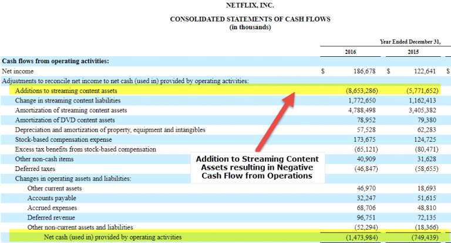

In today's fast-paced financial markets, understanding the complexities of financial analysis is essential for both investors and traders seeking success. Central to this analysis are cash flow and net income, two key financial metrics that offer vital insights into a company's financial health. Cash flow measures the net amount of cash and cash equivalents moving into and out of a company over a specific period, highlighting its liquidity position. In contrast, net income represents the profit remaining after all expenses, including taxes and interest, have been subtracted from total revenue, illustrating the company's profitability.

Leveraging these metrics, algorithmic trading employs computer algorithms to execute trades based on predefined rules and financial indicators. By incorporating cash flow and net income data into these algorithms, traders can optimize their trading strategies and improve decision-making processes. The integration of these financial metrics into algorithmic trading enhances the ability to predict trends and assess risks, providing a sophisticated approach to navigating the financial markets.



This article explores the relationship between cash flow, net income, and their incorporation into algorithmic trading strategies. By examining these relationships, it aims to provide a comprehensive understanding of how financial analysis metrics can be utilized to enhance trading strategy effectiveness and inform investment decisions.

## Table of Contents

## Understanding Cash Flow and Net Income

Cash flow and net income are fundamental metrics in financial analysis, each offering distinct insights into a company's financial performance. Cash flow refers to the net amount of cash and cash equivalents flowing in and out of a company over a specific period. It is critical for assessing a company's liquidity, as it indicates the firm's ability to generate cash to meet its obligations, such as paying suppliers, servicing debt, and investing in new ventures. The cash flow of a company is generally categorized into three activities: operating, investing, and financing. 

1. **Operating activities** encompass the cash generated through the company's primary business operations, such as the sale of goods and services. Analyzing operating cash flow provides insights into whether the company has enough cash inflow from its core operations.

2. **Investing activities** involve cash invested in business growth, including purchases of long-term assets like property and equipment, as well as merger and acquisition activity.

3. **Financing activities** include transactions related to the company's equity and debt, such as issuing new shares or paying dividends.

Net income, on the other hand, represents the profit remaining after all operating expenses, taxes, and interest have been deducted from total revenue. It is a key indicator of a company's profitability. Mathematically, net income can be represented as:

$$
\text{Net Income} = \text{Total Revenue} - (\text{Operating Expenses} + \text{Taxes} + \text{Interest})
$$

While net income provides a snapshot of how well a company is performing in terms of profit generation, it does not offer information about the cash generated from its operations. Therefore, it is possible for a company to report high net income but still face [liquidity](/wiki/liquidity-risk-premium) issues if it lacks sufficient cash flow. 

Both cash flow and net income are crucial for evaluating a company's financial health, each addressing different aspects of a company's performance. Cash flow analysis ensures that a company can sustain its operations and meet short-term obligations, while net income analysis helps assess the overall profitability. An integrated analysis of both metrics can offer a comprehensive understanding of a company's capacity to generate wealth and maintain financial stability.

## Interpreting Financial Statements

The cash flow statement and the income statement are two fundamental components of financial statements, each providing distinct yet complementary insights into a company's financial health. Understanding these statements enables stakeholders to evaluate a company's performance and financial position accurately.

The cash flow statement categorizes cash transactions under three main activities: operating, investing, and financing. Operating activities encompass the primary revenue-generating activities of the company and other activities that are not investing or financing activities, such as receipts from sales and payments to suppliers and employees. For example, the cash generated from sales falls under operating activities, while money spent on inventory purchases also reflects here. Investing activities represent cash flows related to the acquisition or disposal of long-term assets, including property, equipment, and securities. For example, purchasing new machinery would be considered an investing outflow, whereas selling a piece of machinery would be an investing inflow. Financing activities involve cash flows from transactions with the company's owners or debtors, such as issuing stocks or repaying loans. For instance, acquiring a loan is a financing inflow, whereas repaying a portion of long-term debt is a financing outflow.

The income statement, alternatively referred to as the profit and loss statement, outlines a company's financial performance over a specific period, detailing revenue, expenses, and net income. It provides insights into how effectively management is utilizing company resources to generate profit. Revenue, often referred to as the top line, includes all income from normal business operations, whereas expenses cover all costs incurred in [earning](/wiki/earning-announcement) the revenue, including cost of goods sold, operating expenses, interest, and taxes. Net income, or net profit, represents the bottom line, calculated as total revenue minus total expenses. This figure indicates the profitability of a company and is crucial for assessing financial performance.

By analyzing both the cash flow statement and the income statement, investors and analysts gain a comprehensive understanding of a company's financial standing. The cash flow statement reveals the liquidity and cash management of a business, while the income statement offers a broader view of profitability over time. Combined, these statements enable a thorough evaluation of a company's ability to generate cash, sustain operations, and fund future growth. This holistic assessment is essential for making informed investment and business decisions.

## Real-World Impact of Cash Flow and Net Income

Positive cash flow is a significant indicator for companies as it provides the financial flexibility needed to invest in growth opportunities, distribute dividends to shareholders, and reduce existing liabilities. It reflects a company's ability to maintain and increase its cash reserves, which is crucial for sustaining operations and funding expansion initiatives. On the other hand, relying solely on cash flow figures without considering net income can present an incomplete picture of a company's financial health.

A notable distinction between cash flow and profitability is highlighted in scenarios where a company reports positive cash flow alongside negative net income. This divergence often arises due to the nature of cash flow, which encompasses various cash movements that are not directly linked to generating profit. For example, cash flow from financing activities, such as debt issuance, can enhance a company's cash position without necessarily impacting profitability.

A practical case illustrating this scenario is JC Penney. Despite experiencing financial struggles, JC Penney managed to report positive cash flow through strategic borrowings. This inflow of cash allowed the company to preserve short-term liquidity and meet operational needs, even though its net income remained negative, indicating that the company was not profitable from its core business operations. The cash flow here primarily came from financing activities, emphasizing that positive cash flow does not inherently signal a profitable business.

In analyzing the real-world implications of cash flow and net income, it is essential for investors and financial analysts to consider both metrics. While positive cash flow can support immediate financial obligations, assessing net income provides insights into the long-term sustainability of profitability. Only by examining both aspects can stakeholders gain a thorough understanding of a company's financial viability and strategic positioning.

## Algorithmic Trading and Financial Analysis

Algorithmic trading, a cornerstone of modern financial markets, utilizes computer algorithms to automate the process of trading. These algorithms execute trades based on a series of predefined rules that evaluate current market data and relevant financial metrics. Among the metrics that play a crucial role in refining [algorithmic trading](/wiki/algorithmic-trading) strategies are cash flow and net income, which provide insights into a company's financial health.

Integrating cash flow and net income into trading algorithms can enhance decision-making by offering a more comprehensive assessment of a company's financial position. Cash flow measurements provide information on the liquidity and operational efficiency of a company, indicating its ability to generate cash over a period. This information is essential for determining the sustainability of business operations, which is particularly valuable for traders seeking to assess short-term financial health and liquidity risk.

Net income, representing a company's profit after all expenses, taxes, and interest, offers a different perspective by highlighting profitability. This metric is crucial for evaluating long-term financial viability and growth potential. By incorporating net income into trading algorithms, traders can adjust their strategies based on a company's profitability forecasts, improving risk assessment and optimizing returns.

Financial health indicators obtained from cash flow and net income analysis enable algorithms to predict market trends and inform strategy development. For example, an algorithm might prioritize trades involving companies with strong and consistent positive cash flows, suggesting robust financial management and potential for growth. Conversely, it might avoid or short stocks where net income is consistently declining, indicating underlying financial weaknesses.

The integration of these financial metrics into algorithmic frameworks can be illustrated with a simple Python example:

```python
def evaluate_financial_health(cash_flow, net_income):
    if cash_flow > 0 and net_income > 0:
        return "Strong"
    elif cash_flow > 0 and net_income <= 0:
        return "Watch Liquidity"
    elif cash_flow <= 0 and net_income > 0:
        return "Check Cash Sustenance"
    else:
        return "High Risk"

# Example usage
company_financials = {'cash_flow': 500000, 'net_income': 200000}
financial_health = evaluate_financial_health(
                    company_financials['cash_flow'], 
                    company_financials['net_income']
                 )
print(financial_health)  # Output: Strong
```

Advanced algorithms can process much larger datasets, incorporating historical and real-time financial data to continuously refine trading strategies. Machine learning techniques enable these algorithms to adapt to new data patterns, potentially offering enhanced predictive accuracy. By using cash flow and net income data, algorithmic trading systems can anticipate shifts in financial health and adjust their strategies accordingly, striving for optimal timing and investment outcomes.

## Limitations and Challenges

While cash flow statements provide valuable insights into a company's financial operations, they should be used in conjunction with other financial analyses to obtain a more comprehensive understanding of a company's financial health. Relying solely on cash flow statements may lead to incomplete evaluations because they do not account for non-cash items that can significantly impact a company's financial situation. Therefore, combining cash flow analysis with balance sheets and income statements helps create a fuller picture of liquidity, solvency, and profitability.

In the context of algorithmic trading, the integration of financial metrics such as cash flow and net income presents challenges, with data consistency and accuracy at the forefront. Algorithmic models rely heavily on historical and real-time data to predict market movements. In this domain, the accuracy of financial data becomes paramount. Discrepancies or delays in data can result in suboptimal decisions and trading losses. Moreover, financial data is often reported quarterly, which may lag behind the pace at which market conditions change, posing a challenge in making time-sensitive investment decisions.

Algorithmic trading systems also encounter difficulties in predicting market movements solely based on financial metrics. Financial markets are influenced by numerous factors beyond a company’s financial health, including geopolitical events, economic indicators, and investor sentiment. Consequently, algorithms must be sophisticated enough to integrate and analyze multiple data points beyond cash flow and net income to enhance predictive accuracy.

To mitigate these challenges, investors should exercise caution and continuously refine their trading algorithms. This involves incorporating [machine learning](/wiki/machine-learning) and [artificial intelligence](/wiki/ai-artificial-intelligence) techniques to improve the models' ability to learn from new data and adjust strategies accordingly. For instance, adapting algorithms to include real-time sentiment analysis from social media or news feeds can provide additional layers of market insights. 

Moreover, algorithmic trading models should be back-tested rigorously with historical data to evaluate performance under different market conditions. Python provides libraries such as `pandas` and `NumPy`, which are useful for data manipulation and analysis. Here is a simple example of back-testing an algorithm based on historical cash flow data:

```python
import pandas as pd

# Load historical financial data
data = pd.read_csv('financial_data.csv')

# Define a simple strategy based on cash flow trends
def trading_strategy(row):
    if row['Cash Flow'] > row['Previous Cash Flow']:
        return 'Buy'
    elif row['Cash Flow'] < row['Previous Cash Flow']:
        return 'Sell'
    else:
        return 'Hold'

# Apply the strategy
data['Signal'] = data.apply(trading_strategy, axis=1)

# Analyze the results
results = data['Signal'].value_counts()
print(results)
```

This approach allows investors to identify patterns and refine their strategies in alignment with market dynamics. Continuous innovation and the use of advanced statistical modeling can enhance the robustness of algorithmic trading systems, ensuring they are better equipped to navigate the unpredictable nature of financial markets.

## Conclusion

Effectively analyzing cash flow and net income is critical for understanding a company's financial health. Cash flow provides insight into the liquidity and operational health of a company, showcasing its ability to generate cash to fund operations, invest in future growth, and meet financial obligations. Meanwhile, net income highlights profitability, indicating the success of a company in reducing its costs relative to its revenues. By examining these two metrics, investors and analysts gain a comprehensive picture of a company's strength and potential weaknesses, allowing for well-informed financial decisions.

When integrated into algorithmic trading, cash flow and net income can significantly enhance strategy effectiveness and investment decision-making. Algorithmic trading systems utilize financial indicators such as cash flow ratios and profit margins to predict future price movements and identify lucrative trading opportunities. By incorporating real-time financial data, these algorithms can optimize entry and [exit](/wiki/exit-strategy) points, balance trade-offs between risk and reward, and adjust dynamically to market conditions. For instance, a trading strategy could incorporate conditions such as $\text{if cash flow} > \text{debt repayments}$ to filter financially stable companies and avoid those at risk of liquidity issues.

Continued innovation and refinement in financial analysis tools will further empower traders and investors in navigating market complexities. As technology evolves and more sophisticated analytical methods are developed, the integration of machine learning and artificial intelligence will likely play a larger role in processing vast amounts of financial data. This will enable the development of predictive models that can discern patterns and trends with greater accuracy, thus facilitating more reliable decision-making. Ultimately, the combination of robust financial analysis and cutting-edge technology will provide traders and investors with the tools necessary to adapt to the dynamic nature of financial markets and achieve competitive advantages.

## References & Further Reading

[1]: Berk, J., & DeMarzo, P. (2020). ["Corporate Finance"](https://www.pearsonhighered.com/assets/preface/0/1/3/5/0135183804.pdf) (5th Edition). Pearson.

[2]: ["Financial Statement Analysis"](https://www.investopedia.com/terms/f/financial-statement-analysis.asp) by Stephen H. Penman

[3]: ["Principles of Corporate Finance"](https://en.wikipedia.org/wiki/Principles_of_Corporate_Finance) by Richard A. Brealey, Stewart C. Myers, and Franklin Allen

[4]: De Prado, M. L. (2018). ["Advances in Financial Machine Learning"](https://www.amazon.com/Advances-Financial-Machine-Learning-Marcos/dp/1119482089). Wiley.

[5]: Chan, E. P. (2009). ["Quantitative Trading: How to Build Your Own Algorithmic Trading Business"](https://github.com/ftvision/quant_trading_echan_book). Wiley.

[6]: Jansen, S. (2018). ["Machine Learning for Algorithmic Trading"](https://github.com/stefan-jansen/machine-learning-for-trading). Packt Publishing.

[7]: Aronson, D. R. (2006). ["Evidence-Based Technical Analysis: Applying the Scientific Method and Statistical Inference to Trading Signals"](https://www.amazon.com/Evidence-Based-Technical-Analysis-Scientific-Statistical/dp/0470008741). Wiley.

[8]: ["Algorithmic Trading and DMA: An introduction to direct access trading strategies"](https://archive.org/details/algorithmictradi0000john) by Barry Johnson

[9]: Chincarini, L. B., & Kim, D. (2006). ["Quantitative Equity Portfolio Management: An Active Approach to Portfolio Construction and Management"](https://archive.org/details/quantitativeequi0000chin_c9d6). McGraw-Hill.