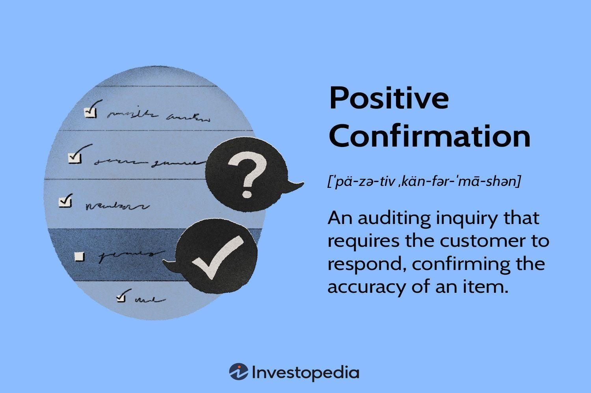

In algorithmic trading, confirmation techniques are essential for validating trading signals and strategies. This article provides a comprehensive analysis of positive and negative confirmations in trading, illustrating their roles and applications in algorithmic systems. Positive confirmation involves corroborating a trade setup with additional data points or aligning multiple indicators to ensure reliability. On the other hand, negative confirmation is focused on identifying discrepancies or deviations that may arise in trading data or setups.

The importance of understanding these concepts cannot be overstated, as they are crucial for traders aiming to refine strategies and improve decision-making in unpredictable and volatile markets. Confirmations affect trading outcomes by influencing the reliability and execution of trading strategies. Effective use of these techniques can prevent false signals, enhance strategy accuracy, and optimize trading performance.



Both seasoned traders and beginners can benefit from grasping the significance of confirmation in their trading activities. Implementing confirmation techniques in trading practices is likely to enhance performance, providing traders with a disciplined and strategic approach to their decision-making processes. By employing positive and negative confirmations, traders are better equipped to navigate the complexities of market dynamics and maintain a competitive edge.

## Table of Contents

## Positive Confirmation in Trading

Positive confirmations signify a proactive approach where traders seek validation of their data or trade setup. In algorithmic trading, this form of confirmation involves utilizing additional data points or aligning multiple indicators to ensure that the trading decision is supported by robust evidence. For instance, a trader might verify a market breakout by checking for increased trading volume, which serves as a reinforcement that the price movement is backed by substantial trading activity. 

Similarly, traders often employ price action patterns to corroborate a trend, ensuring that the movement aligns with recognizable formations. Positive confirmations, therefore, are essential in ensuring the reliability of trading strategies as they substantiate the assumptions underlying the trading setups. These strategies help prevent false signals and improve the accuracy of trading decisions, ultimately enhancing the overall effectiveness of trading outcomes.

Implementing positive confirmation can involve sophisticated techniques such as combining multiple indicators to reinforce a signal. For example, traders may use Relative Strength Index (RSI) together with moving averages. If RSI indicates overbought conditions while a moving average crossover suggests a downward trend, this dual confirmation can provide stronger validation for a sell position.

Moreover, [backtesting](/wiki/backtesting) is a tool often employed to validate strategies using historical data, providing insights into how a particular setup would have performed over time. Python scripts are frequently used for backtesting and to automate the evaluation of positive confirmations within [algorithmic trading](/wiki/algorithmic-trading) systems. For instance, a simple Python script using the pandas library might involve loading historical prices and applying indicator logic to ascertain validation:

```python
import pandas as pd

# Load historical data into a DataFrame
data = pd.read_csv('historical_prices.csv')

# Calculate moving averages
data['SMA_50'] = data['close'].rolling(window=50).mean()
data['SMA_200'] = data['close'].rolling(window=200).mean()

# Identify crossover for positive confirmation
data['Signal'] = 0
data.loc[data['SMA_50'] > data['SMA_200'], 'Signal'] = 1

# Evaluate RSI for additional confirmation
data['RSI'] = rsi(data['close'], period=14)
data['Final_Signal'] = (data['Signal'] == 1) & (data['RSI'] < 70)
```

In this script, a simple moving average crossover is used as a primary signal, and the RSI is used for positive confirmation by checking if it's not in the overbought territory. Such methods enable traders to apply systematic, rules-based approaches to ascertain positive confirmation, ultimately fostering more disciplined and successful trading strategies.

## Negative Confirmation in Trading

Negative confirmations require attention only when discrepancies are observed in the trading data or setup. In algorithmic trading, this concept involves vigilant monitoring of trades and taking action only when outcomes deviate from expected patterns. A critical aspect of this approach is identifying when a trade setup fails to perform as anticipated or when price divergences occur without proper market justification. 

For instance, if an algorithm predicts a bullish trend based on historical data and relevant indicators, but the market price begins to fall, a negative confirmation signal is triggered, prompting a re-evaluation of the strategy. Such examples highlight the importance of negative confirmations in maintaining market awareness and responding appropriately to unforeseen deviations.

This approach is particularly effective in situations where data integrity is high and trading setups have a history of being reliable. The primary advantage of utilizing negative confirmations lies in its efficiency; it directs the trader's attention only to exceptions, significantly saving time and reducing cognitive load. By focusing on exceptions rather than processes that are running as expected, traders can allocate resources more effectively and avoid unnecessary scrutiny of smooth operations.

In algorithmic trading systems, negative confirmations serve as alerts when certain conditions deviate from the norm. For example, a well-coded trading algorithm might include a module that logs discrepancies between expected and actual performance metrics, providing an additional layer of oversight. This aligns with the broader goal of creating robust trading frameworks that can adapt to dynamic markets, ensuring strategies are always tuned to the most current data. 

Overall, negative confirmations enhance the reliability and efficiency of trading strategies, allowing traders and algorithms to concentrate efforts where they are most needed, thus improving performance and mitigating potential risks.

## Application of Confirmations in Algo Trading

Algorithmic trading, commonly known as algo trading, employs sophisticated algorithms to automate trading decisions, allowing traders to capitalize on market opportunities with speed and precision. A critical component of a robust algo trading system is the implementation of confirmation techniques, which are essential for validating and optimizing trading strategies.

Positive confirmations in algorithmic trading involve using historical data to substantiate the effectiveness of trading strategies. This process, known as backtesting, tests a strategy against past market data to assess its performance. By confirming the strategy's historical success, traders gain confidence in its potential effectiveness under current market conditions. For instance, a trader might utilize a moving average crossover strategy and analyze its performance over several years of historical data to ensure that the signals it generates align with profitable trades.

In contrast, negative confirmations in algo trading focus on identifying exceptions when the algorithms deviate from expected behavior. This involves setting up alerts or other monitoring mechanisms to detect anomalies in trading performance. For example, if an algorithm historically predicts upward trends based on certain market indicators but fails to do so under current conditions, a negative confirmation may trigger an alert. This allows traders to investigate the cause, such as changes in market dynamics or errors in the algorithmic code.

Incorporating both types of confirmations within an algorithmic system enhances trader confidence and ensures the consistent execution of trading strategies. By systematically applying positive confirmations, traders can validate strategies through rigorous backtesting, reinforcing trust in the algorithm's decision-making criteria. Simultaneously, negative confirmations provide a safety net, notifying traders of any deviations that require further analysis or adjustment.

Decision frameworks in algorithmic trading often integrate both positive and negative confirmations, creating a balanced approach that ensures trading systems are both robust and adaptive. Positive confirmations help in validating the strategy, while negative confirmations aid in monitoring for unexpected deviations, facilitating a dynamic response to changing market conditions. By utilizing a combination of these confirmation techniques, traders can mitigate risks and improve the overall effectiveness of their algo trading strategies.

## Examples of Confirmation Techniques in Use

Traders often utilize confirmation techniques to bolster their trading strategies by integrating various indicators and data sources. A common practice is the employment of positive confirmation where traders might combine technical indicators, such as the Relative Strength Index (RSI) with moving averages, to validate potential trades. For instance, a trader might look for an RSI crossover above a level of 30, signaling a potential trend reversal, and confirm this indication with a moving average [breakout](/wiki/breakout-trading), thereby reinforcing the decision to enter or [exit](/wiki/exit-strategy) a trade.

Negative confirmation techniques are also prevalent, particularly in scenarios requiring the monitoring of automated trading outputs. Traders or systems might focus on deviations from expected benchmarks. An example includes identifying discrepancies in algorithmic performance metrics, such as Sharpe ratio divergences or tracking errors, which signal a potential issue requiring attention. This method allows traders to concentrate on exceptions rather than routine processes.

Technical indicators like the Moving Average Convergence Divergence (MACD) or Fibonacci retracement levels serve as potent confirmation signals. For instance, a converging MACD line with a signal line might enhance the reliability of a buy or sell signal indicated by another technical pattern or foundational analysis.

The integration of fundamental news alongside technical indicators is crucial in volatile, news-driven environments. For example, the confirmation of a technical pattern with relevant economic data releases, such as GDP growth rates or non-farm payroll figures, can substantiate a trading setup, reducing the likelihood of misinterpretation based on technical signals alone.

Modern algorithmic platforms provide advanced real-time analytics and visualization dashboards, which are instrumental in observing and implementing confirmation techniques. These tools allow traders to monitor live data feeds, visualize indicator alignments, and respond swiftly to confirmation signals. Python, with its robust data processing and visualization libraries, is often used to build custom dashboards and analytical tools. An example Python snippet that combines RSI with moving average might look like this:

```python
import pandas as pd
import numpy as np

# Sample data
data = pd.DataFrame({'Close': [100, 101, 102, 100, 99, 98, 97, 95, 96, 98, 100]})

# Calculate moving average
data['MA'] = data['Close'].rolling(window=5).mean()

# Calculate RSI
delta = data['Close'].diff()
gain = (delta.where(delta > 0, 0)).rolling(window=14).mean()
loss = (-delta.where(delta < 0, 0)).rolling(window=14).mean()
rs = gain / loss
data['RSI'] = 100 - (100 / (1 + rs))

# Logic for confirmation
confirmed_signals = (data['RSI'] < 30) & (data['Close'] > data['MA'])
data['Signals'] = np.where(confirmed_signals, 'Buy', 'Hold')

print(data[['Close', 'MA', 'RSI', 'Signals']])
```

This script calculates basic moving average and RSI, then identifies trade signals where RSI crosses a threshold indicative of potential trend reversals, validated by a moving average crossover. Such integrations, aided by real-time analytics, empower traders to make informed and timely trading decisions, ensuring strategies are both robust and adaptive to market conditions.

## Conclusion

Understanding and implementing both positive and negative confirmation techniques can significantly improve trading efficacy by bolstering the decision-making framework. Confirmation techniques serve as the cornerstone for validating trading strategies, thus enhancing the prospects of successful trades. By integrating these confirmations into algorithmic trading, traders can make informed decisions, reduce risks, and secure strategy validation. For instance, combining technical indicators with confirmations ensures that signals are not only generated but are also reliable, reducing the risk of false positives or negatives impacting strategy performance.

As technology evolves, traders gain access to a wider array of tools and platforms, enabling them to implement robust confirmation processes effectively. Advanced analytics, real-time data processing, and [machine learning](/wiki/machine-learning) are progressively becoming integral to these processes, allowing traders to refine strategies with greater precision. Platforms offering real-time dashboards and analytics facilitate the seamless observation of confirmations, enabling timely decision-making.

Ultimately, the effective use of confirmations sets successful traders apart by promoting disciplined and strategic trading practices. The capacity to adequately respond to market signals and deviations while adhering to well-structured confirmation techniques propels traders towards achieving sustained success. Such disciplined trading practices not only protect against potential market upheavals but also provide a competitive edge, ensuring traders remain agile and adaptive in dynamic market environments.

## References & Further Reading

[1]: Bergstra, J., Bardenet, R., Bengio, Y., & Kégl, B. (2011). ["Algorithms for Hyper-Parameter Optimization."](https://dl.acm.org/doi/10.5555/2986459.2986743) Advances in Neural Information Processing Systems 24.

[2]: ["Advances in Financial Machine Learning"](https://www.amazon.com/Advances-Financial-Machine-Learning-Marcos/dp/1119482089) by Marcos Lopez de Prado

[3]: ["Evidence-Based Technical Analysis: Applying the Scientific Method and Statistical Inference to Trading Signals"](https://www.amazon.com/Evidence-Based-Technical-Analysis-Scientific-Statistical/dp/0470008741) by David Aronson

[4]: ["Machine Learning for Algorithmic Trading"](https://github.com/stefan-jansen/machine-learning-for-trading) by Stefan Jansen

[5]: ["Quantitative Trading: How to Build Your Own Algorithmic Trading Business"](https://www.amazon.com/Quantitative-Trading-Build-Algorithmic-Business/dp/1119800064) by Ernest P. Chan