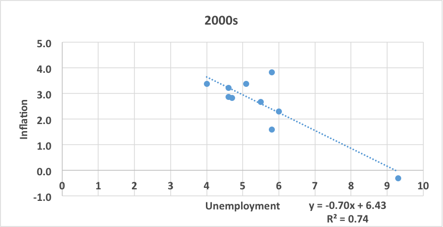

## Table of Contents

## What is inflation?

Inflation is when the prices of things we buy, like food and toys, go up over time. It means that the money we have can buy less stuff than before. Imagine if a candy bar cost $1 last year, but this year it costs $1.10. That's inflation. It happens because the amount of money in the economy grows faster than the number of goods and services available.

There are different reasons why inflation happens. Sometimes, it's because the cost of making things goes up, like if the price of sugar goes up, then the price of candy might go up too. Other times, it's because people have more money to spend, so they're willing to pay more for things. Governments and central banks try to control inflation by changing interest rates or the amount of money in circulation to keep prices stable.

Inflation isn't always bad. A little bit of inflation can be good because it encourages people to spend money instead of saving it, which helps the economy grow. But if inflation gets too high, it can make life harder because everything becomes more expensive, and people's savings lose value quickly. That's why keeping inflation at a moderate level is important for a healthy economy.

## What is unemployment?

Unemployment is when people who want to work can't find a job. It's like when you want to play a game, but no one else wants to play with you. In a country, unemployment means there are people who are ready and willing to work, but there aren't enough jobs for everyone.

There are different reasons why people might be unemployed. Sometimes, it's because the economy is not doing well, and businesses are not hiring as many people. Other times, it might be because someone doesn't have the right skills for the jobs that are available, or they might be looking for work in a place where there aren't many job opportunities. Governments try to help by creating programs to train people for new jobs or by encouraging businesses to hire more workers.

Unemployment can be tough because it means people might not have enough money to buy what they need. It can also make people feel sad or worried about the future. That's why it's important for countries to try to keep unemployment low, so more people can have jobs and feel happy and secure.

## How are inflation and unemployment typically measured?

Inflation is usually measured by looking at the prices of a bunch of different things that people buy, like food, clothes, and toys. This group of things is called a "basket of goods and services." Every month, people check the prices of these items and see if they've gone up or down. They use this information to calculate the Consumer Price Index (CPI), which tells us how much prices have changed overall. If the CPI goes up, it means there's inflation.

Unemployment is measured by counting the number of people who are looking for a job but can't find one. Every month, a big survey is done where people are asked if they have a job or if they're looking for one. If someone says they're looking for a job but don't have one, they're counted as unemployed. This information is used to calculate the unemployment rate, which is the percentage of people who are unemployed out of all the people who could be working. If the unemployment rate goes up, it means more people are out of work.

## What does 'positive correlation' mean in the context of economics?

In economics, a positive correlation means that when one thing goes up, another thing goes up too. Imagine if you're playing a game where the more you practice, the better you get. The amount of practice and your skill level have a positive correlation because as one increases, so does the other.

For example, if we look at the prices of houses and the number of people moving into a city, there might be a positive correlation. As more people move in, the demand for houses goes up, and so do the prices. Understanding these relationships helps economists predict what might happen in the economy and make better decisions.

## Can you explain the basic concept of the Phillips Curve?

The Phillips Curve is a simple idea that tries to show the relationship between inflation and unemployment. It says that when unemployment goes down, inflation tends to go up. Imagine it like a seesaw: when one side (unemployment) goes down, the other side (inflation) goes up. This happens because when more people have jobs, they have more money to spend, and that can make prices go up.

But the Phillips Curve isn't always perfect. Sometimes, things like big changes in oil prices or new technology can mess up the seesaw. Also, people's expectations about inflation can change how the Phillips Curve works. If people expect prices to go up, they might ask for higher wages, which can make inflation go up even if unemployment is staying the same. So, while the Phillips Curve can be helpful, it's not always a perfect guide for understanding the economy.

## What are some historical examples where inflation and unemployment showed a positive correlation?

In the 1960s in the United States, there was a time when inflation and unemployment seemed to move together in a way that matched the Phillips Curve. As more people got jobs and unemployment went down, prices started to go up. This happened because when people had more money from their jobs, they spent more, which made the prices of things like food and clothes go up. Economists at the time thought this showed a clear link between low unemployment and higher inflation.

However, things changed in the 1970s. During this time, the U.S. experienced something called stagflation, which is when inflation and unemployment both go up at the same time. This was confusing because it didn't fit with the Phillips Curve idea. High oil prices from the OPEC oil embargo made everything more expensive, and at the same time, the economy slowed down, causing more people to lose their jobs. This showed that sometimes other big factors can make inflation and unemployment move together in ways that are hard to predict.

## How do economic theories explain a positive correlation between inflation and unemployment?

Economic theories often talk about how inflation and unemployment can move together in a way that's not always easy to understand. One way to think about it is through something called the Phillips Curve, which says that when more people have jobs and unemployment goes down, inflation tends to go up. This happens because when lots of people are working, they have more money to spend, and that can make prices go up. But the Phillips Curve isn't perfect, and sometimes other big things can make inflation and unemployment move in ways we don't expect.

Another way to look at it is through the idea of stagflation, which happened in the 1970s. Stagflation is when both inflation and unemployment go up at the same time. This can happen because of big changes, like when the price of oil goes way up. When oil gets more expensive, it makes everything else more expensive too, which is inflation. At the same time, if businesses have to pay more for oil, they might not be able to hire as many people, so unemployment goes up. So, sometimes inflation and unemployment can go up together because of big changes in the economy.

## What role do government policies play in influencing the correlation between inflation and unemployment?

Government policies can have a big impact on how inflation and unemployment move together. One way they do this is by changing interest rates. When the government lowers interest rates, it can make it cheaper for people to borrow money, which can help businesses grow and hire more people. This might lower unemployment, but if too many people start spending more money, it can also make prices go up, which is inflation. On the other hand, if the government raises interest rates, it can slow down spending and help keep inflation in check, but it might also make it harder for businesses to grow and hire, which could raise unemployment.

Another way governments influence the correlation between inflation and unemployment is through fiscal policy, like spending money on public projects or changing taxes. If the government spends more money on things like building roads or schools, it can create jobs and lower unemployment. But if the economy is already doing well, this extra spending can also make prices go up, leading to inflation. If the government raises taxes, it might slow down spending and help control inflation, but it could also make it harder for people to find jobs, increasing unemployment. So, governments have to be careful and balance their policies to try to keep both inflation and unemployment at good levels.

## How does the concept of stagflation relate to the positive correlation between inflation and unemployment?

Stagflation is when both inflation and unemployment go up at the same time. This is different from what the Phillips Curve says, which is that when unemployment goes down, inflation goes up. Stagflation can happen because of big changes in the economy, like when the price of oil goes way up. When oil gets more expensive, it makes everything else more expensive too, which is inflation. At the same time, businesses might not be able to hire as many people because they have to pay more for oil, so unemployment goes up.

In the 1970s, the United States had stagflation because of high oil prices from the OPEC oil embargo. This made everything more expensive and caused inflation. At the same time, the economy slowed down, and more people lost their jobs, which increased unemployment. This showed that sometimes big changes can make inflation and unemployment move together in ways that are hard to predict. Governments have to be careful and use their policies to try to keep both inflation and unemployment under control, even when things like stagflation happen.

## What are the criticisms of the Phillips Curve in explaining the relationship between inflation and unemployment?

The Phillips Curve has been criticized because it doesn't always work the way it says it should. One big problem is that it doesn't explain stagflation, which is when both inflation and unemployment go up at the same time. This happened in the 1970s because of high oil prices, and it showed that the Phillips Curve isn't always right. Sometimes, big changes in the economy can make inflation and unemployment move together in ways that the Phillips Curve can't predict.

Another criticism is that the Phillips Curve doesn't take into account how people's expectations about inflation can change things. If people expect prices to go up, they might ask for higher wages, which can make inflation go up even if unemployment stays the same. This means that the relationship between inflation and unemployment isn't always as simple as the Phillips Curve suggests. Economists have to think about more than just unemployment when they're trying to understand and predict inflation.

## How do different economic models account for variations in the correlation between inflation and unemployment across different countries?

Different economic models try to explain why the relationship between inflation and unemployment can be different in various countries. One way they do this is by looking at how flexible a country's economy is. Some countries have rules and systems that make it easier for businesses to change prices and wages quickly. In these places, inflation might go up more when unemployment goes down because businesses can raise prices and wages faster. On the other hand, countries with strict rules might see less of a change in inflation even when unemployment changes a lot, because it's harder for businesses to adjust prices and wages.

Another way economic models account for these differences is by considering how open a country's economy is to the rest of the world. Countries that trade a lot with other countries might have their inflation and unemployment affected by what's happening in the global economy. For example, if the price of oil goes up around the world, it can cause inflation in a country that imports a lot of oil, even if unemployment stays the same. Also, if a country relies a lot on exports, changes in the global market can affect how many jobs are available at home, which can change the relationship between inflation and unemployment in ways that are different from what the Phillips Curve predicts.

## What are the latest research findings on the dynamics of inflation and unemployment correlation in the context of global economic changes?

Recent research shows that the relationship between inflation and unemployment is changing because of new things happening around the world. One big change is globalization, which means countries are more connected now. This can affect inflation and unemployment in different ways. For example, if a country relies a lot on things made in other countries, changes in those countries can make prices go up or down at home. Also, new technology is changing how businesses work and how many people they need to hire. This can make the relationship between inflation and unemployment harder to predict because it's not just about what's happening in one country anymore.

Another important finding is that people's expectations about inflation matter a lot more now. If people think prices will go up, they might ask for higher wages, which can make inflation go up even if unemployment stays the same. This means that the old idea of the Phillips Curve, which says that when unemployment goes down, inflation goes up, isn't always right anymore. Economists are trying to understand these new dynamics by looking at more than just unemployment. They're thinking about things like how fast prices and wages can change, how much a country trades with others, and how people expect the economy to do in the future.

## What is the future of algorithmic trading in economic analysis?

As technology continues to evolve, [algorithmic trading](/wiki/algorithmic-trading) is poised to assume an increasingly significant role in financial markets. The integration of real-time economic data, such as unemployment rates and inflation figures, has the potential to reshape the landscape of trading models, making them more sophisticated and responsive to economic fluctuations.

One of the key advancements anticipated in the future is the enhanced ability of trading algorithms to refine their strategies by continuously learning from economic patterns. Machine learning techniques, particularly those related to neural networks and [deep learning](/wiki/deep-learning), offer the capability to process vast amounts of data and recognize intricate patterns that may not be immediately apparent through traditional analysis. By leveraging these technologies, trading systems can dynamically adjust their strategies, improving their predictive accuracy and risk assessment.

For instance, consider a [machine learning](/wiki/machine-learning) model that uses multivariate regression to forecast market reactions to changes in economic indicators. The model might take the form:

$$
y_t = \beta_0 + \beta_1 \cdot \text{Inflation}_t + \beta_2 \cdot \text{Unemployment}_t + \epsilon_t
$$

where $y_t$ is the dependent variable representing potential market responses, $\text{Inflation}_t$ and $\text{Unemployment}_t$ are the independent economic variables at time $t$, $\beta_0, \beta_1, \beta_2$ are coefficients to be estimated, and $\epsilon_t$ is the error term. Such a model, once trained, could quickly adapt to new data inputs, offering traders a real-time decision-making tool.

Furthermore, the integration of high-frequency data streams can reduce the latency of decision-making processes, thereby enabling faster reactions to sudden economic changes. For example, a Python implementation using libraries such as Pandas for data manipulation and Scikit-learn for machine learning can efficiently handle and analyze these real-time data inputs:

```python
import pandas as pd
from sklearn.linear_model import LinearRegression

# Assume df is a DataFrame containing real-time economic data
df = pd.DataFrame({'Inflation': [], 'Unemployment': [], 'Market_Response': []})

# Set up the model
model = LinearRegression()

# Train the model
X = df[['Inflation', 'Unemployment']]
y = df['Market_Response']
model.fit(X, y)

# Predict market response using new data
new_data = pd.DataFrame({'Inflation': [2.5], 'Unemployment': [5.0]})
predicted_response = model.predict(new_data)
```

Such advancements could result in more stable and efficient financial markets. By minimizing the time lag between data capture and response, algorithmic trading systems contribute to reduced [volatility](/wiki/volatility-trading-strategies) and enhanced [liquidity](/wiki/liquidity-risk-premium). As these systems continue to evolve, the symbiotic relationship between technology and economics will lead to more robust financial analyses, enabling traders to make more informed and timely investment decisions.

## References & Further Reading

[1]: Phillips, A. W. (1958). ["The Relation Between Unemployment and the Rate of Change of Money Wage Rates in the United Kingdom, 1861–1957."](https://onlinelibrary.wiley.com/doi/full/10.1111/j.1468-0335.1958.tb00003.x) Economica, 25(100), 283-299.

[2]: Lopez de Prado, M. (2018). ["Advances in Financial Machine Learning."](https://www.amazon.com/Advances-Financial-Machine-Learning-Marcos/dp/1119482089) Wiley.

[3]: Fama, E. F., & French, K. R. (1992). ["The Cross-Section of Expected Stock Returns."](https://www.jstor.org/stable/2329112) The Journal of Finance, 47(2), 427-465.

[4]: Jansen, S. (2020). ["Machine Learning for Algorithmic Trading: Predictive models to extract signals from market and alternative data for systematic trading strategies with Python."](https://www.amazon.com/Machine-Learning-Algorithmic-Trading-alternative/dp/1839217715) Packt Publishing.

[5]: Chan, E. P. (2008). ["Quantitative Trading: How to Build Your Own Algorithmic Trading Business."](https://github.com/ftvision/quant_trading_echan_book) Wiley.