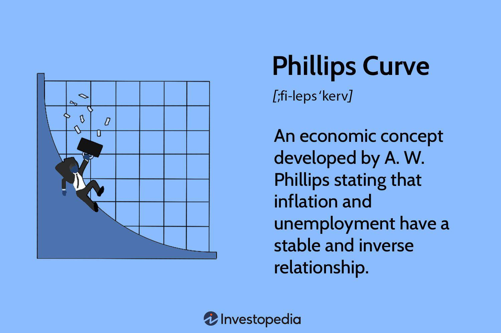

This article examines the intricate relationship between unemployment and inflation, two pivotal economic indicators with far-reaching influences on global economies. Historically, these factors have been understood through theoretical constructs like the Phillips Curve, which suggests an inverse relationship between unemployment and inflation. As unemployment decreases, inflation tends to rise due to increased consumer spending and demand for goods, and vice versa. However, economic peculiarities such as stagflation have shown that this relationship can sometimes be unpredictable.

In understanding the dynamics between unemployment and inflation, particularly in the modern financial landscape, the advent of algorithmic trading offers significant insights. Algorithmic trading, often referred to as algo trading, leverages computer algorithms to analyze large datasets efficiently and execute trades based on preset conditions. This method has revolutionized the way economic trends are interpreted and acted upon. With its ability to integrate vast quantities of data in real time, algorithmic trading provides a powerful tool for understanding and capitalizing on the economic interplay between unemployment and inflation metrics.



Automation plays a critical role in these trading strategies, enabling traders to adjust their positions in response to economic indicators quickly. By incorporating unemployment and inflation data into the algorithms, traders can fine-tune their strategies to anticipate and react to economic shifts. This not only helps in optimizing trading performance but also enhances the predictive power of these strategies.

Comprehending the economic correlation between unemployment and inflation allows investors and traders to make more informed decisions, ultimately leading to more strategic and potentially profitable trading activities. As technology continues to advance, the integration of such economic indicators into trading systems will likely become more sophisticated, offering unprecedented opportunities for efficiency and effectiveness in financial markets.

## Table of Contents

## Understanding the Economic Correlation between Unemployment and Inflation

The Phillips Curve is a conceptual representation of the inverse relationship between unemployment and inflation. This economic theory posits that inflation tends to rise during periods of low unemployment due to increased demand for goods and labor. Conversely, high unemployment typically corresponds with lower inflation, as consumer spending and demand decrease.

The Phillips Curve, named after economist A.W. Phillips, suggests that policymakers could potentially lower unemployment rates by accepting a higher rate of inflation. However, this inverse relationship has shown limitations, particularly during periods of stagflation, where an economy experiences stagnant growth, high unemployment, and high inflation simultaneously.

Stagflation emerged as a significant challenge to the Phillips Curve during the 1970s when economies worldwide grappled with oil shocks that led to rising prices and unemployment. This phenomenon revealed that factors other than consumer demand and labor costs can influence inflation, such as external shocks and supply constraints.

Understanding these complexities is critical for economists and traders aiming to predict future economic conditions. Algorithmic traders, in particular, may incorporate historical patterns identified by the Phillips Curve into their trading models to anticipate changes in economic indicators.

The relationship between unemployment and inflation is intricate. Thus, traders often employ statistical methods, such as regression analysis, to evaluate how unemployment rates might predict inflation trends under current economic conditions. For instance, an econometric model might use unemployment data to estimate future inflation using a time series analysis. Python libraries, such as statsmodels, offer tools to conduct these analyses by factoring in additional economic variables and ensuring model robustness.

```python
import statsmodels.api as sm
import pandas as pd

# Sample data for unemployment and inflation rates
data = pd.DataFrame({
    'unemployment_rate': [5.0, 4.8, 4.2, 3.9, 4.5],
    'inflation_rate': [2.2, 2.5, 3.0, 3.4, 2.8]
})

# Performing a linear regression
X = data['unemployment_rate']
X = sm.add_constant(X)  # Adds a constant term to the predictor
y = data['inflation_rate']

# Fitting Ordinary Least Squares (OLS) regression
model = sm.OLS(y, X)
results = model.fit()

# Output regression summary
print(results.summary())
```

The results of such an analysis might help traders adjust portfolios considering the forecasted economic condition. Despite the historical constraints of the Phillips Curve, understanding the nuanced relationship between unemployment and inflation remains vital. By doing so, decision-makers can better navigate the financial implications of economic shifts.

## The Role of Algorithmic Trading in Economic Analysis

Algorithmic trading leverages advanced computer algorithms to address the complexity of financial markets by autonomously analyzing vast amounts of market data and executing trades. This method relies on the precision and speed of computing systems to process information and react to changing economic conditions, which is paramount in dynamic trading environments. 

Economic indicators such as unemployment rates and inflation data are critical components that can be integrated into these algorithms to enhance decision-making processes. Unemployment rates often influence consumer behavior and spending patterns, while inflation affects purchasing power and overall economic activity. By incorporating these metrics, [algorithmic trading](/wiki/algorithmic-trading) systems can deliver more refined and responsive trading strategies.

One of the primary advantages of algorithmic trading in economic analysis is its capacity to adapt quickly to shifts in economic data. For instance, an unexpected rise in unemployment rates might prompt a systemic reassessment of the market outlook. Algorithms can be programmed to recognize such signals and adjust trading strategies accordingly, providing a distinctive competitive edge in volatile markets. This agility allows for the rapid recalibration of portfolios to optimize returns and manage risk effectively.

Additionally, algorithmic trading systems can be designed to simulate various economic scenarios, thereby enhancing their predictive power. For example, using economic models, these systems can project potential market outcomes based on different inflationary pressures or changes in employment [statistics](/wiki/bayesian-statistics). This modeling capability aids in preemptively identifying advantageous trading opportunities or risks, ensuring that traders can anticipate and respond to economic shifts more effectively.

The optimization of trading strategies is a crucial benefit of integrating algorithmic trading with economic indicators. Traders can utilize these systems to refine their buy, sell, or hold decisions, aligning them with current economic conditions. For example, if inflationary trends are detected, the algorithm might prioritize assets traditionally resistant to inflation, thereby protecting the investment portfolio's value.

In conclusion, the role of algorithmic trading in economic analysis is characterized by its ability to incorporate real-time economic indicators into the trading decision process, adapt rapidly to economic changes, and model economic scenarios to enhance predictive accuracy. This integration ultimately empowers traders to optimize their strategies, capitalizing on market dynamics effectively.

## Case Studies: Algorithmic Trading in Action

Algorithmic trading has proven to be an essential tool for analyzing and acting upon economic indicators like unemployment and inflation. Here, we examine real-world case studies where traders have successfully integrated these economic metrics into their algorithmic trading models, illustrating their impact on decision-making and portfolio adjustment.

One prominent example is the utilization of the Phillips Curve relationship by algorithmic trading systems to predict inflation trends resulting from changes in unemployment rates. Algorithms are designed to monitor unemployment data releases in real-time, adjusting investment strategies accordingly. Such systems can incorporate Gaussian statistical models to account for the typically normal distribution of monthly unemployment rate changes. This statistical approach allows the algorithms to assess the probability of significant economic shifts, prompting timely and strategic portfolio adjustments.

For instance, consider a trading firm that developed an algorithm specifically to respond to quarterly unemployment data. The system used historical unemployment and inflation data to train [machine learning](/wiki/machine-learning) models, ensuring accurate predictions of inflationary pressures. By setting predetermined triggers, such as a half-percentage point change in unemployment rates, the algorithm automatically adjusted the firm's portfolio allocation in sectors most sensitive to inflation, such as commodities and consumer staples.

Another case study involves leveraging inflation expectations data to guide trading decisions. By integrating predictive analytics that combine inflation forecasts with real-time market data, trading algorithms can identify potential market overreactions to inflation reports. This enables traders to exploit short-term mispricing opportunities in [interest rate](/wiki/interest-rate-trading-strategies) markets. Historical event studies have shown that sudden market adjustments to unexpected inflation data can result in temporary price disparities, which these algorithms are designed to capture.

A practical example of this is a [hedge fund](/wiki/hedge-fund-trading-strategies)'s use of algorithmic models to forecast inflation's impact on fixed-income securities. By inputting expected inflation data into econometric models, the algorithms were able to calculate anticipated bond yield changes accurately. This facilitated strategic short positions in bonds during anticipated inflationary periods, thereby preserving capital and enhancing returns.

These case studies underscore the practical advantages of integrating unemployment and inflation data into algorithmic trading. By processing and reacting to economic shifts with unprecedented speed and accuracy, traders can optimize their investment strategies, align with macroeconomic trends, and manage risks more effectively. The ongoing refinement of these models indicates a significant potential for further advancements, driven by continuous improvements in data processing and machine learning techniques.

## Challenges and Opportunities in Algo Trading with Economic Indicators

Incorporating economic indicators into algorithmic trading systems presents both challenges and opportunities. One of the primary challenges is ensuring data accuracy. Economic data, such as unemployment rates and inflation figures, are often subject to revisions and updates. Consequently, traders must rely on the most current and accurate data available to avoid erroneous conclusions that could lead to suboptimal trading decisions. Algorithms designed to process this information need robust mechanisms to manage these revisions, ideally favoring data sources known for reliability and timeliness.

Latency is another critical [factor](/wiki/factor-investing). In algo trading, the speed of decision-making is paramount. High-frequency trading systems, which rely on executing trades within milliseconds, are particularly sensitive to data lag. The delay between when economic data is released and when it is incorporated into trading strategies can impact profitability. Traders need to utilize low-latency data feeds and optimize their network infrastructure to minimize delays, ensuring that their algorithms can react swiftly to new information.

The complexity of economic interactions adds another layer of difficulty. Economic indicators do not operate in isolation; rather, they are intertwined with various other factors like geopolitical events, consumer behavior trends, and policy changes. Designing algorithms that can interpret these complex relationships requires sophisticated modeling techniques. For example, machine learning approaches, such as neural networks, can be deployed to recognize patterns and predict outcomes based on historical data.

Despite these challenges, the integration of economic indicators into trading algorithms offers substantial opportunities. Enhanced decision-making is a primary benefit. Algorithms can process vast amounts of data far beyond human capacity, identifying trends and correlations that might otherwise remain unnoticed. This capacity leads to more informed trading decisions and potentially higher returns.

In addition to better decision-making, risk management is significantly improved. By continuously analyzing incoming data, algorithms can quickly adjust trading positions in response to market [volatility](/wiki/volatility-trading-strategies) induced by economic changes. Such agility reduces exposure to adverse market movements, helping manage risk more effectively.

Advancements in machine learning are pivotal in harnessing these opportunities. Algorithms are increasingly capable of understanding nuanced economic dynamics, adapting to new data, and refining their predictive accuracy over time. This progress is leading to more sophisticated trading models that not only respond to economic indicators but also anticipate market shifts with greater precision.

In conclusion, while incorporating economic indicators into algo trading systems involves hurdles related to data quality, latency, and complexity, the potential for better decision-making and risk management is substantial. The evolution of machine learning technologies continues to enhance these systems' capabilities, making them invaluable tools in the ever-changing landscape of financial markets.

## The Future of Algorithmic Trading in Economic Analysis

As technology continues to evolve, algorithmic trading is poised to assume an increasingly significant role in financial markets. The integration of real-time economic data, such as unemployment rates and inflation figures, has the potential to reshape the landscape of trading models, making them more sophisticated and responsive to economic fluctuations.

One of the key advancements anticipated in the future is the enhanced ability of trading algorithms to refine their strategies by continuously learning from economic patterns. Machine learning techniques, particularly those related to neural networks and [deep learning](/wiki/deep-learning), offer the capability to process vast amounts of data and recognize intricate patterns that may not be immediately apparent through traditional analysis. By leveraging these technologies, trading systems can dynamically adjust their strategies, improving their predictive accuracy and risk assessment.

For instance, consider a machine learning model that uses multivariate regression to forecast market reactions to changes in economic indicators. The model might take the form:

$$
y_t = \beta_0 + \beta_1 \cdot \text{Inflation}_t + \beta_2 \cdot \text{Unemployment}_t + \epsilon_t
$$

where $y_t$ is the dependent variable representing potential market responses, $\text{Inflation}_t$ and $\text{Unemployment}_t$ are the independent economic variables at time $t$, $\beta_0, \beta_1, \beta_2$ are coefficients to be estimated, and $\epsilon_t$ is the error term. Such a model, once trained, could quickly adapt to new data inputs, offering traders a real-time decision-making tool.

Furthermore, the integration of high-frequency data streams can reduce the latency of decision-making processes, thereby enabling faster reactions to sudden economic changes. For example, a Python implementation using libraries such as Pandas for data manipulation and Scikit-learn for machine learning can efficiently handle and analyze these real-time data inputs:

```python
import pandas as pd
from sklearn.linear_model import LinearRegression

# Assume df is a DataFrame containing real-time economic data
df = pd.DataFrame({'Inflation': [], 'Unemployment': [], 'Market_Response': []})

# Set up the model
model = LinearRegression()

# Train the model
X = df[['Inflation', 'Unemployment']]
y = df['Market_Response']
model.fit(X, y)

# Predict market response using new data
new_data = pd.DataFrame({'Inflation': [2.5], 'Unemployment': [5.0]})
predicted_response = model.predict(new_data)
```

Such advancements could result in more stable and efficient financial markets. By minimizing the time lag between data capture and response, algorithmic trading systems contribute to reduced volatility and enhanced [liquidity](/wiki/liquidity-risk-premium). As these systems continue to evolve, the symbiotic relationship between technology and economics will lead to more robust financial analyses, enabling traders to make more informed and timely investment decisions.

## Conclusion

Understanding the economic correlation between unemployment and inflation is crucial for effective algorithmic trading. Historically, these two economic indicators have served as barometers for economic health, guiding investment decisions. Algorithmic trading systems that integrate unemployment and inflation data have the potential to significantly enhance their predictive accuracy and operational efficiency. Such systems can adjust to economic fluctuations faster than traditional methods, providing a substantial edge in volatile financial markets.

Despite the inherent challenges in accurately capturing and integrating economic indicators, the potential benefits are substantial. Data accuracy, latency, and the intricate nature of economic interactions require sophisticated models capable of processing and adapting to vast data sets. Advances in machine learning and data analytics have made it increasingly feasible for algorithms to decode the underlying dynamics of economic variables, offering insights that can refine trading strategies.

As traders and financial analysts strive to adapt to the complexities of economic data, the relationship between technology and economics will continue to evolve, driving innovation in algorithmic trading. This evolution promises more reliable and efficient financial markets by minimizing reaction times to economic changes and enhancing risk management. As such, the symbiotic relationship between algorithmic trading and economic analysis stands poised to redefine the approach to financial decision-making.

## References & Further Reading

[1]: Phillips, A. W. (1958). ["The Relation Between Unemployment and the Rate of Change of Money Wage Rates in the United Kingdom, 1861–1957."](https://onlinelibrary.wiley.com/doi/full/10.1111/j.1468-0335.1958.tb00003.x) Economica, 25(100), 283-299.

[2]: Lopez de Prado, M. (2018). ["Advances in Financial Machine Learning."](https://www.amazon.com/Advances-Financial-Machine-Learning-Marcos/dp/1119482089) Wiley.

[3]: Fama, E. F., & French, K. R. (1992). ["The Cross-Section of Expected Stock Returns."](https://www.jstor.org/stable/2329112) The Journal of Finance, 47(2), 427-465.

[4]: Jansen, S. (2020). ["Machine Learning for Algorithmic Trading: Predictive models to extract signals from market and alternative data for systematic trading strategies with Python."](https://www.amazon.com/Machine-Learning-Algorithmic-Trading-alternative/dp/1839217715) Packt Publishing.

[5]: Chan, E. P. (2008). ["Quantitative Trading: How to Build Your Own Algorithmic Trading Business."](https://github.com/ftvision/quant_trading_echan_book) Wiley.