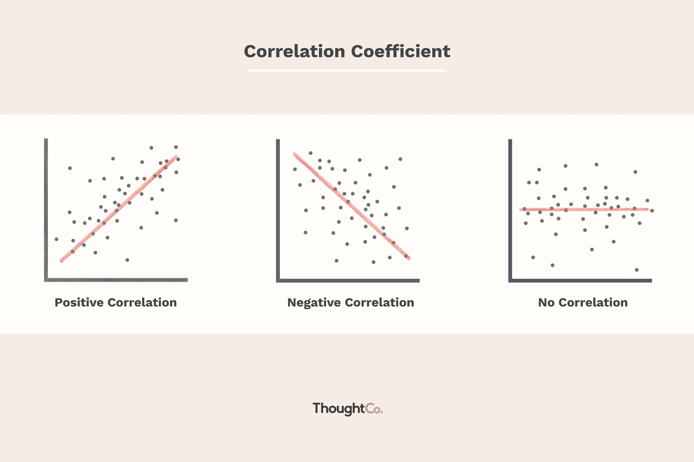

## Table of Contents

## What is positive correlation?

Positive correlation is when two things increase or decrease together. For example, if you study more, your grades might go up. This means that as one thing gets bigger or smaller, the other thing does the same.

You can see positive correlation on a graph where the line goes up from left to right. This shows that as one number gets larger, the other number also gets larger. It's like when the temperature goes up, ice cream sales might also go up because people want to cool off.

## How is positive correlation different from negative correlation?

Positive correlation and negative correlation are two ways to describe how two things change together. Positive correlation means that when one thing goes up, the other thing also goes up. For example, if you spend more time exercising, your fitness level might improve. On a graph, this looks like a line going up from left to right, showing that as one number gets bigger, the other number does too.

Negative correlation is the opposite. It means that when one thing goes up, the other thing goes down. For instance, if you spend more time playing video games, your homework time might decrease. On a graph, a negative correlation looks like a line going down from left to right, showing that as one number gets bigger, the other number gets smaller.

Understanding the difference between positive and negative correlation helps us see how different things affect each other. If you know that more exercise leads to better fitness, that's a positive correlation. But if you know that more video game time leads to less homework time, that's a negative correlation. Recognizing these patterns can help you make better choices in life.

## What are some common examples of positive correlation in everyday life?

In everyday life, one common example of positive correlation is the relationship between the amount of time you study and your test scores. If you spend more time studying, your test scores usually get better. This happens because the more you study, the more you learn and remember, which helps you do well on tests.

Another example is the link between exercise and overall health. When people exercise more, they often feel healthier and have more energy. This is because regular exercise helps keep the body strong and can prevent many health problems.

Lastly, there's a positive correlation between the amount of sunlight and people's moods. On sunny days, people often feel happier and more energetic. This is because sunlight can boost the production of serotonin, a chemical in the brain that helps improve mood.

## How do you measure positive correlation?

To measure positive correlation, we often use something called a correlation coefficient. This is a number that tells us how strong the relationship is between two things. The correlation coefficient can be between -1 and 1. If it's close to 1, it means there's a strong positive correlation. For example, if we're looking at the relationship between studying and test scores, a correlation coefficient close to 1 would show that when study time goes up, test scores also go up a lot.

To find the correlation coefficient, we usually use a formula or a computer program. We collect data on the two things we're interested in, like the number of hours people study and their test scores. Then, we put this data into the formula or program, and it calculates the correlation coefficient for us. This helps us understand how closely related the two things are and whether more of one thing really does lead to more of the other thing.

## What is the correlation coefficient and how is it used to quantify positive correlation?

The correlation coefficient is a number that tells us how strongly two things are related to each other. It can be between -1 and 1. If the correlation coefficient is close to 1, it means there is a strong positive correlation between the two things. This means that when one thing goes up, the other thing also goes up. For example, if we are looking at the relationship between the amount of time people study and their test scores, a correlation coefficient close to 1 would show that more studying leads to higher test scores.

To find the correlation coefficient, we collect data on the two things we are interested in. We then use a formula or a computer program to calculate it. The formula looks at how each pair of data points varies together. If the correlation coefficient is close to 1, it means the two things move together in the same direction a lot. This helps us understand how closely related the two things are and whether more of one thing really does lead to more of the other thing.

## Can you explain the range of the correlation coefficient and what it means for positive correlation?

The correlation coefficient is a number that can be between -1 and 1. It tells us how strong the relationship is between two things. When the correlation coefficient is close to 1, it means there is a strong positive correlation. This means that when one thing goes up, the other thing also goes up. For example, if the correlation coefficient between studying and test scores is close to 1, it means that the more time you spend studying, the higher your test scores will be.

When the correlation coefficient is exactly 1, it means there is a perfect positive correlation. This means that every time one thing goes up, the other thing goes up exactly in the same way. But in real life, it's rare to see a correlation coefficient of exactly 1 because things are usually not that perfect. A correlation coefficient of 0 means there is no relationship at all between the two things. So, if you see a number closer to 1, it means the relationship between the two things is strong and positive.

## What statistical methods are used to test the significance of a positive correlation?

To test if a positive correlation is significant, we often use a method called the t-test for correlation. This test helps us figure out if the correlation we see in our data is real or just happened by chance. We do this by calculating a t-value from our data and then comparing it to a critical value from a t-distribution table. If our t-value is bigger than the critical value, we say the correlation is significant. This means it's unlikely that the correlation happened just by chance.

Another common method is the p-value approach. When we calculate the correlation coefficient, we also get a p-value. This p-value tells us the chance that the correlation we see is just random. If the p-value is small (usually less than 0.05), we say the correlation is significant. This means there's a low chance that the positive correlation we found is just a fluke. Both the t-test and the p-value help us be more sure that the positive correlation we see in our data is real and not just a coincidence.

## How does sample size affect the reliability of measuring positive correlation?

Sample size is very important when you want to find out if two things have a positive correlation. A bigger sample size makes your results more reliable. This is because with more data, you can see the real pattern between the two things more clearly. If you only have a small sample, the results might not show the true relationship. For example, if you only look at a few people's study time and test scores, you might not get a good idea of how studying affects test scores. But if you look at a lot of people, you'll get a better picture of the real connection.

A larger sample size also helps to reduce the chance of getting a wrong result by chance. When you have more data, the impact of random errors or unusual cases is smaller. This means you can be more confident that the positive correlation you see is real and not just a coincidence. So, if you want to be sure that more studying really does lead to higher test scores, it's better to use a big sample size to make your results more reliable.

## What are the limitations and potential pitfalls when interpreting positive correlation?

When you find a positive correlation between two things, it's important to remember that it doesn't mean one thing causes the other. Just because two things go up together doesn't mean one makes the other happen. For example, if you see that ice cream sales and swimming pool visits both go up in the summer, it doesn't mean that eating ice cream makes people want to swim. They might both go up because it's hot outside. So, be careful not to think that one thing causes the other just because they're connected.

Another problem is that other things might be affecting the results. These are called confounding variables. For example, if you find a positive correlation between the amount of time kids spend reading and their reading scores, it might not just be the reading time that's helping. Maybe kids who read more also have parents who help them a lot with schoolwork. If you don't think about these other factors, you might miss the real reason behind the positive correlation. Always try to think about other things that could be influencing the results.

## How can positive correlation be misinterpreted or misused in data analysis?

When people find a positive correlation, they might think that one thing causes the other, but that's not always true. Just because two things go up together doesn't mean one makes the other happen. For example, if you see that people who eat more chocolate also do better in math, you can't say that eating chocolate makes you better at math. There might be other reasons, like people who eat more chocolate might also spend more time studying. So, it's important not to jump to conclusions and think that one thing causes the other just because they're connected.

Another way positive correlation can be misused is when people ignore other things that might be affecting the results. These other things are called confounding variables. For instance, if you find that kids who play more sports also do better in school, it might not just be the sports that are helping. Maybe kids who play sports also have parents who help them a lot with homework. If you don't think about these other factors, you might miss the real reason behind the positive correlation. Always try to consider other things that could be influencing the results before you make any big claims about what the data means.

## What advanced techniques exist for analyzing positive correlation in multivariate datasets?

When you want to look at positive correlation in datasets that have many different things to consider, you can use a method called multiple regression. This helps you see how one thing changes when you change several other things at the same time. For example, if you want to know how studying, sleep, and diet affect test scores, multiple regression can show you how each of these things matters and how they work together. It's like trying to see how different ingredients in a recipe change the taste of a cake. This method helps you understand the big picture and not just focus on one thing at a time.

Another useful technique is called partial correlation. This helps you look at the relationship between two things while ignoring the effect of other things. For instance, if you want to see how exercise affects your mood but you also know that diet can change your mood, partial correlation can help you see the link between exercise and mood without the diet getting in the way. It's like trying to hear one instrument in a band by tuning out the others. These advanced techniques help you get a clearer and more accurate understanding of positive correlation in complicated datasets.

## How can machine learning algorithms utilize positive correlation for predictive modeling?

Machine learning algorithms can use positive correlation to make predictions by finding patterns in data. For example, if a machine learning model is trying to predict how well students will do on a test, it can look at the positive correlation between study time and test scores. The model learns that when students study more, their test scores usually go up. By using this information, the algorithm can predict that a student who studies a lot will likely get a high score on the test. This helps the model make better guesses about future test scores based on how much students study.

Another way machine learning uses positive correlation is in making recommendations. For instance, if a streaming service sees a positive correlation between people who watch a certain type of movie and those who watch another type, it can use this information to suggest new movies. If someone watches a lot of action movies and there's a positive correlation between action movies and sci-fi movies, the service might recommend sci-fi movies to that person. By understanding these connections, machine learning algorithms can give better suggestions and improve their predictions over time.

## What is Understanding Correlation: A Statistical Measurement?

Correlation is a statistical measurement that quantifies the extent to which two variables have a linear relationship. It helps in identifying whether increases or decreases in one variable predict similar changes in another variable. Correlation does not imply causation, but rather indicates the strength and direction of a relationship between the variables being studied.

A prominent tool for computing correlation is the Pearson correlation coefficient (r), which assesses linear correlation between two continuous variables. The formula for the Pearson correlation coefficient is:

$$
r = \frac{\sum{(x_i - \bar{x})(y_i - \bar{y})}}{\sqrt{\sum{(x_i - \bar{x})^2} \sum{(y_i - \bar{y})^2}}}
$$

where $x_i$ and $y_i$ are individual sample points, and $\bar{x}$ and $\bar{y}$ are the mean values of the x and y datasets respectively. The coefficient value ranges from -1 to +1. A coefficient of +1 implies a perfect positive linear relationship, where both variables move in the same direction. Conversely, a coefficient of -1 denotes a perfect negative linear relationship, indicating that one variable increases while the other decreases. A value of 0 suggests no linear correlation between the variables.

The calculation of correlation coefficients can be efficiently performed using statistical software and programming languages like Python, R, or MATLAB. Using Python, for example, one can employ libraries such as pandas or numpy to calculate the Pearson correlation coefficient easily. Below is a simple Python code snippet using pandas:

```python
import pandas as pd

# Assume df is a pandas DataFrame with columns 'X' and 'Y'
correlation_matrix = df[['X', 'Y']].corr()
pearson_correlation = correlation_matrix.loc['X', 'Y']
```

This computational ease enables analysts and researchers to leverage large datasets for identifying correlations, making these techniques vital in data-driven decision-making processes. In fields like finance, healthcare, and social sciences, understanding correlations aids in extracting insights, setting patterns, and forming predictive models which are pivotal for informed decision-making.

In summary, correlation serves as an indispensable tool in statistical analysis for establishing relationships between variables. Its correct application and interpretation can significantly impact strategic decision-making in various fields, thereby enhancing the capability to predict and understand complex data patterns.

## References & Further Reading

[1]: Bergstra, J., Bardenet, R., Bengio, Y., & Kégl, B. (2011). ["Algorithms for Hyper-Parameter Optimization."](https://papers.nips.cc/paper/4443-algorithms-for-hyper-parameter-optimization) Advances in Neural Information Processing Systems 24.

[2]: ["Advances in Financial Machine Learning"](https://www.amazon.com/Advances-Financial-Machine-Learning-Marcos/dp/1119482089) by Marcos Lopez de Prado

[3]: ["Evidence-Based Technical Analysis: Applying the Scientific Method and Statistical Inference to Trading Signals"](https://www.amazon.com/Evidence-Based-Technical-Analysis-Scientific-Statistical/dp/0470008741) by David Aronson

[4]: ["Machine Learning for Algorithmic Trading"](https://github.com/PacktPublishing/Machine-Learning-for-Algorithmic-Trading-Second-Edition) by Stefan Jansen

[5]: ["Quantitative Trading: How to Build Your Own Algorithmic Trading Business"](https://www.amazon.com/Quantitative-Trading-Build-Algorithmic-Business/dp/0470284889) by Ernest P. Chan