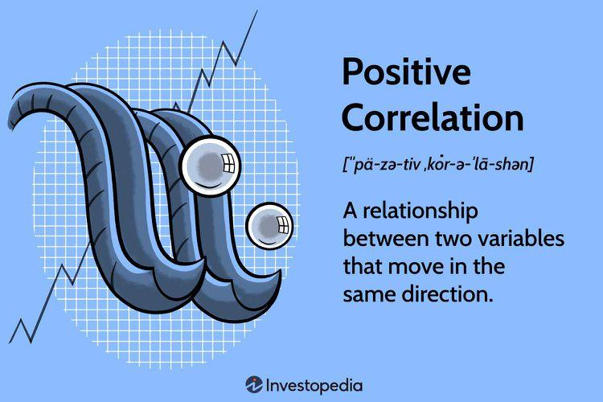

Correlation is a fundamental statistical concept that quantifies the degree to which two variables move in relation to each other. It plays a pivotal role across various fields, including finance, economics, psychology, and more. At its core, correlation is a measure of dependency, signifying whether and how strongly pairs of variables are related. The two main types of correlation are positive and negative correlation. Positive correlation occurs when an increase in one variable tends to be associated with an increase in another, while negative correlation implies that as one variable increases, the other tends to decrease.

In the context of algorithmic trading, understanding correlation is crucial. Algorithmic trading involves the use of computer programs to trade stocks and other financial instruments at speeds and frequencies that are practically impossible for human traders. These programs rely heavily on data analyses, where correlation plays a significant role in identifying relationships between different financial assets. By analyzing correlations, traders can uncover patterns and dependencies between assets, potentially leading to more informed decision-making and improved trading strategies.



This article will explore the concept of correlation, particularly focusing on its application in algorithmic trading. It will discuss how statistical measurements of correlation, such as the Pearson correlation coefficient, are applied to understand market behaviors. The discussion will extend to exploring both positive and negative correlations and their implications for trading strategies. Furthermore, challenges and best practices in utilizing correlation analysis will be examined, alongside the future outlook of such strategies.

Understanding the mathematical underpinnings and practical applications of correlation enhances the capability to make data-driven decisions. In algorithmic trading, harnessing the power of correlation not only informs strategic choices but also aids in risk management, thereby underscoring its indispensable role in contemporary finance.

## Table of Contents

## Understanding Correlation: A Statistical Measurement

Correlation is a statistical measurement that quantifies the extent to which two variables have a linear relationship. It helps in identifying whether increases or decreases in one variable predict similar changes in another variable. Correlation does not imply causation, but rather indicates the strength and direction of a relationship between the variables being studied.

A prominent tool for computing correlation is the Pearson correlation coefficient (r), which assesses linear correlation between two continuous variables. The formula for the Pearson correlation coefficient is:

$$
r = \frac{\sum{(x_i - \bar{x})(y_i - \bar{y})}}{\sqrt{\sum{(x_i - \bar{x})^2} \sum{(y_i - \bar{y})^2}}}
$$

where $x_i$ and $y_i$ are individual sample points, and $\bar{x}$ and $\bar{y}$ are the mean values of the x and y datasets respectively. The coefficient value ranges from -1 to +1. A coefficient of +1 implies a perfect positive linear relationship, where both variables move in the same direction. Conversely, a coefficient of -1 denotes a perfect negative linear relationship, indicating that one variable increases while the other decreases. A value of 0 suggests no linear correlation between the variables.

The calculation of correlation coefficients can be efficiently performed using statistical software and programming languages like Python, R, or MATLAB. Using Python, for example, one can employ libraries such as pandas or numpy to calculate the Pearson correlation coefficient easily. Below is a simple Python code snippet using pandas:

```python
import pandas as pd

# Assume df is a pandas DataFrame with columns 'X' and 'Y'
correlation_matrix = df[['X', 'Y']].corr()
pearson_correlation = correlation_matrix.loc['X', 'Y']
```

This computational ease enables analysts and researchers to leverage large datasets for identifying correlations, making these techniques vital in data-driven decision-making processes. In fields like finance, healthcare, and social sciences, understanding correlations aids in extracting insights, setting patterns, and forming predictive models which are pivotal for informed decision-making.

In summary, correlation serves as an indispensable tool in statistical analysis for establishing relationships between variables. Its correct application and interpretation can significantly impact strategic decision-making in various fields, thereby enhancing the capability to predict and understand complex data patterns.

## Examples of Positive Correlation

A positive correlation occurs when two variables tend to move in the same direction, meaning that as one variable increases, the other variable also tends to increase, and vice versa. This relationship is quantitatively measured by statistical tools, such as the Pearson correlation coefficient, which ranges from 0 to +1 for positive correlations. A coefficient close to +1 suggests a strong positive correlation, indicating a high level of association between the variables.

In real-world scenarios, positive correlation can be observed in various contexts. In academics, for example, there is often a positive correlation between the amount of time spent studying and academic performance. Typically, students who dedicate more hours to studying tend to achieve higher grades. This relationship, however, assumes that the increased study time is effectively utilized, focusing on understanding and retention.

In sociology, positive correlations can be observed between income levels and access to educational resources. Individuals with higher income levels generally have more access to quality education, including better schools and extracurricular learning opportunities. This relationship underlines the socio-economic disparities that influence educational outcomes, highlighting the importance of policies aimed at ensuring equal educational opportunities.

In financial markets, positive correlations can be seen between certain stocks and economic indicators. For instance, a company's stock price might experience a positive correlation with the overall market index or specific economic indicators like GDP growth or consumer confidence. These relationships can be pivotal for investors, as they suggest that when the market or economy performs well, the stock may also perform well, guiding investment decisions.

Identifying positive correlations is crucial in strategic decision-making across sectors. For example, in business, understanding the correlation between product advertisement and sales [volume](/wiki/volume-trading-strategy) can inform marketing strategies. An observed positive correlation might lead a company to allocate more resources to advertising, anticipating increased sales. In healthcare, positive correlations between patient lifestyle factors and health outcomes can direct public health initiatives aimed at improving population health.

Overall, recognizing positive correlations allows stakeholders in various fields to make informed decisions by anticipating the mutual reinforcement of variable trends, thereby optimizing strategies for desired outcomes.

## Correlation in Algorithmic Trading

Algorithmic trading, often referred to as algo trading, integrates technology and statistical methods to execute trades based on quantitative analysis. This form of trading relies heavily on data analysis to identify profitable trading opportunities, optimize execution, and manage risks effectively. One of the fundamental statistical tools used in this process is correlation, which measures the relationship between different financial instruments.

Correlation analysis plays a crucial role in [algorithmic trading](/wiki/algorithmic-trading) by helping traders identify how the prices of different securities move in relation to each other. By calculating correlation coefficients, traders can understand whether two financial instruments have a positive, negative, or no correlation. A positive correlation means that as the value of one asset increases, the value of the other tends to increase as well. Conversely, a negative correlation indicates that as one asset's value rises, the other's tends to decrease.

Understanding these relationships allows traders to develop strategies that take advantage of correlated movements. For example, if two stocks have a high positive correlation, traders may use strategies that exploit the consistent movement in the same direction, such as [pair trading](/wiki/pair-trading). In pair trading, traders simultaneously buy and sell two correlated stocks to capitalize on the spread between them, minimizing the risk of broad market movements.

On the other hand, recognizing negative correlations can be equally beneficial. Traders may construct hedging strategies that involve taking opposite positions in two negatively correlated instruments. This approach reduces exposure to market [volatility](/wiki/volatility-trading-strategies), as losses in one asset can be offset by gains in the other.

Implementing trading algorithms that incorporate correlation analysis requires robust software and fast computational capabilities. For instance, using Python libraries like NumPy and pandas, traders can compute correlation matrices to evaluate relationships between multiple assets efficiently:

```python
import pandas as pd
import numpy as np

# Sample data for closing prices of financial instruments
data = {
    'Stock_A': [100, 102, 104, 103, 105],
    'Stock_B': [98, 100, 101, 100, 102],
    'Stock_C': [95, 97, 96, 95, 94]
}

df = pd.DataFrame(data)
correlation_matrix = df.corr()
print(correlation_matrix)
```

This code produces a correlation matrix that enables traders to easily visualize the correlation coefficients between the assets.

In the rapidly changing financial markets, it is vital to continuously monitor these correlations. The dynamic nature of markets means that correlations can shift quickly due to economic events, policy changes, or shifts in investor sentiment. Regularly updating correlation analyses helps traders adapt their strategies accordingly, ensuring they remain effective and reduce unintended risks.

In conclusion, correlation analysis is an indispensable part of algorithmic trading. It provides essential insights into the relationships between financial instruments, helping traders to craft strategies that mitigate risks and harness profitable opportunities. As technology advances, enhancing the precision and speed of correlation assessments, the importance of this tool in creating competitive trading strategies will continue to grow.

## Leveraging Correlation: Challenges and Best Practices

Traders face several challenges when leveraging correlation data in algorithmic trading. One significant issue is the presence of lagging indicators. Correlation analyses often rely on historical data, which may not accurately predict future relationships between variables due to market dynamism. This lag can lead to misguided strategies if traders assume past correlations will persist unchanged.

Another challenge is the confusion between correlation and causation. Just because two variables exhibit a correlation does not imply that one causes the other. For example, a positive correlation between two stocks might occur due to a third, unobserved [factor](/wiki/factor-investing) influencing both. Misinterpreting such correlations can lead to erroneous trading decisions.

To effectively analyze correlation data within trading strategies, best practices should be adopted. First, traders should utilize rolling correlation calculations. This technique helps accommodate changes in the correlation over time, providing a more dynamic view. Here's a simple Python example using pandas to calculate rolling correlations:

```python
import pandas as pd

# Assume df is a DataFrame with columns 'Stock_A' and 'Stock_B'
rolling_correlation = df['Stock_A'].rolling(window=30).corr(df['Stock_B'])
```

Additionally, integrating varying time frames and combining correlation with other indicators can refine strategy development. Stress testing correlations under different market conditions is also advisable to understand potential variations.

Technological advancements, particularly [machine learning](/wiki/machine-learning), have significantly enhanced correlation analyses. Machine learning algorithms can identify complex, non-linear relationships that traditional correlation metrics might miss. Techniques such as clustering and predictive modeling allow a more nuanced understanding of market dynamics and can improve the precision of correlation-based strategies.

Diversification, informed by correlation insights, remains a crucial component of risk management. By understanding and leveraging the degree of correlation between portfolio assets, traders can design portfolios that minimize risk exposure. Investments in negatively correlated or uncorrelated assets can buffer against market volatility.

Looking forward, the future of correlation-based strategies in algorithmic trading is promising. As data analytics and computational technologies continue to evolve, the ability to harness real-time data and sophisticated algorithms will enhance correlation analyses further. Machine learning and [artificial intelligence](/wiki/ai-artificial-intelligence) are expected to offer deeper predictive insights, facilitating more informed decision-making. Emphasizing the adaptability of strategies and continuous monitoring of correlation metrics will be critical in capitalizing on emerging opportunities.

In summary, while leveraging correlation in algorithmic trading presents challenges, employing best practices, adopting advanced technologies, and focusing on diversification can potentiate its benefits. As the field evolves, traders who effectively integrate these techniques will position themselves advantageously in the marketplace.

## Conclusion

This article has explored the multifaceted concept of correlation and its pivotal role in algorithmic trading. Understanding correlation is crucial for effective data-driven decision-making, as it elucidates the relationships between variables, providing a statistical foundation for predictive modeling and strategy development. Throughout the text, the significance of positive correlation in trading strategies has been highlighted. By identifying positively correlated financial instruments, traders can optimize their portfolios to align with favorable market conditions, potentially enhancing returns and mitigating risks.

As financial markets continue to evolve, the importance of continuous learning and adaptation cannot be overstated. Developments in technology, particularly in fields like machine learning and data analytics, offer new tools and methodologies for improving correlation analyses. By leveraging these innovations, traders can refine their strategies to maintain a competitive edge in increasingly complex environments.

In conclusion, the potential of correlations to provide significant insights and opportunities extends beyond algorithmic trading. Whether in financial markets, academic research, or policy formulation, understanding and applying correlation can lead to informed, strategic decisions that capitalize on the inherent patterns and relationships within data. As such, a profound comprehension of correlation not only empowers traders but enhances decision-making across various sectors, driving advancements and fostering success.

## References & Further Reading

[1]: Bergstra, J., Bardenet, R., Bengio, Y., & Kégl, B. (2011). ["Algorithms for Hyper-Parameter Optimization."](https://papers.nips.cc/paper/4443-algorithms-for-hyper-parameter-optimization) Advances in Neural Information Processing Systems 24.

[2]: ["Advances in Financial Machine Learning"](https://www.amazon.com/Advances-Financial-Machine-Learning-Marcos/dp/1119482089) by Marcos Lopez de Prado

[3]: ["Evidence-Based Technical Analysis: Applying the Scientific Method and Statistical Inference to Trading Signals"](https://www.amazon.com/Evidence-Based-Technical-Analysis-Scientific-Statistical/dp/0470008741) by David Aronson

[4]: ["Machine Learning for Algorithmic Trading"](https://github.com/PacktPublishing/Machine-Learning-for-Algorithmic-Trading-Second-Edition) by Stefan Jansen

[5]: ["Quantitative Trading: How to Build Your Own Algorithmic Trading Business"](https://www.amazon.com/Quantitative-Trading-Build-Algorithmic-Business/dp/0470284889) by Ernest P. Chan