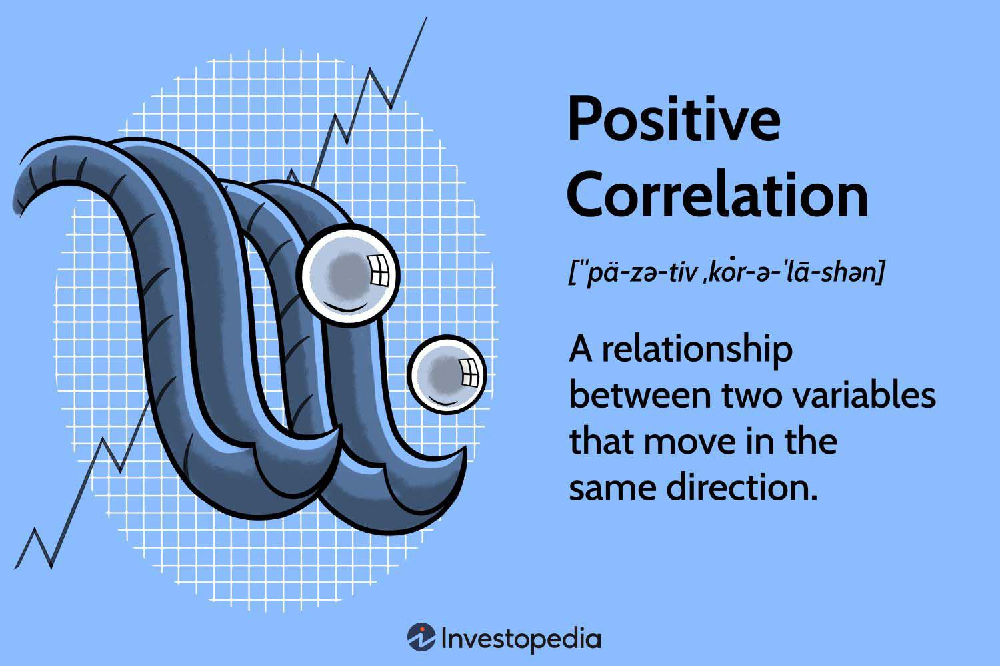

In the ever-evolving landscape of global finance, understanding economic relationships is crucial for effective decision-making. These relationships form the backbone of financial theories and practices, influencing how markets are analyzed and how investment decisions are crafted. Among the myriad connections within this economic tapestry, the study of positive correlations stands out as a key concept. Positive correlations occur when two variables move in the same direction and are fundamental in predicting market behaviors and trends.

Technological advancements have significantly impacted financial markets, particularly with the rise of algorithmic trading. This form of trading utilizes computer algorithms to execute trades at speeds and frequencies beyond human capability. By leveraging economic insights, algorithmic trading has become a powerful tool for market participants, enabling them to capitalize on the positive correlations identified within economies and markets.



This article explores the intricate relationships between economic variables, the nature of positive correlations, and their application in algorithmic trading. By dissecting these elements, it endeavors to provide a comprehensive understanding of how financial markets operate and interact. This understanding is essential not only for traders and economists but also for policymakers and stakeholders aiming to navigate the complexities of modern finance effectively.

Through a blend of theoretical perspectives and practical applications, we highlight the significance of economic relationships in shaping market dynamics and influencing algorithmic strategies. As the financial world continues to evolve, staying informed about these developments is paramount for making informed decisions and achieving strategic financial goals.

## Table of Contents

## Understanding Economic Relationships

Economic relationships are critical connections between different economic variables such as Gross Domestic Product (GDP), inflation, interest rates, and employment levels. These relationships are characterized by how changes in one variable are likely to influence others, shaping the overall economic landscape. By understanding these interdependencies, economists and traders can develop models to predict and analyze market behaviors.

For instance, consider the relationship between employment rates and consumer spending. A rise in employment rates generally means more people have disposable income, which tends to increase consumer spending. This uptick in spending positively impacts GDP, as consumption is a significant component of GDP calculation. The formula for GDP using the expenditure approach is:

$$
\text{GDP} = C + I + G + (X - M)
$$

where:
- $C$ denotes consumption,
- $I$ refers to investment,
- $G$ stands for government spending,
- $X$ and $M$ are exports and imports, respectively.

This formula demonstrates how various factors contribute to a nation's GDP, showing direct and indirect effects through economic relationships.

Inflation and interest rates are another area of significant interdependence. Central banks may raise interest rates to curb inflationary pressures. Higher interest rates increase borrowing costs, thereby reducing consumer spending and business investment. This, in turn, can temper inflation but may also slow down economic growth. Understanding such dynamics is vital for economists to formulate effective monetary policies.

Similarly, interest rates and currency exchange rates are interconnected. When a country's central bank increases interest rates, it often attracts foreign investors seeking higher returns on investments, leading to an appreciation of the national currency. This appreciation can make exports more expensive and imports cheaper, affecting trade balances and, consequently, GDP.

These connections highlight the importance of recognizing economic relationships for developing accurate economic models and forecasts. By understanding how shifts in one variable can impact others, traders and economists can better anticipate market trends and make informed decisions. This ability to predict economic outcomes is crucial for crafting strategies in investment and policy-making, ultimately fostering more stable and predictable economic environments.

## The Concept of Positive Correlations in Economics

A positive correlation in economics occurs when two variables move in the same direction, indicating that an increase in one variable is associated with an increase in another, or vice versa. This relationship is pivotal for analysts aiming to comprehend broader market trends. By identifying positive correlations, it becomes possible to predict how changes in one economic [factor](/wiki/factor-investing) might affect others, thereby enabling more informed decision-making.

A practical illustration of positive correlation can be found in the relationship between a country's export levels and its currency strength. When export levels rise, the demand for the country's currency typically increases as foreign buyers need the currency to pay for the goods, leading to an appreciation of the currency. This positive correlation can be leveraged to develop effective [forex](/wiki/forex-system) trading strategies. Analysts can use historical data to confirm the recurring nature of this correlation, subsequently designing trades that capitalize on expected currency movements.

Such correlations signify mutual reinforcement, where changes in one economic factor enhance or amplify another. This principle underlies many economic models and theories. For instance, the Phillips Curve suggests a positive correlation between inflation and employment rates in the short run, implying that as employment increases, inflation tends to rise due to higher demand for goods and services.

Economists and traders frequently exploit these positive correlations to predict future market movements and devise strategic financial plans. Tools such as regression analysis can be employed to quantify the strength of correlations between variables. For example, the Pearson correlation coefficient provides a measure ranging from -1 to 1, where values closer to 1 signify a strong positive correlation.

In practice, consider a Python example to calculate the Pearson correlation between two sets of economic data, such as export levels and currency strength:

```python
import numpy as np
from scipy.stats import pearsonr

# Example data
export_levels = np.array([100, 200, 300, 400, 500])
currency_strength = np.array([10, 20, 30, 40, 50])

# Calculate Pearson correlation coefficient
correlation_coefficient, _ = pearsonr(export_levels, currency_strength)

print(f'Pearson correlation coefficient: {correlation_coefficient}')
```

This script calculates the Pearson correlation coefficient, providing a quantifiable insight into the correlation's strength. Through understanding and applying the concept of positive correlations, traders and economists can anticipate market trends, which is essential for building strategic and profitable financial models.

## Algorithmic Trading: Leveraging Economic Insights

Algorithmic trading uses pre-defined algorithms to autonomously [carry](/wiki/carry-trading) out trades triggered by specific market signals. The inclusion of economic data plays a critical role in enhancing the efficiency of these systems by allowing them to discern positive correlations that can be leveraged to optimize trading strategies. Economic variables, such as inflation rates, GDP growth, or employment figures, provide a data-rich environment that algorithmic systems can analyze to make informed decisions. By processing this information, these systems can adapt to market shifts with precision.

By minimizing human intervention, [algorithmic trading](/wiki/algorithmic-trading) permits swift and accurate execution of trades. This approach reduces the likelihood of human errors and the emotional bias that often accompanies manual trading decisions. The algorithms can be programmed to react instantaneously to market changes, thus enabling traders to capitalize on fleeting opportunities that might be missed through manual methods.

Successful algorithmic trading relies significantly on the integration of economic relationships and the identification of positive correlations. For instance, consider an economic model that links [interest rate](/wiki/interest-rate-trading-strategies) fluctuations with currency value changes. If an algorithm detects a pattern where a rise in interest rates consistently strengthens a currency, it can automatically place buy orders for that currency as soon as an interest rate hike is announced. This execution relies on historical data and real-time analysis to increase the probability of successful trades.

Moreover, these trading methods help in formulating strategies that are attuned to both current market conditions and long-term economic trends. Real-time data feeds into these systems allow traders to respond promptly to news events or economic releases, ensuring that their strategies remain relevant and effective. Python and other programming languages are often employed to develop and test these trading algorithms. For example, using Python's libraries like Pandas for data manipulation and NumPy for numerical computations can streamline the development of trading strategies:

```python
import pandas as pd
import numpy as np

# Sample data retrieval and processing
def process_market_data():
    # Retrieve and process economic data
    data = pd.read_csv('economic_data.csv')
    # Analyzing positive correlation
    correlation = data['interest_rate'].corr(data['currency_value'])
    return correlation > 0

# Execute trade based on correlation
def execute_trade():
    if process_market_data():
        print("Executing trade based on positive correlation")
    else:
        print("No profitable opportunity detected")

execute_trade()
```

This program demonstrates how economic data can be processed to identify correlations, leading to automated trading decisions that maximize the chances of profitability. The primary advantage of algorithmic trading within this framework is not just its speed and efficiency but also its capacity to continually refine and recalibrate strategies in alignment with evolving economic landscapes.

## Case Studies: Successful Algo Trading Strategies

Several financial institutions have effectively harnessed economic relationship insights within their algorithmic trading strategies, demonstrating the power of data-driven decision-making in financial markets. One prominent example involves the use of GDP growth rates in high-frequency trading ([HFT](/wiki/high-frequency-trading-strategies)) to predict currency fluctuations. In this context, traders employ algorithms to rapidly process GDP announcements and gauge their potential effects on currency values. The logic behind this strategy is rooted in the positive correlation between a nation's economic health, as indicated by GDP growth, and the strength of its currency. During periods of robust economic growth, the demand for a country's currency often increases, leading to appreciation in its value.

Algorithmic trading systems capitalize on these connections by executing trades within milliseconds of GDP data releases. For instance, Python script using a library like NumPy can calculate moving averages of GDP growth to inform trading decisions:

```python
import numpy as np

def moving_average(data, window_size):
    return np.convolve(data, np.ones(window_size)/window_size, mode='valid')

# Example GDP growth data
gdp_growth = [2.1, 2.3, 3.0, 3.5, 4.0, 3.8, 3.9]

# Calculate the 3-period moving average
gdp_moving_avg = moving_average(gdp_growth, 3)
print(gdp_moving_avg)
```

This example highlights the systematic approach traders deploy to optimize their strategies by identifying patterns and trends based on economic indicators.

Another compelling case involves commodities trading, where traders utilize weather patterns and agricultural output data to anticipate futures prices. By analyzing correlations between weather forecasts and crop yields, traders can predict supply fluctuations, influencing commodity prices. For instance, a positive correlation exists between favorable weather conditions and higher agricultural output. Traders employ algorithms to process meteorological data and adjust their positions accordingly.

In commodities markets, a statistical technique such as linear regression could be used to model the relationship between weather variables and crop yield predictions:

```python
from sklearn.linear_model import LinearRegression
import numpy as np

# Example data: [temperature, rainfall] and crop yield
weather_data = np.array([[22, 200], [25, 180], [20, 220], [24, 210]])
crop_yield = np.array([300, 320, 310, 330])

# Fit the regression model
model = LinearRegression().fit(weather_data, crop_yield)

# Predict the crop yield based on new weather data
predicted_yield = model.predict(np.array([[23, 190]]))
print(predicted_yield)
```

Formulating strategies that exploit positive correlations between economic factors and market behaviors, these financial institutions underscore the significance of integrating economic data into trading algorithms. The successful application of such strategies not only demonstrates the potential for profitability but also confirms the critical role of comprehensive data analysis in algorithmic trading. By recognizing and exploiting these correlations, traders can make informed decisions, enhancing their ability to navigate complex and dynamic market environments.

## Future Prospects: The Role of AI and Machine Learning

As technology continues to evolve, [artificial intelligence](/wiki/ai-artificial-intelligence) (AI) and [machine learning](/wiki/machine-learning) (ML) are set to revolutionize algorithmic trading. These technologies offer sophisticated tools capable of processing vast and complex datasets, uncovering hidden correlations that may elude traditional analytical methods. By leveraging AI and ML, algorithmic trading systems can attain unprecedented levels of precision and efficiency.

AI-driven algorithms have the ability to learn from historical data, enabling them to refine their trading strategies over time. This learning capability is akin to a feedback loop, in which the algorithm iteratively updates its model based on new data and past results. Such adaptability ensures that AI systems remain robust in the face of volatile market conditions, continually optimizing their decision-making processes.

The integration of AI enhances the detection of economic relationships, allowing traders to effectively exploit positive correlations. For example, advanced ML techniques can identify subtle patterns and dependencies in financial markets that might otherwise remain concealed. This capability supports the development of predictive models that can anticipate market movements with higher accuracy.

A simple example of using machine learning in trading could involve a basic Python script utilizing the popular library, scikit-learn, to predict stock prices based on historical data:

```python
from sklearn.model_selection import train_test_split
from sklearn.linear_model import LinearRegression
import numpy as np

# Sample data representing historical stock prices and trading volume
data = np.array([
    [100, 150], [102, 148], [101, 155],
    [103, 160], [104, 165], [106, 170]
])

# Splitting the data into features (X) and labels (y)
X = data[:, 0].reshape(-1, 1)  # Stock prices
y = data[:, 1]  # Trading volume

# Train-test split
X_train, X_test, y_train, y_test = train_test_split(X, y, test_size=0.2, random_state=42)

# Model training
model = LinearRegression()
model.fit(X_train, y_train)

# Prediction
predictions = model.predict(X_test)
print("Predicted trading volumes:", predictions)
```

In this example, a simple linear regression model is used to predict trading [volume](/wiki/volume-trading-strategy) based on stock prices. While rudimentary, this illustrates the basic process of using ML to analyze financial data.

The application of AI in trading mechanics signifies a major advancement in this field. By automating complex analyses and continuously refining models based on real-time feedback, AI and ML not only enhance the efficiency and accuracy of trading strategies but also open new avenues for innovation in financial markets. As these technologies continue to mature, they promise to redefine the landscape of algorithmic trading, making it more adaptive and insightful than ever before.

## Conclusion

The interplay between economic relationships and algorithmic trading is intricate yet offers substantial benefits to market participants. Positive correlations serve as pivotal insights, enabling more informed and strategic trading decisions. Identifying scenarios where two economic indicators move in tandem allows traders to anticipate market movements effectively and craft strategies that align with projected trends.

As algorithmic trading platforms continue to advance, their dependence on robust economic data and thorough correlation analysis is anticipated to intensify. The modern trading environment demands rapid decision-making capabilities, which are enhanced through the use of algorithms capable of processing and interpreting complex data sets. Such reliance underscores the importance of integrating comprehensive economic insights into trading systems.

By further examining and utilizing these economic concepts alongside evolving technological tools, traders are increasingly equipped to navigate the uncertainties inherent in financial markets. The rapid data processing capabilities of algorithmic platforms, coupled with the nuanced understanding of economic interactions, greatly improve decision-making precision.

The convergence of economics and technology promises to elevate efficiency and accuracy in trading practices. With continued advancements in data analytics and algorithmic design, the potential for more sophisticated and insightful trading strategies grows. As these systems become more adept at understanding and predicting economic trends, they represent a transformative force in achieving a more dynamic and responsive financial market environment.

## References & Further Reading

[1]: Bergstra, J., Bardenet, R., Bengio, Y., & Kégl, B. (2011). ["Algorithms for Hyper-Parameter Optimization."](https://dl.acm.org/doi/10.5555/2986459.2986743) Advances in Neural Information Processing Systems 24.

[2]: ["Advances in Financial Machine Learning"](https://www.amazon.com/Advances-Financial-Machine-Learning-Marcos/dp/1119482089) by Marcos Lopez de Prado

[3]: ["Evidence-Based Technical Analysis: Applying the Scientific Method and Statistical Inference to Trading Signals"](https://www.amazon.com/Evidence-Based-Technical-Analysis-Scientific-Statistical/dp/0470008741) by David Aronson

[4]: ["Machine Learning for Algorithmic Trading"](https://github.com/stefan-jansen/machine-learning-for-trading) by Stefan Jansen

[5]: ["Quantitative Trading: How to Build Your Own Algorithmic Trading Business"](https://www.amazon.com/Quantitative-Trading-Build-Algorithmic-Business/dp/1119800064) by Ernest P. Chan