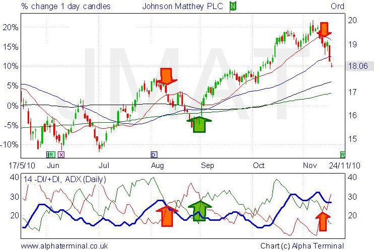

## Table of Contents

## What is the Positive Directional Indicator (PDI)?

The Positive Directional Indicator (PDI) is a technical analysis tool used in trading to measure the strength of an upward price movement in a market. It is part of the Directional Movement System, which also includes the Negative Directional Indicator (NDI) and the Average Directional Index (ADX). The PDI helps traders identify when a stock or other asset is experiencing bullish momentum, which can be useful for making buy or sell decisions.

To calculate the PDI, you need to look at the difference between the current high price and the previous high price. If this difference is positive and greater than the difference between the current low price and the previous low price, then the PDI value will be positive. Traders often use the PDI in combination with the NDI to see if the market is trending up or down. When the PDI is above the NDI, it suggests that the market is in an uptrend, which can be a signal for traders to consider buying.

## How is the Positive Directional Indicator calculated?

The Positive Directional Indicator (PDI) is calculated by looking at the difference between the current high price and the previous high price of a stock or other asset. If this difference is positive and bigger than the difference between the current low price and the previous low price, then the PDI value will be positive. This calculation helps traders see if there is a strong upward movement in the market.

To make the PDI more useful, traders often use a 14-day moving average of these differences. This smooths out the data and makes it easier to see trends over time. When the PDI is higher than the Negative Directional Indicator (NDI), it suggests that the market is in an uptrend, which can be a signal for traders to consider buying.

## What does the Positive Directional Indicator measure in a market?

The Positive Directional Indicator (PDI) measures how strong the upward price movement is in a market. It looks at the difference between the current high price and the previous high price. If this difference is positive and bigger than the difference between the current low price and the previous low price, the PDI value will be positive. This helps traders see if there is a strong upward trend happening.

Traders often use a 14-day moving average to smooth out the PDI values over time. This makes it easier to spot trends. When the PDI is higher than the Negative Directional Indicator (NDI), it suggests that the market is moving upwards. This can be a signal for traders to think about buying.

## How can beginners use the Positive Directional Indicator in trading?

Beginners can use the Positive Directional Indicator (PDI) to help them understand if a stock or other asset is going up in price. The PDI looks at the difference between the current high price and the previous high price. If this difference is positive and bigger than the difference between the current low price and the previous low price, the PDI will show a positive value. This means the market might be moving upwards. Beginners can watch the PDI to see if it's going up, which could be a good time to think about buying.

To make it easier, beginners can use a 14-day moving average of the PDI. This smooths out the numbers and helps them see the trend more clearly. When the PDI is higher than the Negative Directional Indicator (NDI), it suggests that the market is in an uptrend. This can be a signal for beginners to consider buying. By keeping an eye on the PDI and comparing it with the NDI, beginners can get a better idea of when to enter the market.

## What is the relationship between the Positive Directional Indicator and the Negative Directional Indicator?

The Positive Directional Indicator (PDI) and the Negative Directional Indicator (NDI) are both part of the Directional Movement System used in trading. The PDI looks at how much the price of a stock or asset is going up by comparing the current high price to the previous high price. If this difference is positive and bigger than the difference between the current low price and the previous low price, the PDI shows a positive value. This means the market might be moving up. On the other hand, the NDI looks at how much the price is going down by comparing the current low price to the previous low price. If this difference is positive and bigger than the difference between the current high price and the previous high price, the NDI shows a positive value, meaning the market might be moving down.

The relationship between the PDI and the NDI is important for traders because it helps them understand the direction of the market trend. When the PDI is higher than the NDI, it suggests that the market is in an uptrend, which could be a good time to think about buying. When the NDI is higher than the PDI, it suggests that the market is in a downtrend, which might be a good time to think about selling or waiting. By watching both indicators, traders can get a better idea of when to enter or exit the market.

## Can the Positive Directional Indicator be used alone, or should it be combined with other indicators?

The Positive Directional Indicator (PDI) can be used alone to see if the price of a stock or asset is going up. It looks at the difference between the current high price and the previous high price. If this difference is bigger than the difference between the current low price and the previous low price, the PDI shows a positive value. This means the market might be moving up. So, beginners can use the PDI by itself to get a simple idea of when to think about buying.

However, using the PDI with other indicators can give a better picture of the market. The PDI works well with the Negative Directional Indicator (NDI) to show if the market is going up or down. When the PDI is higher than the NDI, it suggests an uptrend, which might be a good time to buy. Also, using the Average Directional Index (ADX) with the PDI can help traders see how strong the trend is. So, while the PDI can be used alone, combining it with other indicators can help traders make better decisions.

## What are the common time frames for using the Positive Directional Indicator?

The Positive Directional Indicator (PDI) can be used with different time frames depending on what a trader wants to see. Short-term traders might use the PDI on time frames like 5 minutes, 15 minutes, or 1 hour to make quick decisions. These short time frames help them see fast changes in the market and decide when to buy or sell quickly.

For traders who want to hold onto their investments for a longer time, they might look at the PDI on daily, weekly, or even monthly charts. These longer time frames help them understand bigger trends in the market. By using the PDI over a longer period, they can make decisions about when to buy or sell that fit their longer-term goals.

## How does the Positive Directional Indicator help in identifying market trends?

The Positive Directional Indicator (PDI) helps traders see if a stock or other asset is going up in price. It does this by looking at the difference between the current high price and the previous high price. If this difference is positive and bigger than the difference between the current low price and the previous low price, the PDI will show a positive value. This means the market might be moving upwards. Traders can use the PDI to spot when the market is in an uptrend, which can be a good time to think about buying.

To make the PDI more helpful, traders often use it with the Negative Directional Indicator (NDI). When the PDI is higher than the NDI, it suggests that the market is going up. This can be a signal for traders to consider buying. Also, using a 14-day moving average of the PDI helps smooth out the numbers and makes it easier to see the trend over time. By watching both the PDI and NDI, traders can get a better idea of the market's direction and make smarter trading choices.

## What are the limitations of using the Positive Directional Indicator?

The Positive Directional Indicator (PDI) can be helpful for seeing if a stock or other asset is going up in price, but it has some limits. One big limit is that the PDI only looks at the upward movement of prices. It doesn't tell you anything about other important things like how much the price is moving or what the overall market is doing. This means you might see the PDI going up, but the market could still be going down because other things are happening.

Another thing to think about is that the PDI can give you false signals. Sometimes, the PDI might show that the market is going up, but it could be a short-term change and not a real trend. This can trick traders into making bad choices. To avoid this, it's a good idea to use the PDI with other tools like the Negative Directional Indicator (NDI) and the Average Directional Index (ADX). These can give you a fuller picture of what the market is doing.

## How can advanced traders optimize the settings of the Positive Directional Indicator for better results?

Advanced traders can optimize the settings of the Positive Directional Indicator (PDI) by adjusting the time period used for its calculation. The standard setting is often a 14-day moving average, but traders might find better results by using a shorter or longer period depending on their trading style. Shorter time periods, like 7 or 10 days, can make the PDI more sensitive to price changes, which is useful for short-term trading. Longer time periods, like 20 or 30 days, can smooth out the indicator and help identify longer-term trends, which is better for investors who hold onto their investments for a while.

Another way to optimize the PDI is by using it in combination with other technical indicators. Advanced traders might pair the PDI with the Negative Directional Indicator (NDI) and the Average Directional Index (ADX) to get a clearer picture of market trends. For example, they might set specific thresholds for when the PDI crosses above the NDI to signal a strong uptrend, or use the ADX to confirm the strength of the trend. By fine-tuning these settings and combinations, traders can better understand market movements and make more informed trading decisions.

## What are some real-world examples where the Positive Directional Indicator provided significant insights?

One real-world example where the Positive Directional Indicator (PDI) provided significant insights was during the tech stock surge in early 2020. As companies like Apple and Microsoft saw their stock prices rise due to increased demand for technology during the global shift to remote work, the PDI helped traders see this upward trend. By watching the PDI, traders could tell when the prices were consistently going up, which signaled a good time to buy these stocks. The PDI, when used with the Negative Directional Indicator (NDI), showed a clear uptrend, helping traders make confident decisions to invest in tech stocks at the right time.

Another example was during the recovery of the airline industry in late 2022. As travel restrictions began to ease and people started flying again, airline stocks like Delta and Southwest saw their prices start to climb. Traders used the PDI to spot this upward movement early on. The PDI showed positive values, indicating that the prices were indeed going up. By combining the PDI with the Average Directional Index (ADX), traders could also see how strong this trend was, helping them decide when to buy into the recovering airline stocks. This allowed them to take advantage of the market's upward movement and make profitable trades.

## How does the Positive Directional Indicator fit into a comprehensive trading strategy?

The Positive Directional Indicator (PDI) can be a useful part of a bigger trading plan. It helps traders see if the price of a stock or asset is going up. By watching the PDI, traders can tell when it might be a good time to buy because the market is moving upwards. But the PDI alone isn't enough. It's best used with other tools like the Negative Directional Indicator (NDI) and the Average Directional Index (ADX). When the PDI is higher than the NDI, it means the market is probably in an uptrend. This can be a signal for traders to think about buying. Using the ADX with the PDI can also help traders see how strong that trend is, making their trading choices even better.

In a full trading strategy, the PDI can help traders decide when to enter or leave the market. For example, if a trader sees that the PDI is going up and it's higher than the NDI, they might choose to buy a stock. They could also use other indicators like moving averages or the Relative Strength Index (RSI) to confirm what the PDI is showing. This way, they get a fuller picture of what's happening in the market. By combining the PDI with these other tools, traders can make smarter decisions about when to buy or sell, helping them manage their risks and aim for bigger profits.

## What is the formula and calculation for +DI?

The Positive Directional Indicator (+DI) is a vital component of technical analysis, quantifying the strength of an upward price movement. To compute +DI, traders use the formula: 

$$
+DI = \left( \frac{S \, +DM}{ATR} \right) \times 100
$$

where $+DM$ stands for Positive Directional Movement, which is calculated as the difference between the current high and the previous high: 

$$
+DM = \text{Current High} - \text{Previous High}
$$

The Average True Range (ATR) is used to normalize the movement, accounting for market [volatility](/wiki/volatility-trading-strategies). ATR itself is a commonly used metric that provides the average range of price movement over a specific period, commonly 14 days.

The calculation of +DI involves smoothing the directional movements over a selected period, typically using the following steps:

1. **Calculate +DM**: For each period, identify whether the current high is higher than the previous high. If it is, the difference is considered +DM, otherwise +DM is zero.

2. **Compute ATR**: Average the true range of each period over your chosen timeframe. The true range is the greatest of the current high minus the current low, the absolute value of the current high minus the previous close, or the absolute value of the current low minus the previous close.

3. **Smooth +DM and ATR**: Use exponential moving averages (EMA) over the period for both +DM and ATR to smooth these values.

4. **Calculate +DI**: Divide the smoothened +DM by the smoothened ATR and multiply by 100 to express the result as a percentage.

Here is a simple Python function that outlines these steps:

```python
import pandas as pd

def calculate_plus_di(highs, lows, closes, period=14):
    high_diff = highs.diff()
    low_diff = lows.diff()

    plus_dm = high_diff.where((high_diff > low_diff) & (high_diff > 0), 0)
    true_range = pd.concat([highs - lows, 
                            abs(highs - closes.shift()), 
                            abs(lows - closes.shift())], axis=1).max(axis=1)

    atr = true_range.rolling(window=period).mean()
    smoothed_plus_dm = plus_dm.rolling(window=period).mean()

    plus_di = (smoothed_plus_dm / atr) * 100

    return plus_di
```

This approach, which involves smoothing over a period like 14 days, aids in establishing the trend's direction more clearly by diminishing the effects of short-term fluctuations. Following these calculations, +DI is presented as a percentage, representing the strength and persistence of the uptrend detected in the market.

## References & Further Reading

[1]: Wilder, J. W. (1978). ["New Concepts in Technical Trading Systems,"](https://archive.org/details/newconceptsintec00wild) Trend Research.

[2]: Schwager, J. D. (1993). ["Technical Analysis,"](https://archive.org/details/technicalanalysi00schw) Wiley.

[3]: Pring, M. J. (2002). ["Technical Analysis Explained,"](https://www.amazon.com/Technical-Analysis-Explained-Fifth-Successful/dp/0071825177) McGraw-Hill Education.

[4]: Achelis, S. B. (1995). ["Technical Analysis from A to Z,"](https://archive.org/details/technicalanalysi00ache) McGraw-Hill Education.

[5]: Murphy, J. J. (1999). ["Technical Analysis of the Financial Markets: A Comprehensive Guide to Trading Methods and Applications,"](https://archive.org/details/technicalanalysi0000murp) New York Institute of Finance.