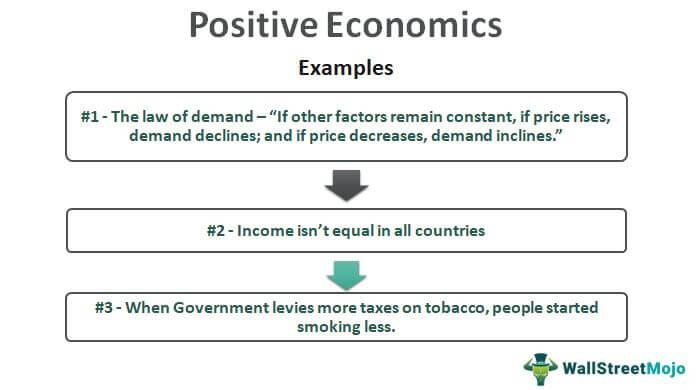

Studying the history of economic theory is crucial for understanding the evolution of human thought on resource allocation, decision-making, and policy formulation. By tracing the development of economic ideas, one can appreciate the shifts in paradigms that have influenced how economies operate today. Theories from thinkers like Adam Smith and John Maynard Keynes laid the groundwork for contemporary economic practices and policies, making it essential to comprehend their contributions and limitations. This historical perspective provides valuable lessons and insights that guide current and future economic strategies.

Positive economics, which focuses on objective analysis and empirical evidence, plays a vital role in modern economics. Unlike normative economics, which deals with what ought to be, positive economics examines what is and can guide decision-making without value judgments. This branch of economics provides models and predictions based on data, allowing policymakers and researchers to test hypotheses and inform regulations with scientifically-backed analyses. The relevance of positive economics in contemporary economics is evident in its capacity to underpin crucial policy decisions and academic research that reflect real-world complexities.



Algorithmic trading has become a cornerstone of modern financial systems, transforming how trades are executed in financial markets. By using algorithms to automate trading decisions, institutions can process vast amounts of data and execute trades at speeds unimaginable in traditional trading. This advancement has led to increased efficiency and liquidity in markets, although it also presents challenges such as market volatility and ethical concerns. Algorithmic trading exemplifies the application of economic theories and quantitative models in practice, illustrating their direct impact on financial systems.

This article examines the foundations of economic theory, starting with classical, neo-classical, and Keynesian economics, and their enduring influence on modern economic thought. It further explores the evolution of positive economics, highlighting the seminal contributions of figures like Milton Friedman. The discussion then focuses on the emergence of algorithmic trading, detailing its history, benefits, risks, and strategies. Finally, the article analyzes the interconnectedness between economics and algorithmic trading, considering how economic theories inform algorithmic strategies and what future trends and challenges lie ahead.

By understanding these topics, readers interested in finance and economics can gain a comprehensive view of both the historical context and the contemporary dynamics shaping today’s financial landscapes. The exploration encourages further inquiry into how these economic theories and practices continue to evolve and influence global markets.

## Table of Contents

## The Foundation of Economic Theory

Economic theory's foundations trace back to the works of classical economists such as Adam Smith and David Ricardo. These thinkers laid the groundwork for understanding how markets function, emphasizing concepts like the division of labor, specialization, and free markets.

### Classical Economics

**Adam Smith** is often regarded as the father of modern economics. In his seminal work, "The Wealth of Nations" (1776), he introduced the idea of the "invisible hand," suggesting that individuals seeking their self-interest in competitive markets lead to economic prosperity and efficiency. Smith's theories emphasized that governments should limit intervention in markets, allowing natural laws of supply and demand to dictate production and pricing.

**David Ricardo**, another classical economist, advanced the theory of comparative advantage, which asserts that nations should specialize in producing goods they can produce most efficiently, even if they are not the most efficient across all industries. This specialization leads to increased overall economic welfare and forms the basis for international trade.

### Transition to Neo-Classical Economics

The late 19th century witnessed a transition from classical to neo-classical economics. This era was marked by the marginal revolution, which introduced the importance of marginal utility in determining value, a departure from the labor theory of value advocated by classical economists.

**William Stanley Jevons**, **Carl Menger**, and **Leon Walras** were central figures in this transition. They introduced mathematical and methodological rigor into economic analysis, focusing on individual preferences and the utility derived from goods. Neo-classical economics brought forth the notion of equilibrium, where supply equates demand, analyzed through calculus and models.

### Keynesian Economics

The 20th century witnessed the rise of Keynesian economics, born from the challenges posed by the Great Depression. **John Maynard Keynes** presented ideas in "The General Theory of Employment, Interest, and Money" (1936) that challenged classical economics, particularly the notion that markets always self-correct.

Keynes argued that active government intervention is necessary to manage economic cycles. He emphasized the role of aggregate demand and the impact of investment on income and employment, advocating for fiscal and monetary policies to mitigate economic downturns. His work laid the foundation for macroeconomic policy and transformed economics, providing governments a toolkit to combat recessions and manage economic stability.

### Significance and Relevance Today

The foundational theories of classical, neo-classical, and Keynesian economics significantly shaped modern economic thought and practices. The classical ideas of free markets and efficiency continue to influence policies promoting deregulation and free trade. Neo-classical principles underpin contemporary microeconomic analysis, utilized in modeling consumer behavior, firm decisions, and market outcomes.

Keynesian economics remains highly relevant, especially during periods of economic instability. Policymakers worldwide continue to deploy Keynesian-inspired fiscal and monetary measures in response to financial crises and economic recessions, as seen during the 2008 financial crisis and the COVID-19 pandemic.

### Continued Relevance

These foundational theories endure as integral building blocks of economic analysis. For example, trade policies and international economic relations often invoke Ricardo's comparative advantage. Neo-classical economics provides tools for analyzing market structures, such as oligopolies and monopolistic competition, with demand-supply models and utility maximization techniques used daily by economists and policymakers. Keynesian economics provides a framework for understanding how aggregate demand influences employment and output, guiding interventions in national budgets and monetary policies.

In summary, the evolution from classical to Keynesian economics established the core principles that continue to guide economic theory and practice, demonstrating their timelessness and adaptability to new challenges.

## Evolution of Positive Economics

Positive economics is a branch of economic analysis that focuses on describing and predicting economic phenomena without prescribing policies or norms. It aims to objectively study and explain how economic systems function, relying heavily on empirical data and observation. This approach contrasts with normative economics, which involves value judgments and recommendations about what economic policies should be pursued.

Milton Friedman is a pivotal figure in the development of positive economics. In his influential essay "The Methodology of Positive Economics," Friedman argued that the merit of a theory should not be judged by the realism of its assumptions but by the accuracy of its predictions. This pragmatic stance emphasized the importance of testable hypotheses and led to a more scientifically grounded approach in economic analysis.

Empirical data and rigorous testing are central to positive economics. Economists collect data from real-world observations and use statistical tools to test hypotheses about economic behaviors and markets. This practice helps isolate causal relationships and enhances the precision of economic forecasts. Techniques such as regression analysis, econometric modeling, and data visualization are frequently employed to interpret complex datasets.

In contemporary contexts, positive economics finds significant applications in policy formulation and academic research. Policymakers rely on objective analyses provided by positive economics to craft interventions that address economic issues such as inflation, unemployment, and trade imbalances. For instance, central banks use econometric models to predict the outcomes of monetary policy changes. Similarly, in academia, positive economics underlies much of the empirical research that explores economic phenomena like growth patterns, consumer behavior, and market dynamics.

Case studies that highlight the impact of positive economics include its role in shaping monetary policies in various countries. By employing economic models rooted in positive analysis, central banks can simulate potential scenarios and make informed decisions. For example, during financial crises, positive economic models help predict the outcomes of [interest rate](/wiki/interest-rate-trading-strategies) adjustments or quantitative easing measures, guiding policymakers toward effective strategies. Moreover, positive economics has been instrumental in evaluating the economic impacts of global trade policies, providing clarity on outcomes versus theoretical expectations. This evidence-based approach not only informs economic policy but also enriches academic discourse by challenging or confirming theoretical postulates with empirical evidence.

 to Algorithmic Trading

Algorithmic trading refers to the use of computer algorithms to execute trading orders in financial markets at speeds and frequencies that are impossible for human traders. These algorithms follow a predefined set of rules for placing trades, factoring in variables such as timing, price, and [volume](/wiki/volume-trading-strategy). The primary objective is to profit from strategies derived from statistical analysis and market data.

The evolution of [algorithmic trading](/wiki/algorithmic-trading) began in the 1970s with the advent of electronic trading platforms, marking a shift from traditional open outcry exchanges. In the subsequent decades, technological advancements such as high-frequency trading ([HFT](/wiki/high-frequency-trading-strategies)) systems and complex algorithms enhanced the capabilities of automated trading. The increased computational power and reduced transaction costs contributed to the rapid growth of algorithmic trading, especially since the 1990s.

Several technological advancements have facilitated the rise of algorithmic trading. The development of high-speed internet and enhanced computational capacities allows for real-time data processing and swift execution of trades. Advances in big data analytics enable traders to process and analyze vast amounts of market data, identifying patterns and opportunities for trading. Machine learning and [artificial intelligence](/wiki/ai-artificial-intelligence) have introduced adaptive algorithms that can modify themselves in response to new data, further improving trade accuracy and profitability.

Algorithmic trading offers numerous advantages, such as increased market [liquidity](/wiki/liquidity-risk-premium) and reduced transaction costs. It enables the execution of trades at optimal speed and efficiency, minimizing human errors. However, it also poses risks, including market [volatility](/wiki/volatility-trading-strategies) and the potential for systemic failures. The flash crash of 2010, where major US stock indices rapidly fell and recovered, highlights the risks associated with high-frequency algorithmic trading.

Various types of algorithmic trading strategies are used today. Statistical [arbitrage](/wiki/arbitrage) seeks to exploit pricing inefficiencies between related financial instruments through mean reversion models. Market-making strategies involve continuously buying and selling securities to capture the spread between bid and ask prices. Momentum-based strategies capitalize on continuing trends, while pairs trading identifies correlations between asset prices. Trend-following algorithms focus on identifying and riding market trends, predicting that assets in motion will continue their movement.

In conclusion, algorithmic trading has revolutionized the financial markets by leveraging computational technologies to create efficient and sophisticated trading strategies. While offering significant benefits, it comes with its own set of challenges and risks that must be managed carefully.

## Interconnection: Economics and Algorithmic Trading

Positive economics plays a crucial role in the landscape of algorithmic trading by providing empirical insights and data-driven models that inform trading strategies. Unlike normative economics, which focuses on what ought to be, positive economics aims to explain and predict real-world behaviors through empirical observation and data analysis. This objective approach is pivotal in the development of algorithmic trading strategies where market behaviors must be predicted and acted upon in real-time.

### Economic Theories Underpinning Market Behaviors

Algorithmic trading relies heavily on economic theories of market efficiency, rational behavior, and price dynamics. The Efficient Market Hypothesis (EMH), for example, posits that asset prices fully reflect all available information. This theory suggests that it is impossible to consistently achieve returns higher than average market returns on a risk-adjusted basis. Traders use this hypothesis to design algorithms that exploit slight anomalies in asset pricing, aiming for high-frequency trades that capitalize on brief opportunities before they self-correct.

Another key concept is the Rational Expectations Theory, which posits that individuals make decisions based on their rational outlook, available information, and past experiences. In algorithmic trading, this theory aids in the modeling of predictive algorithms that anticipate market movements based on historical data and apparent market sentiment.

### Relationship Between Financial Market Theories and Technological Advancements

Technological advancements have provided the tools necessary to apply complex economic theories to real-time trading. High-speed computing, big data analytics, and advanced programming languages like Python and C++ enable traders to design algorithms that analyze large volumes of data, identify patterns, and execute trades within milliseconds. This symbiotic relationship between theory and technology has pushed algorithmic trading to the forefront of modern finance.

### Application of Economic Concepts in Algorithm Design

Economic concepts are directly applied in designing algorithms that perform specific tasks. For example, mean reversion—a financial theory suggesting that asset prices and historical returns revert to their long-term mean or average level—is often coded into trading algorithms. A simple mean reversion strategy in Python might look like this:

```python
import numpy as np
import pandas as pd

# Assume data is a DataFrame with historical price data
data['Moving Average'] = data['Price'].rolling(window=20).mean()

def mean_reversion_strategy(data):
    buy_signals = []
    sell_signals = []
    for i in range(len(data)):
        if data['Price'][i] < data['Moving Average'][i]:
            buy_signals.append(i)
        elif data['Price'][i] > data['Moving Average'][i]:
            sell_signals.append(i)
    return buy_signals, sell_signals

buy, sell = mean_reversion_strategy(data)
```

This code identifies buying opportunities when the current price is below the moving average and selling when above, reflecting the mean reversion principle.

### Implications of Algorithmic Trading on Economic Efficiency and Market Dynamics

Algorithmic trading has profound implications for economic efficiency and market dynamics. By rapidly processing information and executing trades, algorithms contribute to market liquidity and price discovery, potentially leading to more efficient markets. However, the same systems can also increase volatility, as seen in events like the 2010 Flash Crash, where rapid, automated sell-offs caused temporary market disruptions.

The integration of positive economics in algorithmic trading highlights an evolving interplay where empirical analysis and technological sophistication bolster trading strategies, underscoring the significance of economic theory across financial systems globally.

## Current Trends and Challenges in Algorithmic Trading

Algorithmic trading has undergone significant transformation with the introduction of big data and [machine learning](/wiki/machine-learning) technologies. These advancements have enabled the analysis of vast datasets and the identification of complex patterns, enhancing the precision and efficiency of trading strategies. Machine learning algorithms can develop predictive models that assess the probability of various market outcomes, enabling traders to make more informed decisions. One typical example is the use of neural networks, which can detect non-linear relationships in data, providing a competitive edge in predicting stock price movements.

The integration of AI-driven strategies in algorithmic trading provides multiple advantages, including speed and accuracy. By processing data more quickly than human traders, AI systems can execute trades at optimal times, thereby maximizing profits. However, this technological edge also introduces substantial regulatory and ethical challenges. Regulatory authorities face the task of setting boundaries that prevent market manipulation while still allowing innovation. The automation inherent in algorithmic trading poses ethical questions regarding fairness, as unequal access to technology can lead to market disparities.

The current economic landscape profoundly affects algorithmic trading decisions. Economic indicators such as interest rates, inflation, and GDP growth are crucial inputs for trading algorithms. For instance, in periods of economic instability, algorithms may be adjusted to adopt more conservative strategies to mitigate risk. These adjustments require continuous fine-tuning of algorithms to align with ever-changing economic conditions, demonstrating the dynamic interplay between economic environments and trading strategies.

Looking ahead, the future potential of algorithmic trading bears both opportunities and challenges. The rapid adoption of AI and machine learning technologies suggests an optimistic trajectory for enhanced trading systems. However, foreseeable challenges include the need for improved data quality, the complexity of real-time processing, and the need for robust safeguards against systemic risks. Establishing ethical standards and regulatory frameworks will be vital in ensuring the sustainability and integrity of algorithmic trading as it evolves within diverse economic contexts.

## Conclusion

The historical evolution of economic theory has laid a robust foundation for modern finance. From the classical perspectives of Adam Smith and David Ricardo, to the transformative insights of Keynesian economics, these theories have impacted financial practices and policy-making over centuries. In the contemporary setting, the principles derived from these seminal works continue to inform economic models and financial systems, demonstrating their enduring relevance.

Positive economics, with its focus on objective analysis and data-driven insights, has significantly shaped empirical policies and financial innovations. Pioneered by thinkers like Milton Friedman, it emphasizes the importance of predictions based on observable phenomena, which has become crucial in developing effective economic policies and advancing financial technologies. By stressing empirical validation, positive economics has facilitated a more rigorous approach to understanding economic dynamics and designing interventions that reflect real-world complexities.

Algorithmic trading represents a salient intersection of economic theories and technological advancement, reshaping how financial markets operate. By employing algorithms that interpret market data to drive trading decisions, these automated systems leverage economic theories related to market behaviors and efficiency. The rise of algorithmic trading has introduced both opportunities and challenges: while it has increased market liquidity and trade execution speed, it also poses risks related to market volatility and systemic stability. The impacts of algorithmic trading underscore the necessity for ongoing research and adaptation in both economic and regulatory frameworks to ensure balanced growth in financial markets.

Encouraging further study in economics and financial technology is vital to developing innovative solutions and adapting to the rapidly evolving financial landscape. Interdisciplinary research at the nexus of economics, data science, and finance technology promises to uncover new insights and foster advancements that could enhance economic structures globally.

In closing, the continuous exploration of economic theories and financial innovations holds the potential to not only elucidate complex market phenomena but also inspire transformative changes in financial systems. By building on the legacy of past economic thought and embracing the possibilities offered by new technologies like algorithmic trading, future generations can foster a more dynamic and efficient global economy. The journey of economics and finance is one of perpetual discovery, and its pursuit remains as crucial today as ever.

## References & Further Reading

[1]: Smith, A. (1776). ["The Wealth of Nations."](https://en.wikipedia.org/wiki/The_Wealth_of_Nations) London: W. Strahan and T. Cadell.

[2]: Friedman, M. (1953). ["The Methodology of Positive Economics."](https://www.cambridge.org/core/books/methodology-of-positive-economics/methodology-of-positive-economics-1953/CFF7143A05C9A667D3E54E9AD747A98A) Essays in Positive Economics. University of Chicago Press.

[3]: Keynes, J.M. (1936). ["The General Theory of Employment, Interest, and Money."](https://www.files.ethz.ch/isn/125515/1366_KeynesTheoryofEmployment.pdf) London: Palgrave Macmillan.

[4]: Ricardo, D. (1817). ["On the Principles of Political Economy and Taxation."](https://www.econlib.org/library/Ricardo/ricP.html) London: John Murray.

[5]: Chan, E. (2009). ["Quantitative Trading: How to Build Your Own Algorithmic Trading Business."](https://github.com/ftvision/quant_trading_echan_book) Wiley Trading. 

[6]: Lopez de Prado, M. (2018). ["Advances in Financial Machine Learning."](https://www.amazon.com/Advances-Financial-Machine-Learning-Marcos/dp/1119482089) Wiley.

[7]: Jansen, S. (2020). ["Machine Learning for Algorithmic Trading."](https://github.com/stefan-jansen/machine-learning-for-trading) Packt Publishing.

[8]: Aronson, D.R. (2007). ["Evidence-Based Technical Analysis: Applying the Scientific Method and Statistical Inference to Trading Signals."](https://onlinelibrary.wiley.com/doi/book/10.1002/9781118268315) Wiley Trading.