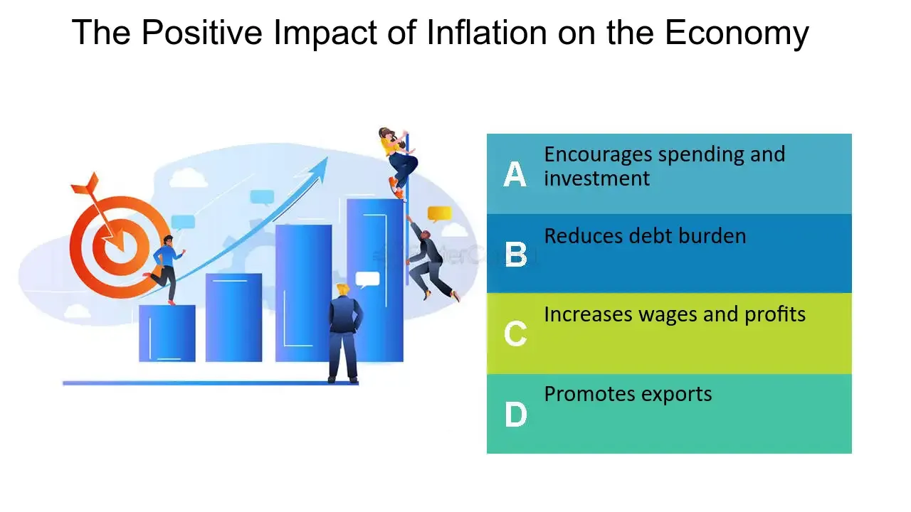

## Table of Contents

## What is inflation and how is it measured?

Inflation is when the prices of things we buy, like food and clothes, go up over time. It means that the money we have can buy less stuff than before. Imagine if a candy bar cost $1 last year, but this year it costs $1.10. That's inflation happening. It happens because the demand for things can go up, or it might cost more to make them, or there might be too much money floating around.

To measure inflation, people look at something called the Consumer Price Index, or CPI. The CPI is like a big list of things that people usually buy, like groceries, gas, and rent. Every month, people check the prices of these things and see how much they've changed from last month or last year. If the prices have gone up a lot, then inflation is high. If they haven't changed much, then inflation is low. This helps us understand how fast our money is losing its value.

## Can inflation have any positive effects on the economy?

Yes, inflation can have some good effects on the economy. One good thing is that it can make people spend their money instead of saving it. When people think prices will go up, they might buy things now rather than later. This can help businesses sell more stuff and grow. It can also help the economy keep moving because when people spend, it creates jobs and more money for everyone.

Another positive effect is that inflation can help reduce the burden of debt. If you owe money, like a loan, and inflation goes up, the money you pay back is worth less than when you borrowed it. This means it's easier to pay off your debt because the value of the money you owe goes down. This can be good for people and businesses that have a lot of debt, making it easier for them to spend money on other things and help the economy grow.

## How does inflation encourage spending and investment?

Inflation encourages spending because people know that prices will be higher in the future. If you think the price of a toy will go up next month, you might want to buy it now. This makes people spend their money instead of saving it. When people spend more, stores sell more things, and this can help the economy grow. More spending means businesses can hire more workers, and everyone has more money to spend.

Inflation also encourages investment. When prices are going up, keeping money in a savings account might not be a good idea because the money will be worth less later. So, people might put their money into things like stocks, real estate, or businesses. These investments can grow faster than inflation, helping people's money keep its value or even increase. This can lead to more business activity and more growth in the economy.

## What role does inflation play in reducing the burden of debt?

Inflation can help make debt easier to pay back. Imagine you borrowed $100 when a candy bar cost $1. If inflation goes up and now that same candy bar costs $1.10, the $100 you owe is worth less. You're paying back the same amount of money, but it's not as valuable as it was before. This means the debt feels lighter because the money you're using to pay it off is worth less than when you borrowed it.

This can be really helpful for people and businesses that have a lot of debt. When inflation makes the money they owe worth less, it's easier for them to pay it back. They can use the money they save to spend on other things or invest in new projects. This can help the economy grow because when people and businesses have less debt to worry about, they can spend and invest more freely.

## How can inflation lead to higher wages and employment?

When inflation goes up, it can lead to higher wages because workers want their pay to keep up with the rising prices. If the cost of living goes up, people need more money to buy the same things they used to. So, they might ask their bosses for a raise. If lots of people do this, companies might have to pay more to keep their workers happy. This can lead to higher wages across the board.

Higher wages can also lead to more jobs. When people have more money, they spend more. This means businesses sell more stuff and need more workers to keep up with the demand. So, they might hire more people. This can lead to lower unemployment because more people have jobs. In this way, inflation can help the economy by making wages go up and creating more jobs.

## In what ways does inflation affect economic growth?

Inflation can help the economy grow by making people spend more. When prices go up, people might buy things now instead of waiting because they know it will cost more later. This spending helps businesses sell more stuff, which can lead to more jobs and more money for everyone. When businesses do well, they might invest in new projects or expand, which also helps the economy grow. So, a little bit of inflation can keep the economy moving and growing.

But too much inflation can be bad for the economy. If prices go up too fast, people might not be able to afford things, and they might stop spending. This can hurt businesses because they sell less, and they might have to cut jobs or close down. Also, if people think inflation is out of control, they might lose trust in the money and the economy. This can make it hard for the economy to grow because people are scared to spend or invest. So, it's important to have just the right amount of inflation to help the economy without causing problems.

## How does moderate inflation help in maintaining economic stability?

Moderate inflation helps keep the economy stable by encouraging people to spend and invest. When prices go up a little bit, people know that waiting to buy things might cost them more later. So, they spend their money now instead of saving it. This spending helps businesses sell more stuff, which can lead to more jobs and more money for everyone. When businesses do well, they might invest in new projects or expand, which keeps the economy moving and growing.

But it's important that inflation stays moderate and doesn't get too high. If prices go up too fast, people might not be able to afford things, and they might stop spending. This can hurt businesses because they sell less, and they might have to cut jobs or close down. Keeping inflation at a moderate level helps avoid these problems and keeps the economy stable. It's like finding the right balance so that the economy can grow without getting out of control.

## What is the relationship between inflation and asset prices?

Inflation can make the prices of things like houses, stocks, and other assets go up. When people see that the prices of everyday things are going up, they might want to put their money into assets instead of keeping it in a bank. This is because they think that assets will go up in value faster than inflation. So, more people buying assets can push their prices higher. For example, if everyone starts buying houses because they think prices will keep going up, the price of houses will go up too.

But, if inflation gets too high, it can also make asset prices go down. When prices go up a lot, people might start to worry about the economy. They might think that things are getting too expensive and that the economy might be in trouble. This can make them sell their assets, like stocks or houses, to get cash. When lots of people sell at the same time, the prices of those assets can go down. So, while a little bit of inflation can help asset prices go up, too much inflation can make them go down.

## How does inflation impact different sectors of the economy?

Inflation affects different parts of the economy in different ways. For businesses that sell things like food or gas, inflation can be good because it means they can charge more for their products. But it can also be bad if the cost of making these things goes up too much. For example, if a farmer has to pay more for seeds and fertilizer, they might not make as much money even if they charge more for their crops. On the other hand, businesses that make things like cars or electronics might have a harder time because people might not want to buy expensive things when prices are going up.

For people who work, inflation can mean they need to ask for higher wages to keep up with the rising cost of living. If they get higher wages, they might spend more money, which can help the economy grow. But if wages don't go up as fast as prices, people might have to cut back on spending, which can hurt businesses. For people who save money, inflation can be bad because the money they have saved will be worth less over time. They might need to find other ways to invest their money to keep up with inflation.

Different sectors also feel inflation differently. For example, the housing market might see prices go up because people want to buy homes as a way to protect their money from losing value. But if inflation gets too high, it can make it harder for people to afford homes, which can slow down the housing market. The stock market can also go up with moderate inflation because companies can charge more for their products, but too much inflation can make people worried about the economy, causing stock prices to drop. So, inflation can have a big impact on how different parts of the economy do.

## What are the mechanisms through which inflation can stimulate economic activity?

Inflation can help the economy grow by making people spend their money instead of saving it. When people see that prices are going up, they might want to buy things now before they get even more expensive. This spending helps businesses sell more stuff, which can lead to more jobs and more money for everyone. When businesses do well, they might invest in new projects or expand, which keeps the economy moving and growing. So, a little bit of inflation can keep the economy active by encouraging people to spend and businesses to invest.

Another way inflation can stimulate economic activity is by making debt easier to pay back. If you owe money, like a loan, and inflation goes up, the money you pay back is worth less than when you borrowed it. This means it's easier to pay off your debt because the value of the money you owe goes down. When people and businesses have less debt to worry about, they can spend and invest more freely. This can help the economy grow because more spending and investment means more business activity and more jobs.

## How do central banks use inflation targeting to manage economic policy?

Central banks use inflation targeting to keep the economy stable. They set a goal for how much they want prices to go up each year, usually around 2%. By doing this, they can make sure that inflation stays at a level that helps the economy grow without causing problems. If inflation is too low, the central bank might lower interest rates to make borrowing cheaper. This can encourage people and businesses to spend and invest more, which can help the economy grow. If inflation is too high, the central bank might raise interest rates to make borrowing more expensive. This can slow down spending and help bring inflation back to the target level.

Inflation targeting helps people and businesses plan for the future. When they know what the central bank is trying to do with inflation, they can make better decisions about spending, saving, and investing. This can make the economy more predictable and stable. By keeping inflation at a moderate level, central banks can help create a good environment for economic growth. This means more jobs and more money for everyone, which is good for the whole economy.

## What are the long-term effects of sustained inflation on economic health and policy?

Sustained inflation over a long time can make the economy less healthy. If prices keep going up and up, people might start to think their money isn't worth as much. This can make them spend less and save more, which can slow down the economy. Businesses might also have a harder time because they have to pay more for things they need to make their products. If inflation stays high for too long, it can make people lose trust in the money and the economy, which can lead to even bigger problems. This is why central banks work hard to keep inflation at a moderate level.

In the long run, high inflation can also make it harder for the government to make good economic policies. If prices are going up too fast, the government might have to raise interest rates to slow down the economy. But this can make it harder for people and businesses to borrow money, which can hurt growth. On the other hand, if the government keeps interest rates too low to try to help the economy, it might make inflation even worse. So, finding the right balance is really important. By keeping inflation at a steady, moderate level, the government can help create a stable environment where the economy can grow and people can plan for the future.

## References & Further Reading

[1]: Bergstra, J., Bardenet, R., Bengio, Y., & Kégl, B. (2011). ["Algorithms for Hyper-Parameter Optimization."](https://papers.nips.cc/paper/4443-algorithms-for-hyper-parameter-optimization) Advances in Neural Information Processing Systems 24.

[2]: ["Advances in Financial Machine Learning"](https://www.amazon.com/Advances-Financial-Machine-Learning-Marcos/dp/1119482089) by Marcos Lopez de Prado

[3]: ["Evidence-Based Technical Analysis: Applying the Scientific Method and Statistical Inference to Trading Signals"](https://www.amazon.com/Evidence-Based-Technical-Analysis-Scientific-Statistical/dp/0470008741) by David Aronson

[4]: ["Machine Learning for Algorithmic Trading"](https://github.com/stefan-jansen/machine-learning-for-trading) by Stefan Jansen

[5]: ["Quantitative Trading: How to Build Your Own Algorithmic Trading Business"](https://www.amazon.com/Quantitative-Trading-Build-Algorithmic-Business/dp/1119800064) by Ernest P. Chan