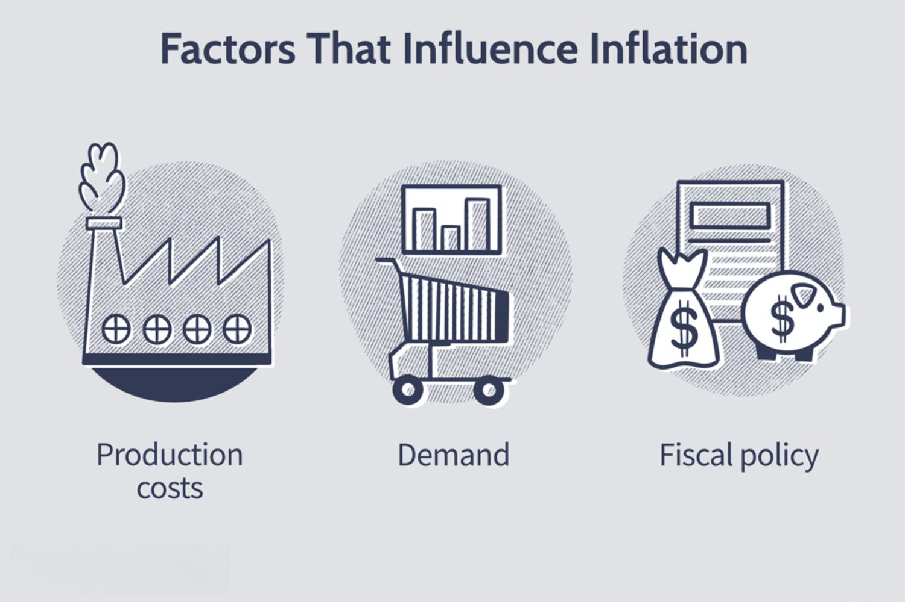

Inflation is a critical and often debated aspect of economic theory and practice. It measures the rate at which the general price level of goods and services in an economy rises, eroding purchasing power of currency. Common perceptions of inflation vary, with some viewing it as a detrimental force that decreases consumer purchasing power and creates uncertainty in markets. Economists often measure inflation using indices like the Consumer Price Index (CPI) and the Producer Price Index (PPI). While high inflation levels are typically seen as harmful to the economy, moderate inflation is sometimes viewed as a sign of economic growth and can encourage spending rather than hoarding money.

In recent years, algorithmic trading has emerged as a pivotal component of the modern financial landscape, leveraging complex algorithms and vast datasets to execute trades at speeds and frequencies far beyond human capability. Algorithmic trading involves the use of computer algorithms to automatically make trading decisions, submit orders, and manage portfolios. It plays a crucial role in enhancing market efficiency, liquidity, and enabling sophisticated strategies that were previously impracticable. Algorithms are designed to analyze market conditions and execute trades when specific, pre-set conditions are met.



This article aims to explore the unexpected yet potentially positive effects of inflation on algorithmic trading. While inflation traditionally presents challenges, it can also offer unique opportunities for traders utilizing algorithmic strategies. The relationship between inflation and algorithmic trading is multifaceted; understanding this dynamic can reveal how certain algorithms thrive under inflation-induced market volatility.

Key points to be discussed include the economic implications of inflation, the mechanics and benefits of algorithmic trading, and how inflation can create opportunities for profitable trading strategies. Additionally, the article will examine real-world case studies where algorithmic trading excelled during inflationary periods, alongside the challenges and considerations faced in such environments. The discussion will conclude with insights into future trends in algorithmic trading, particularly against the backdrop of fluctuating inflation rates and technological advancements in machine learning and artificial intelligence.

## Table of Contents

## Understanding Inflation and Its Economic Impact

Inflation refers to the rate at which the general level of prices for goods and services rises, subsequently eroding the purchasing power of a currency. It is typically measured by various indices, with the Consumer Price Index (CPI) and the Producer Price Index (PPI) being the most commonly used. The CPI measures changes in the price level of a basket of consumer goods and services purchased by households, while the PPI measures changes from the perspective of sellers. Both indices are critical in understanding the cost dynamics faced by consumers and producers.

Economically, inflation presents both challenges and opportunities. One primary challenge is its effect on purchasing power. As prices increase, the value of money diminishes, meaning consumers can buy fewer goods and services with the same amount of money. This can lead to a decrease in real income and savings. For businesses, inflation often results in higher production costs, particularly if input prices rise faster than the end prices that consumers are willing to pay. This can lead to squeezed profit margins unless the company can pass on the extra costs to consumers.

However, inflation can also present opportunities. Moderate inflation is often associated with economic growth; it may encourage spending and investing rather than hoarding cash that depreciates in value. This can stimulate various sectors of the economy, leading to increased demand for goods and services. Additionally, inflation can reduce the real value of debt, benefiting borrowers who are able to repay loans with money that is worth less than when they borrowed it.

Different sectors respond to inflation in varied ways. The real estate sector, for instance, may benefit from inflation as property values and rental income generally increase. Conversely, sectors heavily reliant on imported goods can suffer due to increased costs. The financial sector may experience heightened [volatility](/wiki/volatility-trading-strategies), which, while risky, can provide avenues for profit through strategic investments and trades.

Overall, understanding inflation involves recognizing its dual role as both a disruptor and a growth indicator within the economy. Its impact is broad, affecting consumers, businesses, and policymakers, each needing to adapt to a shifting economic landscape.

## Algorithmic Trading: An Overview

Algorithmic trading, often referred to as algo trading, is a method of executing orders using automated and pre-programmed trading instructions to account for variables such as price, timing, and [volume](/wiki/volume-trading-strategy). It utilizes complex algorithms, mathematical models, and high-speed computational capabilities to continuously monitor the markets and execute trades at optimal times.

The implementation of [algorithmic trading](/wiki/algorithmic-trading) has transformed financial markets significantly since its inception. Initially adopted in the late 20th century, it has gained increasing traction due to its ability to mitigate human error, enhance trading capabilities, and make split-second decisions that would be impossible for human traders. As of the latest trends, algorithmic trading accounts for a substantial portion of trading volume in some of the largest financial markets globally.

Technology has been a significant driver behind the growth of algorithmic trading. Advanced computing power facilitates the processing of vast amounts of data rapidly. Algorithms analyze this data to identify patterns and trends that inform trading strategies. Additionally, the proliferation of high-frequency trading ([HFT](/wiki/high-frequency-trading-strategies)), a subset of algorithmic trading characterized by high speeds and extremely high turnover rates, leverages low-latency networks to place a large number of orders within very short timeframes.

Algorithmic trading strategies can vary widely, often tailored to specific goals or market conditions. Common strategies include [market making](/wiki/market-making), [arbitrage](/wiki/arbitrage), [trend following](/wiki/trend-following), and [statistical arbitrage](/wiki/statistical-arbitrage). Market making involves placing a limit order both at the bid and ask price to profit from the difference in the spread. Arbitrage seeks to exploit price differentials across markets or instruments. Trend following strategies capitalize on market [momentum](/wiki/momentum), while statistical arbitrage uses quantitative models to identify relative value disparities.

One substantial advantage of algorithmic trading is its efficiency. Automated systems can handle multiple transactions simultaneously, at rates far superior to traditional methods. This scalability can lead to reduced transaction costs and improved order execution. Furthermore, algorithmic trading minimizes the impact of human emotions, such as fear and greed, which can lead to irrational decisions in volatile markets.

Moreover, the [backtesting](/wiki/backtesting) of strategies with historical data is another benefit. This allows traders to refine their algorithms and assess potential performance prior to live deployment, which enhances strategic robustness. Risk management, too, can be systematically incorporated into algorithms to respond instantaneously to adverse market movements.

In conclusion, algorithmic trading represents a significant evolution in the practice of trading. Its mechanized approach offers increased precision, efficiency, and speed, distinguishing it from traditional discretionary trading methods. As financial markets continue to evolve, algorithmic trading is poised to further consolidate its role as a cornerstone of modern trading strategies.

## Positive Effects of Inflation on Algorithmic Trading

Inflation, characterized by rising prices, can significantly impact financial markets, often heightening uncertainty and volatility. This setting becomes fertile ground for algorithmic trading, which capitalizes on rapid market movements and inefficiencies. Here's an exploration of how inflationary pressures can create lucrative opportunities for algorithmic traders.

### Profitable Opportunities Through Inflation-Induced Volatility

Inflation often leads to increased volatility in financial markets as investors react to changing economic conditions. Prices can become more erratic, providing frequent trading signals for algorithms designed to exploit these fluctuations. High-frequency trading (HFT) algorithms, in particular, are well-positioned to benefit from this scenario. These algorithms can execute trades in fractions of a second, allowing them to take advantage of price discrepancies before they vanish. The formula \[ P = V \cdot C \] where $P$ is the profit potential, $V$ is the volume of trades, and $C$ is the change in price, illustrates how increasing volatility $C$ enhances profit opportunities for high-frequency traders leveraging large transaction volumes $V$.

### Volatility Benefits for High-Frequency Trading Algorithms

During inflationary periods, the swift shifts in market sentiment and speculation on future price levels heighten volatility. For high-frequency trading algorithms, this entails a greater number of trading opportunities that can be exploited within milliseconds, optimizing returns through sheer transaction speed. Consider the case of a typical pair-trading strategy, where algorithms trade based on the price difference between related securities. If the price covariance increases due to inflationary volatility, algorithms can execute more trades as these price relationships diverge and converge swiftly, thus capitalizing on the transient arbitrage opportunities.

### Algorithmic Strategies Thriving on Inflation

Several algorithmic strategies are particularly effective in inflationary environments. 

1. **Trend Following:** When inflation expectations adjust, markets may establish new price trends. Algorithms can be programmed to identify and follow these trends, entering and exiting positions as momentum dictates.

2. **Mean Reversion:** Despite volatility, prices often revert to their mean over time. Algorithmic strategies can detect deviations from the historical average price and place trades anticipating a return to the norm. Such strategies are enhanced by inflation-driven volatility, which frequently pushes prices away from the mean.

3. **Arbitrage:** In periods of high inflation, differences in the pricing of financial instruments across markets become more pronounced. Algorithms adept at identifying and swiftly executing arbitrage opportunities can benefit considerably.

For example, during inflationary periods, commodity markets may react strongly to news about supply chain disruptions, creating spreads between futures contracts that algorithms can exploit as these spreads eventually converge.

In conclusion, inflation introduces a unique dynamic to financial markets that, despite its challenges, offers rich opportunities for algorithmic trading. The relentless pace and precision of algorithms make them particularly adept at navigating the volatility and complexity introduced by inflation, enabling them to uncover and capitalize on transient market opportunities.

## Case Studies: Successful Algorithmic Trading in Inflationary Periods

During periods of high inflation, certain firms and instances have shown remarkable success in leveraging algorithmic trading to capitalize on market volatility. This section highlights key examples and the strategies they employed.

### Case Study 1: High-Frequency Trading (HFT) Firm During the 2008 Financial Crisis

One notable example is a high-frequency trading firm that thrived during the 2008 financial crisis, a period marked by significant inflationary pressures. The firm utilized advanced HFT algorithms designed to exploit minute price discrepancies across various asset classes. By employing statistical arbitrage, these algorithms could execute trades within milliseconds, capitalizing on the heightened volatility and rapid price movements typical of such economic turmoil.

**Tactics Used:**
- **Latency Arbitrage:** The firm leveraged ultra-low latency technology to capitalize on price inefficiencies across exchanges.
- **Market Making:** Algorithms provided liquidity by offering to buy and sell simultaneously, making profits on bid-ask spreads.
- **Machine Learning Models:** These models adapted swiftly to evolving market conditions, optimizing decision-making processes.

**Outcome:** The firm's strategy led to substantial gains during a period when traditional investment approaches faltered. By maintaining a nimble infrastructure capable of rapid adaptation, the firm realized significant profit margins.

**Lesson Learned:** The success demonstrated the importance of speed and adaptability in algorithmic trading, particularly during inflationary crises when market conditions can change swiftly.

### Case Study 2: Quantitative Hedge Fund's Approach to Post-COVID Inflation

In the wake of COVID-19, a quantitative [hedge fund](/wiki/hedge-fund-trading-strategies) successfully navigated the resulting inflationary environment using algorithmic trading strategies. The fund leveraged macroeconomic indicators and real-time data analytics to predict market movements.

**Tactics Used:**
- **Macro Trend Analysis:** Algorithms identified trends in commodities and currency markets driven by inflation forecasts.
- **Monte Carlo Simulations:** Employed to stress-test trading strategies against various inflation scenarios.
- **Dynamic Portfolio Rebalancing:** Real-time data was used to continually adjust portfolio weights, optimizing exposure to inflation-sensitive assets.

**Outcome:** The fund outperformed its benchmarks, showcasing algorithmic trading's capacity to leverage inflationary trends effectively. By anticipating central bank responses to inflation, the fund maintained a competitive edge.

**Lesson Learned:** Comprehensive data analytics and predictive modeling can significantly enhance algorithmic trading performance in inflationary environments. The ability to integrate macroeconomic insights into trading algorithms is crucial.

### Case Study 3: Retail Trading Platform's Algorithm During 2021 Energy Price Surge

A retail trading platform developed an algorithm targeting energy stocks during the 2021 energy price surge, driven by inflation-relating factors like supply chain disruptions and increased demand post-pandemic.

**Tactics Used:**
- **Sector Rotation Strategy:** Algorithms shifted focus to energy stocks, aligning with sectors poised for inflation-driven growth.
- **Sentiment Analysis:** Natural language processing (NLP) tools assessed sentiment trends in financial news and social media, predicting market sentiment shifts.

**Outcome:** The algorithm successfully increased the platform's profitability by aligning with the inflationary boom in energy sectors, proving beneficial for retail investors seeking exposure to inflation-responsive sectors.

**Lesson Learned:** The application of NLP and sentiment analysis in algorithmic trading illustrated the value of incorporating qualitative data for enhanced decision-making, especially in sectors that are directly affected by inflation.

These case studies collectively highlight how algorithmic trading strategies can capitalize on opportunities presented by inflation. The importance of speed, data-driven insights, and adaptive strategies in navigating inflationary periods underscores the potential of algorithmic trading as a vital tool for investors and firms seeking to thrive in challenging economic climates.

## Challenges and Considerations

Algorithmic trading, while highly beneficial in leveraging financial markets during inflationary periods, also faces significant challenges and requires careful consideration to mitigate potential risks. Here are some of the key considerations and challenges that traders and investors should be aware of:

### Potential Risks and Downsides

1. **Market Volatility**: Inflation often leads to increased market volatility. While volatility can present opportunities for algorithmic strategies, it can also exacerbate risks. Rapid price fluctuations can result in unexpected losses if algorithms are not adequately calibrated to adapt to swift market changes.

2. **Liquidity Risk**: Inflationary pressures can affect market liquidity. As liquidity dries up, the execution of large volume trades becomes difficult without causing significant market impact, which in turn can lead to slippage — the difference between the expected price of a trade and the price at which the trade is executed.

3. **Model Overfitting**: Algorithms designed to exploit patterns during inflationary periods might overfit to historical inflation data. This can result in models that perform well in backtests but poorly in live trading, especially if future inflationary patterns differ from past events.

4. **Interest Rate Impacts**: Inflation often prompts central banks to adjust interest rates, influencing financial instruments differently. Algorithms need to consider these adjustments, and failing to do so can lead to incorrect pricing and valuation of assets. 

### Key Considerations for Traders

1. **Robust Risk Management**: Implementing stringent risk management protocols is crucial. This includes setting appropriate stop-loss limits, position sizing, and diversification strategies to buffer against the adverse impacts of inflation-induced volatility.

2. **Adaptive Algorithms**: Traders must ensure that their algorithms are adaptable and capable of real-time learning or re-calibration based on new data inputs. Incorporating machine learning techniques can help in adapting to changing market conditions swiftly.

3. **Data Quality**: High-quality, real-time data feeds are essential for ensuring that algorithmic decisions are based on accurate and current market information. Inferior data quality can lead to erroneous trading signals and poor decision-making.

### Regulatory Challenges and Ethical Considerations

1. **Regulatory Compliance**: Algorithmic traders must navigate a regulatory landscape that is constantly evolving. Inflationary conditions may prompt regulatory bodies to introduce new trading restrictions or requirements, necessitating agile compliance approaches by trading firms.

2. **Market Manipulation**: Algorithms must be designed to avoid manipulative trading practices, such as spoofing or layering, which can lead to severe legal penalties and reputational damage.

3. **Ethical Use of Technology**: The deployment of algorithmic trading strategies raises ethical questions, especially regarding the potential impact on market stability and fairness. Traders should consider the broader implications of their trading activities and strive to uphold ethical standards.

In summary, while algorithmic trading holds promise in inflationary economies, traders must manage a complex array of risks and ethical considerations. Success hinges on robust risk management, adaptive strategies, compliance with regulatory norms, and conscientiousness towards ethical trading practices.

## Future of Algorithmic Trading in Inflation-Driven Economies

Algorithmic trading is poised for significant evolution as it encounters the dynamic challenges and opportunities presented by inflation-driven economies. As inflation rates fluctuate, so do the market conditions and data patterns that algorithmic trading systems rely on, thereby prompting advancements in technology and strategy refinement.

One major trend anticipated in algorithmic trading amidst varying inflation rates is the increased emphasis on adaptive algorithms. These algorithms are designed to modify their trading strategies in response to changing data patterns, which is crucial when dealing with inflation-induced market volatility. Such adaptability can be achieved through [machine learning](/wiki/machine-learning) techniques, where algorithms learn from historical data and continuously refine their strategies based on real-time market feedback.

Technological advancements are set to play a pivotal role in shaping the future of algorithmic trading. Quantum computing, with its potential to process complex calculations and large datasets at unprecedented speeds, may provide new avenues for developing sophisticated trading models. Additionally, advancements in natural language processing (NLP) are likely to enhance the ability of algorithms to analyze qualitative data, such as market news or social media sentiment, which may influence trading decisions in an inflationary context.

Machine learning (ML) and [artificial intelligence](/wiki/ai-artificial-intelligence) (AI) are central to the future adaptability of algorithmic trading systems. Their ability to recognize intricate patterns and predict outcomes can significantly enhance trading efficiency. For instance, [reinforcement learning](/wiki/reinforcement-learning), a subset of ML, enables algorithms to learn optimal trading strategies through a trial-and-error process. Coupled with AI, these systems can also incorporate economic indicators, such as inflation rate forecasts, to adjust trading strategies dynamically.

Python, with its extensive libraries like TensorFlow and PyTorch, provides a robust framework for implementing these AI-driven trading models. Below is a basic example of initializing a reinforcement learning model using Python:

```python
import gym
import numpy as np
from stable_baselines3 import PPO

# Create trading environment
env = gym.make('TradingEnv-v0')

# Define the model using PPO algorithm
model = PPO("MlpPolicy", env, verbose=1)

# Train the model on historical data
model.learn(total_timesteps=10000)

# Save the trained model for future use
model.save("trading_model")

# Load the model and use it for making predictions
model = PPO.load("trading_model")
obs = env.reset()
while True:
    action, _states = model.predict(obs, deterministic=True)
    obs, rewards, done, info = env.step(action)
    if done:
        break
```

This code illustrates setting up a reinforcement learning model, training it, and applying it to a simulated trading environment. The flexibility and scalability of such models are crucial for thriving in inflation-driven markets by allowing rapid adaptation to new economic data.

In conclusion, the future of algorithmic trading in inflation-driven economies is expected to be characterized by technological advancements and the enhanced use of machine learning and AI. These innovations will enable more sophisticated, adaptive trading strategies that can better navigate the complexities brought about by inflationary pressures. Traders and financial institutions that invest in these technologies are likely to gain a competitive edge, optimizing their operations in fluctuating economic environments.

## Conclusion

The intersection of inflation and algorithmic trading presents a fascinating dynamic in today's financial markets. Inflation, typically viewed as an economic challenge, can offer unique opportunities for algorithmic trading strategies. These opportunities arise from the volatility and price shifts that accompany inflationary periods, allowing algorithms to capitalize on rapid market movements. Algorithmic trading, leveraging technology and advanced strategies, is well-positioned to respond swiftly to these changes, outperforming traditional trading methods.

Throughout this article, we explored how inflation creates volatile markets conducive to high-frequency trading algorithms. These algorithms can adjust quickly to market signals, capturing short-term gains from price fluctuations. Moreover, various algorithmic strategies, such as statistical arbitrage and trend-following, have been shown to thrive in inflationary environments, further highlighting the potential for profit in such conditions.

As we look to the future, the relationship between inflation and algorithmic trading is likely to deepen. Technological advancements, particularly in machine learning and artificial intelligence, will continue to refine algorithmic trading strategies, allowing for even more sophisticated responses to economic changes. These technologies will enable traders to harness vast datasets, optimizing decision-making processes and navigating inflation-driven economies with greater precision.

Therefore, it is imperative for traders and investors to recognize the strategic benefits of integrating algorithmic trading into their portfolios, especially in inflation-affected markets. By doing so, they can position themselves to not only mitigate risks associated with inflation but also capitalize on the opportunities it presents. Embracing algorithmic trading approaches could be the key to unlocking new dimensions of profitability amidst the complexities of modern economic landscapes.

## References & Further Reading

[1]: Bergstra, J., Bardenet, R., Bengio, Y., & Kégl, B. (2011). ["Algorithms for Hyper-Parameter Optimization."](https://papers.nips.cc/paper/4443-algorithms-for-hyper-parameter-optimization) Advances in Neural Information Processing Systems 24.

[2]: ["Advances in Financial Machine Learning"](https://www.amazon.com/Advances-Financial-Machine-Learning-Marcos/dp/1119482089) by Marcos Lopez de Prado

[3]: ["Evidence-Based Technical Analysis: Applying the Scientific Method and Statistical Inference to Trading Signals"](https://www.amazon.com/Evidence-Based-Technical-Analysis-Scientific-Statistical/dp/0470008741) by David Aronson

[4]: ["Machine Learning for Algorithmic Trading"](https://github.com/stefan-jansen/machine-learning-for-trading) by Stefan Jansen

[5]: ["Quantitative Trading: How to Build Your Own Algorithmic Trading Business"](https://www.amazon.com/Quantitative-Trading-Build-Algorithmic-Business/dp/1119800064) by Ernest P. Chan