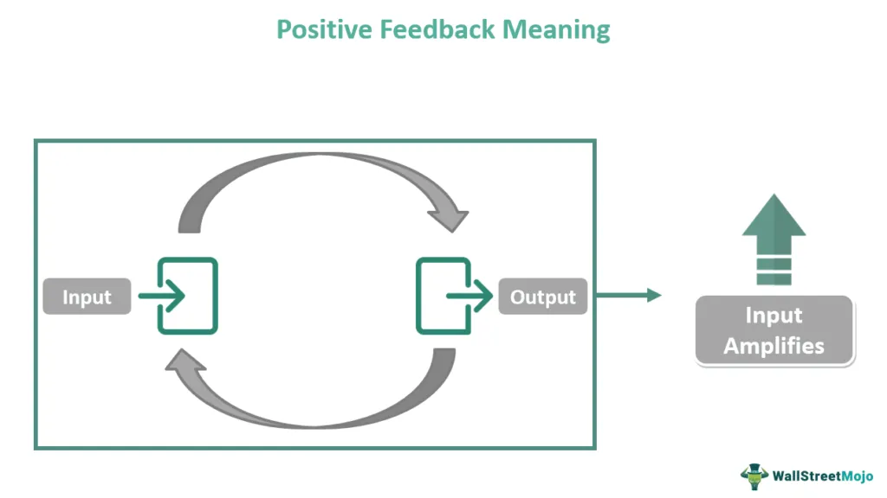

Feedback mechanisms are fundamental components in biological systems that play crucial roles in maintaining stability, homeostasis, and regulation. These mechanisms are processes that organisms use to keep internal conditions within a narrow, healthy range despite external changes. Essentially, they function as control systems that respond to deviations from a normal set point, reinstating equilibrium within the organism. Two primary types of feedback mechanisms exist: negative and positive feedback. Negative feedback works to negate or dampen changes, promoting stability, while positive feedback amplifies changes, driving a process forward until a particular outcome is achieved.

In biological contexts, feedback systems are instrumental for several physiological processes. For instance, they regulate body temperature, blood sugar levels, and other vital functions that underpin homeostasis. Negative feedback, the most common type, helps rectify a deviation by initiating a response that reverses the direction of change. On the other hand, positive feedback, although less common, amplifies the direction of change, often culminating in an event or product release, such as during childbirth or blood clotting.

Beyond biology, feedback systems find significant applications in technology and finance. In technology, they underlie automated systems and control processes, ensuring devices and networks operate consistently and efficiently. Similarly, in finance, feedback systems are integral to the concept of algorithmic trading. Algorithmic trading involves the use of algorithms to execute trades at speeds and frequencies that are unsustainable for human traders. These systems depend on real-time data input and feedback loops to make rapid trading decisions, which can sometimes result in market phenomena like asset bubbles or rapid price changes.

The significance of feedback mechanisms in both biological and financial systems cannot be overstated. They are vital not only for maintaining equilibrium in living organisms but also for ensuring the functionality and profitability of complex systems in finance and technology. This article aims to explore the concept of positive feedback specifically within biological systems and financial contexts like algorithmic trading. By understanding these parallels, we can better comprehend how feedback loops contribute to stability and change across different domains, drawing important insights for managing such systems effectively.

## Table of Contents

## Understanding Feedback Mechanisms

Feedback mechanisms are fundamental processes used by systems to maintain equilibrium, regulate functions, and respond to changes. In biological systems, these mechanisms play a crucial role in ensuring homeostasis, the stable condition of an organism's internal environment. Moreover, feedback systems are also integral in technological applications and economic models, where they help in optimizing performance and managing stability.

Feedback mechanisms can be defined as processes that use the conditions of one component to regulate the function of another component within a system. They are generally classified into two categories: open-loop and closed-loop systems. An open-loop system operates without feedback, meaning the output is not influenced by the output itself. For example, an electric fan without a thermostat simply runs at a set speed regardless of the room temperature.

Conversely, closed-loop systems, also known as feedback control systems, continuously monitor output and adjust input accordingly to maintain desired conditions. This self-regulatory nature is what differentiates closed-loop systems from their open-loop counterparts. An everyday example of a closed-loop system is a home heating system with a thermostat that adjusts heating based on the temperature.

There are two main types of feedback mechanisms: positive feedback and negative feedback.

1. **Negative Feedback Mechanisms**: These mechanisms work to correct a deviation from a set point, thus ensuring stability. When a system senses that it is moving away from its target, negative feedback mechanisms trigger responses that will counteract the change. A classic example from biology is the regulation of blood glucose levels. If blood sugar rises, the pancreas secretes insulin to lower it, and if it falls, glucagon is released to raise it, thus maintaining equilibrium.

2. **Positive Feedback Mechanisms**: Positive feedback mechanisms, contrary to their negative counterparts, amplify changes in the system. They drive systems away from equilibrium by increasing the effects of a perturbation. In biological contexts, positive feedback is often part of processes that require a definitive endpoint. For example, during childbirth, the hormone oxytocin is released to intensify contractions, which in turn stimulates more oxytocin production until delivery is achieved.

Mathematically, positive feedback can be represented by the equation:
$$
\Delta y = k \times \Delta x
$$
where $\Delta y$ is the change induced by the feedback, $\Delta x$ is the initial change, and $k$ is a positive constant greater than one, indicating amplification of change.

Negative feedback, in contrast, can be represented by:
$$
\Delta y = -k \times \Delta x
$$
where the negative sign indicates an inversion or counteraction of the initial change.

In summary, feedback mechanisms are critical for the regulation and stability of systems across various domains. Understanding the distinction between negative and positive feedback, as well as open-loop and closed-loop systems, provides a foundation for examining more complex applications of these principles in both biology and technology.

## Positive Feedback in Biological Systems

Positive feedback is a mechanism characterized by the enhancement or amplification of deviations from an initial set point. Unlike negative feedback, which acts to stabilize a system by counteracting changes, positive feedback drives a system further from its starting condition, often leading to significant transformations.

One classic example of positive feedback in biological systems is blood clotting. This process begins when a blood vessel is injured, triggering platelets to adhere to the site of injury. These platelets release chemicals that attract more platelets, creating an amplification loop. The mass of platelets forms a clot that plugs the vessel breach, crucial for preventing excessive blood loss. Mathematically, this can be represented by an exponential growth function $P(t) = P_0 e^{kt}$, where $P(t)$ is the number of platelets over time, $P_0$ is the initial platelet count, and $k$ is a constant representing the amplification rate due to feedback.

Another example is childbirth, where the release of oxytocin plays a central role. The feedback loop begins with contractions of the uterus, stimulating the release of oxytocin from the pituitary gland. Increased levels of oxytocin intensify uterine contractions, pushing the process of labor and delivery forward. Each contraction prompts the release of more oxytocin, thus strengthening the contractions until delivery occurs. This biological mechanism highlights the role of positive feedback in achieving rapid and decisive physiological outcomes.

Both examples showcase how positive feedback can lead to swift and decisive outcomes necessary for survival and adaptation, reflecting its vital role in various biological processes. Despite the potential for runaway effects inherent in positive feedback, these systems are typically part of larger networks that eventually bring them to a necessary end point, ensuring the organism's stability and continued homeostasis.

## Positive Feedback in Financial Systems: Algorithmic Trading

Algorithmic trading is a form of trading where orders are executed by algorithmic programs without human intervention. These programs utilize pre-defined rules—based on various factors such as timing, price, and [volume](/wiki/volume-trading-strategy)—to execute orders efficiently and rapidly in financial markets. The primary goal of [algorithmic trading](/wiki/algorithmic-trading) is to maximize profitability by leveraging the speed and accuracy of computers.

These automated systems rely heavily on feedback loops, which can either be negative or positive. Positive feedback loops in trading occur when the activity of buying or selling leads to more of the same, magnifying the original trend. This often results in phenomena such as asset bubbles, where the price of an asset inflates rapidly beyond its intrinsic value. For instance, when a trading algorithm identifies a rising price trend and buys more of the asset, this can drive prices even higher, triggering other algorithms to do the same. Such feedback can create an upward spiral in asset prices, disconnected from fundamental values.

The implications of positive feedback in trading behavior are significant. One notable effect is the herd instinct, where traders or algorithms mimic each other's actions, leading to a homogenous market movement. This collective behavior can often result in a self-fulfilling prophecy where the expectation of price changes causes the actual change. Another consequence is irrational exuberance, coined by economist Robert Shiller, which describes the market's overenthusiastic reaction to positive economic news, resulting in inflated asset prices. 

In summary, positive feedback in algorithmic trading can create self-reinforcing cycles that amplify market trends, leading to [volatility](/wiki/volatility-trading-strategies) and potential financial instability. Understanding these loops is crucial to devising strategies that can mitigate risks and ensure more stable market conditions.

## Comparative Analysis: Biological Systems vs. Algorithmic Trading

Biological systems and algorithmic trading platforms both exhibit positive feedback loops that can significantly drive system dynamics. In biological systems, positive feedback loops accelerate processes when an initial stimulus enhances an outcome. A classic example is the process of blood clotting, where an injury triggers a cascade of biochemical reactions that amplify the initial clotting signal. Similarly, positive feedback in algorithmic trading can cause rapid market changes. When trading algorithms detect a price increase, they might generate buy orders that further inflate the price, thus creating a self-reinforcing loop. 

Both systems are capable of escalating rapidly without external intervention. In biology, unchecked blood clotting can result in thrombosis, while in financial markets, a positive feedback loop can lead to asset bubbles and subsequent crashes. For instance, if traders begin to sell an asset due to a negative report, algorithmic triggers can exacerbate the sell-off, leading to a market depression.

Control mechanisms are crucial to prevent undesirable outcomes in both fields. Biological systems often rely on negative feedback loops to stabilize and reverse the [course](/wiki/best-algorithmic-trading-courses) of reactions. In financial systems, regulation and circuit breakers serve as such mechanisms to moderate excessive trading activities, preventing market crashes. Just as biological systems utilize genetic regulation and hormonal control to maintain equilibrium, financial systems use policies and oversight to ensure market integrity. 

The need for control is evident in both domains to effectively manage the volatility induced by positive feedback loops. In biology, this is seen in the careful hormonal regulation during childbirth, which halts contractions once the process is completed. In trading, financial authorities might implement restrictions or temporarily suspend trading to curb panic selling or buying, thereby averting a potential crash. Understanding the parallels between these dynamics informs the development of robust control strategies across disciplines.

## Managing Positive Feedback: Lessons and Strategies

Positive feedback loops, though fundamental to numerous biological and financial systems, can lead to instability if not properly managed. In biological contexts, these loops are frequently controlled through intricate systems that balance amplification with regulation, ensuring the overall stability of an organism. Similarly, financial systems, particularly in the case of algorithmic trading, can benefit from strategies inspired by biological control mechanisms to mitigate risks inherent to positive feedback loops.

In biology, one effective strategy to manage positive feedback involves introducing negative feedback mechanisms that act to counterbalance the amplification. This concept is evident in processes like the regulation of hormone levels, where an increase in a particular hormone triggers actions that promote its reduction, thus stabilizing the system. For instance, the hypothalamic-pituitary-adrenal (HPA) axis functions predominantly through negative feedback to regulate hormone levels crucial for homeostasis and stress response.

Additionally, biological systems often incorporate thresholds beyond which a positive feedback loop will cease, preventing runaway effects. For example, during childbirth, the hormone oxytocin triggers uterine contractions, which lead to further secretion of oxytocin. However, this loop is kept in check as it naturally resolves post-delivery when the stimulus (fetal expulsion) is removed.

Applying these lessons to financial systems entails creating robust detection and regulation frameworks that can dampen financial "runaway" effects, such as rapid price escalations in asset markets driven by algorithmic trading. One approach is the implementation of circuit breakers in stock exchanges, which temporarily halt trading if extreme price movements are detected, functioning analogously to biological thresholds.

Continuous monitoring plays a critical role in both biology and finance to ensure that systems remain stable. In finance, real-time data analysis allows for the swift identification of emerging positive feedback loops. Leveraging sophisticated algorithms, financial systems can be designed to recognize patterns indicative of such loops, enabling preemptive interventions. For example, if a trading algorithm detects a sharp hike in asset prices, it might autonomously trigger trades that counteract this [momentum](/wiki/momentum), reflecting a negative feedback mechanism.

Moreover, regulation is essential in maintaining equilibrium within financial markets, akin to how homeostatic processes operate within organisms. Regulatory bodies like the U.S. Securities and Exchange Commission (SEC) establish rules to prevent practices that might inadvertently trigger uncontrollable positive feedback loops, such as excessive leverage or high-frequency trading without adequate risk assessments.

In conclusion, understanding and managing positive feedback mechanisms is crucial for maintaining stability, whether in biological organisms or financial systems. Drawing inspiration from biological strategies, such as integrating negative feedback, establishing thresholds, and continuous monitoring, financial systems can implement regulations and technologies that mitigate the risks associated with positive feedback. These strategies play a significant role in ensuring the stability and success of both natural and engineered systems.

## Conclusion

In examining the role of positive feedback loops, we have identified key similarities between biological and financial systems, particularly in how they can drive processes toward amplification and escalation. In both contexts, positive feedback mechanisms play essential roles, enhancing tendencies and amplifying changes which can lead to systems moving away rapidly from their stable states. 

In biological systems, positive feedback offers an advantage in processes where rapid and decisive responses are crucial, such as during childbirth where hormonal feedback enhances contractions, or in blood clotting, where each step accelerates the next to rapidly prevent blood loss. These examples illustrate how positive feedback can be beneficial in achieving specific, necessary outcomes.

Conversely, in financial systems, particularly algorithmic trading, the same type of feedback can sometimes lead to undesirable phenomena such as asset bubbles, where the value of an asset is driven beyond its intrinsic value due to speculative buying. This occurs because these systems, when driven by automated feedback loops, can result in herd behavior and irrational exuberance, propelling market trends beyond reasonable limits.

Understanding feedback mechanisms is vital for ensuring stability across various fields. In biology, mechanisms including negative feedback often act as checks to positive feedback, providing balance and preventing runaway processes that could be harmful. Similarly, financial systems require robust strategies and regulatory measures to mitigate the risks associated with unchecked positive feedback. Proper monitoring and application of regulatory controls can help in stabilizing these systems, preventing the undesirable consequences of runaway feedback loops.

In conclusion, the parallels between biological feedback systems and financial markets underscore the importance of understanding and managing feedback loops. Recognizing the underlying principles and behaviors of these loops is crucial for stability and achieving successful outcomes, whether in biological contexts or financial markets. Balancing positive and negative feedback mechanisms can lead to more resilient systems and prevent potential disruptions.

## References & Further Reading

[1]: ["Biological Feedback Mechanisms and Control Loops"](https://www.cell.com/cell-systems/fulltext/S2405-4712(21)00159-9) - Scientific Reports article discussing feedback mechanisms in biological systems.

[2]: Jamshidian, F., & Zhu, Y. (1997). ["Scenario simulation: Theory and methodology."](https://link.springer.com/article/10.1007/s007800050016) Quantitative Finance, 33(2), 231–250.

[3]: ["Advances in Financial Machine Learning"](https://www.amazon.com/Advances-Financial-Machine-Learning-Marcos/dp/1119482089) by Marcos Lopez de Prado

[4]: ["Feedback Systems: An Introduction for Scientists and Engineers"](https://fbswiki.org/wiki/index.php/Feedback_Systems:_An_Introduction_for_Scientists_and_Engineers) by Karl Johan Åström and Richard M. Murray

[5]: Shiller, R. J. (2000). ["Irrational Exuberance"](https://press.princeton.edu/books/paperback/9780691173122/irrational-exuberance) - Author reflects on economic factors contributing to asset bubbles and market dynamics.

[6]: ["Quantitative Trading: How to Build Your Own Algorithmic Trading Business"](https://www.amazon.com/Quantitative-Trading-Build-Algorithmic-Business/dp/1119800064) by Ernest P. Chan

[7]: ["Machine Learning for Algorithmic Trading"](https://github.com/stefan-jansen/machine-learning-for-trading) by Stefan Jansen