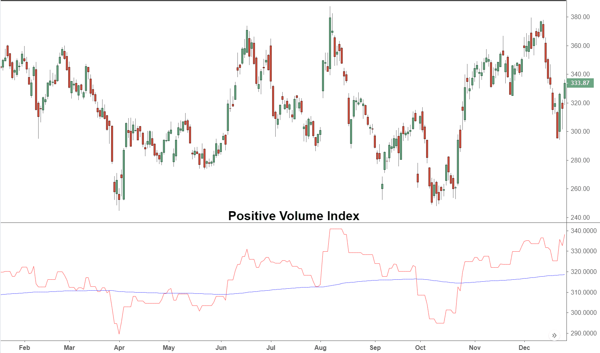

The Positive Volume Index (PVI) stands as a crucial instrument in technical analysis, utilized predominantly to identify stock price movements correlated with positive changes in trading volume. Unlike conventional price-focused analytical tools, the PVI concentrates specifically on days when the market sees an uptick in trading activity, offering traders valuable insights into market sentiment and dynamics.

The significance of the PVI in stock analysis lies in its ability to reveal underlying market trends that may not be immediately apparent through price action alone. By tracking price changes conditioned on increasing volume, the PVI helps traders discern whether a price move is backed by robust market participation, thus bolstering the prediction of future price directions. This focus on volume-based analysis makes the PVI particularly useful in distinguishing exaggerated price moves from those supported by genuine investor interest.



In algorithmic trading, the PVI is utilized to refine automated trading strategies by confirming or debunking signals derived from other technical indicators. The integration of PVI with algorithmic systems aids in enhancing the precision of trading decisions, enabling traders to capitalize on volume-driven price trends with minimal latency. Understanding and interpreting PVI can therefore serve as a reinforcement to create more informed and effective trading strategies.

Thus, by leveraging PVI, traders can enhance their ability to gauge market trends and make informed decisions that align with the prevailing market sentiment, ultimately aiming to optimize their trading performance.

## Table of Contents

## Understanding the Positive Volume Index (PVI)

The Positive Volume Index (PVI) is a financial metric that captures price variations on days when trading volume surpasses the prior day's volume. Created in the 1930s by Paul Dysart, the PVI's primary function is to trace whether price changes are associated with an increasing volume, thus enabling an assessment of investor behavior during such periods. This index places emphasis on the notion that volume spikes generally indicate the involvement of retail investors, whereas professional or institutional investors exert influence during low-volume periods.

A fundamental approach to using the PVI involves its integration with a one-year moving average. This combination serves to validate potential market signals—bullish or bearish. A bullish signal is typically identified when the PVI stays above its one-year moving average, suggesting potential upwards price movements, and conversely, a bearish signal surfaces when the PVI remains below this average, implying possible price downturns.

Notable recognition for the PVI came with Norman Fosback's book "Stock Market Logic," where he expanded on its applications and interpretative value. By examining price movements in conjunction with [volume](/wiki/volume-trading-strategy) changes, the PVI offers insightful interpretations of market sentiment and helps traders gauge the strength and sustainability of emerging market trends. Through assessing these dynamics, the PVI provides crucial insights into the decision-making processes underpinning stock market participation during heightened trading activities.

## How to Calculate the Positive Volume Index

The calculation of the Positive Volume Index (PVI) involves a straightforward approach that primarily focuses on the relationship between current and previous trading volumes and the corresponding price changes. To compute the PVI, the following formula is applied:

$$

\text{PVI}_{\text{current}} = \begin{cases} 
\text{PVI}_{\text{previous}} + \left( \frac{\text{Price Change}}{\text{Previous Price}} \right) \times \text{PVI}_{\text{previous}}, & \text{if Current Volume} > \text{Previous Volume} \\
\text{PVI}_{\text{previous}}, & \text{if Current Volume} \leq \text{Previous Volume}
\end{cases}
$$

Here's how the PVI calculation process can be broken down into a step-by-step guide:

1. **Identify Price and Volume Data**: Collect the daily price and volume data for the stock or asset you want to analyze. Ensure you have data for consecutive days as PVI calculations require reference to the previous day's figures.

2. **Compute Daily Price Change**: For each day, calculate the price change as the difference between the current day's price and the previous day's price.

3. **Determine Volume Condition**: Check if the current day's trading volume is greater than the previous day's trading volume. This condition determines how the PVI will be adjusted.

4. **Adjust PVI**: 
   - If today's volume is greater than yesterday's, update the PVI using the formula:
$$
     \text{PVI}_{\text{current}} = \text{PVI}_{\text{previous}} + \left( \frac{\text{Price Change}}{\text{Previous Price}} \right) \times \text{PVI}_{\text{previous}}

$$
   - If today's volume is less than or equal to yesterday's, the PVI remains unchanged from the previous day:
$$
     \text{PVI}_{\text{current}} = \text{PVI}_{\text{previous}}

$$

5. **Initialize the PVI**: The initial PVI value is typically set at 1000 for the first day of your data set.

6. **Iterate and Record**: Repeat the above steps for each trading day in your dataset, recording the PVI values accordingly.

Below is a sample Python code snippet illustrating how this calculation might be implemented:

```python
def calculate_pvi(prices, volumes):
    if len(prices) != len(volumes):
        raise ValueError("Price and volume lists must have the same length.")

    pvi = [1000] # Initial PVI value
    for i in range(1, len(prices)):
        if volumes[i] > volumes[i - 1]:
            price_change = prices[i] - prices[i - 1]
            pvi_value = pvi[i - 1] + (price_change / prices[i - 1]) * pvi[i - 1]
        else:
            pvi_value = pvi[i - 1]
        pvi.append(pvi_value)

    return pvi

# Example usage
prices = [100, 102, 105, 103]  # Sample price data
volumes = [1000, 1500, 1300, 1600]  # Sample volume data
pvi_values = calculate_pvi(prices, volumes)
print(pvi_values)
```

By systematically applying this procedure, traders can derive the PVI for any given period, regardless of market conditions, thus incorporating it effectively into their technical analysis toolkit.

## Applying the PVI in Algorithmic Trading

Algorithmic traders utilize the Positive Volume Index (PVI) for its unique ability to identify market trends and signal potential entry and [exit](/wiki/exit-strategy) points, especially when employed alongside the Negative Volume Index (NVI) and other technical indicators. By focusing on days when trading volume increases, PVI helps traders discern whether price changes are supported by increased market interest. This information is crucial for developing automated trading strategies that can respond to genuine market movements.

To integrate PVI into [algorithmic trading](/wiki/algorithmic-trading), traders typically look for conditions where the PVI indicates a positive trend, frequently in conjunction with its moving average. A bullish signal may be confirmed when the PVI crosses above its moving average, suggesting a period of sustained price increases supported by higher trading volumes. Conversely, a bearish signal is often noted when the PVI falls below its moving average.

### Example of PVI Implementation in Python

Below is a simplified Python script that demonstrates how PVI can be calculated and applied within an algorithmic trading framework:

```python
import pandas as pd

# Assuming 'data' is a DataFrame containing 'Close' and 'Volume' columns
def calculate_pvi(data):
    data['PVI'] = 1000
    data['PVI'] = data['Close'].pct_change() * data['Volume']

    for i in range(1, len(data)):
        if data['Volume'].iloc[i] > data['Volume'].iloc[i - 1]:
            data['PVI'].iloc[i] = data['PVI'].iloc[i - 1] + (data['Close'].pct_change().iloc[i] * data['PVI'].iloc[i - 1])
        else:
            data['PVI'].iloc[i] = data['PVI'].iloc[i - 1]

    pvi_moving_avg = data['PVI'].rolling(window=255).mean()  # 1-year moving average based on trading days
    return data, pvi_moving_avg

# Implement PVI with trading rules
def pvi_trade_signals(data, pvi_moving_avg):
    buy_signals = []
    sell_signals = []
    for i in range(1, len(data)):
        if data['PVI'].iloc[i] > pvi_moving_avg.iloc[i] and data['PVI'].iloc[i - 1] <= pvi_moving_avg.iloc[i - 1]:
            buy_signals.append(data['Close'].iloc[i])
            sell_signals.append(float('nan'))
        elif data['PVI'].iloc[i] < pvi_moving_avg.iloc[i] and data['PVI'].iloc[i - 1] >= pvi_moving_avg.iloc[i - 1]:
            buy_signals.append(float('nan'))
            sell_signals.append(data['Close'].iloc[i])
        else:
            buy_signals.append(float('nan'))
            sell_signals.append(float('nan'))
    return buy_signals, sell_signals

data, pvi_moving_avg = calculate_pvi(data)
buy_signals, sell_signals = pvi_trade_signals(data, pvi_moving_avg)
```

### Integration with Other Indicators

For enhanced accuracy, traders often combine PVI with NVI and other volume-based indicators like the On-Balance Volume (OBV) to form a composite view of market activity. This approach reduces the risk of false signals inherent in any single indicator, thereby refining automated strategies' predictive capabilities.

Algorithmic trading using PVI not only helps capture real-time trading opportunities but also serves to automate decision-making processes, streamlining operations and potentially maximizing returns. By regularly evaluating the performance of such strategies, traders can optimize their rules and adapt to evolving market conditions.

## Comparing PVI with Other Volume Indicators

The Positive Volume Index (PVI), as its name suggests, is unique in its approach to focusing on days when trading volume increases compared to the previous day. This specificity distinguishes it from other volume indicators such as the On-Balance Volume (OBV) and the Accumulation/Distribution Line, each of which offers distinct perspectives on volume and price movements.

The On-Balance Volume (OBV) indicator, developed by Joseph Granville, emphasizes the cumulative total of volume added on days when the market closes higher than the previous day and subtracted when it closes lower. Unlike the PVI, which only considers positive changes in volume, OBV incorporates volume data from every trading day, providing a continuous cumulative measure. This enables OBV to reflect broader market sentiment, but it may also dilute the significance of volume spikes on specific days.

In contrast, the PVI's strength lies in its ability to isolate and focus on 'active' trading days—those with higher volume than the preceding day. This targeted approach can be particularly advantageous in volatile markets where positive volume spikes might signal important shifts in investor behavior, such as increased buying interest. For example, an upward move in PVI, confirmed by breaking above its moving average, can indicate bullish sentiment among investors.

Another well-known volume-based indicator is the Accumulation/Distribution Line, which combines both price and volume data to gauge the underlying accumulation or distribution of a security. This indicator considers the proximity of a closing price to its range for the day and weighs it with the corresponding volume, giving insight into the strength behind price movements. While the Accumulation/Distribution Line integrates both price and volume elements, the PVI strictly confines itself to positive volume changes, offering a more focused view that may simplify trend confirmation when the market is experiencing a strong directional bias.

The distinct advantage of using PVI lies in its simplicity and ability to provide clear signals based on volume activity. By focusing solely on days with increased volume, PVI can help traders identify [momentum](/wiki/momentum) shifts that might be missed by broader indicators that encompass all trading days. However, it is often beneficial to use PVI in conjunction with other indicators. For instance, pairing PVI with the Negative Volume Index (NVI), which looks at days with decreased volume, can offer a more balanced view of market dynamics.

By leveraging PVI alongside other indicators, traders can enhance their analysis and refine their strategies, maximizing the insights gained from volume data to make informed trading decisions.

## Limitations and Considerations

The Positive Volume Index (PVI) is a valuable tool in technical analysis, but like all indicators, it has its limitations. One significant limitation of the PVI is its diminished effectiveness in low-volume or choppy markets. In such environments, market signals derived from PVI can be misleading due to the reduced impact of volume changes on price movements. This is because the PVI primarily captures price action on days when trading volume is higher than the previous day. When market volumes are generally low, the PVI may not accurately reflect genuine market sentiment or potential trends.

To address these limitations and enhance the reliability of the PVI, it is recommended to combine it with other technical analysis tools. Such combinations can provide a more comprehensive view of the market and improve the accuracy of trading signals. For instance, integrating the PVI with the Negative Volume Index (NVI) can offer insights into price movements on days with declining volumes, thereby offering a wider perspective on market dynamics.

Moreover, utilizing moving averages alongside the PVI can help confirm trends and filter out noise. For example, a simple strategy might involve using the PVI in conjunction with its one-year moving average to validate bullish or bearish market signals. Other indicators like the Relative Strength Index (RSI) or Moving Average Convergence Divergence (MACD) can be used to confirm overbought or oversold conditions, thus providing additional layers of validation.

In algorithmic trading, these combinations can be implemented programmatically to automate and refine trading strategies. For instance, a Python script can be designed to trigger trades only when the PVI confirms signals from other indicators:

```python
import pandas as pd

# Example DataFrame df with columns: Date, Close, Volume
df['PVI'] = 1000  # Starting value of PVI

# Compute PVI
for i in range(1, len(df)):
    if df.at[i, 'Volume'] > df.at[i-1, 'Volume']:
        price_change = (df.at[i, 'Close'] - df.at[i-1, 'Close']) / df.at[i-1, 'Close']
        df.at[i, 'PVI'] = df.at[i-1, 'PVI'] * (1 + price_change)
    else:
        df.at[i, 'PVI'] = df.at[i-1, 'PVI']

# Example combination with a moving average for confirmation
df['PVI_MA'] = df['PVI'].rolling(window=252).mean()  # 252 trading days in a year

# Trading logic example
buy_signals = (df['PVI'] > df['PVI_MA']) & (df['RSI'] < 30)
sell_signals = (df['PVI'] < df['PVI_MA']) & (df['RSI'] > 70)

# Extract buy/sell dates
buy_dates = df.loc[buy_signals, 'Date']
sell_dates = df.loc[sell_signals, 'Date']
```

By integrating multiple indicators and employing automated checks, traders can mitigate the inherent limitations of the PVI, gaining a more reliable assessment of market trends and trading opportunities.

## Conclusion and Key Takeaways

The Positive Volume Index (PVI) emerges as a valuable indicator for traders aiming to understand market sentiment and confirm price trends prompted by changes in trading volume. Whether utilized alone or in combination with other technical indicators, the PVI provides insights that can enhance trading decisions. Its strength lies in its ability to track how price behaves on days with increased volume, which is often linked to institutional trading activities.

A key strategy in using the PVI involves pairing it with a one-year moving average to discern potential bullish or bearish market conditions. This is crucial as it can help traders distinguish between genuine market shifts and temporary fluctuations. The PVI, when aligned with a moving average, aids in filtering out noise, allowing traders to focus on significant market moves.

Incorporating the PVI into a comprehensive analysis framework usually involves comparing it with other volume-based indicators, such as the Negative Volume Index (NVI) or On-Balance Volume (OBV). This approach can provide a more rounded view of market dynamics, helping to mitigate the limitations that any single indicator might present. For instance, in low-volume or highly volatile markets, relying solely on PVI could lead to misinterpretation. Combining it with indicators sensitive to different aspects of volume and price changes can enhance decision-making efficiency.

In conclusion, the PVI holds substantial utility for traders and analysts seeking deeper insights into market behavior driven by volume changes. Its application, especially when integrated with additional technical analysis tools, enhances the ability to make more informed and strategic trading decisions.

## References & Further Reading

[1]: Poser, Steven L., ["Applying Technical Analysis"](https://www.amazon.com/Applying-Elliot-Theory-Profitably-Trading-ebook/dp/B000SBBZO6). Prentice Hall.

[2]: Fosback, Norman G., ["Stock Market Logic: A Sophisticated Approach to Profits on Wall Street"](https://archive.org/details/stockmarketlogic0000fosb). Dearborn Financial Publishing.

[3]: Murphy, John J., ["Technical Analysis of the Financial Markets: A Comprehensive Guide to Trading Methods and Applications"](https://archive.org/details/technicalanalysi0000murp). Prentice Hall Press.

[4]: Granville, Joseph E., ["New Key to Stock Market Profits"](https://www.amazon.com/Granvilles-New-Stock-Market-Profits-ebook/dp/B07VJCD3GW). Richard D. Irwin.

[5]: Achelis, Steven B., ["Technical Analysis from A to Z"](https://archive.org/details/technicalanalysi00ache). McGraw-Hill Education.