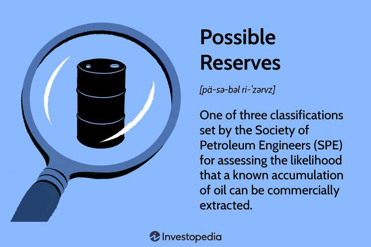

The energy sector is a multifaceted ecosystem critical to the functioning of global economies, comprising varied activities and processes that ensure the availability and efficient use of energy commodities. Central to this ecosystem is the careful management of energy resources, which necessitates accurate reserve classification, resource estimation, and the deployment of algorithmic trading strategies. These components are indispensable not only for optimizing operational efficiencies but also for informing strategic investment decisions.

Reserve classification forms the foundation of resource management, offering a structured approach to evaluating the viability of oil and gas reserves. Reserve categories such as Proved, Probable, and Possible provide a probabilistic framework that helps stakeholders assess the potential value and risks associated with energy projects. This evaluative process is essential for investors and companies when making decisions about whether and when to exploit such reserves.



Resource estimation involves applying rigorous geological, technical, and economic analyses to forecast the potential recoverability of energy reserves. Techniques like geophysical surveys and reservoir simulations contribute vital data, enabling stakeholders to understand the quantity and quality of available resources. These estimates serve as vital inputs for strategic planning and operational execution in the energy sector.

Algorithmic trading, increasingly utilized in contemporary markets, leverages quantitative data to execute trades and manage portfolios. In the context of the energy market, insights from reserve estimates and classifications can guide trading algorithms, allowing for the anticipation of market trends and fluctuations. By analyzing vast datasets, algorithms provide timely investment recommendations, helping traders optimize their performance, mitigate risks, and enhance returns.

This article examines how reserve classification and resource estimation converge with algorithmic trading to shape the dynamics and investment strategies of the energy market. By exploring these intersections, we can gain a deeper understanding of how these processes collectively steer market evolution and influence economic outcomes. This integration of disciplines is pivotal in managing risk, ensuring regulatory compliance, and achieving optimal financial results within the energy sector.

## Table of Contents

## Understanding Reserve Classifications

The Society of Petroleum Engineers (SPE) has developed a comprehensive system for classifying oil reserves, which is crucial for understanding the potential yields and associated risks of extraction projects. This classification system encompasses three main categories: Proven (P1), Probable (P2), and Possible (P3) reserves, each defined by the probability of commercial extraction.

**Proven Reserves (P1):** This category includes hydrocarbon resources with a high degree of certainty for commercial extraction, specifically at least a 90% probability. These reserves must be demonstrable through geological and engineering data to be economically recoverable under current operating conditions. The level of certainty in proven reserves makes them a reliable indicator for immediate investment and operational planning.

**Probable Reserves (P2):** Probable reserves, on the other hand, carry a 50% probability of successful extraction. These reserves are less certain than proven reserves and generally require further technological or economic conditions to be classified as viable. While they introduce a higher risk factor, they also provide a substantial opportunity for future development if advancements in technology or favorable changes in market conditions occur.

**Possible Reserves (P3):** Representing the least certain category, possible reserves have at least a 10% chance of being commercially viable. These reserves often require significant changes in technology, market conditions, or regulatory environments to move into either the probable or proven categories. Possible reserves are critical for long-term strategic planning as they offer potential growth avenues, albeit with considerable risk.

These classifications are integral for companies and investors as they evaluate the viability and inherent risks of oil extraction projects. The distinction between P1, P2, and P3 reserves helps guide investment decisions, providing a structured understanding of resource availability and associated uncertainties. This framework supports more informed decision-making processes, promoting transparency and fostering investor confidence within the energy sector.

## Resource Estimation Techniques

Resource estimation involves a comprehensive assessment of geological, technical, and economic factors to predict both the [volume](/wiki/volume-trading-strategy) and the recoverability of energy reserves. The process is essential for understanding potential yields from oil and gas fields and involves several key techniques:

**Geophysical Surveys:**
Geophysical surveys, particularly seismic methods, are crucial for accurate subsurface mapping. Seismic surveys utilize controlled energy sources to send sound waves into the Earth. As these waves travel through different geological layers, they are reflected back to the surface and captured by geophones. The data collected allows geophysicists to create detailed images of subsurface structures, identifying potential hydrocarbon reservoirs. Various techniques, such as 2D, 3D, and 4D seismic surveys, offer increasing levels of detail, with 3D providing comprehensive spatial data and 4D allowing for time-lapse analysis to monitor reservoir changes over time (Stoneley, 1995).

**Core Sampling:**
Core sampling involves extracting cylindrical sections of rock from the subsurface, providing direct evidence of the presence of hydrocarbons. By analyzing these samples, geologists can assess the porosity, permeability, and saturation levels of the rock, critical factors in estimating the quality and quantity of the reserves. Core data also aids in understanding the geological history and conditions of the reservoir, enhancing the accuracy of the resource estimation.

**Reservoir Simulation Models:**
Reservoir simulation models integrate geological, geophysical, and engineering data to predict production profiles under various scenarios. These models use mathematical representations to simulate fluid flow through porous media, accounting for factors such as pressure, temperature, and fluid properties. Advanced computational techniques allow for the simulation of complex reservoirs, enabling engineers to assess different recovery strategies and optimize production. The models can be expressed through differential equations that approximate fluid movement, such as Darcy's law for the flow of fluids through porous media. In Python, computational packages such as NumPy and SciPy can be employed to solve these equations:

```python
import numpy as np
from scipy.integrate import solve_ivp

def reservoir_model(t, y, params):
    # Example placeholder function for reservoir dynamics
    pressure, saturation = y
    porosity, permeability, viscosity = params
    d_pressure_dt = -permeability / viscosity * (pressure - saturation)
    d_saturation_dt = porosity * (pressure / saturation)
    return [d_pressure_dt, d_saturation_dt]

# Define parameters
params = {'porosity': 0.2, 'permeability': 0.1, 'viscosity': 1.0}

# Initial conditions: pressure and saturation
initial_conditions = [100, 0.5]

# Time span for simulation
t_span = (0, 50)

# Solve the system of equations
solution = solve_ivp(reservoir_model, t_span, initial_conditions, args=(params.values(),))
```

In conclusion, resource estimation techniques provide a foundational understanding of the potential and limitations of oil and gas reserves, supporting strategic decision-making in the energy sector. Through advanced geophysical methods, core sampling, and sophisticated modeling, companies can effectively evaluate and manage their resources.

## The Impact of Reserve Classifications on the Energy Market

Reserve classifications play a crucial role in shaping corporate valuations and influencing investment decisions within the energy sector. These classifications help assess the potential success and commercial viability of oil extraction projects, guiding companies and investors in understanding the associated risks and rewards.

Proven reserves, also known as 1P reserves, provide a solid foundation for interpreting a company's current operational capabilities. With a minimum of 90% probability of commercial extraction, these reserves form the cornerstone of a company's asset valuation. Investors and stakeholders often look at proven reserves as reliable indicators of a company’s immediate production potential and cash flow expectations. This high degree of certainty strengthens confidence in near-term financial projections and supports stable investment decisions.

On the other hand, the aggregate category of possible, probable, and proven reserves, collectively referred to as 3P reserves, offers a comprehensive long-term perspective. This broader classification encompasses proven (P1), probable (P2), and possible (P3) reserves, allowing companies and investors to evaluate potential future growth and long-term project viability. Probable reserves have a 50% likelihood of commercial extraction, while possible reserves have a 10% chance. By considering these additional categories, companies engage in strategic planning that balances current production with future exploration and development opportunities. The ability to anticipate and manage potential future reserves can enhance strategic decision-making, risk management, and competitive positioning in volatile markets.

Regulatory compliance further underscores the importance of precise reserve disclosure. Regulatory bodies often mandate stringent reporting requirements to ensure transparency and accuracy in reserve estimates. Companies must adhere to these regulations, as discrepancies or inaccuracies in reserve reporting can lead to legal ramifications and erode investor trust. Transparent reserve classifications contribute to an efficient and fair energy market by providing investors with clear insights into a company's asset base and operational capabilities.

In conclusion, reserve classifications significantly affect corporate valuation and investment dynamics in the energy sector. Proven reserves offer immediate insight into a company's current production capabilities, while 3P reserves provide a long-term outlook essential for strategic planning. Adhering to regulatory standards in reserve disclosure ensures market transparency and fosters investor confidence, ultimately influencing the overall health and stability of the energy market.

## Algorithmic Trading in the Energy Market

Algorithmic trading employs sophisticated algorithms to automate decision-making processes and execute trading strategies based on quantitative data analysis. In the energy sector, the integration of reserve estimates and classifications plays a vital role in guiding these algorithms. This data provides insight into market trends and potential price movements, thereby influencing trading strategies.

Reserve estimates help quantify the supply-side potential by categorizing the reserves into proved, probable, and possible reserves, each with associated probabilities. The calculations for probability distribution based on these classifications can optimally weigh inputs into trading algorithms. For instance, a basic Python function to simulate random reserve probability outcomes could look like:

```python
import numpy as np

def simulate_reserve_classification(n_simulations=1000):
    probabilities = {'Proved': 0.9, 'Probable': 0.5, 'Possible': 0.1}
    results = {classification: np.random.binomial(n=1, p=prob, size=n_simulations).mean() 
               for classification, prob in probabilities.items()}
    return results

simulation_results = simulate_reserve_classification()
```

In practice, these classifications are combined with other market data such as oil prices, demand forecasts, and economic indicators. Algorithms analyze this wide array of data to generate investment recommendations and trading signals. This data-driven approach optimizes portfolio management by systematically reducing risks and maximizing returns. Through rapid data analysis and trade execution, [algorithmic trading](/wiki/algorithmic-trading) consistently outpaces human traders in responsiveness and efficiency.

For instance, an algorithm might adjust its investment strategy if it detects an upward trend in oil prices coupled with increased estimates in proved reserves. The relationship between reserve estimates and market conditions can be modeled to speculate future movements, allowing traders to preemptively strategize.

Moreover, [machine learning](/wiki/machine-learning) techniques can further enhance these algorithms by learning from historical data patterns and adjusting strategies dynamically. These models use historical price data, macroeconomic factors, and company-specific information to predict future trends and optimize trading performance.

Algorithmic trading in energy markets effectively synthesizes reserve classification data with real-time market analytics. This fusion aids traders not just in predicting the market fluctuations more accurately but also in executing trades with unmatched speed and precision, ultimately ensuring competitive advantage within the volatile energy sector.

## Synergy Between Resource Estimation and Algo Trading

Quantitative models in resource estimation play a crucial role in the formulation of algorithmic trading strategies within the energy market. By leveraging the sophisticated data from geological, technical, and economic evaluations, trading algorithms gain a robust foundation for making informed decisions. These models capture various aspects of reserve data, such as volume and recoverability, and integrate them into predictive algorithms for market dynamics.

The dynamic nature of the energy sector demands trading strategies that can adapt rapidly to new data inputs. Technological advancements, such as improved seismic techniques or core sampling data, provide updated insights into reserve estimations. Similarly, changes in regulations affecting reserve disclosure could influence market perspectives and valuations. Algorithmic trading systems respond to these changes by modifying trading rules and strategies in real-time, allowing for enhanced responsiveness compared to traditional trading methods.

A critical aspect of this synergy is the feedback loop between resource estimation and algorithmic trading. As algorithms process data outputs from resource estimations, their predictions refine resource valuation, providing further input for subsequent trading decisions. For instance, if new data suggests an increase in probable reserve presence, algorithms could speculate on future price movements, leading investors to either capitalize on or hedge against these potential shifts.

Investors who utilize these systems can anticipate market trends more effectively since algorithms run simulations and predictions that account for a broad array of variables, from geopolitical events to technological breakthroughs. By doing so, resource allocation becomes more strategic, reducing risk exposure while maximizing potential returns. Furthermore, this integrated approach ensures that investors maintain adaptability, critical for thriving in a constantly evolving energy market landscape.

## Conclusion

Understanding possible reserves and their classification is crucial for navigating the complexities of the energy market. Reserve classifications, such as Proved (P1), Probable (P2), and Possible (P3), provide a structured approach to assess the risk and viability of energy projects. These classifications inform stakeholders about the potential and uncertainty regarding the extraction of resources, thereby influencing investment decisions and market dynamics.

Resource estimation techniques underpin the data that trading strategies rely on, particularly in algorithmic contexts. By employing geophysical surveys, core sampling, and reservoir simulation models, companies develop robust estimates that forecast the volume and recoverability of reserves. These inputs are integral for developing precise and adaptive trading strategies that can respond effectively to market changes.

Together, reserve classifications and resource estimation techniques shape investment strategies and drive the future of energy markets. As algorithmic trading becomes more prevalent, the synergy between quantitative models used in resource estimation and automated trading strategies becomes increasingly vital. Trading algorithms process complex datasets, including reserve estimates and market conditions, to anticipate price movements and optimize portfolios.

By integrating these disciplines, investors and companies gain enhanced capabilities to manage risk, comply with regulatory requirements, and achieve optimized financial outcomes. This convergence allows for more informed decision-making and strategic planning, positioning market participants to seize emerging opportunities while mitigating potential downsides. As the energy sector evolves, the interplay between reserve classification, resource estimation, and algorithmic trading will continue to shape its trajectory.

## References & Further Reading

[1]: Society of Petroleum Engineers. (2007). ["Petroleum Reserves and Resources Classification & Definitions"](https://www.spe.org/industry/docs/Petroleum-Resources-Management-System-2007.pdf)

[2]: Stoneley, R. (1995). ["Introduction to Petroleum Exploration for Non-geologists"](https://academic.oup.com/book/53967) Oxford University Press.

[3]: Silversides, I. (1997). ["Geophysical Methods in Exploration and Mineral Environmental Investigations"](https://pubs.usgs.gov/of/1995/ofr-95-0831/CHAP3.pdf) U.S. Geological Survey Bulletin 2191.

[4]: ["An Introduction to Reservoir Simulation Using Python"](https://github.com/chanshing/ressim)

[5]: Zhang, D. et al. (2019). ["Algorithmic Trading and the Effects of Information on the Market"](https://papers.ssrn.com/sol3/papers.cfm?abstract_id=2420017)

[6]: Bodie, Z., & Merton, R. C. (2000). ["Finance"](https://archive.org/details/finance00bodi) Prentice Hall. 

[7]: ["The Handbook of Commodity Investing"](https://archive.org/details/handbookofcommod0000fabo) by Frank J. Fabozzi and Roland Fuss