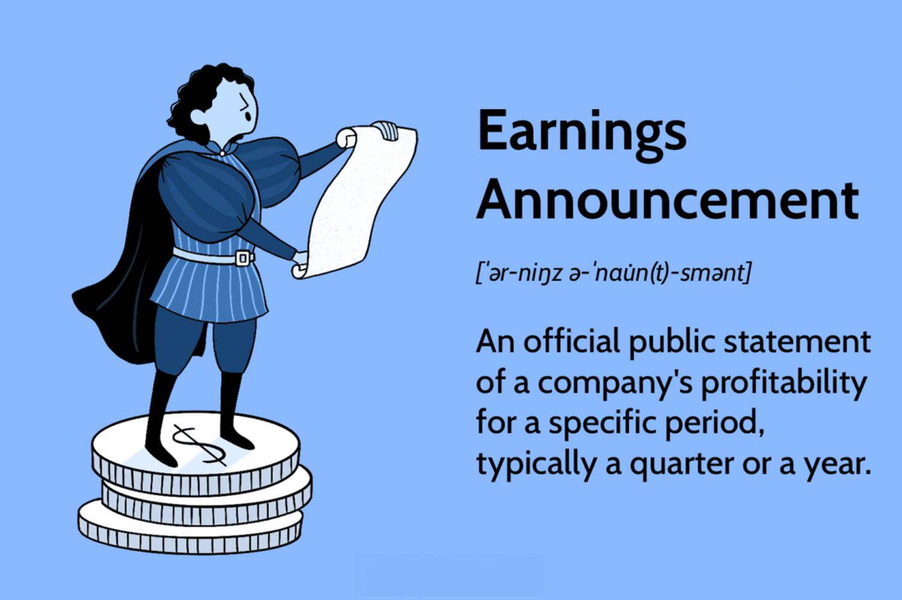

Post Earnings Announcement Drift (PEAD) refers to the tendency of a stock's price to continue moving in the direction of an earnings surprise for a period following an earnings announcement. This phenomenon is significant in the stock market as it challenges the efficient market hypothesis which posits that stock prices immediately and fully reflect all available information. PEAD suggests a lag in the market’s response, creating opportunities for traders to profit from these price movements. Historically, PEAD highlights inefficiencies in market information processing, often influenced by investor behavior and cognitive biases which delay the full adjustment of stock prices to new earnings information.

Algorithmic trading has become a dominant force in the modern financial landscape, altering the way stocks are traded by utilizing computerized systems to execute trading strategies rapidly and efficiently. This automated form of trading boasts advantages such as speed, precision, and the capacity to handle vast datasets beyond human capability. Given the pace and complexity of today’s markets, algorithmic trading is increasingly utilized to exploit patterns or inefficiencies like PEAD. The ability to systematically identify and act on post-earnings drift could provide a competitive edge to traders who integrate these strategies within their algorithms.



Studying the impact of PEAD in algorithmic trading is crucial for both investors and traders. Understanding this interplay offers valuable insights into market dynamics, helping market participants derive enhanced trading strategies and identify potential profit opportunities while accounting for risks associated with PEAD. Moreover, algorithmic systems empowered with the capability to exploit PEAD events might rebalance the usual advantages of institutional traders over individual investors by leveling the playing field and allowing broader market participation.

This article will explore the theoretical underpinnings of PEAD, assessing its implications on stock pricing and market efficiency. It will delve into the mechanisms of algorithmic trading, discuss how traders can harness these technologies to exploit PEAD, and address challenges inherent in these strategies. By examining empirical evidence and case studies, the article aims to highlight practical insights for incorporating PEAD strategies in trading while stressing the importance of adaptive approaches in a continuously evolving market environment. The coming sections will provide detailed analyses, contributing to a comprehensive understanding of PEAD and its relevance in algorithmic trading.

## Table of Contents

## Understanding Post Earnings Announcement Drift (PEAD)

Post Earnings Announcement Drift (PEAD) is a well-documented anomaly in financial markets, manifesting as a delayed stock price reaction to corporate earnings announcements. This phenomenon has been observed consistently, where stocks [earning](/wiki/earning-announcement) positive surprises tend to experience subsequent price increases, while those with negative surprises often face declines beyond what initial market reactions would suggest. The drift typically lasts several weeks to months, indicating a sluggish market response to earnings information.

The historical context of PEAD dates back to the seminal works of Ball and Brown (1968) and later, Bernard and Thomas (1989), who provided substantial empirical evidence for the existence of PEAD. These studies highlighted how the delayed assimilation of new earnings information by the market leads to predictable stock price movements after earnings announcements. Researchers have since sought to understand the underlying reasons for this delayed reaction.

Several factors contribute to PEAD, primarily revolving around behavioral finance concepts. One key [factor](/wiki/factor-investing) is investor behavior, particularly the underreaction hypothesis, suggesting that investors fail to fully incorporate earnings news into their valuation models immediately. This can be attributed to cognitive biases, such as conservatism bias, where investors are slow to update their beliefs in light of new evidence. Additionally, limited attention and information processing delays further exacerbate this underreaction, allowing the drift to persist as information spreads gradually across the market. Institutional investors, who may have quicker access to information and better resources for analysis, often capitalize on these delays, potentially prolonging the drift.

The impact of PEAD on stock prices is significant, as it offers informed traders the opportunity to generate abnormal returns by exploiting the drift. However, the presence of predictable return patterns challenges the notion of market efficiency. According to the Efficient Market Hypothesis (EMH), asset prices should reflect all available information instantaneously, rendering consistent excess returns impossible. Yet, the persistence of PEAD suggests inefficiencies in information assimilation within financial markets.

PEAD has broader implications for market efficiency, revealing potential weaknesses in how information is reflected in stock prices. This anomaly not only poses a challenge to the EMH but also offers valuable opportunities for traders and investors to develop strategies that exploit these inefficiencies. By understanding the mechanics of PEAD, market participants can better navigate the complexities of post-earnings stock price behavior, ultimately influencing their investment decisions and trading strategies.

## Algorithmic Trading: An Overview

Algorithmic trading, often referred to as algo trading, is the use of computer programs to execute orders systematically, based on pre-defined criteria and algorithms. This approach stands in contrast to traditional trading methods where decisions are largely driven by human intuition and manual execution. The primary distinction between these two lies in the automation and speed offered by algo trading. Algorithms allow traders to scan multiple markets and execute trades at speeds impossible for human traders. They also ensure precision and reduce the impact of human emotions on trading decisions.

The advantages of [algorithmic trading](/wiki/algorithmic-trading) are manifold. Speed is a crucial benefit, as algorithms can process market data and execute trades within milliseconds, capturing opportunities that might be missed by manual trading. Accuracy is another advantage, as trades can be executed with precision, reducing the likelihood of human errors. Furthermore, algorithms can handle vast amounts of data, enabling traders to sift through historical and real-time data to make informed decisions. This capability becomes particularly important in handling large orders that might be impractical to manage manually due to the need for real-time data analysis and strategic execution.

Common algorithmic strategies include [arbitrage](/wiki/arbitrage), mean reversion, and [momentum](/wiki/momentum) trading. Arbitrage strategies exploit price differences of identical or similar financial instruments across different markets or forms. Mean reversion strategies, based on the idea that prices revert to their mean or average level over time, involve buying or selling based on statistical indicators. Momentum trading capitalizes on existing market trends, buying assets that show an upward trend and selling them once they begin to lose momentum.

Algorithmic trading also plays a significant role in identifying and exploiting market inefficiencies, such as Post Earnings Announcement Drift (PEAD). PEAD is characterized by the tendency of stock prices to drift upwards or downwards following an earnings announcement, as the market gradually absorbs new information. Algorithms can be designed to detect these patterns by analyzing earnings reports, historical data, and market reactions. By doing so, traders can position themselves advantageously to profit from price movements linked to PEAD phenomena. This kind of strategic trading leverages the computational strength of algorithms to gain an edge in markets often perceived to operate efficiently. 

In summary, algorithmic trading represents a transformative advancement in securities markets, providing enhanced speed, accuracy, and data processing capabilities. Through its various strategic implementations, it offers significant opportunities to navigate and capitalize on market inefficiencies such as PEAD.

## Interaction Between PEAD and Algorithmic Trading

Algorithmic trading has become a key player in modern financial markets, largely due to its ability to process vast amounts of data and make decisions at speeds far surpassing human capability. One of the areas where algorithmic trading can offer distinct advantages is in exploiting Post Earnings Announcement Drift (PEAD). PEAD is characterized by the tendency of a stock's price to drift in the direction of an earnings surprise for some time following an earnings announcement. This phenomenon presents unique opportunities that algorithmic strategies can potentially capitalize on.

### Identifying PEAD Opportunities

Algorithmic trading strategies utilize a variety of tools and methodologies to identify PEAD opportunities. Advanced [machine learning](/wiki/machine-learning) models and statistical algorithms are employed to detect patterns and correlations between earnings announcements and subsequent stock price movements. Natural Language Processing (NLP) is often used to analyze textual data from earnings reports, press releases, and news articles to gauge market sentiment and anticipate the direction of price drift.

Furthermore, quantitative models such as the Fama-French three-factor model can be adapted to account for PEAD effects by including an additional factor related to earnings surprise. The use of big data analytics allows traders to analyze historical earnings data and identify stocks that consistently exhibit PEAD characteristics.

### Technological and Analytical Tools

Integrating PEAD into trading algorithms requires sophisticated technological infrastructure. High-frequency trading platforms provide the speed and precision needed to execute trades based on PEAD signals. Cloud computing resources enable the rapid processing of large data sets to identify potential trades. 

Moreover, predictive analytics and machine learning models—such as Random Forests or Gradient Boosting Machines—help enhance forecast accuracy for earnings surprises and stock price reactions. These tools are instrumental in developing algorithms that can autonomously adjust to new data and refine their predictive capabilities.

Python libraries like `pandas`, `scikit-learn`, and `[tensorflow](/wiki/tensorflow)` are often employed in developing and [backtesting](/wiki/backtesting) such algorithms. For instance, code to process and model earnings data might look like this:

```python
import pandas as pd
from sklearn.ensemble import RandomForestClassifier
from sklearn.model_selection import train_test_split

# Load dataset
data = pd.read_csv('earnings_data.csv')

# Preprocess data
features = data.drop('price_drift', axis=1)
labels = data['price_drift']

# Split dataset
X_train, X_test, y_train, y_test = train_test_split(features, labels, test_size=0.2, random_state=42)

# Train model
model = RandomForestClassifier(n_estimators=100)
model.fit(X_train, y_train)

# Predict PEAD
predictions = model.predict(X_test)
```

### Challenges and Limitations

Despite its potential, leveraging PEAD through algorithmic trading presents several challenges. Market anomalies like PEAD are known to dissipate over time as more traders become aware of them, narrowing profit margins. Additionally, algo traders must account for transaction costs, slippage, and latency, which can significantly impact net profitability.

Models must also be robust enough to adapt to rapidly changing market conditions. This requires continuous monitoring and recalibration to ensure algorithmic strategies remain effective. Overfitting is another concern, where algorithms perform well on historical data but fail to generalize to live market conditions.

### Real-world Examples

Several empirical studies have documented the successful exploitation of PEAD through algorithmic trading. For example, academic research has shown that certain quant funds have achieved consistent profits by systematically trading on PEAD signals (Ke & Ramalingegowda, 2005). These funds often use proprietary algorithms to predict and act on post-earnings price movements, exploiting inefficiencies before they are corrected by the broader market.

Overall, while the integration of PEAD strategies into algorithmic trading systems presents challenges, the potential rewards for those who can successfully navigate these hurdles are substantial. As technology continues to evolve, so too will the tools and techniques available to capitalize on stock market inefficiencies like PEAD.

## Empirical Evidence and Case Studies

Empirical research on the relationship between Post Earnings Announcement Drift (PEAD) and algorithmic trading performance has yielded significant insights into their interplay. A foundational study by Bernard and Thomas (1989) highlighted that markets do not always efficiently incorporate information from earnings announcements, leading to predictable stock price movements, a phenomenon known as PEAD. This inefficiency provides fertile ground for algorithmic trading, which can exploit these patterns effectively.

Algorithmic trading systems are designed to process a vast amount of financial data at high speed. By utilizing historical price data, earnings reports, and other financial metrics, algorithms are capable of identifying PEAD opportunities much faster than traditional methods. A notable case study by Jegadeesh and Titman (1993) demonstrated that momentum strategies—buying stocks with high past returns and selling stocks with poor past returns—could capitalize on market inefficiencies, including PEAD.

Empirical data patterns indicate that PEAD effects can vary considerably across different market conditions. For instance, in bullish markets, the drift can be more pronounced as positive sentiment amplifies the impact of unexpectedly positive earnings. Conversely, in bearish markets, PEAD might be muted due to overriding negative sentiment prevalent among traders and investors.

One example involves the technology sector during the early 2000s. Algorithms operating in this sector were able to leverage PEAD through high-frequency trading ([HFT](/wiki/high-frequency-trading-strategies)) strategies, as evidenced by a study done by Chordia, Roll, and Subrahmanyam (2005). These strategies focused on buying tech stocks shortly after positive earnings surprises, riding the drift for a brief period before selling. The efficiency of these algorithms in anticipating and capitalizing on PEAD was especially noticeable during earnings seasons, where the frequency and [volume](/wiki/volume-trading-strategy) of data provided ample trading opportunities.

The robustness of the evidence supporting the effectiveness of exploiting PEAD through algorithmic trading varies across market segments. In small-cap stocks, where information is less disseminated and analyst coverage sparser, the PEAD effect tends to be stronger and more persistent. In contrast, large-cap stocks, with their extensive analyst following and wider dissemination of information, exhibit a more subdued PEAD effect. This variability suggests that algorithmic trading strategies must be tailored to the specific characteristics of the market segment in question.

Furthermore, the time period of analysis can influence the observed PEAD effects. During the financial crisis of 2008, for instance, the predictability of PEAD was reduced as market turmoil overshadowed typical earnings-related movements. Nonetheless, subsequent periods of stability saw a resurgence of PEAD exploitation by algorithmic trading, reinforcing the theory that while certain extreme market conditions may dampen PEAD, the underlying inefficiencies eventually resurface.

In summary, empirical evidence and case studies reveal that algorithmic trading has the potential to exploit PEAD effectively, albeit with considerations for market-specific nuances and temporal conditions. The adaptability of algorithms, coupled with their speed and precision, affords traders a formidable tool in capturing gains from these predictable market behaviors.

## Practical Implications for Traders and Investors

Incorporating Post Earnings Announcement Drift (PEAD) into trading strategies can provide traders and investors with unique opportunities to capitalize on market inefficiencies. To effectively leverage PEAD, traders should develop strategies that integrate insights from PEAD phenomena with existing trading systems, ensuring compatibility and consistency with broader market goals.

A fundamental approach to incorporating PEAD into trading strategies involves constructing algorithms that explicitly target opportunities arising from earnings announcements. This entails analyzing historical earnings data to identify patterns or trends that consistently follow announcements. Algorithms should be optimized to execute trades in line with these patterns, ensuring entry and [exit](/wiki/exit-strategy) points align with expected drifts.

Risk management is a critical aspect of any PEAD-based strategy. Since PEAD occurrences can be influenced by broader market conditions and specific company factors, robust risk management techniques should be utilized. One effective method is diversifying the portfolio to mitigate risks associated with incorrect predictions or abrupt market shifts. Diversification can help spread exposure across various sectors or stock types, thus reducing the impact of any one asset underperforming.

For instance, setting stop-loss orders can act as a safeguard against unexpected market movements post-earnings announcement. By specifying predetermined exit points, traders can limit potential losses. Additionally, implementing trailing stops can enable capturing upward trends while protecting against downward shifts, offering a dynamic risk management tool.

Adjusting algorithms to stay responsive to changing market signals is essential for maintaining the efficacy of PEAD-based strategies. Continuous monitoring of algorithm performance metrics, such as Sharpe ratio or alpha, allows for timely adjustments and optimizations. Adaptive algorithms can be developed using machine learning techniques that incorporate feedback loops, which assess algorithm performance and make requisite recalibrations based on real-time market data.

For developing and optimizing such algorithms, traders can employ Python libraries such as pandas for data manipulation and scikit-learn for machine learning applications. The following Python snippet provides a basic framework for analyzing PEAD:

```python
import pandas as pd
from sklearn.linear_model import LinearRegression

# Load historical earnings data
data = pd.read_csv('earnings_data.csv')

# Feature engineering
data['PEAD_signal'] = data['post_earnings_return'] - data['market_return']

# Set up linear regression model
model = LinearRegression()
X = data[['previous_quarter_return', '[volatility](/wiki/volatility-trading-strategies)']]
y = data['PEAD_signal']

# Train the model
model.fit(X, y)

# Predict with new data
new_data = pd.DataFrame([[0.02, 0.05]], columns=['previous_quarter_return', 'volatility'])
prediction = model.predict(new_data)
```

Furthermore, staying informed about PEAD trends and algorithm advancements is crucial for both retail and institutional traders. Continuous education through financial news outlets, academic journals, and market research reports can ensure traders remain aware of emerging trends and technological improvements. Participating in trading forums and attending conferences provides additional insights into current practices and future directions.

Finally, collaborating with peers and experts within trading networks can spur new ideas and methodologies for exploiting PEAD phenomena. By doing so, traders can maintain a competitive edge and contribute to the evolving landscape of algorithmic trading.

## Conclusion

The phenomenon of Post Earnings Announcement Drift (PEAD) significantly influences algorithmic trading strategies in today’s financial markets. PEAD, characterized by the delayed market response to earnings announcements, presents unique opportunities for algorithmic trading. Algorithms can swiftly analyze large datasets to detect these anomalies, allowing traders to capitalize on the lingering effects of earnings news. The critical role of algorithmic trading in exploiting PEAD underscores the transformative impact of technology on market efficiency and profitability.

Looking ahead, advancements in technology and analytics offer promising prospects for more sophisticated exploitation of PEAD. The integration of [artificial intelligence](/wiki/ai-artificial-intelligence) and machine learning can enhance the detection of subtle patterns in stock price movements post-earnings announcements, fostering more accurate predictive models. As technology evolves, the potential for refining algorithmic strategies to better exploit inefficiencies like PEAD will expand, paving the way for improved trading performance.

Continuous research is vital in understanding the dynamics of PEAD and its changing patterns amid evolving markets. Engaging with ongoing academic and industry studies can provide traders with new insights into PEAD's impacts and manifestations across different market conditions and segments. Such exploration can help discern nuanced shifts in PEAD behavior that traditional models might overlook, offering a competitive edge.

Traders and investors should cultivate critical thinking and adaptive strategies when dealing with PEAD-related opportunities. Given the complex and dynamic nature of financial markets, an adaptive mindset is essential to adjusting algorithms in response to new market signals or economic conditions. By staying informed about technological advancements and market trends, market participants can refine their strategies to better respond to PEAD, ensuring their approaches remain relevant and effective in capturing potential returns. This adaptability, coupled with a commitment to continuous learning, will be crucial for success as the market landscape evolves.

## References & Further Reading

[1]: Ball, R., & Brown, P. (1968). ["An Empirical Evaluation of Accounting Income Numbers."](https://www.jstor.org/stable/2490232) Journal of Accounting Research.

[2]: Bernard, V. L., & Thomas, J. K. (1989). ["Post-Earnings-Announcement Drift: Delayed Price Response or Risk Premium?."](https://www.jstor.org/stable/2491062) Journal of Accounting Research.

[3]: Jegadeesh, N., & Titman, S. (1993). ["Returns to Buying Winners and Selling Losers: Implications for Stock Market Efficiency."](https://onlinelibrary.wiley.com/doi/abs/10.1111/j.1540-6261.1993.tb04702.x) The Journal of Finance.

[4]: Chordia, T., Roll, R., & Subrahmanyam, A. (2005). ["Evidence on the Speed of Convergence to Market Efficiency."](https://www.cfainstitute.org/-/media/documents/article/cfa-digest/2005/dig-v35-n4-1778-pdf.pdf) Journal of Financial Economics.

[5]: Ke, B., & Ramalingegowda, S. (2005). ["Do institutional investors exploit the post-earnings announcement drift?"](https://www.sciencedirect.com/science/article/pii/S0165410104000552) Journal of Accounting and Economics.

[6]: Lopez de Prado, M. (2018). ["Advances in Financial Machine Learning."](https://www.amazon.com/Advances-Financial-Machine-Learning-Marcos/dp/1119482089) Wiley.

[7]: Jansen, S. (2020). ["Machine Learning for Algorithmic Trading."](https://github.com/stefan-jansen/machine-learning-for-trading) Packt Publishing.