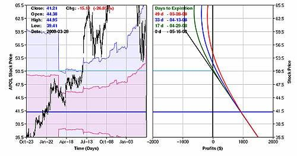

Post–earnings-announcement drift (PEAD) is a well-documented anomaly in financial economics and accounting research, characterized by a predictable pattern in stock prices following earnings announcements. This anomaly challenges the efficient market hypothesis (EMH), a cornerstone principle which suggests that all available information is already reflected in stock prices, and therefore, it is impossible to "beat the market" consistently on a risk-adjusted basis using this information. 

PEAD occurs when stock prices continue to drift in the direction of an earnings surprise for an extended period after the initial announcement. Typically, this manifests as an upward drift following positive earnings surprises and a downward drift following negative surprises. This predictable pattern contradicts the EMH, as it implies that markets do not efficiently or instantaneously incorporate earnings information into stock prices, allowing for the possibility of earning abnormal returns by exploiting this lag.

The significance of PEAD extends beyond its challenge to the EMH, serving as a crucial topic for algorithmic trading. Algorithmic trading involves using computer systems to execute trades based on predefined criteria and is ideally positioned to capitalize on anomalies like PEAD due to its ability to process information and execute trades at speeds far beyond human capability. By understanding and exploiting the patterns of PEAD, algorithmic traders can design strategies that anticipate and profit from expected price movements post-earnings announcements before the market fully assimilates this information.

Exploring PEAD through the lens of algorithmic trading not only provides insights into its mechanics but also underscores the evolving nature of financial markets, where human behavioral biases create opportunities that algorithmic systems can exploit. Furthermore, this discussion facilitates a deeper understanding of the market's dynamics, challenging established notions and shaping future research and trading strategies.

## Table of Contents

## Understanding Post–Earnings-Announcement Drift

Post–[earning](/wiki/earning-announcement)s-announcement drift (PEAD) was first brought into the spotlight by the seminal work of Ray J. Ball and P. Brown in the late 1960s. Through their pioneering research, they uncovered an intriguing anomaly occurring in the stock market: the prices of stocks continued to move in the direction of an earnings surprise for an extended period following an earnings announcement. This drift was contrary to the expectation set by the efficient market hypothesis (EMH), which posits that stock prices should instantly and fully reflect all available information, including new earnings data. 

The typical patterns of PEAD observed in the market support Ball and Brown's findings. When companies announce earnings that exceed analyst expectations, their stock prices often experience an upward drift for days, weeks, or even months after the announcement. Conversely, if a company's earnings fall short of expectations, the stock tends to drift downward over a similar timeframe. This behavior suggests that investors may not fully digest earnings information immediately, leading to delayed price adjustments.

PEAD stands as a robust challenge to the EMH, revealing significant implications for how information is processed in financial markets. Instead of fully efficient pricing, the market resembles a more behavior-based interpretation, where cognitive biases and other behavioral [factor](/wiki/factor-investing)s can slow down the information dissemination process. Investors may either under-react to the initial announcement or systematically adjust their expectations over time, paving the way for the observed drift.

The recognition of PEAD has prompted further inquiry into why markets fail to instantly assimilate new earnings information. Researchers continue to study behavior-based theories that account for delayed market responses, such as investor psychology and information processing limits. These explanations provide alternatives to purely economically rational models, suggesting instead that psychological factors play a crucial role in market dynamics.

## Causes and Hypotheses Behind PEAD

Post-earnings-announcement drift (PEAD) is a well-documented market anomaly wherein stock prices tend to drift in the same direction as the earnings surprise after earnings announcements. One of the predominant explanations for PEAD is investor under-reaction to earnings news. This under-reaction theory suggests that investors do not fully incorporate the implications of earnings announcements into stock prices immediately, leading to a gradual adjustment period where prices continue to move in the direction indicated by the earnings surprise.

Research by Bernard & Thomas has been pivotal in advancing the understanding of PEAD. Their studies highlight a delayed price response as a central characteristic of PEAD, where stock prices do not instantly reflect all available information post-earnings announcements. This delay suggests a market inefficiency that can be attributed to either slow assimilation of information by investors or a lack of attention to the earnings announcements.

Bernard & Thomas also explored the concept of a risk premium in relation to PEAD. They proposed that the drift might not solely be due to under-reaction but could also relate to compensation for bearing additional risk. However, it is the delayed response hypothesis that gained more traction as it directly challenges the notion of market efficiency by suggesting that prices do not immediately incorporate new information.

Additionally, their research delved into autocorrelation patterns present in stock returns around earnings announcements. Notably, they found positive autocorrelation of earnings surprises between adjacent quarters. This means that if a company reports a positive earnings surprise in one quarter, it is likely to do so again in the next. Conversely, there is a negative autocorrelation pattern observed four quarters apart. This phenomenon suggests a reversion to the mean over a more extended period, where the impact of an earnings announcement tends to diminish after a year.

These autocorrelation patterns indicate that short-term memory in earnings performance exists, providing a basis for predictive strategies based on past earnings surprises. The presence of such systematic patterns further reinforces the notion of inefficiencies in market pricing and challenges the efficient market hypothesis, which posits that all available information should already be reflected in stock prices. Understanding these patterns is crucial for traders and analysts aiming to exploit the PEAD anomaly effectively.

## Algorithmic Trading and PEAD

Algorithmic trading uses computer algorithms to execute trades at speeds and frequencies impossible for a human trader. Its growing prominence in financial markets is due, in part, to its ability to capitalize on market anomalies, such as Post–Earnings-Announcement Drift (PEAD). PEAD is the tendency for stocks to continue drifting in the direction of an earnings surprise for weeks or months after an earnings announcement, providing a potential opportunity for traders. 

Algorithmic trading systems can be designed to identify and exploit such anomalies by applying sophisticated strategies immediately after earnings announcements. Momentum strategies, for example, are particularly suitable for PEAD-focused algorithms. These strategies take advantage of the continued drift in stock prices by buying stocks that have experienced positive earnings surprises and selling stocks with negative surprises. This approach leverages the [momentum](/wiki/momentum) of stock movements post-announcement to capture potential gains, maximizing returns through rapid and automated execution of trades.

While [algorithmic trading](/wiki/algorithmic-trading) presents opportunities to exploit PEAD, it also poses several challenges and considerations that traders must address. One significant challenge is the risk of model overfitting, where a trading algorithm is too closely tailored to historical data, reducing its effectiveness in live market conditions. Furthermore, market [liquidity](/wiki/liquidity-risk-premium) is a concern, as the rapid execution of large [volume](/wiki/volume-trading-strategy)s of trades could impact the stock price, particularly in less liquid markets.

Regulatory concerns must also be considered, as markets worldwide increasingly scrutinize algorithmic and high-frequency trading activities. For instance, traders must comply with regulations that prevent market manipulation and adhere to circuit breakers designed to curb excessive [volatility](/wiki/volatility-trading-strategies). Effective risk management strategies and compliance mechanisms are essential in mitigating these risks, ensuring that algorithmic trading strategies remain both profitable and within legal norms.

Implementing a PEAD-focused trading algorithm involves continuous refinement and adaptation to changing market conditions and regulations. Despite the challenges, the potential for superior returns makes it a compelling choice for traders with the resources to navigate this complex landscape.

## Empirical Evidence and Case Studies

The concept of Post–Earnings-Announcement Drift (PEAD) has been rigorously studied, and empirical evidence consistently supports its existence. One notable study by Bernard and Thomas (1989) demonstrates how stocks exhibit price movements following earnings announcements that are not immediately efficient, thereby creating opportunities for excess returns. Their research shows that stocks with positive earnings surprises tend to outperform for up to 60 days after the announcement, while those with negative surprises underperform for similar durations.

An interesting case study of exploiting PEAD through algorithmic trading involves the use of momentum strategies. For instance, [quantitative trading](/wiki/quantitative-trading) firms often design algorithms that detect earnings surprises from data feeds and make rapid buy or sell decisions to capitalize on anticipated stock price drifts. By using a momentum strategy, algorithms enter positions in stocks with positive surprises shortly after the earnings announcement, maintaining these positions to capture the post-announcement drift.

The profitability of PEAD-based strategies has been analyzed through various quantitative models, demonstrating attractive returns relative to traditional benchmarks. For example, let's consider a strategy where an algorithm buys stocks that have had an earnings surprise exceeding a threshold of two standard deviations from analyst forecasts. The algorithm holds these stocks for a predetermined period, such as two months, based on historical drift patterns adequately capturing PEAD. Historical backtests of such strategies often reveal consistent excess returns, adjusted for risk, indicating the exploitable nature of PEAD.

Additionally, high-frequency trading firms have been successful in leveraging PEAD. These firms focus on the short-lived price changes immediately following an earnings release. By acting swiftly and utilizing advanced data mining techniques to interpret sentiment and numerical data, their algorithms capitalize on inefficiencies in the immediate aftermath of earnings news.

However, implementing PEAD-focused trading strategies involves challenges. While historical data is promising, factors such as evolving market structures, transaction costs, and regulatory considerations can impact the real-world profitability of these strategies. Moreover, the widespread adoption of algorithmic trading has potentially reduced the magnitude of PEAD, necessitating continuous innovation and adaptation in trading models.

In conclusion, empirical studies provide robust support for the existence of PEAD, and historical scenarios reveal how algorithmic trading can efficiently exploit this anomaly. While potential profitability is evident, traders must navigate the evolving landscape carefully to maintain a competitive edge.

## PEAD and Market Efficiency Debate

Post-earnings-announcement drift (PEAD) plays a significant role in the ongoing debates between behavioral finance and traditional market efficiency theories. Traditional market efficiency, particularly the efficient market hypothesis (EMH), asserts that markets are rational and that all available information is fully reflected in stock prices almost instantaneously. According to EMH, it should be impossible to achieve consistently abnormal returns using any publicly available information, as the market prices should adjust to new information rapidly and without bias.

However, PEAD presents a clear challenge to this notion. The drift indicates that stock prices do not adjust immediately following earnings announcements, allowing investors to exploit this delayed response for potential gains. This contradicts EMH's prediction of prompt and accurate price adjustment and suggests that markets may not be fully efficient. 

The behavioral finance perspective offers explanations for PEAD based on cognitive biases and psychological factors affecting investor behavior. It suggests that investors do not always react rationally to new information due to biases such as underreaction to earnings reports, where investors might initially undervalue the impact of earnings surprises. Consequently, it takes time for the full effect of the earnings news to be incorporated into stock prices, resulting in the drift observed in PEAD.

Regarding the implications of PEAD on the assumptions of EMH, if PEAD can be consistently exploited, it implies that information is not being efficiently priced into stocks as EMH would suggest. This undermines the strong form of market efficiency, which posits that even insider information is fully reflected in stock prices. The existence of PEAD signals that there are limits to [arbitrage](/wiki/arbitrage) and cognitive biases that prevent markets from being perfectly efficient.

Looking forward, research into anomalies like PEAD can benefit from exploring several avenues. One potential direction is incorporating advancements in [machine learning](/wiki/machine-learning) and big data analytics to better understand the dynamics that enable PEAD. Another important research direction is the examination of how market liquidity and investor composition affect the persistence and strength of PEAD. Moreover, studying the impact of regulatory changes and technological advancements, such as the proliferation of high-frequency trading, on the manifestation of PEAD in stock markets can provide deeper insights into market structures.

Ultimately, bridging empirical research with advancements in technology and behavioral insights could shed new light on the intricacies of PEAD and its implications for both market efficiency and trading strategies. This intersection of disciplines holds promise for refining existing theories and developing more robust financial models that account for market anomalies.

## Conclusion

Post–earnings-announcement drift (PEAD) plays a pivotal role in influencing stock prices and shaping trading strategies. This market anomaly indicates that stock prices continue to move in the direction of an earnings surprise for a period following the announcement, defying the efficient market hypothesis which suggests that stock prices should instantly reflect all available information. Recognizing and harnessing PEAD is critical in modern algorithmic trading because it provides opportunities for traders to capitalize on delayed market reactions.

Incorporating PEAD into trading algorithms can potentially enhance returns by exploiting the momentum effect seen in stock price adjustments post-earnings announcements. Algorithmic strategies can be programmed to identify stocks exhibiting signs of PEAD and execute trades that align with the expected price drift, either upward or downward. This approach, however, requires a sophisticated understanding of market dynamics and risk management to navigate the complexities involved.

Moreover, the continuous integration of empirical research with practical trading applications ensures that trading strategies remain relevant and effective. Empirical evidence supporting the existence of PEAD allows traders and researchers alike to refine their models and approaches, adapting to changing market conditions and improving predictive capabilities. As financial markets evolve, ongoing research into phenomena like PEAD remains crucial, offering insights that bridge theoretical frameworks with real-world trading considerations. This synergy between research and application not only enhances the understanding of market anomalies but also drives advancements in trading technology and strategies.

## References

1. **Ball, R., & Brown, P. (1968).** "An Empirical Evaluation of Accounting Income Numbers." *Journal of Accounting Research*, 6(2), 159-178. This seminal paper introduced the concept of how stock prices react to earnings announcements, laying the foundation for understanding Post-Earnings-Announcement Drift (PEAD).

2. **Bernard, V. L., & Thomas, J. K. (1989).** "Post-Earnings-Announcement Drift: Delayed Price Response or Risk Premium?" *Journal of Accounting Research*, 27, 1-36. This study is pivotal to understanding the persistent price movements after earnings announcements, exploring potential causes behind PEAD.

3. **Bernard, V. L., & Thomas, J. K. (1990).** "Evidence That Stock Prices Do Not Fully Reflect the Implications of Current Earnings for Future Earnings." *Journal of Accounting and Economics*, 13(4), 305-340. Further investigation into the inefficiencies in market reactions, focusing on the behavior of investors and market pricing.

4. **Mendenhall, R. R. (2004).** "Arbitrage Risk and Post-Earnings-Announcement Drift." *Journal of Business*, 77(4), 875-894. This paper discusses the risk factors associated with exploiting PEAD in trading, offering insights into risk management practices.

5. **Fama, E.F. (1991).** "Efficient Capital Markets: II." *The Journal of Finance*, 46(5), 1575-1617. A discussion on the efficient market hypothesis with references to market anomalies like PEAD, critically evaluating the boundaries of market efficiency.

6. **Chordia, T., & Shivakumar, L. (2006).** "Earnings and Price Momentum." *Journal of Financial Economics*, 80(3), 627-656. This research highlights strategies often used in algorithmic trading, leveraging anomalies like PEAD for enhanced trading efficiency.

7. **Skinner, D. J., & Sloan, R. G. (2002).** "Earnings Surprises, Growth Expectations, and Stock Returns or Don’t Let an Earnings Torpedo Sink Your Portfolio." *Review of Accounting Studies*, 7(2-3), 289-312. The paper examines the impact of earnings surprises on stock returns, providing empirical evidence that supports the existence and persistence of PEAD.

For further reading on PEAD and its implications in financial markets, consider exploring specialized finance and accounting journals that periodically publish updated research on market anomalies and trading strategies utilizing advanced algorithmic techniques.

## References & Further Reading

[1]: Ball, R., & Brown, P. (1968). ["An Empirical Evaluation of Accounting Income Numbers."](https://www.jstor.org/stable/2490232) Journal of Accounting Research, 6(2), 159-178.

[2]: Bernard, V. L., & Thomas, J. K. (1989). ["Post-Earnings-Announcement Drift: Delayed Price Response or Risk Premium?"](https://www.jstor.org/stable/2491062) Journal of Accounting Research, 27, 1-36.

[3]: Bernard, V. L., & Thomas, J. K. (1990). ["Evidence That Stock Prices Do Not Fully Reflect the Implications of Current Earnings for Future Earnings."](https://www.sciencedirect.com/science/article/pii/016541019090008R) Journal of Accounting and Economics, 13(4), 305-340.

[4]: Mendenhall, R. R. (2004). ["Arbitrage Risk and Post-Earnings-Announcement Drift."](https://www.jstor.org/stable/10.1086/422627) Journal of Business, 77(4), 875-894.

[5]: Fama, E. F. (1991). ["Efficient Capital Markets: II."](https://onlinelibrary.wiley.com/doi/full/10.1111/j.1540-6261.1991.tb04636.x) The Journal of Finance, 46(5), 1575-1617.

[6]: Chordia, T., & Shivakumar, L. (2006). ["Earnings and Price Momentum."](https://www.sciencedirect.com/science/article/pii/S0304405X05002175) Journal of Financial Economics, 80(3), 627-656.

[7]: Skinner, D. J., & Sloan, R. G. (2002). ["Earnings Surprises, Growth Expectations, and Stock Returns or Don’t Let an Earnings Torpedo Sink Your Portfolio."](https://link.springer.com/article/10.1023/A:1020294523516) Review of Accounting Studies, 7(2-3), 289-312.