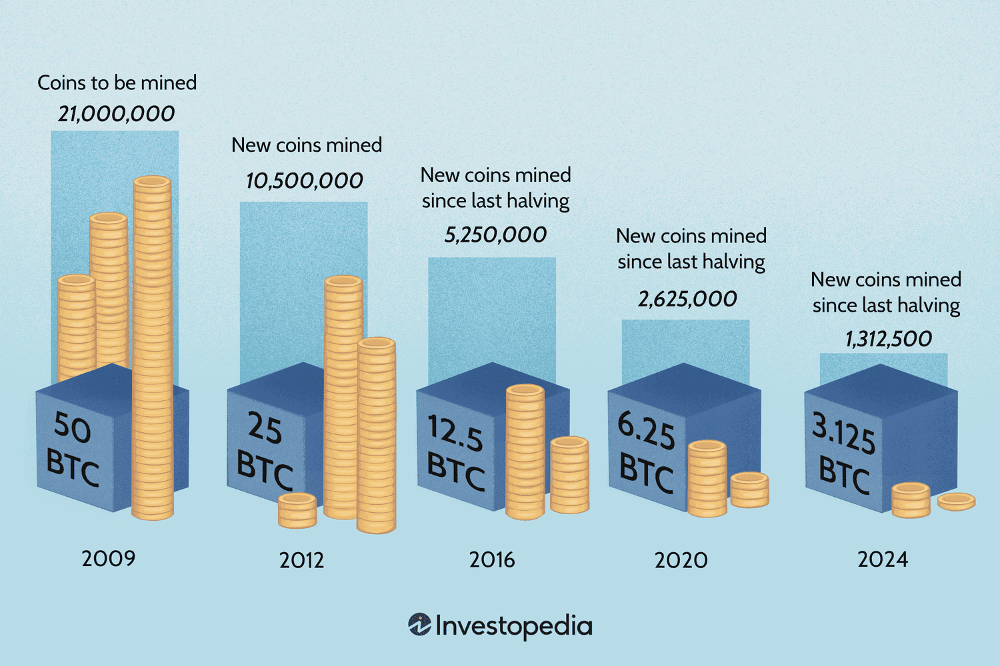

## Table of Contents

## What is Bitcoin and why is its supply finite?

Bitcoin is a type of digital money that you can use to buy things online. It was created in 2009 by someone using the name Satoshi Nakamoto. Unlike regular money, Bitcoin is not controlled by any government or bank. Instead, it uses a technology called blockchain, which is like a big, public record book that keeps track of all Bitcoin transactions. People store their Bitcoins in digital wallets and can send them to others over the internet.

The supply of Bitcoin is finite, which means there will only ever be 21 million Bitcoins in existence. This limit was set by Satoshi Nakamoto when he created Bitcoin. The reason for this limit is to make Bitcoin more like gold, which also has a limited supply. By having a finite supply, Bitcoin is designed to avoid problems like inflation, where the value of money goes down because there is too much of it. This makes Bitcoin more valuable over time as more people want to use it, but there are only so many Bitcoins to go around.

## How does Bitcoin mining work and what is its role in the supply?

Bitcoin mining is the process where people use powerful computers to solve complex math problems. When a computer solves one of these problems, it gets to add a new block of transactions to the blockchain. This is important because it helps keep the Bitcoin system secure and running smoothly. The person who solves the problem gets rewarded with new Bitcoins. This is how new Bitcoins enter the supply.

The role of mining in the supply of Bitcoin is very important. As mentioned before, there will only ever be 21 million Bitcoins. Miners are the ones who bring these new Bitcoins into existence. But, the number of Bitcoins miners get as a reward gets smaller over time. This was planned by Satoshi Nakamoto to make sure that all 21 million Bitcoins will be released slowly over many years. This slow release helps keep Bitcoin's value stable and makes it more like a limited resource, like gold.

## What happens when all Bitcoins are mined?

When all 21 million Bitcoins are mined, no more new Bitcoins will be created. This is expected to happen around the year 2140. After that, miners won't get new Bitcoins as a reward for adding new blocks to the blockchain. Instead, they will only earn from the fees people pay to send Bitcoins to each other. These fees will become the main way miners make money.

Even though no new Bitcoins will be made, the Bitcoin network will still need miners to keep running. Miners will still be important because they help keep the system secure and make sure transactions are processed correctly. As long as there are enough miners willing to work for the fees, the Bitcoin system should continue to work well. This means Bitcoin can still be used as money, even after all the Bitcoins are mined.

## What are the economic implications of Bitcoin's finite supply?

Bitcoin's finite supply of 21 million coins means that there will never be more Bitcoins than this. This can make Bitcoin more valuable over time because it's like a treasure that can't grow bigger. When more people want to use Bitcoin but there's only so much of it, the price can go up. This is different from regular money, which governments can print more of, which sometimes makes it worth less. Bitcoin's limit can help it keep its value or even grow, which is why some people see it as a good way to store money for the future.

But, having a fixed supply also means that if everyone suddenly wants to use Bitcoin, it might be hard to get. This could make the price go up a lot very quickly, which can be risky for people who own Bitcoin. Also, if fewer people want to use Bitcoin, the price might not go up as much or could even go down. So, while the finite supply can make Bitcoin valuable, it also makes its price more unpredictable. People need to think carefully about these ups and downs before deciding to use or invest in Bitcoin.

## How does the halving event affect Bitcoin's supply and value?

The halving event in Bitcoin happens about every four years. It cuts in half the number of new Bitcoins that miners get as a reward for adding new blocks to the blockchain. This makes the supply of new Bitcoins grow slower. Because there are fewer new Bitcoins coming into the market, this can make Bitcoin more scarce. When something is more scarce but people still want it, its value often goes up. So, the halving can push the price of Bitcoin higher over time.

But, the halving doesn't always make the price go up right away. Sometimes, the price can go down or stay the same after a halving. This is because many things affect Bitcoin's price, like what people think about it, laws from governments, and how the economy is doing. Still, over the long run, the halving helps keep Bitcoin's supply limited, which is one reason why some people think Bitcoin can be a good store of value, kind of like digital gold.

## What are the potential impacts of Bitcoin's finite supply on its adoption?

Bitcoin's finite supply can make it more attractive to people who want to use it as a way to store value. Because there will only ever be 21 million Bitcoins, it's like a treasure that can't grow bigger. This can make people think Bitcoin is like gold, which is also limited. When more people want to use Bitcoin but there's only so much of it, the price can go up. This might encourage more people to start using and investing in Bitcoin, hoping its value will keep growing.

However, the limited supply can also make it harder for Bitcoin to be used as everyday money. If everyone wants to use Bitcoin to buy things, but there's not enough of it, the price might go up too fast. This can make it hard for people to use Bitcoin for regular purchases because it might be too expensive. Also, if the price goes up and down a lot because of the limited supply, people might be scared to use it. They might worry about losing money if the price drops suddenly. So, while the finite supply can make Bitcoin valuable, it can also make it less useful for everyday buying and selling.

## How do post-mining scenarios influence Bitcoin's security and decentralization?

After all Bitcoins are mined, miners will only earn money from the fees people pay to send Bitcoins. This means that the security of the Bitcoin network will depend on these fees being big enough to keep miners interested in doing their job. Miners are important because they keep the system safe and make sure transactions are added to the blockchain. If the fees are too small, fewer people might want to mine, which could make the network less secure. But if the fees are big enough, miners will still work hard to keep the system running smoothly.

The finite supply of Bitcoin also affects how decentralized it is. Decentralization means that no single person or group controls the network. After all Bitcoins are mined, the network might become more decentralized if more people start mining for the fees. This could happen if the fees are high enough to make mining profitable for lots of different people. But if only a few big miners can make money from the fees, the network might become more centralized, with just a few people in control. So, the way miners earn money after all Bitcoins are mined will be important for keeping Bitcoin secure and decentralized.

## What are the environmental implications of Bitcoin mining and how will they change post-mining?

Bitcoin mining uses a lot of electricity because miners need powerful computers to solve math problems. These computers use a lot of energy, and most of the time, this energy comes from sources like coal or gas, which can harm the environment. The more Bitcoins that are mined, the more energy is used, and this can lead to more pollution and climate change. Some people worry that Bitcoin mining is not good for the planet because of how much energy it uses.

After all Bitcoins are mined, the way miners earn money will change. They won't get new Bitcoins as a reward anymore, but they will still earn money from the fees people pay to send Bitcoins. This might mean less energy is used for mining because miners might not need as many powerful computers. If the fees are enough to keep miners interested, they might use more energy-efficient ways to mine, which could be better for the environment. But if the fees are too small, fewer people might want to mine, which could also mean less energy use overall.

## How might Bitcoin's finite supply affect its role as a store of value compared to other assets?

Bitcoin's finite supply makes it more like gold, which is also limited. Because there will only ever be 21 million Bitcoins, it can become more valuable over time as more people want to use it. This is different from regular money, which governments can print more of, sometimes making it worth less. People who want to keep their money safe from losing value might choose Bitcoin because its limited supply could make it go up in value. This is why some people call Bitcoin "digital gold."

However, Bitcoin's limited supply can also make its price go up and down a lot. If everyone wants to use Bitcoin but there's not enough of it, the price might jump quickly. This can be risky for people who own Bitcoin because they might lose money if the price suddenly drops. Compared to other assets like stocks or real estate, Bitcoin's value can be more unpredictable. So, while Bitcoin's finite supply can make it a good store of value for some, it also means people need to be careful and think about the risks before deciding to use it to keep their money safe.

## What strategies are being proposed or implemented to manage Bitcoin's supply after mining ends?

After all Bitcoins are mined, the main way miners will earn money is from the fees people pay to send Bitcoins. To make sure there are enough miners to keep the network safe, some people think that the fees need to be big enough to keep miners interested. One idea is to make the fees go up if there are not enough miners. This could help make sure there are always enough miners to keep the Bitcoin system running smoothly and securely.

Another strategy being talked about is to make mining more energy-efficient. Right now, mining uses a lot of power, which can be bad for the environment. After mining ends, if miners use less energy to earn from fees, it could be better for the planet. Some people are working on new ways to mine that use less power, which could help keep Bitcoin going even after all the coins are mined.

## How could the cessation of mining impact the Bitcoin network's transaction processing and fees?

When all Bitcoins are mined, miners won't get new Bitcoins as a reward anymore. Instead, they will only earn money from the fees people pay to send Bitcoins. This means the fees need to be big enough to keep miners interested in doing their job. If the fees are too small, fewer miners might want to work, which could slow down how fast transactions are processed. People might have to wait longer to send their Bitcoins, and the network might not work as well.

On the other hand, if the fees are high enough, miners will keep working hard to process transactions. This could make the Bitcoin network stay fast and secure. But, if the fees get too high, it might be too expensive for people to use Bitcoin for small purchases. So, the right balance of fees is important to keep the network running smoothly and make sure people can still use Bitcoin easily.

## What are the long-term forecasts for Bitcoin's value and utility considering its finite supply?

Bitcoin's finite supply of 21 million coins means that it could become more valuable over time. When something is limited but more people want it, the price usually goes up. This is why some people think Bitcoin is like digital gold. They believe that as more people use Bitcoin and fewer new Bitcoins are made, its value will keep growing. This could make Bitcoin a good way to store money for the future, kind of like saving gold. But, because the supply is limited, the price can also go up and down a lot. If everyone wants to use Bitcoin but there's not enough of it, the price might jump quickly, which can be risky for people who own Bitcoin.

In the long run, Bitcoin's role as a way to buy things might change because of its limited supply. If the price keeps going up, it might be too expensive for people to use Bitcoin for everyday purchases. This means Bitcoin might be used more as a store of value, like keeping money safe, rather than as regular money. But, if the fees people pay to send Bitcoins are enough to keep miners working, the Bitcoin network can still process transactions quickly and safely. This balance will be important for making sure Bitcoin stays useful and valuable in the future.

## Will Bitcoin ever reach 21 million?

Bitcoin, since its inception, has been defined by a supply cap of 21 million coins, a feature that plays a pivotal role in its monetary policy. However, reaching precisely 21 million Bitcoins is a technical impossibility due to intrinsic elements within Bitcoin's code. This section outlines the reasons behind this and examines the mathematic and technical nuances contributing to this limit.

The key mechanism that governs Bitcoin's supply is its issuance schedule through mining rewards, which are halved approximately every four years in an event known as the "halving." Initially set at 50 Bitcoins per block, these rewards were reduced to 25, then 12.5, and so on. With each halving, the emission rate approaches zero.

Mathematically, this scenario is modeled by the geometric series sum formula: 

$$
S = a \times \frac{1 - r^n}{1 - r}
$$

where $S$ is the total supply, $a$ is the initial block reward, and $r$ is the reduction factor (0.5 for Bitcoin's halvings). Theoretically, if extended to infinity, Bitcoin’s supply cap would reach exactly 21 million coins. However, since Bitcoin's emission is structured through discrete halvings rather than a continuous model, this sum slightly falls short due to rounding errors inherent in digital computation and the specifics of Bitcoin's distribution method.

A technical aspect that contributes to the exact sum never reaching 21 million involves bit-shift operations and mathematical rounding in Bitcoin's codebase. Since Bitcoin operates within binary constraints, reward calculations often use fixed-point arithmetic, which can introduce slight inaccuracies due to the rounding demands of binary representation. Operations such as bit-shifting can similarly truncate minor fractions in reward calculations.

Practically, this means that the final Bitcoin will never be mined in the traditional sense, but will instead reside as a mathematically asymptotic limit. Experts approximate the total supply will come close to, but not exactly reach, 21 million Bitcoins. Given the coding mechanics and finite block reward reductions, estimates suggest the final mined figure might hover within a few Bitcoin of the proposed limit.

Prominent Bitcoin developers and researchers like Pietro De Biase and Nic Carter have indicated that the maximum extractable Bitcoin, given current coding architecture, results in a cap marginally less than 21 million due to these computational nuances. As Bitcoin's monetary structure continues to evolve amidst technological progress, these slight variations underscore the precision and limitations of its decentralized protocol within software design constraints.

## References & Further Reading

[1]: Nakamoto, S. (2008). ["Bitcoin: A Peer-to-Peer Electronic Cash System."](https://nakamotoinstitute.org/library/bitcoin/)

[2]: Antonopoulos, A. M. (2017). ["Mastering Bitcoin: Unlocking Digital Cryptocurrencies."](https://books.google.com/books/about/Mastering_Bitcoin.html?id=IXmrBQAAQBAJ) O'Reilly Media.

[3]: Narayanan, A., Bonneau, J., Felten, E., Miller, A., & Goldfeder, S. (2016). ["Bitcoin and Cryptocurrency Technologies: A Comprehensive Introduction."](https://press.princeton.edu/books/hardcover/9780691171692/bitcoin-and-cryptocurrency-technologies) Princeton University Press.

[4]: Lewis, M. (2021). ["Flash Boys: A Wall Street Revolt."](https://www.amazon.com/Flash-Boys-Wall-Street-Revolt/dp/0393351599) W. W. Norton & Company.

[5]: De Filippi, P., & Wright, A. (2018). ["Blockchain and the Law: The Rule of Code."](https://www.jstor.org/stable/j.ctv2867sp) Harvard University Press.

[6]: Lopez de Prado, M. (2018). ["Advances in Financial Machine Learning."](https://www.amazon.com/Advances-Financial-Machine-Learning-Marcos/dp/1119482089) Wiley.

[7]: Chan, E. P. (2009). ["Quantitative Trading: How to Build Your Own Algorithmic Trading Business."](https://github.com/ftvision/quant_trading_echan_book) Wiley.