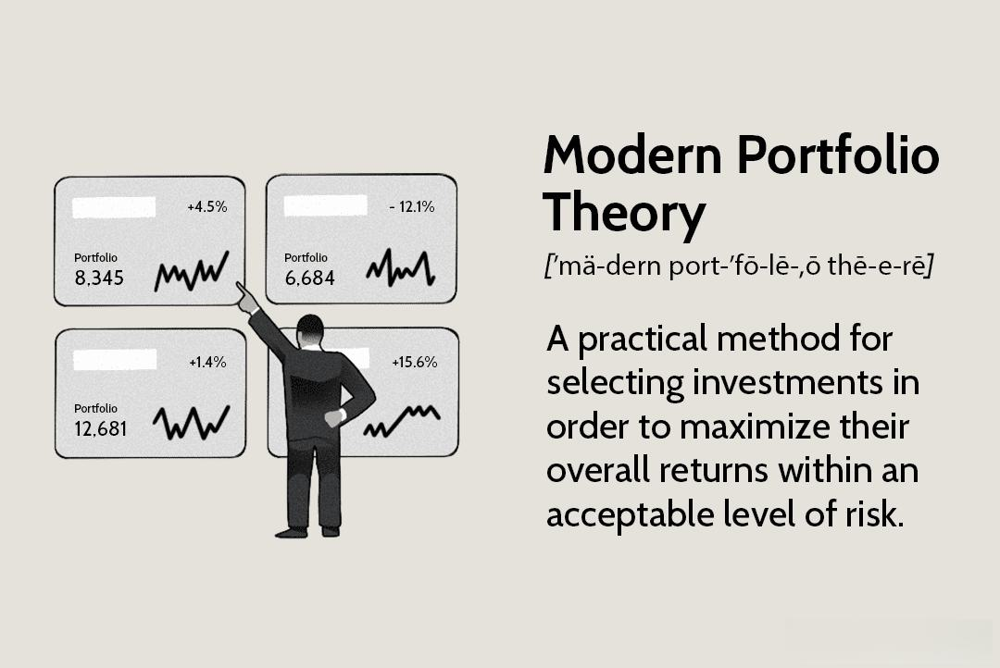

In the ever-evolving landscape of finance, investment strategies must adapt to new theories and technologies to remain effective and competitive. One such advancement is the Post-Modern Portfolio Theory (PMPT), which marks a significant departure from the traditional Modern Portfolio Theory (MPT) by explicitly focusing on downside risk rather than total variance. PMPT offers a more investor-relevant assessment of risk by emphasizing potential losses, which aligns better with investors' natural aversion to downside risks.

Algorithmic trading, often referred to as algo trading, plays a crucial role in enhancing these contemporary investment theories. It involves using complex algorithms to execute trades based on pre-determined conditions, improving both the efficiency and precision of investment decisions. By integrating algo trading with PMPT, investors can automate the adjustment of portfolios based on downside risk metrics, thus optimizing investment outcomes.



This article explores the combination of PMPT and algo trading, proposing a modern approach to portfolio management. The key components of PMPT, including its focus on downside risk, are analyzed alongside its distinctions from MPT. Additionally, the role of algo trading in enhancing these strategies is examined, demonstrating how real-time market data and automatic adjustments can create more consistent risk-return profiles aligned with investor goals.

## Table of Contents

## Understanding Post-Modern Portfolio Theory (PMPT)

Post-Modern Portfolio Theory (PMPT) was developed to address the shortcomings of Modern Portfolio Theory (MPT), especially the latter's focus on total risk without adequately considering investors' concerns about downside risk. Introduced by Brian M. Rom and Kathleen Ferguson in 1991, PMPT shifts the emphasis from the overall variance in returns to the risks associated with negative returns, providing a risk assessment framework better aligned with investor objectives.

One of the fundamental distinctions between PMPT and its predecessor is the measure of risk. While MPT uses the standard deviation of returns to reflect both upside and downside volatility, PMPT focuses specifically on downside deviation. This measure considers only the negative deviations of a portfolio's returns, providing investors with a more relevant sense of risk – essentially, how far returns can fall short of a minimal acceptable return.

In place of the Sharpe Ratio, which evaluates risk-adjusted returns based on total volatility, PMPT employs the Sortino Ratio. This alternative metric isolates downside deviation, offering a clearer insight into performance by penalizing only those outcomes that fall below a predefined target or minimal level of return. The formula for the Sortino Ratio is as follows:

$$
\text{Sortino Ratio} = \frac{R_p - R_t}{\text{DR}}
$$

where $R_p$ is the portfolio return, $R_t$ is the target or minimal acceptable return, and $\text{DR}$ is the downside risk.

Evidence from academic research supports PMPT's superior ability to optimize portfolios by minimizing the risk of downside losses rather than merely reducing total [volatility](/wiki/volatility-trading-strategies). This methodology results in investment strategies that better reflect actual investor preferences, as they generally involve a higher sensitivity to losses than to equivalent gains. By concentrating on these investor-centric metrics, PMPT facilitates more effective portfolio construction, aligning outcomes with investor goals and risk tolerances.

## Why PMPT Over Modern Portfolio Theory?

Modern Portfolio Theory (MPT), developed by Harry Markowitz in 1952, primarily focuses on total variance as a measure of risk, assuming that investors should aim to optimize portfolios by maximizing expected return for a given level of risk. This approach, however, does not adequately reflect the concerns of many investors, particularly those who are more sensitive to downside risks. Post-Modern Portfolio Theory (PMPT) addresses these limitations by shifting the focus towards downside risk, which is the risk of experiencing losses that fall below a minimum acceptable return.

**Focus on Downside Losses**

Investors are generally more concerned with potential losses than with volatility per se, leading PMPT to emphasize downside risk rather than the total variance used in MPT. The downside deviation is calculated by considering only the returns that fall below a specified target or threshold, offering a more relevant risk assessment tool for investors wary of losses. The formula for calculating downside deviation: 

$$
\text{Downside Deviation} = \sqrt{\frac{\sum_{t=1}^{n} \min(R_t - \text{MAR}, 0)^2}{n}}
$$

Where $R_t$ is the return at time $t$, MAR is the Minimum Acceptable Return, and $n$ is the number of periods.

**Behavioral Biases and Individual Preferences**

PMPT integrates behavioral biases and individual preferences, aligning more closely with real-world investor behavior. Investors are seldom rational actors as posited by classical economics; instead, they exhibit biases such as loss aversion—preferring to avoid losses over acquiring equivalent gains. PMPT captures these behaviors by concentrating on the aspects of risk that investors find most concerning, which aids in constructing portfolios that resonate more with investors' psychological profiles and risk appetites.

**Balancing Risk and Return in Volatile Markets**

PMPT provides a more nuanced evaluation of risk than MPT, especially in volatile markets. While MPT assumes a normal distribution of returns, real market returns often exhibit skewness and kurtosis, challenging the classic risk-return paradigm. PMPT, by accounting for the asymmetry of returns and potential for extreme losses, better accommodates the realities of market behavior, allowing for a more balanced approach to achieving desired returns while adequately managing risk.

**Role of Alternative Investments**

Within PMPT, greater emphasis is placed on alternative investments, which serve as critical tools for diversification and risk management. Alternative assets, such as real estate, commodities, and hedge funds, often have low correlations with traditional equity and bond markets, thus providing a hedge against market fluctuations. Inclusion of such assets in a PMPT-guided portfolio can reduce downside risk and enhance risk-adjusted performance.

In summary, while MPT provides a foundational framework for investment strategy, PMPT offers an evolution that more accurately reflects investors' concerns about downside risk, accounts for behavioral biases, and achieves a better risk-return balance, particularly in volatile markets. With its focus on understanding and managing the specific risks that investors care most about, PMPT emerges as a sophisticated enhancement to traditional portfolio management strategies.

## Algorithmic Trading and PMPT

Algorithmic trading, often abbreviated as algo trading, utilizes advanced algorithms to execute trades automatically based on predetermined criteria, significantly enhancing efficiency and precision in trading operations. By integrating [algorithmic trading](/wiki/algorithmic-trading) with Post-Modern Portfolio Theory (PMPT), investors can achieve automatic portfolio adjustments that are responsive to downside risk metrics—an essential feature as PMPT emphasizes protection against negative returns.

The ability of algorithms to digest and assess vast datasets allows for the continual optimization of portfolios in line with PMPT principles. This capacity for real-time data analysis ensures that portfolios remain aligned with market conditions and investor preferences. A key advantage of this integration is the reduction or elimination of human biases and emotional inclinations in investment decisions. By relying on predefined, objective criteria coded into the trading algorithms, the investment process becomes more systematic and disciplined.

Moreover, the adaptation to market changes facilitated by algo trading provides investors with more consistent risk-return profiles. These profiles are crafted to reflect the specific goals and risk tolerance of the investors, resulting in tailored investment strategies that more closely match investors' desired outcomes. Additionally, the use of metrics such as the Sortino Ratio or other downside risk measurements can be seamlessly integrated into the algorithms, allowing them to dynamically adjust positions based on ongoing performance evaluations.

Python, a preferred programming language in algorithmic trading, offers extensive libraries such as NumPy and pandas for data manipulation and analysis, reinforcing the operational capability of PMPT-focused algorithms. Hypothetically, a simple algorithm might be structured as follows:

```python
import numpy as np
import pandas as pd

# Sample data for portfolio returns
returns = pd.Series([0.05, -0.02, 0.04, -0.03, 0.06, -0.01])

# Calculate downside deviation
target_return = 0
downside_deviation = np.sqrt(np.mean(np.minimum(0, returns - target_return)**2))

# Use downside deviation to adjust portfolio weights dynamically
def adjust_portfolio(returns, target, current_weights):
    downside_dev = np.sqrt(np.mean(np.minimum(0, returns - target)**2))
    adjusted_weights = current_weights * (1 - downside_dev)
    return adjusted_weights / np.sum(adjusted_weights)

# Example of adjusting portfolio based on recent returns
current_weights = np.array([0.4, 0.3, 0.3])
new_weights = adjust_portfolio(returns, target_return, current_weights)
print("Adjusted Portfolio Weights:", new_weights)
```

This example demonstrates how downside risk measurements can be incorporated into algorithmic strategies, allowing for real-time, data-driven adjustments that align with PMPT objectives. As these technologies and methodologies continue to develop, the alignment of PMPT and algorithmic trading presents a powerful toolset for achieving optimized, risk-managed investment portfolios.

## Key Components and Metrics of PMPT

Post-Modern Portfolio Theory (PMPT) provides an alternative framework to gauge investment risk and performance, emphasizing downside risk over total risk. It introduces several key metrics that are crucial for assessing and managing portfolio risk, aligning more closely with investor concerns.

**Downside Deviation** is the primary metric in PMPT, as it offers a focused view of the risks investors are typically more concerned with—those below a target or threshold return. Unlike the standard deviation used in Modern Portfolio Theory (MPT), which measures overall volatility, downside deviation only considers returns that fall below a certain target, thereby giving a more relevant picture of risk.

Mathematically, downside deviation is expressed as:
$$
DD = \sqrt{\frac{1}{N} \sum_{i=1}^{N} \min(0, R_i - R_T)^2}
$$
where $R_i$ are the individual returns, $R_T$ is the target return, and $N$ is the number of returns.

**Volatility skewness and semivariance** are additional metrics that PMPT employs to better understand the distribution of returns. Volatility skewness provides insight into the asymmetry of return distribution, highlighting whether there are more extreme negative or positive returns. **Semivariance**, similar to downside deviation, focuses on the variance of returns that are below the mean or target return, further refining the analysis of downside risk exposure.

In PMPT, the **Sortino Ratio** replaces the more commonly known Sharpe Ratio to adjust performance measures for downside risk. The Sortino Ratio is calculated by dividing the difference between the portfolio return and the risk-free rate by the downside deviation:
$$
\text{Sortino Ratio} = \frac{R_p - R_f}{DD}
$$
where $R_p$ is the portfolio return, $R_f$ is the risk-free rate, and $DD$ is the downside deviation.

Furthermore, the **Omega Ratio** provides a comprehensive measure of risk-adjusted performance by considering both downside and upside potential. It is calculated as the ratio of weighted cumulative probability of gains to losses, offering a multifaceted view of returns relative to a specific threshold.

These PMPT metrics collectively assist in capturing possible gains while effectively managing potential downside risks. By focusing on risk metrics more aligned with investor preferences, including skewness and target-oriented deviations, PMPT facilitates a balanced, informed approach to portfolio management, aiming to enhance decision-making and optimize performance in accordance with investor-specific goals and market conditions.

## Implementing PMPT with Algo Trading: Practical Applications

Incorporating algorithmic trading with Post-Modern Portfolio Theory (PMPT) offers significant advancements in modern investment strategy execution. By setting algorithms to adapt portfolios to real-time risk and market shifts, investment managers can effectively manage and optimize portfolios with greater precision and reduced latency.

### Scenario Simulation and Stress Testing

Investment managers wield the power of simulation and stress testing to anticipate and prepare for potential market disruptions. By creating numerous market scenarios and applying stress tests, they can evaluate the robustness of their portfolios under various conditions. This proactive approach allows them to identify vulnerabilities and reinforce their strategies, ensuring resilience against unexpected market movements.

### Dynamic Asset Allocation and Scenario Analysis

Dynamic asset allocation, a core component of PMPT, involves continuously adjusting the asset mix in response to changing market conditions. This adaptability is powered by scenario analysis, which evaluates the potential impact of various market developments. By using statistical models and historical data, these analyses predict how different assets will respond to changes in market conditions, providing insights that guide allocation decisions.

Algorithmic trading enhances these practices by executing the necessary adjustments seamlessly. Consider the Python code snippet below which demonstrates a simple dynamic asset allocation model using historical return data:

```python
import pandas as pd
import numpy as np

def dynamic_allocation(returns, target_return):
    cov_matrix = returns.cov()
    avg_returns = returns.mean()
    num_assets = len(avg_returns)

    weights = np.zeros(num_assets)
    for i in range(num_assets):
        weights[i] = (target_return - avg_returns[i]) / cov_matrix.iloc[i, i]
    weights /= weights.sum()  # Normalize weights

    return weights

# Example: Adjust portfolio weights based on historical returns
historical_returns = pd.read_csv("historical_returns.csv")
target_return = 0.05  # 5% target return
portfolio_weights = dynamic_allocation(historical_returns, target_return)
print(portfolio_weights)
```

### Seamless Execution with Algorithmic Trading

The integration of algo trading in this context ensures that portfolio adjustments are executed without delay. Algorithms process large datasets to inform decisions promptly, minimizing human biases and eliminating emotional interference. As a result, portfolio performance is continuously optimized, maintaining alignment with PMPT principles by prioritizing downside risk management and enhancing risk-adjusted returns.

### Practical Use Cases

Hedge funds and institutional investors use these sophisticated strategies to construct and maintain robust portfolios. They employ the synergy of PMPT and algorithmic trading to navigate volatile markets effectively. The ability to automatically rebalance portfolios and capitalize on real-time data enables them to achieve optimal risk-return profiles tailored to specific investment objectives and constraints.

Applying these strategies equips investors with a cutting-edge approach to portfolio management, facilitating improved outcomes through meticulous risk management and data-driven decision-making processes.

## Future Implications and the Evolving Landscape

As financial markets continue to change, the integration of Post-Modern Portfolio Theory (PMPT) and algorithmic trading presents significant opportunities and challenges for investors. A critical driver of this transformation is the advancement of emerging technologies such as [artificial intelligence](/wiki/ai-artificial-intelligence) (AI) and [machine learning](/wiki/machine-learning). These technologies offer powerful tools for processing vast amounts of financial data, uncovering complex patterns, and making precise, data-driven decisions. AI can enhance risk assessment by identifying downside risks more accurately and enabling the development of more sophisticated risk management protocols that align with PMPT principles.

The increasing attention to downside risk and behavioral finance is likely to shape broader financial management practices. By concentrating on downside deviations and investor behavior, PMPT provides a framework that is more aligned with real-world investment concerns. This focus enables portfolio managers to implement strategies that are not only rooted in rigorous quantitative methods but also consider psychological factors influencing investor decisions. Understanding these elements can lead to investment strategies that are more robust against market volatility and investor biases.

Moreover, the combination of PMPT with algorithmic trading will continue to offer investors a competitive advantage. By leveraging algorithms that incorporate PMPT metrics, investors can achieve optimized returns through real-time adjustments to their portfolios. This approach minimizes human error and allows for more consistent performance across diverse market conditions. The adaptability of these strategies is particularly beneficial during periods of market instability, where agility and precision are paramount.

Ongoing research and application of PMPT and algorithmic trading will pave the way for more flexible and resilient investment strategies tailored to future markets. The evolution of these methodologies will likely result in tools and solutions that are increasingly sophisticated and customized for individual investor needs and market conditions. By embracing technological advancements and refining investment frameworks, the financial industry can develop strategies that are well-equipped to navigate the uncertainties and opportunities of tomorrow's markets. These efforts ensure that investment management not only keeps pace with change but also capitalizes on it to achieve superior outcomes.

## Conclusion

Blending Post-Modern Portfolio Theory with algorithmic trading represents a forward-thinking approach in investment management. This integration highlights the benefits of focusing on downside risk, behavioral insights, and real-time adaptability, positioning PMPT as a vital tool in the investor's arsenal.

Downside risk, a core component of PMPT, shifts the focus from traditional methods that often emphasize total variance to a model that better resonates with real-world investor concerns. By concentrating on negative deviations, investors can fine-tune their strategies to manage potential losses more effectively. The dynamic adaptability offered by algorithmic trading allows for the continuous realignment of portfolios, ensuring swift responses to market shifts, thereby minimizing risks associated with human bias and emotional decision-making.

Harnessing these combined strategies enables investors to overcome traditional investment challenges, providing pathways that offer robust avenues for future growth. Such approaches incorporate the principles of behavioral finance, recognizing the importance of aligning investment strategies with real investor behavior and preferences. This alignment results in risk-return profiles that are not only more consistent but also closely tailored to individual investor goals.

To ensure continued success amid the changing dynamics of global financial markets, staying informed and adaptable is crucial. As financial environments become increasingly complex and technology drives rapid evolution, investors who master these advanced investment strategies will find themselves well-equipped for long-term success. By maintaining a focus on downside risk, adapting behaviors to real-time data, and leveraging algorithmic solutions, today's investors can secure competitive advantages that persist into the future.

## References & Further Reading

[1]: Rom, B. M., & Ferguson, K. W. (1993). ["Post-Modern Portfolio Theory Comes of Age"](https://actuaries.org/AFIR/Colloquia/Orlando/Ferguson_Rom.pdf). The Journal of Investing.

[2]: Sortino, F. A., & Van Der Meer, R. (1991). ["Downside Risk: Capturing What’s at Stake in Investment Situations."](https://research.rug.nl/en/publications/downside-risk-capturing-whats-at-stake-in-investment-situations) The Journal of Portfolio Management.

[3]: Sortino, F. A., & Satchell, S. (2001). ["Managing Downside Risk in Financial Markets."](https://www.sciencedirect.com/book/9780750648639/managing-downside-risk-in-financial-markets) Butterworth-Heinemann Finance. 

[4]: Treleaven, P., Galas, M., & Lalchand, V. (2013). ["Algorithmic trading review."](https://www.researchgate.net/publication/262239006_Algorithmic_Trading_Review) Communications of the ACM.

[5]: Lo, A. W. (2016). ["What is an index?"](https://dspace.mit.edu/bitstream/handle/1721.1/109050/Lo_What%20is%20an%20index.pdf) The Journal of Portfolio Management.