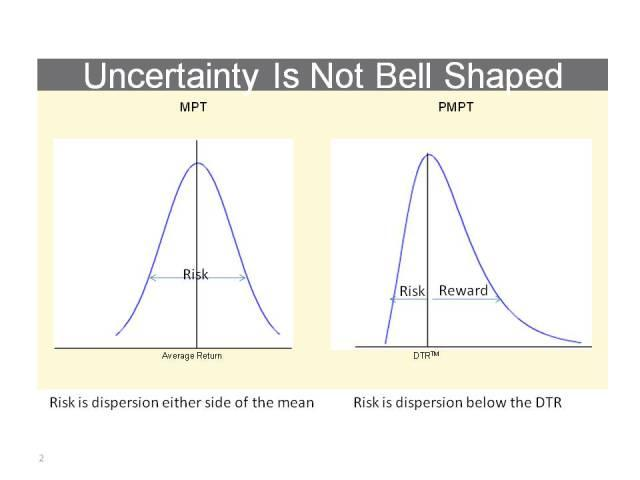

## Table of Contents

## What is Post-Modern Portfolio Theory (PMPT) and how does it differ from Modern Portfolio Theory (MPT)?

Post-Modern Portfolio Theory (PMPT) is a more recent approach to investing that builds on the ideas of Modern Portfolio Theory (MPT). PMPT was developed because MPT has some limitations. MPT looks at risk as how much an investment's returns go up and down (called volatility). But PMPT says that what really matters to investors is not just any kind of risk, but the risk of losing money. So, PMPT focuses on "downside risk," which is the chance that an investment will lose value.

The main difference between PMPT and MPT is how they measure risk. MPT uses standard deviation to measure risk, which looks at all kinds of movement in an investment's value, both up and down. PMPT, on the other hand, uses a measure called "semi-deviation," which only looks at the negative movements. This means PMPT tries to build portfolios that protect against losses better than MPT does. By focusing on downside risk, PMPT aims to help investors avoid big losses and achieve better returns over time.

## What are the key principles of Post-Modern Portfolio Theory?

Post-Modern Portfolio Theory (PMPT) is all about focusing on the risk of losing money, which it calls "downside risk." Instead of looking at all the ups and downs of an investment like Modern Portfolio Theory does, PMPT only cares about the downs. It uses something called "semi-deviation" to measure this risk. This means PMPT tries to build investment portfolios that are less likely to lose money, which can be really important for people who don't want to see their savings drop a lot.

Another big idea in PMPT is that not all risk is bad. If an investment goes up a lot, that's good, even if it's risky. So, PMPT tries to find a balance where the good risks (the ones that can make you more money) are kept, but the bad risks (the ones that can make you lose money) are reduced. This way, investors can aim for higher returns without worrying as much about big losses.

## How does PMPT address the limitations of MPT?

PMPT addresses the limitations of MPT by focusing on the risk of losing money, which is called "downside risk." MPT looks at all kinds of risk, both the good and the bad, using a measure called standard deviation. But PMPT says that what really matters to investors is not losing money. So, PMPT uses a different measure called "semi-deviation" to only look at the times when an investment loses value. This helps investors build portfolios that are less likely to see big losses, which can be really important for people who want to keep their savings safe.

Another way PMPT improves on MPT is by recognizing that not all risk is bad. If an investment goes up a lot, that's a good kind of risk. PMPT tries to keep these good risks while reducing the bad ones that can lead to losses. This way, investors can aim for higher returns without worrying as much about big drops in their portfolio's value. By focusing on what really matters to investors, PMPT helps them make better choices about where to put their money.

## What role does downside risk play in PMPT?

Downside risk is super important in Post-Modern Portfolio Theory (PMPT). It's all about the chance that an investment might lose money. PMPT thinks that this kind of risk is what really matters to people who are investing. Instead of looking at all the ups and downs like Modern Portfolio Theory does, PMPT only cares about the downs. It uses a special measure called "semi-deviation" to see how often and how much an investment loses value. By focusing on downside risk, PMPT helps people build investment portfolios that are less likely to see big losses.

This focus on downside risk helps investors feel more secure about their money. PMPT says that not all risk is bad. If an investment can go up a lot, that's a good kind of risk. So, PMPT tries to find a balance where the good risks (the ones that can make you more money) are kept, but the bad risks (the ones that can make you lose money) are reduced. This way, investors can aim for higher returns without worrying as much about big drops in their portfolio's value. By understanding and managing downside risk, PMPT helps people make smarter choices about where to put their money.

## How is the Sortino Ratio used in PMPT?

The Sortino Ratio is a tool used in Post-Modern Portfolio Theory (PMPT) to measure how well an investment is doing when you only think about the bad risks. It looks at how much money an investment makes compared to how much it might lose. The Sortino Ratio is better than other tools because it only cares about the times when an investment goes down, not when it goes up. This helps people see if an investment is worth the risk of losing money.

In PMPT, the Sortino Ratio is really helpful because it matches the idea of focusing on downside risk. It tells investors if the good returns they might get are worth the chance of losing money. A higher Sortino Ratio means the investment is doing a good job of making money without too much risk of losing it. This way, people can pick investments that fit their goals of growing their money while keeping it safe from big losses.

## Can you explain the concept of semi-variance in the context of PMPT?

In Post-Modern Portfolio Theory (PMPT), semi-variance is a way to measure risk that only looks at the bad times when an investment loses money. It's different from other ways of measuring risk because it doesn't care about the good times when an investment goes up. Instead, semi-variance focuses on the times when the investment's returns are below what you expect or below a certain target. This helps investors see how much they might lose, which is really important for people who want to keep their money safe.

By using semi-variance, PMPT helps people build portfolios that are less likely to have big losses. It's all about understanding the downside risk, which is the chance that an investment will lose value. When investors know how much they might lose, they can make better choices about where to put their money. This way, they can aim for good returns without worrying too much about big drops in their savings.

## How does PMPT incorporate investor behavior and preferences into portfolio construction?

Post-Modern Portfolio Theory (PMPT) pays a lot of attention to what investors want and how they act when making investment choices. It knows that everyone is different and might have different goals and feelings about risk. Some people might be okay with big ups and downs if it means they could make more money, while others might want to keep their money safe and not take big risks. PMPT uses this information to help build portfolios that fit each person's needs. It asks investors about their comfort with risk and their goals for their money, then uses that to choose investments that match what they want.

PMPT also looks at how investors actually behave, not just what they say they want. It knows that people can get scared and sell their investments when the market goes down, even if it's not the best thing to do. By understanding these behaviors, PMPT can help build portfolios that are less likely to make investors panic and sell at the wrong time. This way, it tries to keep investors calm and focused on their long-term goals, even when the market is bumpy. By considering both what investors say they want and how they actually act, PMPT helps create investment plans that work better for real people.

## What are some practical applications of PMPT in investment management?

Post-Modern Portfolio Theory (PMPT) helps people who manage money build investment plans that focus on not losing money. Instead of looking at all the ups and downs of an investment, PMPT only cares about the times when an investment goes down. This means it helps investors pick investments that are less likely to lose value, which is really important for people who want to keep their savings safe. For example, a financial advisor might use PMPT to build a portfolio for someone who is close to retiring and doesn't want to take big risks. By focusing on downside risk, the advisor can choose investments that are more stable and less likely to drop a lot.

PMPT also helps by matching investments to what each person wants and how they act. It knows that everyone is different—some people might be okay with big risks if it means they could make more money, while others might want to play it safe. So, PMPT asks investors about their comfort with risk and their goals for their money, then uses that information to pick the right investments. This way, it can create a plan that fits each person's needs. For instance, if someone is scared of big market drops, PMPT can help build a portfolio that is less likely to make them panic and sell at the wrong time, helping them stick to their long-term goals.

## How does PMPT handle asset allocation differently compared to traditional methods?

Post-Modern Portfolio Theory (PMPT) handles asset allocation differently from traditional methods by focusing on not losing money. Instead of looking at all the ups and downs of an investment, PMPT only cares about the times when an investment goes down. This is called "downside risk." By focusing on this, PMPT helps investors pick a mix of investments that are less likely to lose value. This means someone who is close to retiring and wants to keep their savings safe might choose a different mix of investments than someone who is okay with more risk. PMPT helps find the right balance of investments to match what each person wants and needs.

Traditional methods, like Modern Portfolio Theory (MPT), look at all kinds of risk, both the good and the bad. They use something called "standard deviation" to measure this risk, which means they consider all the ups and downs of an investment. But PMPT thinks that what really matters to investors is not losing money, so it uses a different way to measure risk called "semi-deviation." This only looks at the bad times when an investment loses value. By doing this, PMPT can help build a portfolio that is more focused on keeping the investor's money safe, while still trying to grow it over time. This way, investors can feel more secure about their money and make choices that fit their own goals and comfort with risk.

## What are the criticisms and challenges faced by PMPT?

Post-Modern Portfolio Theory (PMPT) has some critics who say it's not perfect. One big problem is that it can be hard to predict the future, so even though PMPT tries to focus on not losing money, it's tough to know for sure what will happen. Another issue is that PMPT might make people too focused on avoiding losses and not focused enough on making money. Some people think that trying to avoid all the bad risks might mean missing out on good chances to grow their savings.

Also, PMPT can be tricky to use because it needs a lot of data and math to figure out the right mix of investments. Not everyone has the tools or the know-how to do this, which can make it hard to use PMPT in real life. Plus, some people argue that the way PMPT measures risk, called "downside risk," might not be the best way to look at things. They say that all kinds of risk, both good and bad, matter when making investment choices. So, while PMPT tries to help investors avoid big losses, it's not without its challenges and criticisms.

## How can PMPT be integrated with other investment strategies like ESG investing?

Post-Modern Portfolio Theory (PMPT) can be combined with Environmental, Social, and Governance ([ESG](/wiki/esg-investing)) investing to make a strong plan that focuses on not losing money and also doing good for the world. PMPT looks at the risk of losing money, which it calls "downside risk." By using this idea, investors can pick investments that match their goals of not losing money while also [picking](/wiki/asset-class-picking) companies that do well in areas like the environment, social issues, and how they are run. This way, people can feel good about their investments making a positive impact while also trying to keep their money safe.

Integrating PMPT with ESG investing means looking at both the financial side and the impact side of investments. For example, someone might choose to invest in a company that has good ESG scores but also has a low chance of losing money. By using the tools from PMPT, like the Sortino Ratio and semi-variance, investors can see if these ESG-focused investments are worth the risk. This helps people build a portfolio that not only aims to grow their money but also supports their values and helps make the world a better place.

## What advanced tools or software are available for implementing PMPT?

There are some special tools and software that can help people use Post-Modern Portfolio Theory (PMPT) when they're making investment choices. One of these tools is called Morningstar Direct. It's a software that helps investors look at how much risk they might face, including the kind of risk that PMPT cares about, which is the risk of losing money. Morningstar Direct uses things like the Sortino Ratio and semi-variance to help people see if their investments are good at avoiding big losses. Another tool is Riskalyze, which also focuses on downside risk and helps investors build portfolios that match their comfort with risk.

Another helpful software is FactSet, which is really good at giving detailed data and analytics. It can help investors figure out the downside risk of their investments and see if they fit with PMPT. FactSet has tools that let people look at different scenarios and see how their investments might do in the future. This can be really useful for people who want to use PMPT to make smart choices about where to put their money. These tools make it easier for investors to use PMPT and build portfolios that are less likely to lose money.

## What is Understanding Post-Modern Portfolio Theory (PMPT)?

Post-Modern Portfolio Theory (PMPT) was developed to address the shortcomings of Modern Portfolio Theory (MPT), especially the latter's focus on total risk without adequately considering investors' concerns about downside risk. Introduced by Brian M. Rom and Kathleen Ferguson in 1991, PMPT shifts the emphasis from the overall variance in returns to the risks associated with negative returns, providing a risk assessment framework better aligned with investor objectives.

One of the fundamental distinctions between PMPT and its predecessor is the measure of risk. While MPT uses the standard deviation of returns to reflect both upside and downside volatility, PMPT focuses specifically on downside deviation. This measure considers only the negative deviations of a portfolio's returns, providing investors with a more relevant sense of risk – essentially, how far returns can fall short of a minimal acceptable return.

In place of the Sharpe Ratio, which evaluates risk-adjusted returns based on total volatility, PMPT employs the Sortino Ratio. This alternative metric isolates downside deviation, offering a clearer insight into performance by penalizing only those outcomes that fall below a predefined target or minimal level of return. The formula for the Sortino Ratio is as follows:

$$
\text{Sortino Ratio} = \frac{R_p - R_t}{\text{DR}}
$$

where $R_p$ is the portfolio return, $R_t$ is the target or minimal acceptable return, and $\text{DR}$ is the downside risk.

Evidence from academic research supports PMPT's superior ability to optimize portfolios by minimizing the risk of downside losses rather than merely reducing total [volatility](/wiki/volatility-trading-strategies). This methodology results in investment strategies that better reflect actual investor preferences, as they generally involve a higher sensitivity to losses than to equivalent gains. By concentrating on these investor-centric metrics, PMPT facilitates more effective portfolio construction, aligning outcomes with investor goals and risk tolerances.

## Question: Why choose PMPT over Modern Portfolio Theory?

Modern Portfolio Theory (MPT), developed by Harry Markowitz in 1952, primarily focuses on total variance as a measure of risk, assuming that investors should aim to optimize portfolios by maximizing expected return for a given level of risk. This approach, however, does not adequately reflect the concerns of many investors, particularly those who are more sensitive to downside risks. Post-Modern Portfolio Theory (PMPT) addresses these limitations by shifting the focus towards downside risk, which is the risk of experiencing losses that fall below a minimum acceptable return.

**Focus on Downside Losses**

Investors are generally more concerned with potential losses than with volatility per se, leading PMPT to emphasize downside risk rather than the total variance used in MPT. The downside deviation is calculated by considering only the returns that fall below a specified target or threshold, offering a more relevant risk assessment tool for investors wary of losses. The formula for calculating downside deviation: 

$$
\text{Downside Deviation} = \sqrt{\frac{\sum_{t=1}^{n} \min(R_t - \text{MAR}, 0)^2}{n}}
$$

Where $R_t$ is the return at time $t$, MAR is the Minimum Acceptable Return, and $n$ is the number of periods.

**Behavioral Biases and Individual Preferences**

PMPT integrates behavioral biases and individual preferences, aligning more closely with real-world investor behavior. Investors are seldom rational actors as posited by classical economics; instead, they exhibit biases such as loss aversion—preferring to avoid losses over acquiring equivalent gains. PMPT captures these behaviors by concentrating on the aspects of risk that investors find most concerning, which aids in constructing portfolios that resonate more with investors' psychological profiles and risk appetites.

**Balancing Risk and Return in Volatile Markets**

PMPT provides a more nuanced evaluation of risk than MPT, especially in volatile markets. While MPT assumes a normal distribution of returns, real market returns often exhibit skewness and kurtosis, challenging the classic risk-return paradigm. PMPT, by accounting for the asymmetry of returns and potential for extreme losses, better accommodates the realities of market behavior, allowing for a more balanced approach to achieving desired returns while adequately managing risk.

**Role of Alternative Investments**

Within PMPT, greater emphasis is placed on alternative investments, which serve as critical tools for diversification and risk management. Alternative assets, such as real estate, commodities, and hedge funds, often have low correlations with traditional equity and bond markets, thus providing a hedge against market fluctuations. Inclusion of such assets in a PMPT-guided portfolio can reduce downside risk and enhance risk-adjusted performance.

In summary, while MPT provides a foundational framework for investment strategy, PMPT offers an evolution that more accurately reflects investors' concerns about downside risk, accounts for behavioral biases, and achieves a better risk-return balance, particularly in volatile markets. With its focus on understanding and managing the specific risks that investors care most about, PMPT emerges as a sophisticated enhancement to traditional portfolio management strategies.

## References & Further Reading

[1]: Rom, B. M., & Ferguson, K. W. (1993). ["Post-Modern Portfolio Theory Comes of Age"](https://actuaries.org/AFIR/Colloquia/Orlando/Ferguson_Rom.pdf). The Journal of Investing.

[2]: Sortino, F. A., & Van Der Meer, R. (1991). ["Downside Risk: Capturing What’s at Stake in Investment Situations."](https://research.rug.nl/en/publications/downside-risk-capturing-whats-at-stake-in-investment-situations) The Journal of Portfolio Management.

[3]: Sortino, F. A., & Satchell, S. (2001). ["Managing Downside Risk in Financial Markets."](https://www.sciencedirect.com/book/9780750648639/managing-downside-risk-in-financial-markets) Butterworth-Heinemann Finance. 

[4]: Treleaven, P., Galas, M., & Lalchand, V. (2013). ["Algorithmic trading review."](https://www.researchgate.net/publication/262239006_Algorithmic_Trading_Review) Communications of the ACM.

[5]: Lo, A. W. (2016). ["What is an index?"](https://dspace.mit.edu/bitstream/handle/1721.1/109050/Lo_What%20is%20an%20index.pdf) The Journal of Portfolio Management.