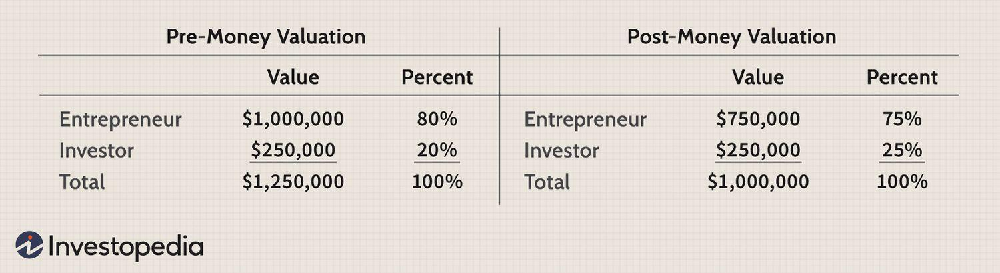

The intersection of investment startups, valuation methods, and algorithmic trading signifies a dynamic and rapidly evolving segment within the financial industry. These elements collectively contribute to reshaping the strategies that startups employ to attract investment and maximize returns. Investment startups, often at the forefront of innovation, adopt advanced valuation techniques to appraise their market potential and appeal to investors. These valuation methods are crucial, as they not only provide a fiscal snapshot of the startup's worth but also guide investors through complex and often volatile financial landscapes.

Algorithmic trading, another critical component, leverages sophisticated computational models to automate the trading process. By integrating vast amounts of real-time data, algorithms can execute trades at scales and speeds impossible for human traders. This tool is indispensable for startups seeking to optimize investment strategies, allowing them to capitalize on fleeting market opportunities swiftly and efficiently.



Understanding these concepts is of paramount importance in today's investment landscape, which is characterized by its complexity and the rapid influx of technological advancements. Emerging markets, in particular, exhibit high volatility alongside the potential for significant returns, making the mastery of valuation and algorithmic methodologies crucial. As startups seek to operationalize these strategies, they not only enhance their competitiveness but also contribute to the broader evolution of financial practices globally. Hence, a comprehensive grasp of how these elements interplay allows investors and startups alike to navigate the intricacies of modern market environments with greater efficacy.

## Table of Contents

## Understanding Investment Startups

Investment startups represent a transformative sector within the broader financial industry, marked by their pursuit of capital infusion and the application of innovative strategies designed to yield substantial returns. These entities distinguish themselves by harnessing cutting-edge technologies and business models, often exploring uncharted approaches to financial growth and stability.

Core to the operation of investment startups is the exploration of new valuation methods. Traditional valuation techniques like Discounted Cash Flow (DCF) or comparables are sometimes supplemented or replaced by strategies more tailored to modern technological landscapes. This adjustment is crucial in sectors dominated by rapid growth and innovation, particularly in areas such as technology and artificial intelligence. For instance, the real options valuation method allows startups to account for the flexibility and varied pathways in the development of new technologies, adapting traditional frameworks to better match the uncertain environments they operate within.

Alongside innovative valuation approaches, investment startups increasingly adopt algorithmic trading strategies. Algorithmic trading refers to the utilization of advanced algorithms to automate and optimize the decision-making processes involved in buying and selling financial instruments. This involves sophisticated data analysis and real-time market assessments, enabling startups to execute trades with enhanced precision and speed. Algorithmic trading can significantly improve trading efficiency, allowing startups to capitalize on fleeting market opportunities that might be missed by human traders.

The integration of [algorithmic trading](/wiki/algorithmic-trading) systems within investment startups also facilitates more informed decision-making processes. By utilizing [machine learning](/wiki/machine-learning) algorithms and AI-driven data analytics, these startups can process vast amounts of financial data at unprecedented speeds, uncovering patterns and insights that inform trading strategies. For instance, using Python libraries like pandas and scikit-learn, startups can develop models to predict market trends and adjust their strategies accordingly.

```python
import pandas as pd
from sklearn.ensemble import RandomForestClassifier

# Sample code to illustrate predictive modeling
# Load historical market data
data = pd.read_csv('market_data.csv')

# Feature engineering: Create relevant features for the model
data['Price_Change'] = data['Close'] - data['Open']

# Define the model
model = RandomForestClassifier()

# Train the model
model.fit(data[['Open', 'High', 'Low', 'Volume']], data['Trend'])

# Make predictions
predictions = model.predict(data[['Open', 'High', 'Low', 'Volume']])
```

Investment startups, by leveraging such heuristic and data-driven methodologies, can systematically enhance their trading outcomes. The continuous refinement of these strategies is pivotal as they seek to navigate the complexities and volatilities inherent in financial markets, setting a new standard for agility and adaptability in investment practices.

This hybrid approach—melding sophisticated valuation methodologies with advanced algorithmic trading—enables investment startups not only to secure competitive edges but also to pioneer new paths in the wider financial landscape.

## Valuation Techniques for Startups

Valuation is a critical step for startups as it determines their market potential and attractiveness to investors. Among the most commonly used valuation methods are Discounted Cash Flow (DCF), comparables, and specialized techniques tailored for AI and tech startups.

The Discounted Cash Flow (DCF) method involves estimating the future cash flows of a startup and discounting them back to their present value using a discount rate. This technique reflects the time value of money and allows investors to assess the intrinsic value of a startup based on expected performance. The basic DCF formula is:

$$
\text{DCF} = \sum_{t=1}^{n} \frac{CF_t}{(1 + r)^t}
$$

where $CF_t$ represents the cash flow at time $t$, $r$ is the discount rate, and $n$ is the number of years.

Another popular approach is the comparables or "comps" method, where the valuation is based on the market valuation of similar companies. This method typically involves identifying key financial metrics such as revenue, earnings before interest, taxes, depreciation, and amortization (EBITDA), and applying relevant multiples derived from publicly traded companies or recent acquisitions.

For AI and tech startups, unique valuation methods often emerge due to their innovative nature and future potential rather than present earnings. Techniques such as Venture Capital (VC) valuation models are prevalent. These models account for significant elements like future growth prospects, scalability, and intellectual property. The Berkus Method, another specialized technique, assesses a startup based on qualitative factors such as the soundness of the idea, the capabilities of the leadership team, and strategic relationships.

Startups, especially those in tech and AI sectors, often face challenges like market [volatility](/wiki/volatility-trading-strategies), which can cause significant fluctuations in perceived value. Additionally, developing customized valuation models becomes necessary to cater to unique business models and technological advancements. These customized models often consider the rapid pace of innovation and the unpredictability in these industries, requiring assumptions on growth rates and market adoption.

Investors and startup founders must navigate these challenges by remaining flexible and responsive to market conditions and technological advancements. Tailored valuation methodologies that incorporate both quantitative data and qualitative insights are essential for accurately capturing the true potential of a tech-driven startup.

## The Role of Algorithmic Trading

Algorithmic trading employs sophisticated computational techniques to automate the process of buying and selling securities based on predefined criteria. This approach enhances the speed, accuracy, and efficiency of trading strategies, capitalizing on minor price movements in the market. Startups particularly benefit from algorithmic trading as it allows them to employ complex and data-driven strategies that traditional human-led methods might overlook.

### Leveraging Real-Time Data and Market Analysis
Startups use algorithmic trading to harness real-time data, facilitating rapid execution of trades that might otherwise be impractical with manual operation. By analyzing vast amounts of market data, algorithms are designed to detect patterns and execute trades at optimal times. For instance, algorithms can be programmed to identify [arbitrage](/wiki/arbitrage) opportunities, capitalize on market inefficiencies, or implement high-frequency trading strategies that depend on minute-by-minute fluctuations.

Python is a popular language among startups for developing these trading algorithms, especially due to its extensive libraries for data analysis and machine learning. Here is a basic example of how an algorithmic trading strategy might be set up using Python:

```python
import pandas as pd
import numpy as np

# Load market data
data = pd.read_csv('market_data.csv')

# Calculate moving averages
data['Short_MA'] = data['Close'].rolling(window=50).mean()
data['Long_MA'] = data['Close'].rolling(window=200).mean()

# Generate buy/sell signals
data['Signal'] = np.where(data['Short_MA'] > data['Long_MA'], 1, 0)
data['Position'] = data['Signal'].diff()

# Buy when short MA crosses above long MA
data['Buy'] = np.where(data['Position'] == 1, data['Close'], np.nan)
# Sell when short MA crosses below long MA
data['Sell'] = np.where(data['Position'] == -1, data['Close'], np.nan)
```

This script demonstrates a simple moving average crossover strategy, a common algorithmic trading method.

### Integration of Valuation Models
Incorporating valuation models with algorithmic trading enables startups to discern discrepancies and identify trading opportunities more effectively. This integration is crucial when aligning trading strategies with intrinsic values derived from [fundamental analysis](/wiki/fundamental-analysis). For example, algorithms may combine moving averages or [momentum](/wiki/momentum) indicators with discounted cash flow (DCF) valuations to refine entry and [exit](/wiki/exit-strategy) points in the market.

By blending such models with algorithmic strategies, firms can systematically exploit market conditions that misalign with their analytical projections. This results in more informed decision-making processes, where trades are not only based on market trends but also on underlying asset values.

### Identifying Trading Opportunities
Algorithmic trading aids in identifying profitable opportunities by continuously analyzing and predicting market movements across different timescales. Startups can utilize machine learning models trained on historical data to forecast price trends and volatility, providing a competitive edge over more traditional investment methods. These capabilities are especially valuable for navigating highly volatile emerging markets, where timely and precise trading decisions can significantly impact returns.

In conclusion, algorithmic trading equips startups with robust tools to optimize investment strategies through the seamless integration of advanced computing, real-time data analysis, and valuation models. This not only enhances their ability to recognize and exploit market opportunities but also supports more adaptive and resilient trading frameworks in the dynamic financial environment.

## Challenges and Limitations

Investment startups navigating the contemporary financial landscape encounter numerous challenges and limitations, particularly concerning data transparency, market volatility, and the adaptation of valuation models. These challenges are critical to address to ensure the effectiveness and sustainability of their operations.

Data transparency is a significant issue for investment startups, as they rely heavily on accurate and timely information to inform their valuation processes and algorithmic trading systems. With the fragmented nature of data sources and varying levels of data integrity, startups often find it difficult to obtain reliable datasets. This lack of transparency can lead to suboptimal investment strategies and increased risk. Ensuring data accuracy and developing robust data validation techniques are essential steps towards mitigating this challenge.

Market volatility presents another formidable challenge for startups. Financial markets are inherently unpredictable, with prices subject to sudden and significant fluctuations. This volatility can make it difficult for startups to apply consistent valuation models, as assumptions used in these models may need frequent revisions. To address this, startups can employ stress-testing models, which simulate various market scenarios to predict potential future states and their impacts on valuations.

Moreover, adapting valuation models to fit dynamic markets is crucial for startups. Traditional valuation methods, like Discounted Cash Flow (DCF) and comparables, may not always capture the nuances of modern market dynamics, particularly for fast-evolving sectors like technology and AI. Startups are compelled to innovate and customize their valuation models, incorporating non-traditional metrics and real-time data analysis to better reflect market realities.

In algorithmic trading, adaptability is key. Trading algorithms must be capable of evolving alongside changing market conditions to maintain their efficacy. This requires constant monitoring and updating of algorithm parameters to align with current market trends and data inputs. Machine learning techniques, such as [reinforcement learning](/wiki/reinforcement-learning), can be employed to enable algorithms to learn from past trades and adjust strategies autonomously.

To illustrate, consider a Python snippet that outlines a simple adaptive strategy using machine learning:

```python
import numpy as np
from sklearn.ensemble import RandomForestRegressor

# Sample data representing market conditions and results
market_data = np.array([[10, 5], [15, 7], [14, 6], [17, 8]])
trade_results = np.array([1, 1, 0, 1])  # 1 for profit, 0 for loss

# Initialize and train the model
model = RandomForestRegressor()
model.fit(market_data, trade_results)

# Predicting future market conditions
new_market_conditions = np.array([[16, 7]])
predicted_results = model.predict(new_market_conditions)

print("Predicted trade result:", predicted_results)
```

This simplistic model uses historical market data and trade outcomes to predict the profitability of potential future trades, allowing startups to adjust their algorithms based on evolving data patterns.

In summary, while data transparency, market volatility, and the need for adaptable valuation and trading models present considerable challenges for investment startups, there are strategies and tools available to address these issues. By leveraging advanced technologies and maintaining a proactive approach to market changes, startups can enhance their competitiveness and resilience in volatile financial environments.

## Case Studies and Real-World Applications

Renaissance Technologies, a pioneer in the field of quantitative investing, stands out as a prime example of successful implementation of algorithmic trading and valuation strategies. Founded by Jim Simons, the firm's flagship Medallion Fund has consistently delivered exceptional returns, largely due to its sophisticated algorithms and data-driven approach. At Renaissance Technologies, the use of mathematical models to identify market inefficiencies is a cornerstone of their strategy. These models process vast amounts of data to detect patterns and execute trades in fractions of a second, minimizing human intervention and emotional bias.

One of the critical components of Renaissance Technologies' success lies in their valuation techniques, which are deeply integrated with their algorithmic trading systems. Unlike traditional valuation methods such as Discounted Cash Flow (DCF) or comparables, Renaissance leverages proprietary models that account for a broader array of factors and real-time data inputs. These models are calibrated and adjusted continuously to enhance predictive accuracy and adapt to evolving market conditions.

The lessons from Renaissance Technologies extend beyond their proprietary strategies to offer valuable insights into applying algorithmic trading and flexible valuation methods across different market conditions. For instance, their ability to seamlessly merge complex mathematical models with algorithmic trading platforms illustrates how firms can navigate volatile market environments and capitalize on transient opportunities. The adaptive nature of their algorithms, coupled with rigorous data analysis, highlights the importance of real-time data integration and machine learning in refining trading strategies.

Moreover, the emphasis on data transparency and integrity at Renaissance Technologies underscores the necessity for reliable data sources and the importance of clean, high-quality data in any algorithmic trading operation. This focus ensures that their algorithms are not only reactive but predictive, providing an edge in highly competitive financial markets.

In summary, Renaissance Technologies exemplifies the successful application of advanced quantitative techniques in modern finance. Their strategic use of algorithmic trading and innovative valuation models offers a blueprint for other firms aiming to harness technology for optimized investment decisions. As market dynamics continue to evolve, the ability to adapt algorithms and valuation models to specific conditions will remain critical for sustained success.

## Future Trends and Conclusion

The integration of technology into valuation methods and trading strategies is poised to fundamentally transform the investment landscape. With advancements in [artificial intelligence](/wiki/ai-artificial-intelligence), machine learning, and big data analytics, investment startups are harnessing these tools to enhance precision in both startup valuations and algorithmic trading operations. One significant trend is the use of machine learning algorithms that can process vast amounts of data to identify patterns and predict market trends, enabling more informed investment decisions.

Moreover, the evolution of blockchain technology presents new opportunities for investment startups, particularly in enhancing transparency and security within valuation processes. Blockchain can provide an immutable record of transactions and valuations, thus reducing the risk of fraud and increasing investor confidence. As these technologies continue to mature, they are expected to foster a more efficient and reliable investment environment.

Furthermore, the fusion of quantum computing with algorithmic trading holds promising potential. Quantum algorithms could revolutionize the speed and effectiveness of data processing, enabling real-time analysis that could significantly outpace conventional computing techniques. This could lead to more adaptive trading strategies and the ability to capture fleeting market opportunities.

Innovation in valuation models is also expected to advance, particularly with the application of AI-driven analytics tailored to specific industries such as biotechnology or green technology. These models can account for industry-specific variables and developmental milestones, offering more accurate predictions of a startup's future performance.

In conclusion, the continued integration and advancement of technology in valuation and trading strategies are set to drive more precise and effective investment decisions. As startups and investors embrace these innovations, they will likely experience improved decision-making capabilities and increased potential for returns, particularly in volatile and emerging markets. Embracing these technological advancements will be crucial for stakeholders aiming to navigate and thrive in the evolving financial ecosystem.

## References & Further Reading

[1]: Bergstra, J., Bardenet, R., Bengio, Y., & Kégl, B. (2011). ["Algorithms for Hyper-Parameter Optimization."](https://dl.acm.org/doi/10.5555/2986459.2986743) Advances in Neural Information Processing Systems 24.

[2]: ["Advances in Financial Machine Learning"](https://www.amazon.com/Advances-Financial-Machine-Learning-Marcos/dp/1119482089) by Marcos Lopez de Prado

[3]: ["Evidence-Based Technical Analysis: Applying the Scientific Method and Statistical Inference to Trading Signals"](https://www.amazon.com/Evidence-Based-Technical-Analysis-Scientific-Statistical/dp/0470008741) by David Aronson

[4]: ["Machine Learning for Algorithmic Trading"](https://github.com/stefan-jansen/machine-learning-for-trading) by Stefan Jansen

[5]: ["Quantitative Trading: How to Build Your Own Algorithmic Trading Business"](https://www.amazon.com/Quantitative-Trading-Build-Algorithmic-Business/dp/1119800064) by Ernest P. Chan