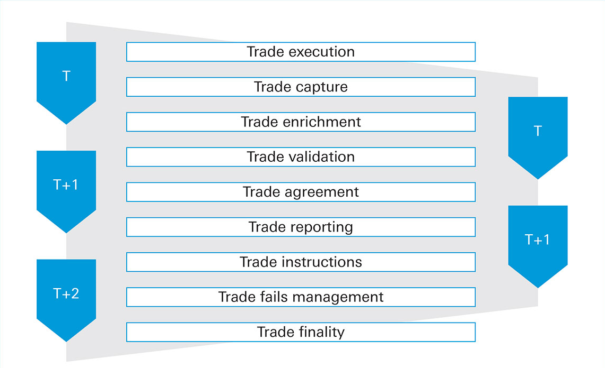

## Table of Contents

## What is post-trade processing?

Post-trade processing is what happens after you buy or sell something in the financial markets. It includes all the steps needed to make sure the trade is complete and everything is correct. This can involve confirming the details of the trade, settling the payment, and updating records to show who owns what. It's important because it makes sure that both the buyer and the seller get what they agreed on.

Sometimes, post-trade processing can be complicated because it involves many different people and systems. For example, a trade might need to go through a broker, a clearinghouse, and a bank before it's fully settled. If anything goes wrong, like a mistake in the trade details or a delay in payment, it can cause problems. That's why it's important for everyone involved to work together and use technology to make the process smoother and faster.

## Why is post-trade processing important in financial markets?

Post-trade processing is super important in financial markets because it makes sure that when you buy or sell something, everything goes smoothly. After you make a trade, there are a lot of steps that need to happen to make sure the trade is finished correctly. This includes checking that the details of the trade are right, making sure the money and the assets change hands properly, and updating everyone's records so they know who owns what. If any part of this process goes wrong, it can cause big problems, like delays or even losses of money.

Without good post-trade processing, the whole financial market could get messed up. Imagine if you bought a stock, but the money didn't get transferred correctly, or if the records weren't updated, and you didn't actually get the stock you paid for. That would be a huge mess! So, having a reliable post-trade process helps keep trust in the market. It makes sure that everyone can trade with confidence, knowing that their trades will be completed accurately and on time.

## What are the main stages of post-trade processing?

Post-trade processing starts right after a trade is made. The first stage is called trade confirmation. This is when both the buyer and the seller check that all the details of the trade are correct, like the price, the amount, and what was traded. They need to make sure everyone agrees on what happened. If there are any mistakes, they fix them at this stage. Once everything is confirmed, the trade moves to the next step.

The next stage is trade settlement. This is when the money and the assets actually change hands. The buyer pays the money, and the seller gives over the stocks, bonds, or whatever was traded. This usually happens through banks and clearinghouses, which act like middlemen to make sure everything goes smoothly. After the settlement, the last stage is record updating. This means updating all the records to show the new owner of the assets. This is super important because it keeps everyone's records accurate and up to date.

## How does trade confirmation work in post-trade processing?

Trade confirmation is the first step in post-trade processing. It happens right after a trade is made. During this stage, both the buyer and the seller check all the details of the trade to make sure they are correct. This includes things like the price, the amount of the asset traded, and the type of asset. They need to agree on everything to avoid any mistakes. If there are any errors, they fix them at this point. This step is important because it makes sure that everyone is on the same page before moving forward.

Once the details are confirmed, the trade can move to the next stage of post-trade processing. Trade confirmation helps prevent problems later on by catching any mistakes early. It's like double-checking your work before you turn it in. If the trade details are not confirmed properly, it could lead to issues during settlement, like the wrong amount of money being transferred or the wrong assets being exchanged. So, getting the confirmation right is key to a smooth post-trade process.

## What is the role of clearing in post-trade processing?

Clearing is a really important part of post-trade processing. It happens after the trade is confirmed but before the money and assets actually change hands. The main job of clearing is to make sure that both the buyer and the seller can actually complete the trade. This means checking if they have enough money and assets to go through with it. Clearing also helps to reduce risk by acting as a middleman. If one side can't complete the trade, the clearinghouse steps in to make sure the other side still gets what they were supposed to.

Clearinghouses are like referees in the financial markets. They keep an eye on everything to make sure trades go smoothly. They also handle something called netting, which means they add up all the trades between two parties and only settle the difference. This makes the whole process simpler and faster. Without clearing, there would be a lot more risk and confusion in the markets. So, clearing is super important for keeping trades safe and reliable.

## How does settlement occur in post-trade processing?

Settlement is the part of post-trade processing where the money and the assets actually change hands. After the trade is confirmed and cleared, the buyer pays the money, and the seller gives over the stocks, bonds, or whatever was traded. This usually happens through banks and clearinghouses, which act like middlemen to make sure everything goes smoothly. The settlement date is when this exchange happens, and it's important that everything is ready by then.

During settlement, the clearinghouse makes sure that the buyer has the money and the seller has the assets. If everything checks out, the clearinghouse will transfer the money from the buyer's account to the seller's account, and the assets from the seller to the buyer. This process can take a few days, depending on the type of asset and the rules of the market. Once the settlement is complete, the trade is considered final, and the records are updated to show the new owner of the assets.

## What are the common challenges faced in post-trade processing?

Post-trade processing can run into a few common challenges. One big problem is errors in the trade details. If something like the price or the amount of the asset is wrong, it can mess up the whole process. Fixing these errors can take time and cause delays. Another challenge is the risk of one side not being able to complete the trade. This can happen if the buyer doesn't have enough money or the seller doesn't have the assets. Clearinghouses help with this, but it's still a risk that can slow things down.

Another issue is the complexity of the process. Post-trade processing involves a lot of different people and systems, like brokers, clearinghouses, and banks. If any of these parts don't work together well, it can cause delays and confusion. Also, technology can be a challenge. While it helps make things faster, if there's a problem with the technology, like a system crash, it can stop the whole process. Keeping everything running smoothly takes a lot of work and coordination.

## How do regulatory requirements impact post-trade processing?

Regulatory requirements have a big impact on post-trade processing. They are rules set by governments or financial authorities to make sure that trades are done fairly and safely. These rules can affect how quickly trades are settled, what information needs to be reported, and how records are kept. For example, some regulations might say that trades need to be settled within a certain number of days. If the rules are strict, it can make the process more complicated and take longer, but it also helps to keep the market safe and trustworthy.

Regulations also require a lot of reporting and record-keeping. This means that everyone involved in post-trade processing needs to keep detailed records of every trade and report them to the right authorities. This can add more steps to the process and make it more work. But it's important because it helps to prevent fraud and makes sure that everything is transparent. So, while regulatory requirements can make post-trade processing more challenging, they are essential for keeping the financial markets honest and reliable.

## What technologies are used to enhance post-trade processing efficiency?

Technology plays a big role in making post-trade processing faster and easier. One important technology is automation. This means using computers to do a lot of the work that people used to do by hand. For example, computers can automatically check the details of a trade, make sure the money and assets are ready for settlement, and update the records. This cuts down on mistakes and saves a lot of time. Another technology that helps is blockchain. It's like a digital ledger that keeps track of trades in a way that's hard to change or mess up. This can make the whole process more secure and transparent.

Another technology that's making a difference is [artificial intelligence](/wiki/ai-artificial-intelligence) (AI). AI can look at a lot of data really quickly and find patterns or problems that people might miss. This can help catch errors early and make the process smoother. Also, cloud computing is important because it lets different parts of the post-trade process work together more easily, no matter where they are. By using these technologies, post-trade processing can be faster, safer, and more reliable, which is good for everyone in the financial markets.

## How does post-trade processing differ for different types of financial instruments?

Post-trade processing can be different depending on what kind of financial instrument you're trading, like stocks, bonds, or derivatives. For stocks, the process is usually pretty straightforward. After you buy or sell a stock, the trade is confirmed, settled, and the records are updated. This usually happens within a few days. But for bonds, things can be a bit more complicated. Bonds often have different settlement times and might need more paperwork, like proving that you're allowed to buy certain kinds of bonds. So, the process can take longer and involve more steps.

Derivatives, like options and futures, have their own set of rules for post-trade processing. These trades often go through a clearinghouse, which adds an extra layer of checking to make sure the trade can be completed. The settlement for derivatives can be more complex because they often involve agreements about future payments or deliveries. This means that the post-trade process might need to keep track of these future obligations and make sure everything happens as planned. So, while the basic steps of confirmation, settlement, and record updating are the same, the details can be very different depending on the type of financial instrument.

## What are the best practices for managing risk in post-trade processing?

Managing risk in post-trade processing is really important to make sure everything goes smoothly and safely. One of the best ways to do this is by using a clearinghouse. A clearinghouse acts like a middleman that checks if both the buyer and the seller can complete the trade. If one side can't do it, the clearinghouse steps in to help. This reduces the risk that someone won't be able to finish the trade. Another good practice is to have strong systems for checking the details of each trade. By catching any mistakes early, you can fix them before they cause big problems.

It's also a good idea to keep good records and report everything correctly. This helps everyone know what's going on and makes it easier to spot any issues. Using technology like automation and AI can help with this by making the process faster and more accurate. Finally, it's important to follow all the rules set by regulators. These rules are there to protect everyone and make sure the market is fair. By following them, you can avoid a lot of risks and keep the whole process safe and reliable.

## How can firms optimize their post-trade processing operations?

Firms can optimize their post-trade processing operations by using technology to automate a lot of the work. Automation means using computers to do tasks that people used to do by hand, like checking trade details and updating records. This can help cut down on mistakes and make the process faster. Another way to optimize is by using artificial intelligence (AI). AI can look at a lot of data quickly and find any problems or patterns that people might miss. This can help catch errors early and keep the process running smoothly.

It's also important for firms to work well with other people involved in post-trade processing, like clearinghouses and banks. Good communication and coordination can help avoid delays and make sure everything goes smoothly. Firms should also keep up with regulatory requirements and make sure they are reporting everything correctly. This helps prevent problems and keeps the process safe and reliable. By using technology and working well with others, firms can make their post-trade processing operations more efficient and effective.

## References & Further Reading

[1]: Cont, R. (2009). ["Statistical Modeling of High-Frequency Financial Data."](https://ieeexplore.ieee.org/document/5999562) The Review of Financial Studies, 22(12), 2339–2376.

[2]: Gregory, J. (2014). ["Counterparty Credit Risk and Credit Value Adjustment: A Continuing Challenge for Global Financial Markets."](https://onlinelibrary.wiley.com/doi/book/10.1002/9781118673638) Wiley Finance.

[3]: Hull, J. C. (2012). ["Options, Futures, and Other Derivatives."](https://www.semanticscholar.org/paper/Options%2C-Futures%2C-and-Other-Derivatives-Hull/89bdee500c8623864fc9eb7a471546aa713acc44) Pearson Education.

[4]: Mackintosh, I. (2017). ["Shortening the Settlement Cycle: The Move to T+2."](https://www.finextra.com/finextra-downloads/newsdocs/ssc.pdf) Cognizant White Paper.

[5]: PIMCO (2020). ["Understanding Trade Settlement: A Primer."](https://www.sec.gov/files/pimco.pdf) PIMCO Education.