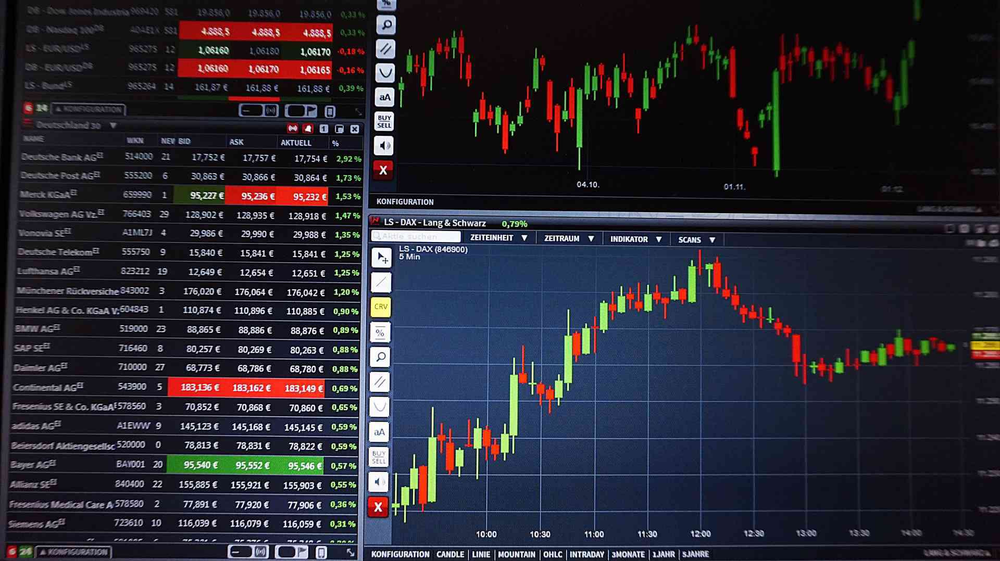

The financial markets are complex ecosystems where transactions are executed at lightning speed. However, the activities that occur once a transaction is completed are equally critical to the integrity and reliability of the trading system. Post-trade processing ensures that trades are faithfully executed, involving intricate processes such as clearing and settlement. These processes are fundamental to confirming trade details, managing counterparty risk, and ultimately transferring ownership of securities.

As the financial industry increasingly leans towards automation and the use of algorithmic solutions, understanding the nuances of post-trade processes in financial transactions becomes essential. These processes are not just bureaucratic formalities but crucial elements that underpin the stability and efficiency of the entire trading operation. In automated and algorithmic trading environments, errors can proliferate quickly, making robust post-trade mechanisms vital to correcting discrepancies and finalizing trades smoothly.

This article explores the critical aspects of post-trade processing and its significance in trading operations, especially in algorithmic trading contexts. By examining these processes, we can appreciate their role in maintaining market integrity and contributing to the seamless function of global financial markets.

## Table of Contents

## Understanding Post-Trade Processing

Post-trade processing is a critical phase in the lifecycle of a financial transaction, encompassing all necessary activities after a trade is executed to its eventual clearance and settlement. This stage is crucial for maintaining market confidence and stability, as it ensures the accuracy and integrity of transactions made at high speeds. 

A fundamental component of post-trade processing is the reconciliation of trade details. This involves verifying that the details recorded by both the buyer and seller match in terms of quantity, price, and other critical parameters. Any discrepancies identified must be resolved promptly to prevent potential settlement failures. Following reconciliation, transactions are approved, marking them ready for the next processing stages. This approval process is vital in confirming that both parties agree on the transaction terms and conditions.

Subsequent to approval, post-trade processing involves updating ownership records, which is a vital step in the transfer of securities. These records ensure that the buyer's ownership is accurately recorded and reflected, safeguarding against any unauthorized claims. Concurrently, the transfer of cash is managed to fulfill the financial obligations of the trade. The seamless transfer of cash and securities mitigates counterparty risk and is essential for the correct finalization of the trade.

In non-standardized markets, such as the Over-the-Counter (OTC), the importance of post-trade processing escalates. These markets lack a centralized clearing house, increasing the complexity and potential risk of trades. As such, bespoke solutions are often required to manage these trades, emphasizing meticulous tracking and reconciliation processes to ensure their successful execution and settlement.

The absence of centralization in OTC markets demands rigorous attention to detail, often necessitating specialized systems to handle the specific nuances of post-trade tasks in these environments. Customization and adaptability in post-trade systems become indispensable to accommodate the unique demands of these trades and uphold trading integrity.

## Key Components: Trade Clearing and Settlement

Clearing and settlement are pivotal processes in post-trade operations, ensuring the seamless execution and finalization of financial transactions. 

**Clearing** involves a comprehensive assessment of trade details, focusing on confirming that both the buyer and seller meet their respective contractual obligations. This process is crucial for mitigating counterparty risk, where the failure of one party to fulfill their part of the trade could result in financial loss for the other. To further reduce settlement risk—the risk that the securities or cash will not be delivered as agreed—clearinghouses act as intermediaries, guaranteeing trades and providing a safety net to market participants. By doing so, they enhance market integrity and stability.

**Settlement**, the final step in the trading process, encompasses the actual exchange of securities and funds between transacting parties. This transfer is delineated by timelines denoted as T+1, T+2, and T+0. These terms indicate the number of business days from the trade date (T) that it takes for settlement to occur. A T+1 settlement signifies that the transaction is settled one business day after the trade date, whereas T+2 and T+0 refer to two days and same-day settlements, respectively. These schedules are critical for managing liquidity and ensuring timely and efficient transfer of ownership and payment.

In response to technological advancements and evolving market demands, recent regulatory changes have aimed to shorten settlement cycles. Such reforms are designed to enhance the efficiency of the trading system while concurrently reducing counterparty and systemic risks. Shortening settlement periods decreases the time window in which participants are exposed to potential adverse changes in the valuation of traded securities or associated currency fluctuations. This acceleration in settlement timelines reflects an industry-wide push to improve post-trade reliability and bolster overall market confidence.

## Post-Trade Processing in Algorithmic Trading

Algorithmic trading, characterized by high-frequency transactions executed with minimal human intervention, has transformed the landscape of financial markets. This form of trading relies heavily on automated systems to analyze market conditions and execute trades in milliseconds. Consequently, the need for robust post-trade processing has become crucial to ensure that these trades are executed accurately and efficiently.

One of the primary challenges in [algorithmic trading](/wiki/algorithmic-trading) is the increased risk of discrepancies due to the sheer [volume](/wiki/volume-trading-strategy) and rapid pace of transactions. As algorithms execute trades in large numbers, it is imperative to have post-trade processes in place that can quickly identify and rectify any mismatches or errors. Efficient post-trade processing systems are essential to manage confirmations, ensure compliance with regulatory requirements, and avoid financial losses.

To address these challenges, technological advancements have played a significant role in enhancing post-trade processing capabilities. Trade matching technologies have evolved to facilitate real-time comparisons of trade details, thereby reducing errors and accelerating the settlement process. Data reconciliation tools have become more sophisticated, enabling the swift detection and resolution of discrepancies in trade data. 

Moreover, real-time settlement systems are being increasingly adopted to shorten the time frame between trade execution and settlement. These systems work to mitigate counterparty risks and ensure [liquidity](/wiki/liquidity-risk-premium) by ensuring cash and securities are exchanged promptly. 

In current financial markets, the integration of advanced technologies such as [artificial intelligence](/wiki/ai-artificial-intelligence) and [machine learning](/wiki/machine-learning) further amplifies the efficiency of post-trade processes. These technologies can predict potential discrepancies by analyzing patterns in historical trade data, providing a proactive approach to risk management.

In conclusion, as algorithmic trading continues to dominate financial markets, the role of efficient and effective post-trade processing becomes ever more critical. By leveraging technological advancements, market participants can improve the accuracy and speed of trade settlements, ultimately contributing to the stability and integrity of financial markets.

## Technological Innovations and Challenges

Emerging technologies are fundamentally transforming post-trade processing by introducing more transparency and efficiency. Among these, blockchain technology and event-driven architectures stand out as significant advancements. Blockchain's decentralized ledger offers an immutable and transparent record of transactions, drastically reducing the time required for reconciliation and verification. This reduces the risk of discrepancies and fraud, enhances trust between counterparties, and potentially shortens settlement cycles.

Event-driven architectures leverage real-time data processing to streamline post-trade workflows. By reacting to trade events as they occur, systems can update relevant records and initiate necessary processes instantaneously, thereby minimizing delays and errors. This real-time processing capability supports faster trade clearing and settlement, a crucial requirement in high-frequency and algorithmic trading environments.

While these technologies promise greater efficiency, their implementation is not without challenges. Integrating new technologies with existing, often legacy, systems presents significant hurdles. Legacy systems are typically not designed to interoperate with advanced technologies like blockchain, requiring costly and time-consuming upgrades or replacements. Moreover, gaining industry-wide adoption for new technologies can be difficult due to the need for standardization and interoperability across diverse financial institutions.

Securing data integrity remains a constant challenge as the complexity of trading operations increases. Blockchain provides a solution by ensuring data immutability and security through cryptographic methods. However, the vast amounts of data handled in post-trade processes require robust systems to manage and process this data efficiently, without sacrificing security. Operational risks also rise as these systems expand in complexity, necessitating advanced risk management strategies to mitigate potential issues such as system outages or data breaches.

Overall, while technological innovations are pivotal in advancing post-trade processing, the associated challenges must be carefully managed to realize their full potential. A coordinated effort across industry players to modernize systems and adopt standardized technologies will be crucial in paving the way for future developments in post-trade operations.

## Conclusion

Post-trade processing stands as the cornerstone of financial transaction execution, ensuring that trades are completed with both reliability and integrity. This stage of the trading lifecycle addresses the essential behind-the-scenes activities that guarantee the seamless transition of securities and funds, thereby maintaining market confidence and stability. As financial markets increasingly embrace algorithmic trading, the importance of evolving post-trade systems cannot be overstated. Algorithmically driven operations bring forth amplified complexity and volume, necessitating advanced post-trade mechanisms that can accommodate these demands effectively.

Innovative solutions are pivotal in overcoming existing challenges within post-trade processing. Emerging technologies, such as blockchain and advanced data analytics, promise to enhance transparency, reduce operational risks, and improve efficiency across trading operations. Implementing such technologies requires a strategic balance between innovation and integration with existing systems to ensure smooth transitions. The adoption of these advancements will shape the future of trading environments, making them more resilient and efficient, thereby fortifying the financial infrastructure necessary for handling increasingly sophisticated market activities.

Ultimately, the continuous development of post-trade systems is indispensable for supporting the dynamic nature of modern financial markets, ensuring they remain robust in the face of ever-evolving trading practices.

## References & Further Reading

[1]: Cont, R. (2009). ["Statistical Modeling of High-Frequency Financial Data."](https://ieeexplore.ieee.org/document/5999562) The Review of Financial Studies, 22(12), 2339–2376.

[2]: Gregory, J. (2014). ["Counterparty Credit Risk and Credit Value Adjustment: A Continuing Challenge for Global Financial Markets."](https://onlinelibrary.wiley.com/doi/book/10.1002/9781118673638) Wiley Finance.

[3]: Hull, J. C. (2012). ["Options, Futures, and Other Derivatives."](https://www.semanticscholar.org/paper/Options%2C-Futures%2C-and-Other-Derivatives-Hull/89bdee500c8623864fc9eb7a471546aa713acc44) Pearson Education.

[4]: Mackintosh, I. (2017). ["Shortening the Settlement Cycle: The Move to T+2."](https://www.finextra.com/finextra-downloads/newsdocs/ssc.pdf) Cognizant White Paper.

[5]: PIMCO (2020). ["Understanding Trade Settlement: A Primer."](https://www.sec.gov/files/pimco.pdf) PIMCO Education.