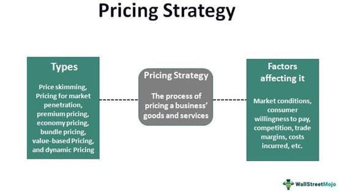

The world of economic pricing is undergoing a significant transformation, driven by the rise of algorithmic trading platforms and artificial intelligence (AI)-driven solutions. These advancements are fundamentally altering how businesses approach pricing strategies, aiming to optimize their offerings in increasingly competitive markets. Understanding these strategies is crucial, as they hold the key to enhancing both market efficiency and business profitability.

Economic pricing strategies play a vital role in determining how goods and services are valued, influencing consumer behavior and market dynamics. Traditionally, businesses have employed static pricing models, such as posted pricing, where prices are predetermined and remain constant over a period. This approach, while providing transparency, might not always reflect real-time market conditions, leading to potential inefficiencies in rapidly changing environments.



As technology advances, the integration of algorithmic trading and AI technologies into pricing strategies presents new opportunities and challenges. Algorithmic trading leverages complex algorithms and real-time data analysis to make instantaneous trading decisions, thus optimizing pricing and improving market efficiency. These systems can dynamically adjust prices based on fluctuating supply and demand factors, providing businesses with adaptive pricing strategies that are more aligned with current market conditions.

The interaction between posted pricing and algorithmic strategies represents a critical area of exploration. This intersection has the potential to redefine market behavior, influencing both market competition and equilibrium. By addressing these dynamics, businesses can achieve more competitive pricing, optimize their profit margins, and better respond to market needs.

Furthermore, the implications of these strategies extend beyond individual business benefits, as they also have the power to affect broader market structures. The integration of AI and machine learning in pricing could lead to more efficient resource allocation, potentially driving more balanced supply-demand equilibriums and fostering fair competition across industries. Understanding and leveraging these interconnected strategies will be essential for businesses seeking to succeed in the evolving economic landscape.

## Table of Contents

## Economic Pricing Strategies

Economic pricing strategies are central to determining how businesses set prices for their goods and services based on a comprehensive understanding of market dynamics, particularly supply and demand factors. These strategies are crucial for businesses aiming to optimize their market offerings and stay competitive. There are several fundamental approaches to pricing that companies may adopt:

1. **Cost-Plus Pricing**:
   This involves adding a fixed percentage or fee to the cost of producing a product to ensure a profit margin. The formula used is:
$$
   \text{Selling Price} = \text{Cost} + (\text{Cost} \times \text{Markup Percentage})

$$
   This straightforward strategy guarantees that all costs are covered while generating a predetermined profit.

2. **Value-Based Pricing**:
   This strategy sets prices primarily based on the perceived value to the customer rather than the cost of the product itself. Factors here include brand perception, customer preferences, and competitive positioning. Companies using this method focus on articulating and enhancing the product's value proposition to justify higher price points.

3. **Competition-Driven Pricing**:
   Also known as competitive pricing, this strategy focuses on setting prices based on competitors' pricing schemes. Companies analyze the market to ensure their prices are within a comparable range to maintain competitiveness. This strategy is prevalent in markets with similar product offerings where price differentiation can influence consumer choice.

Understanding these strategies helps businesses tailor their pricing models effectively according to their specific market conditions and objectives.

**Posted Pricing**:
A traditional pricing method, posted pricing involves setting fixed prices for products or services. These prices remain constant over time unless deliberately changed through a formal revision process. While this approach offers clarity and simplicity, it may not always reflect rapid shifts in market conditions, making it potentially less effective in highly volatile environments. However, industries with stable demand patterns continue to benefit from this method's predictability.

**Dynamic Pricing Models**:
These models have surged in popularity, particularly in sectors such as e-commerce and retail. By adjusting prices in real-time or at frequent intervals, dynamic pricing leverages technology and data analytics to align closely with market supply and demand fluctuations. For instance, algorithms may alter prices based on metrics such as competitor pricing, customer behavior, and inventory levels. This adaptability allows businesses to optimize revenue and inventory usage effectively.

The evolution of dynamic pricing models represents a significant shift from static to flexible strategies, showing that companies must continuously adapt to changing market and technological landscapes to sustain their competitive edge.

## The Role of Posted Pricing

Posted pricing, a widely-used economic pricing strategy, refers to the publicly quoted prices at which firms commit to sell their goods or services. This approach offers a high degree of transparency, facilitating straightforward transactions for both buyers and sellers. However, one of its inherent limitations is its inflexibility in the face of fluctuating market conditions or changes in supply and demand dynamics.

In markets characterized by [volatility](/wiki/volatility-trading-strategies), maintaining static prices can lead to inefficiencies. For example, if a posted price is not adjusted in response to a sudden increase in demand, it might fail to capture additional consumer surplus, letting potential profit slip away. Conversely, if demand drops and prices remain unchanged, firms could experience a surplus of unsold inventory, leading to potential losses.

Case studies across varied industries illustrate the differential impact of posted pricing. In the commodities sector, where prices can be highly volatile due to geopolitical events or natural disasters, static posted prices might not always align with real-time market values. Historical episodes in the oil industry, for instance, have shown that firms adhering strictly to posted prices sometimes face challenges when market prices oscillate rapidly. The retail industry, on the other hand, might experience less disruptive effects, especially for items with stable demand and limited price variations.

Despite its rigidity, posted pricing holds significant value in industries where price variance is relatively infrequent. Sectors that deal with standardized goods or services, such as public utilities or postage, benefit from the predictability and simplicity that posted pricing grants. It reduces administrative overhead associated with frequent price adjustments and provides consumers with a clear and consistent pricing framework.

Ultimately, while posted pricing delivers transparency and simplicity, its success largely depends on the specific characteristics of the industry and the volatility of its market conditions. In today’s rapidly changing economic environment, finding the right balance between static posted pricing and more adaptive models could be crucial for businesses aiming to optimize their pricing strategies.

## Algorithmic Trading and Its Impact

Algorithmic trading represents a significant advancement in the automation of trading decisions and processes, utilizing algorithms based on predetermined criteria. This method has become prevalent in financial markets due to its ability to execute trades with remarkable speed and precision. Traditionally, human traders relied on manual analyses and execution, which could be time-consuming and prone to errors. In contrast, [algorithmic trading](/wiki/algorithmic-trading) systems can process vast amounts of data and execute trades within milliseconds, allowing traders to capitalize on fleeting market opportunities.

The core advantage of algorithmic trading lies in its ability to identify and exploit short-term price discrepancies more efficiently than human traders. Algorithms are designed to analyze real-time data and apply complex models to assess market conditions rapidly. For instance, an algorithm might continuously monitor asset prices and their historical movements to detect anomalies or patterns that could indicate a profitable trading opportunity. These patterns might include price [arbitrage](/wiki/arbitrage), [momentum](/wiki/momentum) trading signals, or [statistical arbitrage](/wiki/statistical-arbitrage) strategies.

Python is a popular language for developing algorithmic trading models due to its extensive libraries and ease of use. An example of a simple trading strategy can be implemented using Python libraries such as `pandas` for data manipulation and `numpy` for numerical calculations:

```python
import pandas as pd
import numpy as np

# Sample historical price data
data = pd.DataFrame({
    'price': [100, 102, 101, 103, 104, 102, 105, 107]
})

# Calculate moving average
data['moving_average'] = data['price'].rolling(window=3).mean()

# Define a simple trading strategy based on moving average
def trading_signal(row):
    if row['price'] > row['moving_average']:
        return 'Buy'
    elif row['price'] < row['moving_average']:
        return 'Sell'
    else:
        return 'Hold'

data['signal'] = data.apply(trading_signal, axis=1)

print(data)
```

In addition to executing trades quickly, algorithmic trading has contributed to increased market [liquidity](/wiki/liquidity-risk-premium) and reduced transaction costs. By constantly participating in markets, algorithms facilitate the continuous flow of trades, ensuring that buy and sell orders are matched efficiently. This efficiency reduces the bid-ask spread, which is the difference between the price at which one can buy and sell an asset, thus lowering transaction costs for market participants.

However, the reliance on real-time data analytics and intricate models means that algorithmic trading systems must constantly adapt to changing market conditions. These systems utilize [machine learning](/wiki/machine-learning) techniques to refine their models, further enhancing their decision-making processes. For instance, [reinforcement learning](/wiki/reinforcement-learning) algorithms can optimize trading strategies by learning from historical trades and iteratively improving their performance.

In conclusion, algorithmic trading has revolutionized the financial markets by enabling the automation of trading activities, thus enhancing market liquidity and reducing costs. Its reliance on advanced algorithms and data analytics continues to push the boundaries of trading capabilities, offering a glimpse into the future of financial market operations.

## Integrating Posted Pricing with Algorithmic Strategies

Integrating posted pricing with algorithmic strategies presents innovative opportunities for businesses seeking to navigate market complexities. This amalgamation leverages the strengths of both methodologies, combining the transparency and stability of posted pricing with the agility and precision of algorithmic trading.

AI-driven models play a crucial role in this integration by enabling dynamic pricing adjustments responsive to real-time market conditions. These models use machine learning algorithms to analyze vast datasets, identifying patterns and trends that inform pricing strategies. For example, consider a simple Python implementation where machine learning models predict optimal pricing adjustments:

```python
import numpy as np
from sklearn.linear_model import LinearRegression

# Sample data: market condition metrics and their impact on pricing
X = np.array([[10, 0.2], [15, 0.5], [20, 0.3], [25, 0.7]])
y = np.array([200, 250, 220, 270])

# Create and train a linear regression model
model = LinearRegression()
model.fit(X, y)

# Predict optimal price based on new market conditions
new_conditions = np.array([[18, 0.6]])
optimal_price = model.predict(new_conditions)
print("Optimal pricing adjustment:", optimal_price)
```

Integrating algorithmic insights into posted pricing enables businesses to maintain competitive pricing schemes while maximizing profit margins. The synergy between static posted prices and dynamic algorithmic inputs allows firms to establish a balanced and responsive approach to pricing. This combination helps maintain stable customer interactions based on predictable pricing, supplemented by algorithmically driven adjustments to adapt to current market trends.

However, challenges accompany these opportunities. The primary requirement is a robust data infrastructure capable of handling and processing large-scale datasets swiftly. This infrastructure is essential for ensuring data accuracy and facilitating real-time processing, enabling the continuous updating of pricing models.

Additionally, there are concerns about market manipulation risks inherent in automated pricing systems. Algorithms could potentially exploit market inefficiencies or inadvertently lead to anti-competitive behaviors, necessitating stringent oversight and ethical programming standards to mitigate these risks.

In conclusion, combining posted pricing with algorithmic trading strategies enables businesses to capitalize on technological advances, offering new methods to optimize pricing strategies effectively. This integration requires careful implementation and regulation to avoid pitfalls while harnessing the benefits of both pricing systems.

## Case Studies and Examples

Industries such as oil and commodities provide classic examples of how posted pricing has historically played a significant role in market dynamics. In these sectors, prices are often determined by a small number of dominant producers and can remain relatively stable for extended periods. This approach provides clarity and reduces the complexity for buyers, allowing producers to maintain control over pricing structures. However, this strategy can sometimes lead to inefficiencies, particularly when market conditions shift rapidly. In the oil industry, for instance, geopolitical events or sudden changes in supply levels can necessitate swift price modifications, challenging the rigidity of posted pricing. As a result, companies in these sectors are increasingly looking toward more dynamic pricing models enhanced by algorithmic strategies.

Algorithmic trading, notably prevalent in stock markets, offers a striking contrast to the rigidity of posted pricing. Employing sophisticated algorithms allows traders to react almost instantaneously to market fluctuations. The automation embedded in algorithmic trading can identify opportunities in milliseconds, exploiting short-term price discrepancies and contributing to more efficient market outcomes. For example, high-frequency trading firms use algorithms to execute a vast number of transactions per second, which can tighten spreads and improve liquidity. The regulatory frameworks around algorithmic trading continue to evolve, aiming to address concerns over market manipulation and ensure market stability.

Illustrative examples underscore the contrast between posted pricing and algorithmic strategies. One successful integration occurs within retail sectors, where e-commerce platforms utilize AI-driven algorithms to dynamically adjust prices based on supply conditions, competitor pricing, and consumer demand patterns. In contrast, industries relying solely on posted pricing, such as some commodity markets, often find themselves at a competitive disadvantage, struggling to adapt product pricing in volatile market scenarios.

Lessons from these varied sectors offer insight into blending traditional pricing models with modern technology. For instance, businesses that successfully merge posted pricing with real-time data adjustments often maintain market competitiveness and enhance profit margins. However, there are challenges, such as ensuring robust data infrastructure and mitigating the risk of collusive practices facilitated by AI. Companies must remain vigilant, ensuring that algorithms promote rather than hinder fair competition.

In conclusion, the examination of these case studies reveals the transformative potential of algorithmic strategies in pricing applications, suggesting that integrated approaches could inform more adaptive and efficient pricing models. The balanced application of both posted pricing and algorithmic trading assures businesses can thrive amidst market uncertainties, while the regulatory focus remains crucial in preventing potential market distortions.

## Conclusion

Economic pricing strategies must adapt to the fast-paced changes brought by technological advancements like algorithmic trading. These technologies offer mechanisms for optimizing pricing models and improving market responsiveness. By understanding and integrating both posted pricing and algorithmic strategies, businesses can secure substantial competitive advantages. 

Posted pricing, with its transparent and static nature, serves as a reliable foundation in industries with less frequent price fluctuations, ensuring consistency and customer trust. However, in volatile markets, algorithmic trading can provide the agility needed to adjust prices dynamically in reaction to real-time market data. The combination of these strategies allows companies to maintain stable pricing while also adapting to sudden changes, enhancing both profitability and customer satisfaction.

As market landscapes evolve, the fusion of AI-driven models with traditional pricing strategies is becoming increasingly vital for business success. AI algorithms are capable of analyzing extensive datasets and identifying patterns or anomalies that human analysis might miss. This capability not only aids in setting competitive prices but also in anticipating market trends, thereby allowing proactive business decisions.

However, integrating these technologies raises potential regulatory concerns, particularly with respect to market fairness and manipulation. Ensuring that algorithmic pricing and trading do not lead to anti-competitive practices or exploit market inefficiencies is vital. Regulators and businesses must work collaboratively to develop frameworks that foster innovation while safeguarding ethical standards. 

Continuous research and comprehensive case studies are crucial in monitoring the effects of advanced pricing strategies and in guiding future implementations. This ongoing inquiry will inform the development of best practices and regulatory mechanisms to harness the benefits of technology while minimizing its risks. As data analytics and AI continue to transform industries, mastering the intersection of economic pricing and technology will be essential for sustainable growth and market effectiveness.

## References & Further Reading

[1]: Jovanovic, F., & Le Gall, P. (2001). ["Does God Practice a Random Walk? The 'Financial Physics' of a 19th-Century Forerunner, Jules Regnault."](https://papers.ssrn.com/sol3/Delivery.cfm/SSRN_ID3294556_code3258977.pdf?abstractid=3294556&mirid=1) Social Science Information, 42(4), 637-657.

[2]: Lopez de Prado, M. (2018). ["Advances in Financial Machine Learning."](https://www.amazon.com/Advances-Financial-Machine-Learning-Marcos/dp/1119482089) Wiley.

[3]: Aronson, D. R. (2006). ["Evidence-Based Technical Analysis: Applying the Scientific Method and Statistical Inference to Trading Signals."](https://www.amazon.com/Evidence-Based-Technical-Analysis-Scientific-Statistical/dp/0470008741) Wiley.

[4]: Jansen, S. (2020). ["Machine Learning for Algorithmic Trading: Predictive Models to Extract Signals from Market and Alternative Data for Systematic Trading Strategies with Python."](https://github.com/stefan-jansen/machine-learning-for-trading) Packt Publishing.

[5]: Chan, E. (2009). ["Quantitative Trading: How to Build Your Own Algorithmic Trading Business."](https://github.com/ftvision/quant_trading_echan_book) Wiley Trading.

[6]: Biais, B., Glosten, L., & Spatt, C. (2005). ["Market Microstructure: A Survey of Microfoundations, Empirical Results, and Policy Implications."](https://www.sciencedirect.com/science/article/abs/pii/S1386418104000382) Journal of Financial Markets, 8(2), 217-264.

[7]: Hasbrouck, J. (2007). ["Empirical Market Microstructure: The Institutions, Economics, and Econometrics of Securities Trading."](https://academic.oup.com/book/52241) Oxford University Press.