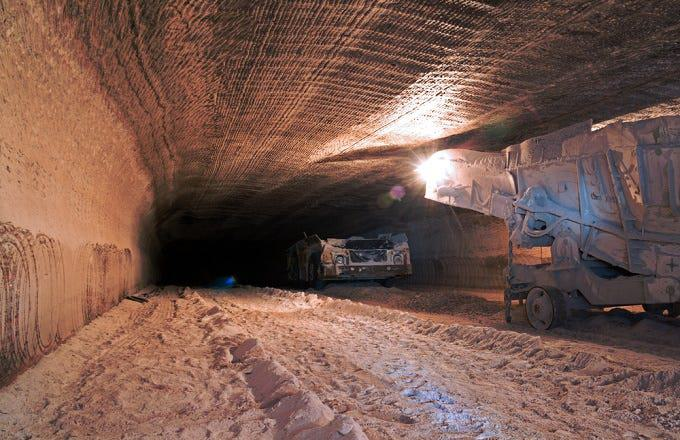

## Table of Contents

## What is potash and why is it important?

Potash is a type of salt that contains potassium in a form that plants can use. It is usually found in the soil, but farmers often add more to their fields to help their crops grow better. Potash is made from potassium-rich minerals, like potassium chloride, which are mined from the earth or extracted from underground saltwater.

Potash is important because it helps plants grow strong and healthy. It helps them use water better, fight off diseases, and make bigger and better fruits and vegetables. Without enough potash, plants can become weak and not produce as much food. This is why farmers all over the world use potash to make sure their crops are as good as they can be.

## How is potash extracted from the earth?

Potash is extracted from the earth in two main ways: mining and evaporation. Mining involves digging deep into the ground to find potash-rich minerals like sylvite, which is a type of potassium chloride. Miners use big machines to dig tunnels and then bring the minerals to the surface. Once the minerals are out of the ground, they are crushed and processed to separate the potash from other materials.

The other way to get potash is through evaporation. This method is used in places where there are underground saltwater deposits called brine. Workers drill wells to reach the brine and then pump it to the surface. The brine is put into large ponds where the water is left to evaporate under the sun. As the water evaporates, the potash crystals are left behind. These crystals are then collected and processed to make potash that can be used by farmers.

Both methods are important for getting potash out of the earth. Mining is used where the potash is found in solid form, while evaporation is used where it is dissolved in water. Each method helps make sure that there is enough potash available to help plants grow strong and healthy.

## What are the different types of potash?

There are several types of potash, but the main ones are potassium chloride, potassium sulfate, and potassium nitrate. Potassium chloride is the most common type of potash. It is a salt that has a lot of potassium and chlorine. Farmers use it a lot because it is cheaper than other types of potash. Potassium sulfate is another type of potash. It has potassium and sulfur, which are both good for plants. This type of potash is used when the soil already has too much chlorine or when plants need more sulfur. Potassium nitrate is the third type of potash. It has potassium and nitrogen, which are both important for plant growth. This type of potash is used when plants need more nitrogen.

Each type of potash has its own special uses. Potassium chloride is good for most crops and is used a lot because it is easy to find and not too expensive. Potassium sulfate is used for crops that do not like too much chlorine, like some fruits and vegetables. It is also good for crops that need more sulfur. Potassium nitrate is used when plants need more nitrogen, which helps them grow bigger and faster. By choosing the right type of potash, farmers can make sure their plants get the nutrients they need to grow well.

## What are the main uses of potash in agriculture?

Potash is very important in farming because it helps plants grow strong and healthy. It is a type of fertilizer that has a lot of potassium, which is a nutrient that plants need to grow well. When farmers add potash to their fields, it helps the plants use water better and fight off diseases. This means the plants can grow bigger and produce more food. Without enough potash, plants can become weak and not grow as well.

Farmers use different types of potash depending on what their crops need. The most common type is potassium chloride, which is used for most crops because it is cheaper and easy to find. Some crops, like certain fruits and vegetables, need potassium sulfate because it has sulfur and less chlorine, which is better for them. Another type, potassium nitrate, is used when plants need more nitrogen to grow bigger and faster. By choosing the right type of potash, farmers can make sure their plants get the nutrients they need to grow well.

## How does potash benefit plant growth and soil health?

Potash helps plants grow strong and healthy. It has a lot of potassium, which is a nutrient that plants need to grow well. When plants get enough potassium from potash, they can use water better and fight off diseases. This means the plants can grow bigger and produce more food. Without enough potash, plants can become weak and not grow as well. Farmers add potash to their fields to make sure their crops get the potassium they need.

Potash also helps keep the soil healthy. It can help balance the nutrients in the soil so that plants can grow better. Different types of potash, like potassium chloride, potassium sulfate, and potassium nitrate, have other nutrients like sulfur and nitrogen that can help the soil and the plants. By using the right type of potash, farmers can make sure their soil has the right mix of nutrients for their crops. This helps the soil stay healthy and able to support good plant growth.

## What are the industrial applications of potash?

Potash is not just used in farming. It is also important in many industries. One big use of potash is in making glass. Potash helps make glass stronger and easier to melt. This is important for making things like windows, bottles, and screens for phones and computers. Another use of potash is in making soap and detergents. Potash helps clean things better by making the soap and detergents work well.

Potash is also used in the oil and gas industry. It is used to drill for oil and gas. Potash helps keep the drilling mud stable, which makes it easier to drill deep into the ground. In the chemical industry, potash is used to make other chemicals. These chemicals are used in many products, like fertilizers, medicines, and even fireworks. Potash is a very useful substance that helps in many different ways.

## What are the environmental impacts of potash mining?

Potash mining can have some effects on the environment. When miners dig deep into the ground to get potash, they can change the land. This can make the land look different and can harm the plants and animals that live there. Also, mining can use a lot of water. If too much water is used, it can be hard for people and animals nearby to have enough water. The mining can also make dust and other small particles that can go into the air and make it hard to breathe.

Another way potash mining can affect the environment is through the waste it makes. When potash is mined, there is a lot of leftover rock and other materials that are not used. This waste can be put in big piles, which can take up a lot of space and can leak chemicals into the soil and water. If these chemicals get into rivers or lakes, they can harm fish and other water animals. It is important for mining companies to be careful and try to reduce these impacts as much as they can.

## How is potash processed after extraction?

After potash is taken out of the ground, it needs to be cleaned and turned into something that farmers and other people can use. If potash is mined from the earth, the first step is to crush the big pieces of rock into smaller pieces. Then, these smaller pieces are mixed with water to make a kind of mud. This mud is put into a machine that separates the potash from the other stuff in the rock. The potash is then dried and turned into small crystals or powder that can be used as fertilizer.

If potash is taken from underground saltwater, the process is a bit different. The saltwater, called brine, is pumped up to the surface and put into big ponds. The sun and wind help to dry up the water, leaving behind potash crystals. These crystals are then collected and cleaned to get rid of any other salts. After cleaning, the potash is also turned into small crystals or powder. Both ways of processing potash help make sure it is ready to be used to help plants grow strong and healthy.

## What are the global leaders in potash production?

Canada is the biggest country for making potash. They have a lot of potash in the ground and big mines to get it out. Canada sends potash to many other countries to help them grow food. Russia is also a big maker of potash. They have mines and also use the evaporation way to get potash from saltwater. Russia sends a lot of potash to other places too.

Belarus is another important country for potash. They have big mines and make a lot of potash for other countries. China also makes a lot of potash, but they use most of it themselves because they have a lot of farms. These countries are the main ones that help the world have enough potash for farming and other uses.

## How does the potash market influence global agriculture?

The potash market is very important for farming all over the world. Potash is a type of fertilizer that has a lot of potassium, which helps plants grow strong and healthy. When farmers can buy potash easily and at a good price, they can use it to make their crops grow better. This means they can grow more food and make more money. Countries that make a lot of potash, like Canada and Russia, help other countries by selling them potash. This helps farmers everywhere have the nutrients they need for their plants.

The price of potash can change and affect farmers. If the price goes up, it can be harder for farmers to buy enough potash. This can make it harder for them to grow good crops. But if the price goes down, farmers can buy more potash and help their plants grow better. The potash market also affects how much food the world can grow. When there is enough potash, more food can be grown, which is good for everyone. So, the potash market is a big part of making sure there is enough food for people all over the world.

## What are the latest technological advancements in potash production?

New technology is helping to make potash production better and easier. One big change is using better machines to dig deeper into the ground to find potash. These machines can work faster and safer than before. They also use less energy, which is good for the environment. Another new technology is using computers and sensors to help find where the potash is in the ground. This helps miners know exactly where to dig, so they waste less time and money.

Another important advancement is in how potash is cleaned and turned into fertilizer. New machines can clean potash better and faster. They can take out more of the other stuff that is not needed, so the potash is purer. This makes the fertilizer work better for plants. Also, new ways of drying potash are being used. These new ways use less energy and can dry the potash faster, which saves time and money. All these new technologies are helping to make more potash and make it better for farmers to use.

## What future trends are expected in the potash industry?

The potash industry is expected to grow in the future because more people will need food. As the world's population gets bigger, farmers will need more potash to help their crops grow better. Countries like Canada and Russia will keep making a lot of potash, but other countries might start making more too. This will help make sure there is enough potash for everyone.

New technology will also change how potash is made. Machines will get better at finding and digging out potash, making it easier and cheaper to get. Also, new ways of cleaning and drying potash will make it purer and better for plants. These changes will help the potash industry keep up with the growing need for food around the world.

## References & Further Reading

[1]: Bergstra, J., Bardenet, R., Bengio, Y., & Kégl, B. (2011). ["Algorithms for Hyper-Parameter Optimization."](https://papers.nips.cc/paper/4443-algorithms-for-hyper-parameter-optimization) Advances in Neural Information Processing Systems 24.

[2]: ["Advances in Financial Machine Learning"](https://www.amazon.com/Advances-Financial-Machine-Learning-Marcos/dp/1119482089) by Marcos Lopez de Prado

[3]: ["Evidence-Based Technical Analysis: Applying the Scientific Method and Statistical Inference to Trading Signals"](https://www.amazon.com/Evidence-Based-Technical-Analysis-Scientific-Statistical/dp/0470008741) by David Aronson

[4]: ["Machine Learning for Algorithmic Trading"](https://github.com/PacktPublishing/Machine-Learning-for-Algorithmic-Trading-Second-Edition) by Stefan Jansen

[5]: ["Quantitative Trading: How to Build Your Own Algorithmic Trading Business"](https://books.google.com/books/about/Quantitative_Trading.html?id=j70yEAAAQBAJ) by Ernest P. Chan