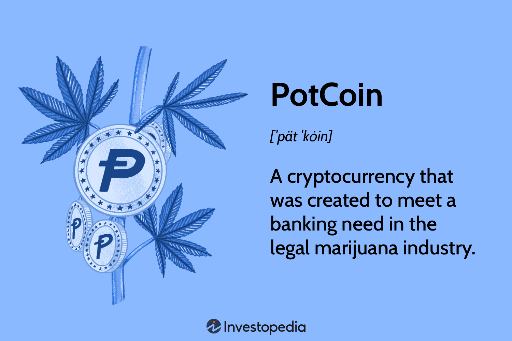

## Table of Contents

## What is PotCoin and what is its primary purpose?

PotCoin is a type of digital money, similar to Bitcoin, that was created in 2014. Its main goal is to be used for buying and selling things related to marijuana, like cannabis products and accessories. People who support the legalization of marijuana use PotCoin because it helps them trade easily without traditional banks, which sometimes don't work with marijuana businesses.

The primary purpose of PotCoin is to make it easier for people in the cannabis industry to do business. Since many banks won't help marijuana companies because of legal issues, PotCoin gives them another way to pay for things and get paid. It's like a special money system just for the marijuana community, helping to support and grow the industry.

## How was PotCoin created and who are its founders?

PotCoin was created in 2014 by two people named Brett James and Travis Schilling. They wanted to make a special kind of money that would help people in the marijuana business. They used something called blockchain technology, which is like a big, secure list that keeps track of all the PotCoin transactions. This technology makes sure that the money is safe and that people can trust it.

Brett and Travis thought that regular banks were not helping marijuana businesses because of legal problems. So, they made PotCoin to give these businesses another way to buy and sell things. They hoped that by using PotCoin, the marijuana industry could grow and more people could support legalization. PotCoin is meant to be easy to use and help the cannabis community trade with each other without needing traditional banks.

## What makes PotCoin different from other cryptocurrencies?

PotCoin is different from other cryptocurrencies because it was made just for the marijuana industry. While Bitcoin and other cryptocurrencies can be used for all kinds of things, PotCoin is focused on helping people buy and sell cannabis products and accessories. This special focus makes it easier for people in the marijuana business to trade with each other without needing traditional banks, which often won't work with them because of legal issues.

Another thing that sets PotCoin apart is its community and purpose. The people who use PotCoin are often supporters of marijuana legalization. They believe in using PotCoin to help grow the cannabis industry and make it easier for businesses to operate. This shared goal creates a strong community around PotCoin, which is different from the more general communities around other cryptocurrencies.

## How can someone acquire PotCoin and where can it be used?

Someone can get PotCoin by buying it on a [cryptocurrency](/wiki/cryptocurrency) exchange that supports it, like Poloniex or Bittrex. They can use regular money like dollars or other cryptocurrencies like Bitcoin to buy PotCoin. Another way to get PotCoin is by mining it, which means using a computer to solve math problems and earn PotCoin as a reward. This can be a bit tricky and needs special computer equipment, but it's another way to get PotCoin without buying it.

Once someone has PotCoin, they can use it to buy things from places that accept it. Some online stores that sell cannabis products and accessories take PotCoin as payment. There are also some dispensaries and other businesses in the marijuana industry that accept PotCoin. People can also trade PotCoin with each other, like if they want to buy something from someone who only wants PotCoin. It's like using special money just for the cannabis community.

## What are the technical specifications of PotCoin, such as its total supply and block time?

PotCoin has a total supply of 115,354,959 coins. This means that there will never be more than this number of PotCoins in the whole world. The total supply is set this way to make sure that PotCoin stays valuable and doesn't get too common. When PotCoin was first made, it started with a certain number of coins, and then more coins were added over time until it reached the total supply.

The block time for PotCoin is about 40 seconds. This means that every 40 seconds, a new group of transactions, called a block, is added to the PotCoin blockchain. The blockchain is like a big list that keeps track of all the PotCoin transactions. A shorter block time means that transactions can be confirmed faster, which is good for people who want to use PotCoin to buy and sell things quickly.

## How does the mining process work for PotCoin?

Mining PotCoin is like solving puzzles with a computer. When someone wants to mine PotCoin, they use their computer to try and solve math problems. These problems are part of the PotCoin blockchain, which is like a big list that keeps track of all the PotCoin transactions. When a miner solves a problem, they get to add a new block to the blockchain and are rewarded with new PotCoins. This process helps keep the PotCoin system safe and working properly.

The mining process for PotCoin uses something called the Scrypt algorithm. This is a special way of solving the math problems that makes it easier for regular computers to mine PotCoin, not just fancy ones. Miners compete to solve these problems as fast as they can, and the first one to solve it gets the reward. Over time, the reward for mining a block gets smaller, but miners can also earn PotCoins from the fees people pay for their transactions. This way, mining helps keep the PotCoin network running smoothly and securely.

## What are the security features of PotCoin and how is the network protected?

PotCoin uses a few important things to keep the money safe and the network protected. One of the main things is the blockchain, which is like a big list that keeps track of all the PotCoin transactions. This list is very hard to change because it's spread out on many computers all over the world. If someone tries to change something in the list, the other computers will notice and stop it. This makes it very safe because no one person can control the whole list.

Another way PotCoin stays safe is through something called mining. Miners use their computers to solve math problems, and when they solve one, they add a new part to the blockchain. This process is called mining, and it helps make sure that the transactions are real and not fake. Miners also check each other's work, which adds another layer of safety. This way, the network stays strong and protected from people who might try to cheat or steal PotCoins.

## Can you explain the consensus mechanism used by PotCoin?

PotCoin uses a consensus mechanism called Proof of Work (PoW). This means that miners use their computers to solve math problems. When a miner solves a problem, they get to add a new block of transactions to the PotCoin blockchain. This process helps everyone agree on which transactions are real and should be added to the list. It's like a game where everyone is working together to keep the list of transactions safe and correct.

The Proof of Work system makes sure that no one can cheat or change the transactions without everyone noticing. If someone tries to change something in the blockchain, the other miners will see it and won't agree to it. This keeps the PotCoin network honest and secure. By solving these math problems, miners help keep the network running smoothly and protect it from bad people who might try to mess with it.

## What are the current developments and future plans for PotCoin?

PotCoin is always trying to get better and help the cannabis community more. Right now, they are working on making it easier for people to use PotCoin. They want to make sure that more stores and businesses accept PotCoin as payment. They are also trying to make the PotCoin system faster and safer. This means they are working on new ways to keep the money safe and to make sure that transactions happen quickly.

In the future, PotCoin wants to be used by even more people in the marijuana industry. They hope that as more places legalize cannabis, more businesses will start using PotCoin. They also want to make it easier for people to buy and sell PotCoin. This could mean working with more cryptocurrency exchanges or making their own special way for people to trade PotCoin. The goal is to keep helping the cannabis community grow and make it easier for them to do business.

## How does PotCoin contribute to the cannabis industry and community?

PotCoin helps the cannabis industry by giving people a special kind of money they can use to buy and sell things related to marijuana. Since many banks won't work with cannabis businesses because of legal issues, PotCoin gives them another way to do business. This makes it easier for people in the marijuana industry to trade with each other without needing traditional banks. By using PotCoin, cannabis businesses can grow and support each other, which helps the whole industry.

PotCoin also brings the cannabis community together. People who use PotCoin often believe in legalizing marijuana and want to help the industry grow. They use PotCoin to show their support and to make it easier for cannabis businesses to succeed. This shared goal creates a strong community around PotCoin, where people can help each other and work towards making cannabis more accepted and available.

## What are the potential risks and challenges associated with using PotCoin?

Using PotCoin can come with some risks and challenges. One big risk is that the value of PotCoin can go up and down a lot. This means that if you buy PotCoin, it might be worth less money later, and you could lose some of your money. Another challenge is that not many places accept PotCoin yet. This can make it hard to use it to buy things you need. Also, since PotCoin is focused on the cannabis industry, if laws about marijuana change, it could affect how useful PotCoin is.

Another risk is that PotCoin, like other cryptocurrencies, can be a target for hackers. If someone steals your PotCoin, it can be very hard to get it back because there's no bank to help you. You have to be very careful to keep your PotCoin safe. Also, the rules about using cryptocurrencies can be different in different places. This can make it tricky to use PotCoin if you live somewhere where the rules are strict or unclear. So, while PotCoin can be helpful for the cannabis community, it's important to know about these risks and challenges before you start using it.

## How does PotCoin compare to other cryptocurrencies focused on the cannabis industry?

PotCoin is one of several cryptocurrencies made just for the cannabis industry, but it has some special things that make it different. One big difference is that PotCoin started earlier than many other cannabis-focused cryptocurrencies, like CannaCoin and HempCoin. This means PotCoin has had more time to grow and be used by people in the cannabis community. PotCoin also uses a special way of mining called Scrypt, which makes it easier for regular computers to mine it, not just fancy ones. This can help more people get involved in mining PotCoin.

Other cryptocurrencies like CannaCoin and HempCoin also want to help the cannabis industry, but they might have different ways of doing things. For example, CannaCoin uses a different mining method called SHA256, which might need more powerful computers. HempCoin focuses a lot on helping hemp farmers and businesses, which is a bit different from PotCoin's broader focus on the whole cannabis industry. Each of these cryptocurrencies has its own community and goals, but they all want to make it easier for people in the cannabis world to do business without traditional banks.

## References & Further Reading

[1]: ["Blockchain and the Law: The Rule of Code"](https://www.amazon.com/Blockchain-Law-Rule-Primavera-Filippi/dp/0674976428) by Primavera De Filippi and Aaron Wright

[2]: Kapoor, A. & Roland, M. (2020). ["The Economics of Cannabis"](https://www.sciencedirect.com/science/article/pii/S0167268123003505). Springer.

[3]: Narayanan, A., Bonneau, J., Felten, E., Miller, A., & Goldfeder, S. (2016). ["Bitcoin and Cryptocurrency Technologies: A Comprehensive Introduction"](https://press.princeton.edu/books/hardcover/9780691171692/bitcoin-and-cryptocurrency-technologies) Princeton University Press.

[4]: Mohanty, S. (2020). ["Options and Derivatives Programming in C++: Algorithms and Programming Techniques"](https://www.oreilly.com/library/view/options-and-derivatives/9781484263150/) Wiley.

[5]: Choudhry, M. (2010). ["The Art of High Value Trading: Technical Analysis"](https://www.researchgate.net/publication/325828875_The_Moorad_Choudhry_Anthology) Pearson.