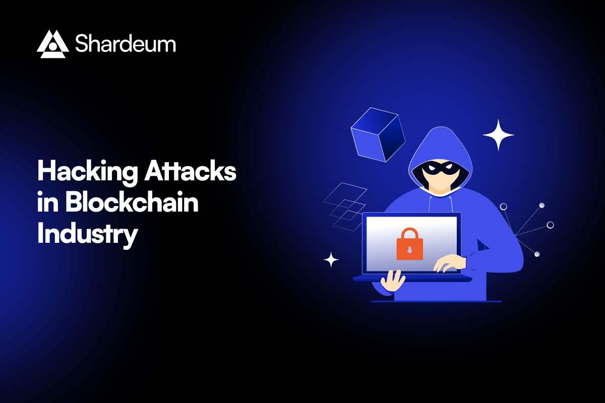

## Table of Contents

## What are hacks in the context of the cryptocurrency industry?

In the cryptocurrency industry, hacks refer to unauthorized access and theft of digital assets from exchanges, wallets, or other platforms. These hacks often exploit vulnerabilities in the security systems of these platforms, allowing hackers to steal cryptocurrencies like Bitcoin, Ethereum, or other tokens. The stolen assets can then be moved to different wallets or sold on the black market, causing significant financial losses for the victims.

Hacks can happen in different ways. Sometimes, hackers use phishing attacks to trick people into giving away their private keys or login details. Other times, they might find a weak spot in the software of a cryptocurrency exchange and use it to get in. These incidents can shake people's trust in cryptocurrencies and make them worry about keeping their digital money safe. That's why it's really important for crypto platforms to have strong security measures and for users to be careful and use secure practices.

## How common are hacks in cryptocurrencies?

Hacks in the cryptocurrency world happen quite often. Every year, there are many reports of different kinds of hacks, like stealing from exchanges or tricking people with phishing scams. A big reason for this is that cryptocurrencies are digital and can be hard to trace, which makes them a target for hackers. Also, since the crypto industry is still new, some platforms might not have the best security yet.

These hacks can be really damaging. For example, in 2022, there were hacks that led to billions of dollars being stolen. This not only hurts the people and companies that lose their money but can also make people less trusting of cryptocurrencies in general. That's why it's important for everyone in the crypto space to keep improving their security and for users to be careful with their digital assets.

## What are the immediate financial impacts of hacks on cryptocurrency users?

When a hack happens in the [cryptocurrency](/wiki/cryptocurrency) world, the people who lose their money feel it right away. If someone's crypto is stolen, they lose the value of those coins or tokens instantly. This can be a lot of money, and it can be really upsetting. Sometimes, the platform that got hacked might try to help by giving back some of the lost money, but this doesn't always happen, and it can take a long time.

The value of the cryptocurrency can also drop right after a big hack. When people hear about a hack, they might get scared and start selling their crypto, which makes the price go down. This can affect everyone who owns that cryptocurrency, even if they weren't directly hacked. So, a hack can have a big impact on the whole crypto market, not just the people who were directly affected.

## Can hacks lead to improvements in cryptocurrency security?

Yes, hacks can lead to better security in the cryptocurrency world. When a big hack happens, it shows everyone where the weak spots are. This pushes the people who make and run crypto platforms to fix these problems and make their security stronger. They might add new ways to keep things safe, like better ways to check who you are or stronger ways to keep your private keys safe. This can make the whole crypto world safer for everyone.

Also, when hacks happen, it makes everyone more aware of the risks. People who use cryptocurrencies start to be more careful. They might use safer ways to keep their crypto, like hardware wallets, and be more careful about not falling for tricks like phishing. This means that over time, the whole community gets better at protecting itself from hackers. So, even though hacks are bad, they can help make things safer in the long run.

## How do hacks influence the development of new cryptocurrencies?

Hacks can really change how new cryptocurrencies are made. When people see a big hack, they start thinking about how to make their new crypto safer from the start. They might add special security features right from the beginning, like ways to check if the code is safe or ways to keep the money safe even if something goes wrong. This means that new cryptocurrencies can be built to be stronger and less likely to get hacked.

Also, hacks make everyone in the crypto world more careful. When new cryptocurrencies are being made, the people working on them know that everyone is watching to see if they are safe. This pushes them to think about security all the time, not just when they are making the crypto but also when they are telling people about it. So, hacks can make new cryptocurrencies better and safer for everyone who uses them.

## What role do hacks play in shaping regulatory policies for cryptocurrencies?

Hacks play a big role in shaping the rules for cryptocurrencies. When a big hack happens, it gets the attention of people who make the laws. They see that cryptocurrencies can be risky and start thinking about ways to make them safer. This can lead to new rules that make crypto platforms follow strict security standards. These rules are meant to protect people from losing their money to hackers.

Sometimes, after a hack, the people making the laws might want to control cryptocurrencies more tightly. They might think that if they can watch over the crypto world more closely, they can stop hacks from happening. This could mean more checks and rules for crypto companies. But, it's a tricky balance because too many rules might slow down the growth of new cryptocurrencies and make it harder for people to use them.

## How can hacks affect the overall trust and adoption of cryptocurrencies?

Hacks can really shake people's trust in cryptocurrencies. When someone hears about a big hack where people lost a lot of money, they might start to think that crypto is too risky. They might worry that their own money could get stolen too. This fear can make people less likely to use or invest in cryptocurrencies. If a lot of people feel this way, it can slow down how fast cryptocurrencies grow and become popular.

But, hacks can also push the crypto world to get better. When a hack happens, everyone sees where the weak spots are. This makes the people who run crypto platforms work harder to fix these problems and make their security stronger. Over time, this can make cryptocurrencies safer and more trustworthy. So, while hacks can scare people away at first, they can also lead to a safer crypto world that more people might want to join.

## What are the potential long-term benefits of hacks for the cryptocurrency ecosystem?

Hacks can actually help the cryptocurrency world get better over time. When a big hack happens, it shows everyone where the weak spots are in the system. This makes the people who run crypto platforms work hard to fix these problems and make their security stronger. They might add new ways to keep things safe, like better ways to check who you are or stronger ways to keep your private keys safe. This can make the whole crypto world safer for everyone who uses it.

Also, hacks make everyone more aware of the risks. When people see a big hack, they start to be more careful with their own cryptocurrencies. They might use safer ways to keep their crypto, like hardware wallets, and be more careful about not falling for tricks like phishing. This means that over time, the whole community gets better at protecting itself from hackers. So, even though hacks are bad, they can help make the crypto world safer and more trusted in the long run.

## How do hacks contribute to the evolution of blockchain technology?

Hacks push the people who work on blockchain technology to make it better. When a big hack happens, it shows everyone where the weak spots are in the system. This makes the people who make blockchains work hard to fix these problems. They might add new ways to keep things safe, like better ways to check who you are or stronger ways to keep your private keys safe. This can make the whole blockchain world safer for everyone who uses it.

Also, hacks make everyone more aware of the risks. When people see a big hack, they start to be more careful with their own cryptocurrencies. They might use safer ways to keep their crypto, like hardware wallets, and be more careful about not falling for tricks like phishing. This means that over time, the whole community gets better at protecting itself from hackers. So, even though hacks are bad, they can help make blockchain technology safer and more trusted in the long run.

## What strategies can cryptocurrency platforms implement to turn hacks into opportunities for growth?

When a hack happens, cryptocurrency platforms can use it as a chance to get better. They can look at what went wrong and fix those problems. This means making their security stronger, like adding better ways to check who you are or using stronger ways to keep private keys safe. By doing this, they can show everyone that they care about keeping people's money safe. This can make people trust them more and want to use their platform again.

Also, platforms can talk openly about the hack and what they are doing to fix it. This can help them seem more honest and responsible. They can also use the hack to teach people about how to keep their own crypto safe. By sharing tips and tricks, they can help the whole crypto community get better at protecting itself. Over time, this can make their platform more popular and help it grow.

## How do hacks influence the competitive landscape within the cryptocurrency industry?

When a hack happens, it can change how different cryptocurrency platforms compete with each other. If one platform gets hacked, people might start to trust it less and move their money to another platform that seems safer. This can make the hacked platform lose customers and fall behind in the competition. On the other hand, the platforms that weren't hacked can use this as a chance to show how good their security is. They might tell people about their strong security measures and try to attract more users.

Hacks can also push all platforms to get better. When everyone sees where the weak spots are, they all try to fix these problems and make their security stronger. This can lead to a race to have the best security, which is good for everyone who uses cryptocurrencies. Over time, this can make the whole industry safer and more competitive, as platforms that can keep their users' money safe will be the ones that do well.

## What advanced security measures have been developed as a direct response to major cryptocurrency hacks?

After big hacks, people in the cryptocurrency world have come up with new ways to keep things safe. One way is using multi-signature wallets, which need more than one person to agree before money can be moved. This makes it harder for hackers to steal money because they can't do it alone. Another way is using cold storage, where most of the money is kept offline and away from the internet, so hackers can't reach it easily. Also, some platforms now use something called "circuit breakers" that can stop trading if they think something fishy is going on, which can help stop hackers from taking money quickly.

Another important thing that has been added is better ways to check who you are, called KYC (Know Your Customer). This helps make sure that only the right people can use the platform and makes it harder for hackers to get in. Also, there are now more tools to watch for strange activity, like systems that can spot if someone is trying to trick people with phishing. These tools can warn users and stop hackers before they do any harm. By using these new security measures, cryptocurrency platforms can make their users' money safer and help stop hacks from happening.

## References & Further Reading

[1]: Andersen, T. G., Davis, R. A., Kreiss, J.-P., & Mikosch, T. (Eds.). (2009). ["Handbook of Financial Time Series."](https://link.springer.com/book/10.1007/978-3-540-71297-8) Springer.

[2]: Nakamoto, S. (2008). ["Bitcoin: A Peer-to-Peer Electronic Cash System."](https://nakamotoinstitute.org/library/bitcoin/) 

[3]: Bonneau, J., Miller, A., Clark, J., Narayanan, A., Kroll, J. A., & Felten, E. W. (2015). ["Sok: Research perspectives and challenges for Bitcoin and cryptocurrencies."](https://ieeexplore.ieee.org/document/7163021) 2015 IEEE Symposium on Security and Privacy.

[4]: Zohar, A. (2015). ["Bitcoin: under the hood."](https://dl.acm.org/doi/10.1145/2701411) Communications of the ACM, 58(9), 104-113.

[5]: Lewis, A. (2016). ["A Gentle Introduction to Bitcoin and Blockchains."](https://bitsonblocks.net/) Bits on Blocks.

[6]: Peters, G. W., & Panayi, E. (2016). ["Understanding Modern Banking Ledgers through Blockchain Technologies: Future of Transaction Processing and Smart Contracts on the Internet of Money."](https://link.springer.com/chapter/10.1007/978-3-319-42448-4_13) Springer.