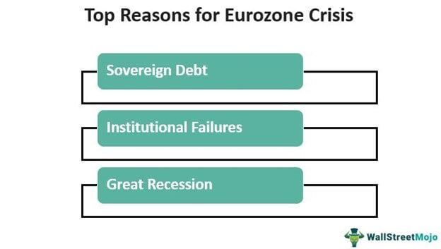

## Table of Contents

## What is the Eurozone and which countries are part of it?

The Eurozone is a group of European countries that use the euro as their official currency. It was created to make trade and travel easier between these countries. The euro is managed by the European Central Bank, which helps keep the economy stable.

There are 20 countries in the Eurozone. Some of the biggest ones are Germany, France, Italy, and Spain. Other countries include Austria, Belgium, Cyprus, Estonia, Finland, Greece, Ireland, Latvia, Lithuania, Luxembourg, Malta, the Netherlands, Portugal, Slovakia, and Slovenia. Each country joined at different times, but they all work together to make the euro strong.

## What does it mean for a currency to collapse?

When a currency collapses, it means that it loses its value very quickly. People start to lose trust in the currency, and they don't want to use it anymore. This can happen for many reasons, like if a country has big money problems or if people think the government is not managing the money well. When a currency loses value, it can make things very expensive because the money is worth less. This can make life hard for people who live in that country.

A currency collapse can cause a lot of problems. For example, if you have savings in that currency, those savings become worth less. It can also make it hard for a country to buy things from other countries because their money is not as strong. Sometimes, a country might need help from other countries or big organizations to fix the problem. If the situation gets really bad, they might even have to start using a different currency.

## What are the immediate effects of a currency collapse on everyday citizens?

When a currency collapses, everyday citizens feel it right away. Their money suddenly becomes worth less, so the things they need to buy, like food and gas, get a lot more expensive. If someone was saving money for something important, like a new house or their kid's education, those savings might not be enough anymore. People might also find it hard to pay their bills because their money doesn't go as far as it used to.

This can make life really tough. People might have to change how they live, maybe by buying less or looking for cheaper options. Jobs can be affected too, because businesses might struggle if they can't afford to pay their workers or buy what they need. Sometimes, people might even try to buy things from other countries where the money is still strong, but that can be hard if they don't have access to that other currency. Overall, a currency collapse can make everyday life a lot more challenging and stressful for citizens.

## How would a Eurozone currency collapse affect trade within Europe?

If the euro collapsed, it would make trade within Europe very hard. The euro makes it easy for countries in the Eurozone to buy and sell things from each other because they all use the same money. If the euro went away, each country might go back to using their old money, like the German mark or the French franc. This would mean that every time a country wanted to trade with another, they would have to change their money into the other country's money. This can be slow and expensive, and it might make businesses think twice about trading as much.

Also, a collapse of the euro would make prices go up and down a lot. If one country's money gets weaker than another's, the things they sell might become cheaper, but the things they need to buy from other countries would get more expensive. This can make it hard for businesses to plan and can lead to less trade overall. People might also start buying things from countries outside of Europe if their money is still strong, which could hurt businesses inside Europe. In the end, a euro collapse would make trade within Europe a lot more complicated and could slow down the whole economy.

## What impact would a Eurozone currency collapse have on global financial markets?

If the euro collapsed, it would shake up global financial markets a lot. The euro is one of the biggest currencies in the world, so a lot of people and businesses use it. If it suddenly lost its value, it would make everyone nervous. People might start selling their investments, like stocks and bonds, because they wouldn't know what would happen next. This could lead to a big drop in the stock market, not just in Europe but all over the world. Banks and big investors might also lose money if they have a lot of euros, and this could make them more careful about lending money, which could slow down the whole global economy.

The effects wouldn't stop at the financial markets. Countries outside of Europe that trade a lot with Eurozone countries would feel it too. Their money might get stronger compared to the euro, but their businesses might struggle if they can't sell as much to Europe. Big organizations like the International Monetary Fund might have to step in to help, but fixing the problem would take a long time. Overall, a euro collapse would cause a lot of uncertainty and could lead to a global economic crisis.

## How might a Eurozone currency collapse affect the European Union's political stability?

If the euro collapsed, it would make things very hard for the European Union's political stability. People might start to not trust the leaders who let the euro fall apart. They might be angry and want to vote for new leaders or even want their country to leave the European Union. This could make the whole group of countries weaker because they wouldn't work together as well.

Also, countries in the Eurozone might start fighting more about money. Some countries might want to help others that are struggling, but others might not want to share their money. This could lead to big arguments and make it hard for the European Union to make decisions. In the end, a euro collapse could make the European Union less strong and less united.

## What historical examples of currency collapses can we learn from?

One big example of a currency collapse happened in Germany in the 1920s. It's called the Weimar Republic hyperinflation. After World War I, Germany had to pay a lot of money to other countries. They printed more money to pay these bills, but this made their money worth less and less. Soon, people needed wheelbarrows full of money just to buy a loaf of bread. This made life very hard for people and helped lead to big political changes, including the rise of Adolf Hitler and the Nazi Party.

Another example is Zimbabwe in the late 2000s. The government printed too much money to pay for things, and this caused hyperinflation. At one point, prices were doubling every day. People's savings became worthless, and they couldn't buy basic things like food and medicine. The government even had to print a 100 trillion dollar bill, but it still wasn't enough. This led to a lot of suffering and made the country's economy and government very unstable.

These examples show how dangerous a currency collapse can be. It can make life very hard for people, cause big political changes, and even lead to new governments or leaders. It's important for countries to manage their money carefully to avoid these problems.

## What measures could be taken to prevent a Eurozone currency collapse?

To prevent a Eurozone currency collapse, countries need to work together to keep their economies strong. This means they should try to keep their budgets balanced and not borrow too much money. If a country is struggling, other countries in the Eurozone should help them out, but in a way that makes sure everyone is doing their part. The European Central Bank also plays a big role. They can control how much money is in the economy and make sure the euro stays strong. If they see problems coming, they can take action to fix them before they get too big.

Another important thing is to keep people's trust in the euro. This means being open about what's going on with the economy and making sure everyone understands the plans to keep the euro safe. If people start to worry, they might stop using the euro, which could make it collapse. So, clear communication and strong leadership are key. By working together and being smart about money, the Eurozone can avoid a currency collapse and keep the euro strong for everyone.

## How would different sectors of the economy (e.g., banking, manufacturing, services) be affected by a Eurozone currency collapse?

If the euro collapsed, the banking sector would be hit hard. Banks have a lot of money in euros, and if the euro lost its value, banks could lose a lot of money. This might make them scared to lend money to people and businesses, which could slow down the whole economy. People might also take their money out of the bank because they wouldn't trust it anymore, which could make the problem even worse. Banks might need help from the government or other countries to stay open.

The manufacturing sector would also feel the effects. If the euro collapsed, the cost of making things could go up because the money they use to buy materials would be worth less. This could make their products more expensive, and they might not be able to sell as much. If other countries' money got stronger compared to the euro, it might be harder for European manufacturers to sell their products abroad. This could lead to factories closing and people losing their jobs.

The services sector would not be spared either. If the euro lost its value, services like restaurants, hotels, and shops would see their costs go up. They might have to raise their prices, which could make fewer people want to use their services. People might also have less money to spend on these services if their savings and income lost value. This could lead to businesses closing and people in the service industry losing their jobs. Overall, a euro collapse would make life harder for everyone in the economy.

## What are the potential long-term economic consequences of a Eurozone currency collapse?

If the euro collapsed, it would have big effects on the economy for a long time. Countries in the Eurozone might go back to using their old money, like the German mark or the French franc. This would make it harder for them to trade with each other because they would have to change their money every time they wanted to buy or sell things. It could also make prices go up and down a lot, which would make it hard for businesses to plan and could lead to less trade overall. People might lose trust in their governments and the European Union, which could lead to big political changes and even some countries wanting to leave the EU.

In the long run, a euro collapse could also make the whole world's economy weaker. The euro is one of the biggest currencies in the world, so if it lost its value, it would make everyone nervous. This could lead to a big drop in the stock market and make banks and big investors more careful about lending money. Countries outside of Europe that trade a lot with Eurozone countries would also feel it. They might struggle to sell their products to Europe, and this could slow down the global economy. It would take a long time to fix all these problems, and life would be harder for people all over the world.

## How would a Eurozone currency collapse influence monetary policies of non-Eurozone countries?

If the euro collapsed, it would make non-Eurozone countries think hard about their own money policies. They might get worried about their own money losing value, so they would try to keep it strong. They might raise interest rates to make their money more attractive to people and businesses. This could slow down their economy a bit, but they would think it's worth it to keep their money safe. They might also try to help their businesses that trade with Eurozone countries, maybe by giving them loans or other help to keep them going.

Non-Eurozone countries might also change how they trade with Eurozone countries. If the euro lost its value, it might be cheaper for them to buy things from Eurozone countries. But they would also be careful because they wouldn't know if the euro would keep losing value. They might try to use other currencies for trade or find new countries to buy things from. Overall, a euro collapse would make non-Eurozone countries change their money policies to protect their own economies and keep things stable.

## What role could international organizations like the IMF play in mitigating the effects of a Eurozone currency collapse?

If the euro collapsed, the International Monetary Fund (IMF) could help a lot. The IMF is like a big helper for countries with money problems. They could give loans to Eurozone countries that are struggling. This money could help these countries pay their bills and keep their economies going. The IMF might also tell these countries what they should do to fix their money problems, like cutting spending or raising taxes. This advice could help stop the euro from collapsing even more.

The IMF could also work with other big organizations, like the World Bank, to help. They could make plans to help the whole Eurozone, not just one country at a time. This could include giving money to the European Central Bank to help keep the euro strong. The IMF could also talk to countries outside of Europe to keep them calm and stop them from doing things that could make the problem worse. By working together, the IMF and other organizations could help make the effects of a euro collapse less bad and help the Eurozone get back on its feet.

## References & Further Reading

[1]: International Monetary Fund. ["World Economic Outlook Reports."](https://www.imf.org/en/Publications/WEO) International Monetary Fund.

[2]: European Central Bank. ["Monetary Policy - Instruments."](https://www.ecb.europa.eu/mopo/implement/html/index.en.html) European Central Bank.

[3]: Eurostat. ["Eurostat: Your Key to European Statistics."](https://ec.europa.eu/eurostat/web/products-catalogues/-/KS-02-17-839) European Commission.

[4]: Lopez de Prado, M. ["Advances in Financial Machine Learning."](https://www.amazon.com/Advances-Financial-Machine-Learning-Marcos/dp/1119482089) John Wiley & Sons.

[5]: Jansen, S. ["Machine Learning for Algorithmic Trading."](https://github.com/stefan-jansen/machine-learning-for-trading) Packt Publishing.

[6]: European Central Bank. (2015). ["The international role of the euro."](https://www.ecb.europa.eu/pub/pdf/other/euro-international-role-201507.en.pdf) European Central Bank.

[7]: Krugman, P. (2012). ["End This Depression Now!"](https://www.princeton.edu/~pkrugman/End%20This%20Depression%20Now!.pdf) W. W. Norton & Company.

[8]: Chan, E. P. ["Quantitative Trading: How to Build Your Own Algorithmic Trading Business."](https://github.com/ftvision/quant_trading_echan_book) John Wiley & Sons.