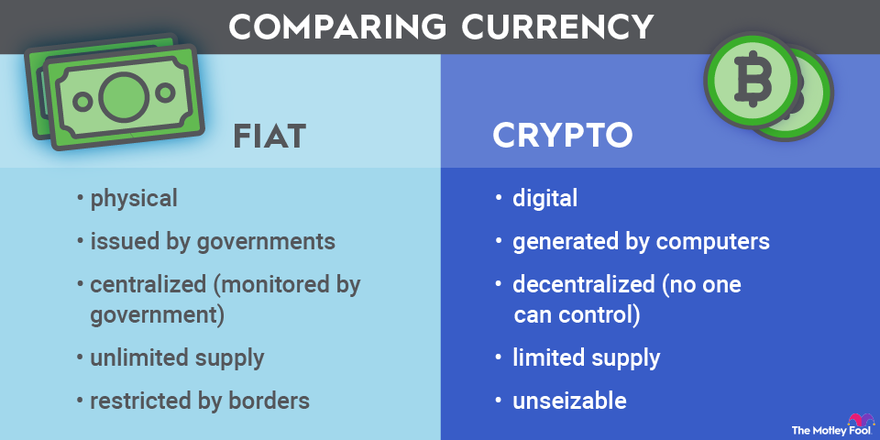

## Table of Contents

## What is cryptocurrency and how does it differ from fiat currency?

Cryptocurrency is a type of digital money that you can use to buy things online. It uses a technology called blockchain, which is like a digital ledger that keeps track of all the transactions. People can send and receive cryptocurrencies without needing a bank or government to oversee it. Some popular cryptocurrencies include Bitcoin, Ethereum, and Dogecoin. You can store them in a digital wallet on your computer or phone.

Fiat currency, on the other hand, is the money we use every day, like dollars, euros, or pesos. It's issued and regulated by governments and central banks. When you use fiat currency, banks keep track of your money and help you make transactions. Unlike cryptocurrencies, fiat money has physical forms like coins and banknotes. The value of fiat currency is based on the trust and stability of the government that issues it.

The main difference between the two is that cryptocurrencies are decentralized, meaning no single authority controls them, while fiat currencies are centralized and controlled by governments. Cryptocurrencies can be more anonymous and harder to track, but they can also be more volatile in value. Fiat currencies are generally more stable but can be affected by government policies and economic conditions.

## What are the main types of cryptocurrencies currently in use?

There are many types of cryptocurrencies, but some of the most popular ones are Bitcoin, Ethereum, and stablecoins. Bitcoin is the first and most well-known [cryptocurrency](/wiki/cryptocurrency). It was created in 2009 and is often called "digital gold" because people see it as a store of value. Ethereum is another big cryptocurrency that came out in 2015. It's not just a currency; it also has a platform where people can build and run apps and smart contracts, which are like digital agreements that automatically do what they're supposed to do.

Stablecoins are another type of cryptocurrency that are designed to have a stable value. They are usually tied to something like the US dollar, so their value doesn't go up and down as much as other cryptocurrencies. Tether and USD Coin are examples of stablecoins. There are also other cryptocurrencies like Litecoin, which is similar to Bitcoin but faster, and Ripple, which is used by banks to move money quickly around the world. Each type of cryptocurrency has its own special features and uses, so people choose them based on what they need.

## How does the technology behind cryptocurrencies, like blockchain, work?

Blockchain is like a digital notebook that keeps track of all the transactions made with cryptocurrencies. Imagine a chain of blocks, where each block contains a list of transactions. When someone sends cryptocurrency to another person, that transaction gets added to a block. Once a block is full, it gets added to the chain, and a new block starts filling up. This chain of blocks is stored on many computers around the world, so it's very hard to change or cheat the system. Every time a new block is added, it's checked by many computers to make sure it's correct. This process is called mining, and people who do it are called miners. They use powerful computers to solve puzzles, and when they do, they get rewarded with some cryptocurrency.

The cool thing about blockchain is that it's decentralized, meaning no single person or group controls it. Because the information is spread out on many computers, it's very secure and transparent. Everyone can see the transactions, but they are usually anonymous, so you can't easily tell who is sending or receiving the money. This makes it different from traditional banking systems, where a bank keeps track of everything. Blockchain also uses something called cryptography to keep the transactions safe. Cryptography is like a secret code that makes sure only the right people can see and change the information. This is why cryptocurrencies are often called "crypto" for short.

## What are the advantages of using cryptocurrencies over traditional fiat currencies?

One big advantage of using cryptocurrencies is that they can be more private and secure. When you use cryptocurrencies, you don't need to give your personal information to a bank or a government. This can be good if you want to keep your money matters private. Also, because cryptocurrencies use blockchain technology, it's very hard for someone to steal your money or change the records. The transactions are checked by many computers around the world, so it's safer than traditional banking systems where one bank keeps all the records.

Another advantage is that cryptocurrencies can be used anywhere in the world without needing to change money from one country's currency to another. This can save time and money, especially if you're sending money to another country. Traditional banks can take a few days and charge fees to send money internationally, but with cryptocurrencies, you can send money quickly and often for less money. Plus, cryptocurrencies are not controlled by any one government or bank, so they can be a good option if you don't trust your country's money system or if the economy is not stable.

## What are the current limitations and challenges faced by cryptocurrencies?

One big challenge with cryptocurrencies is that their value can go up and down a lot. This is called [volatility](/wiki/volatility-trading-strategies). For example, the price of Bitcoin can change a lot in just one day. This makes it hard for people to use cryptocurrencies for everyday buying and selling because they don't know if their money will be worth more or less tomorrow. Also, because cryptocurrencies are not controlled by governments, they can be used for illegal things like buying drugs or weapons on the dark web. This makes some people and governments worried about them.

Another limitation is that not many places accept cryptocurrencies as payment yet. While you can use them to buy things online or from some stores, most places still only take regular money like dollars or euros. This can make it hard to use cryptocurrencies in everyday life. Also, if you lose your digital wallet or forget your password, you can lose all your cryptocurrencies and there's no bank to help you get them back. This can be scary for people who are not used to managing their money this way.

## How widely accepted are cryptocurrencies for everyday transactions?

Cryptocurrencies are not very widely accepted for everyday transactions yet. While you can use them to buy things online or from some stores, most places still only take regular money like dollars or euros. For example, you might be able to use Bitcoin to buy a pizza from a website that accepts it, but you can't use it at most grocery stores or restaurants. This can make it hard to use cryptocurrencies in your daily life because you need to find special places that accept them.

Some big companies like Microsoft and Overstock do accept cryptocurrencies, but they are the exception, not the rule. Most businesses are hesitant to accept cryptocurrencies because their value can change a lot in a short time. This makes it risky for businesses to use them. Also, since cryptocurrencies are not backed by any government, businesses might worry about legal issues or taxes. So, while cryptocurrencies are becoming more known, they are not yet a common way to pay for things every day.

## What role do governments and financial institutions play in the adoption of cryptocurrencies?

Governments and financial institutions play a big role in how much people use cryptocurrencies. Governments can make rules that either help or hurt the use of cryptocurrencies. For example, if a government says that cryptocurrencies are legal and safe to use, more people might start using them. But if a government says they are illegal or too risky, people might stay away from them. Governments also worry about things like money laundering and fraud, so they might make strict rules to keep cryptocurrencies safe. This can make it harder for people to use them but can also make them more trustworthy.

Financial institutions like banks also affect how much cryptocurrencies are used. Banks can start offering services that let people buy, sell, and store cryptocurrencies. This can make it easier and safer for people to use them. But some banks are worried about cryptocurrencies because they are not controlled by any one group. This can make banks hesitant to work with them. If banks and other financial institutions start to accept and use cryptocurrencies more, it could help them become more common for everyday use. But if they keep their distance, it might slow down how fast cryptocurrencies grow.

## Can cryptocurrencies maintain their value and stability compared to fiat currencies?

Cryptocurrencies can have a hard time keeping their value and being stable compared to fiat currencies. The value of cryptocurrencies like Bitcoin can go up and down a lot in a short time. This is because their value is based on what people think they are worth, not on a government or bank saying they are worth something. This can make it risky to use them for everyday buying and selling because you don't know if your money will be worth more or less tomorrow. Fiat currencies, like dollars or euros, are usually more stable because they are backed by governments and central banks that can control how much money is out there.

However, some cryptocurrencies, like stablecoins, are designed to be more stable. Stablecoins are tied to something like the US dollar, so their value doesn't change as much. This can make them a better choice for people who want to use cryptocurrencies but don't want the big ups and downs. Even with stablecoins, though, there can still be some risks because they depend on the thing they are tied to staying stable. Overall, while cryptocurrencies can be exciting and offer new ways to handle money, they often struggle to match the stability of fiat currencies.

## What are the potential impacts of cryptocurrencies on global financial systems?

Cryptocurrencies could change the way money works around the world. They can make it easier and cheaper to send money from one country to another without needing banks or governments to help. This could be really helpful for people in countries where the money system is not stable or where it's hard to get a bank account. But it could also make it harder for governments to control their money and keep track of what people are doing with it. This might lead to more illegal activities like money laundering because cryptocurrencies can be harder to trace.

On the other hand, if more people start using cryptocurrencies, it could push banks and other financial institutions to change how they work. They might start offering services for cryptocurrencies to keep up with what people want. This could make the whole financial system more open and competitive. But it could also make the system more risky because cryptocurrencies can go up and down in value a lot. Governments and banks will need to find a way to balance the good things about cryptocurrencies with the risks they bring to keep the global financial system safe and fair for everyone.

## How might cryptocurrencies evolve to better serve as a replacement for fiat currencies?

For cryptocurrencies to better serve as a replacement for fiat currencies, they need to become more stable and widely accepted. Right now, the value of cryptocurrencies like Bitcoin can change a lot in a short time. This makes it hard for people to use them for everyday buying and selling. If cryptocurrencies could be tied to something stable, like the US dollar, they might be more useful. Stablecoins are already trying to do this, but they need to be even more reliable. Also, more stores and businesses need to start accepting cryptocurrencies. If you can use them at most places, just like you use dollars or euros, they would be much more convenient for everyday use.

Another way cryptocurrencies could improve is by becoming easier and safer to use. Right now, if you lose your digital wallet or forget your password, you can lose all your money and there's no bank to help you get it back. If there were better ways to keep your cryptocurrencies safe and easy ways to get them back if something goes wrong, more people might trust them. Governments and banks could also help by making clear rules about how to use cryptocurrencies safely. If they work together with the people who make cryptocurrencies, they could make them a better choice for everyone. This would help cryptocurrencies become a real alternative to fiat currencies.

## What are the legal and regulatory considerations for cryptocurrencies to become mainstream?

For cryptocurrencies to become mainstream, governments need to make clear rules about how to use them safely. Right now, some countries say cryptocurrencies are okay to use, while others say they are too risky or even illegal. If governments can agree on good rules, it would help people trust cryptocurrencies more. These rules could stop bad things like money laundering and fraud, but they also need to let people use cryptocurrencies easily. If the rules are too strict, it might scare people away. But if they are fair and clear, more people might start using cryptocurrencies for everyday buying and selling.

Financial institutions like banks also play a big role. If banks start offering services to help people buy, sell, and store cryptocurrencies, it could make them easier and safer to use. But some banks are worried about cryptocurrencies because they are not controlled by any one group. This can make banks hesitant to work with them. If banks and other financial institutions start to accept and use cryptocurrencies more, it could help them become more common for everyday use. But if they keep their distance, it might slow down how fast cryptocurrencies grow. So, working together with governments and banks is important for cryptocurrencies to become a normal part of our money system.

## What future scenarios could lead to cryptocurrencies fully replacing fiat currencies?

For cryptocurrencies to fully replace fiat currencies, they would need to become much more stable and widely accepted. Right now, the value of cryptocurrencies like Bitcoin can go up and down a lot in a short time. This makes it hard for people to use them for everyday buying and selling. If cryptocurrencies could be tied to something stable, like the US dollar, they might be more useful. Stablecoins are already trying to do this, but they need to be even more reliable. Also, more stores and businesses need to start accepting cryptocurrencies. If you can use them at most places, just like you use dollars or euros, they would be much more convenient for everyday use.

Another important thing is that governments and banks need to make clear rules about how to use cryptocurrencies safely. Right now, some countries say cryptocurrencies are okay to use, while others say they are too risky or even illegal. If governments can agree on good rules, it would help people trust cryptocurrencies more. These rules could stop bad things like money laundering and fraud, but they also need to let people use cryptocurrencies easily. If the rules are too strict, it might scare people away. But if they are fair and clear, more people might start using cryptocurrencies for everyday buying and selling. If all these things happen, cryptocurrencies could one day fully replace fiat currencies.

## References & Further Reading

[1]: Nakamoto, S. (2008). ["Bitcoin: A Peer-to-Peer Electronic Cash System."](https://nakamotoinstitute.org/library/bitcoin/)

[2]: Buterin, V. (2013). ["Ethereum Whitepaper: A Next Generation Smart Contract & Decentralized Application Platform."](https://ethereum.org/content/whitepaper/whitepaper-pdf/Ethereum_Whitepaper_-_Buterin_2014.pdf)

[3]: Böhme, R., Christin, N., Edelman, B., & Moore, T. (2015). ["Bitcoin: Economics, technology, and governance."](https://www.aeaweb.org/articles?id=10.1257/jep.29.2.213) Journal of Economic Perspectives, 29(2), 213-238.

[4]: Tapscott, D., & Tapscott, A. (2016). ["Blockchain Revolution: How the Technology Behind Bitcoin is Changing Money, Business, and the World."](https://archive.org/details/blockchainrevolu0000taps) Penguin.

[5]: Chainalysis. (2022). ["The 2022 Global Crypto Adoption Index."](https://www.chainalysis.com/blog/2022-global-crypto-adoption-index/)

[6]: Lopez de Prado, M. (2018). ["Advances in Financial Machine Learning."](https://www.amazon.com/Advances-Financial-Machine-Learning-Marcos/dp/1119482089) Wiley.

[7]: Lanier, J. (2018). ["Ten Arguments for Deleting Your Social Media Accounts Right Now."](https://www.amazon.com/Arguments-Deleting-Social-Media-Accounts/dp/125019668X) Henry Holt and Co.

[8]: Narayanan, A., Bonneau, J., Felten, E., Miller, A., & Goldfeder, S. (2016). ["Bitcoin and Cryptocurrency Technologies: A Comprehensive Introduction."](https://press.princeton.edu/books/hardcover/9780691171692/bitcoin-and-cryptocurrency-technologies) Princeton University Press.

[9]: Mougayar, W. (2016). ["The Business Blockchain: Promise, Practice, and Application of the Next Internet Technology."](https://books.google.com/books/about/The_Business_Blockchain.html?id=CEsPDAAAQBAJ) Wiley.