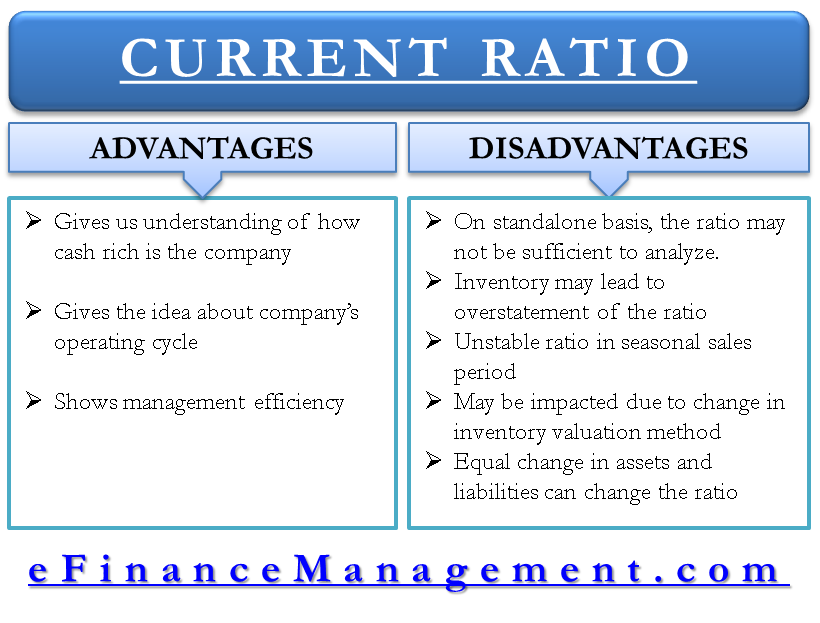

## Table of Contents

## What is a liquidity ratio?

A liquidity ratio is a number that shows if a company can pay its short-term bills. It compares what the company owns that can be quickly turned into cash with what it owes in the short term. This helps people see if the business is healthy and can handle its money well.

There are different types of liquidity ratios, but the most common ones are the current ratio and the quick ratio. The current ratio looks at all the things a company can turn into cash within a year, like inventory, and compares it to what it needs to pay in the same time. The quick ratio is stricter; it only counts the most liquid assets, like cash and money that people owe the company, ignoring inventory. Both ratios help investors and managers understand the company's ability to meet its short-term financial obligations.

## Why are liquidity ratios important for a business?

Liquidity ratios are important for a business because they show if the company can pay its bills on time. If a business has a good liquidity ratio, it means it has enough cash or things it can quickly sell to cover its short-term debts. This is important because if a business can't pay its bills, it might have to borrow more money, which can be expensive, or it might even have to close down.

These ratios also help business owners and investors understand the financial health of the company. A high liquidity ratio can make investors feel more confident about putting their money into the business. On the other hand, a low liquidity ratio might scare investors away because it suggests the company could struggle to pay its debts. By keeping an eye on liquidity ratios, a business can make better decisions about managing its money and planning for the future.

## What does a high liquidity ratio indicate?

A high liquidity ratio means that a company has a lot of cash or things it can easily turn into cash compared to what it owes in the short term. This is good because it shows the company can pay its bills on time without any trouble. It means the business is in a healthy financial position and can handle any sudden expenses that come up.

Having a high liquidity ratio also makes investors feel more confident. They see that the company is managing its money well and is less likely to run into financial trouble. This can make it easier for the company to get loans or attract more investment, which can help it grow and succeed in the future.

## Can a high liquidity ratio be considered a disadvantage?

Yes, a high liquidity ratio can be a disadvantage. If a company has too much cash or too many things that can be quickly turned into cash, it might mean they are not using their money well. Instead of keeping a lot of money sitting around, they could be investing it in new projects or equipment that could help the business grow and make more money.

On the other hand, having too much liquidity might also show that the company is too cautious. They might be missing out on opportunities to expand or improve their business because they are too focused on keeping a lot of cash on hand. While it's good to be prepared for unexpected expenses, being too liquid can mean the company is not as profitable as it could be.

## How might a high liquidity ratio affect a company's profitability?

A high liquidity ratio can make a company less profitable because the money sitting in cash or easily sellable assets isn't being used to grow the business. If a company keeps too much money in the bank or in things like inventory, it's not investing that money in new projects or equipment that could make more money. For example, instead of keeping a lot of cash, the company could use it to open new stores, develop new products, or buy new machines that help make things faster and cheaper.

Also, having too much liquidity might mean the company is too careful with its money. They might be missing out on chances to make more money because they're too focused on being able to pay bills quickly. While it's good to be ready for surprises, being too liquid can stop the company from taking risks that could lead to bigger profits. So, while a high liquidity ratio shows the company can pay its bills, it might also mean they're not as profitable as they could be if they used their money more wisely.

## What are the potential opportunity costs associated with maintaining high liquidity?

When a company keeps a lot of money in cash or things it can quickly sell, it might miss out on other ways to use that money to make more money. For example, instead of keeping money in the bank, the company could use it to open new stores, buy new machines, or start new projects. These things could help the business grow and make more profit. But if the money is just sitting there, the company isn't getting any of those benefits.

Also, having too much cash can mean the company is being too careful and not taking chances to make more money. They might be scared to invest in new ideas or expand because they want to make sure they can always pay their bills. But this carefulness can mean they miss out on opportunities that could make the business bigger and more successful. So, keeping too much money in liquid form can lead to missed chances to grow and be more profitable.

## How does a high liquidity ratio impact a company's investment opportunities?

When a company has a high liquidity ratio, it means they have a lot of cash or things they can easily turn into cash. This might sound good, but it can actually make them miss out on good investment opportunities. If they keep too much money in the bank or in things like inventory, they are not using that money to invest in new projects or to buy new equipment that could help the business grow and make more money.

Also, having a lot of cash can make a company too cautious. They might be scared to take risks because they want to make sure they can always pay their bills. But this carefulness can mean they miss out on chances to expand or try new things that could make the business bigger and more successful. So, a high liquidity ratio can lead to missed opportunities because the company is not using its money to invest in ways that could bring more profit.

## What are the effects of high liquidity ratios on shareholder value?

A high liquidity ratio means a company has a lot of cash or things it can easily turn into cash. This can be good because it shows the company can pay its bills and might make shareholders feel more confident. When shareholders see a high liquidity ratio, they might think the company is financially healthy and less likely to go bankrupt. This can make the value of their shares go up because more people want to buy them.

But, a high liquidity ratio can also be bad for shareholder value. If the company keeps too much money in cash instead of using it to grow the business, it might miss out on chances to make more money. Shareholders want the company to use its money wisely to make profits. If the company is too cautious and doesn't invest in new projects or expand, the business might not grow as much as it could. This can make the value of the shares go down because the company isn't making as much money as it could be.

## How can excessive liquidity lead to inefficient resource allocation?

When a company has too much cash or things it can easily turn into cash, it might not be using its money in the best way. Instead of keeping a lot of money in the bank or in inventory, the company could use it to start new projects, buy new equipment, or expand its business. These things could help the company make more money and grow. But if the money is just sitting there, it's not doing anything to help the business get bigger or more profitable.

Having too much liquidity can also mean the company is being too careful with its money. They might be scared to take risks and miss out on good opportunities to invest in new ideas or grow the business. If the company doesn't use its money to invest in ways that could bring more profit, it's not using its resources efficiently. This can lead to the company not growing as much as it could, and shareholders might not be happy because the company isn't making as much money as it should be.

## What are the industry-specific implications of maintaining high liquidity ratios?

In some industries, like technology or startups, having a high liquidity ratio can be really important. These businesses often need to be ready for quick changes and new opportunities. They might need to spend money fast to develop new products or expand into new markets. If they have a lot of cash, they can take these chances without worrying about not being able to pay their bills. But, if they keep too much money just sitting there, they might miss out on growing their business as fast as they could.

In other industries, like manufacturing or retail, a high liquidity ratio might not be as important. These businesses might have more stable cash flows and fewer sudden expenses. But, if they keep too much money in cash instead of using it to buy new machines or open new stores, they might not be as profitable as they could be. They need to find a balance between having enough money to pay their bills and using their money to grow and make more profit.

## How do high liquidity ratios influence a company's credit ratings and borrowing costs?

When a company has a high liquidity ratio, it shows that it has enough cash or things it can easily turn into cash to pay its bills. This makes credit rating agencies feel good about the company. They might give the company a better credit rating because they think it's less likely to have trouble paying back its loans. A better credit rating can help the company get loans more easily and at lower interest rates. This is good because it means the company can borrow money without it costing too much.

But, if a company keeps too much money in cash instead of using it to grow the business, it might not be using its money in the best way. This could make investors and credit rating agencies worry that the company is not making as much money as it could. If the company's profits don't grow because it's too focused on keeping a lot of cash, its credit rating might not go up as much as it could. This means the company might still have to pay higher interest rates on its loans, which can make borrowing more expensive.

## What strategies can companies employ to optimize their liquidity without compromising financial health?

Companies can optimize their liquidity by carefully managing their cash flow. They can do this by keeping a close eye on how much money is coming in and going out. One way to do this is by speeding up how quickly customers pay their bills. Offering discounts for early payments or using better billing systems can help get money into the company faster. Another way is to manage inventory better. Instead of keeping too much stock, companies can use just-in-time inventory systems to buy things only when they need them. This helps keep more cash on hand without having to keep a lot of money tied up in things that aren't selling.

Another strategy is to invest excess cash wisely. Instead of letting money sit in the bank, companies can use it to invest in projects that will help the business grow. This could mean opening new stores, buying new equipment, or developing new products. By investing in these ways, companies can make more money while still keeping enough cash to pay their bills. It's all about finding a balance between having enough liquidity to be safe and using money to make the business more profitable.

## What are Liquidity Ratios and How Do They Function in Business Finance?

Liquidity ratios are essential financial metrics that assess a company's ability to meet its short-term obligations using its most liquid assets. They provide insights into the financial stability of a business by comparing its current assets to its current liabilities. The two most common liquidity ratios are the current ratio and the quick ratio, also known as the acid-test ratio.

### Current Ratio

The current ratio is calculated by dividing a company's current assets by its current liabilities:

$$
\text{Current Ratio} = \frac{\text{Current Assets}}{\text{Current Liabilities}}
$$

This ratio indicates how well a company can cover its short-term liabilities with its short-term assets. A current ratio greater than one suggests that the company has more assets than liabilities, which typically signals good financial health. However, the ideal value for the current ratio can vary significantly depending on industry standards and the nature of a business's operations.

### Quick Ratio (Acid-Test Ratio)

The quick ratio offers a more stringent test of [liquidity](/wiki/liquidity-risk-premium) by excluding inventory from current assets. It is calculated as follows:

$$
\text{Quick Ratio} = \frac{\text{Current Assets} - \text{Inventory}}{\text{Current Liabilities}}
$$

This ratio measures a company's ability to meet its short-term obligations with its most liquid assets—those that can be quickly converted to cash. A quick ratio greater than one indicates that a company can instantly pay off its current liabilities without depending on the sale of inventory.

### Significance to Investors and Analysts

Investors and financial analysts focus on liquidity ratios to assess the risk and performance potential of a business. These ratios provide valuable insight into a firm's operational efficiency and financial health. A higher ratio generally reflects better liquidity and suggests that a company is less likely to face financial distress in the short term. However, extremely high liquidity ratios might indicate that a company is not effectively utilizing its assets to grow and generate returns.

Analyzing liquidity ratios involves not only assessing standalone values but also comparing them with industry norms and historical data. This comparative analysis helps in identifying trends, potential financial weaknesses, and opportunities for improvement. Consequently, liquidity ratios serve as a fundamental tool for decision-making in business finance. 

In summary, liquidity ratios are crucial indicators of a company's financial position, assisting stakeholders in evaluating how well a company can handle its short-term obligations while maintaining operational stability.

## What is the importance of liquidity ratios in financial analysis?

Liquidity ratios are crucial in financial analysis as they assess a business's ability to cover its short-term debts. This assessment is essential for maintaining operations, especially during economic [volatility](/wiki/volatility-trading-strategies). Two primary liquidity ratios, the current ratio and the quick ratio, serve as benchmarks for evaluating a company's short-term financial health. The formula for the current ratio is: 

$$
\text{Current Ratio} = \frac{\text{Current Assets}}{\text{Current Liabilities}}
$$

This ratio helps stakeholders determine if a company has enough short-term assets to cover its short-term liabilities. Industries requiring rapid asset conversion to cash, such as retail and hospitality, particularly rely on maintaining optimal liquidity ratios to manage operational fluctuations efficiently.

Beyond the ratios themselves, comparing a business's liquidity ratio against industry standards and competitor benchmarks is crucial for a comprehensive analysis. While a current ratio above 1 indicates that current assets exceed current liabilities, the context is vital; certain industries might require higher ratios due to their unique operational dynamics. Moreover, historical data analysis of a company's liquidity ratios can reveal trends that signal either strengthening or weakening financial stability.

Analyzing liquidity ratios provides insights into not just a company's current financial standing but also its ability to withstand financial stress. These ratios, when contextualized with market information, help in identifying potential financial weaknesses. For example, a declining quick ratio over consecutive periods may highlight a company's increasing reliance on inventory sales to meet liabilities, suggesting potential liquidity issues.

In conclusion, liquidity ratios serve as a foundational element in financial analysis, enabling stakeholders to make informed decisions about a company's financial health and strategic direction. Understanding and evaluating these ratios within industry contexts and historical trends provides a deeper understanding of a company's financial stability and operational efficiency.

## References & Further Reading

[1]: ["Financial Ratios for Executives: How to Assess Company Strength, Fix Problems, and Make Better Decisions"](https://link.springer.com/book/10.1007/978-1-4842-0731-4) by Michael Rist

[2]: ["Algorithmic Trading and DMA: An Introduction to Direct Access Trading Strategies TradeTech Specialist Books"](https://archive.org/details/algorithmictradi0000john) by Barry Johnson

[3]: ["Liquidity Risk: Managing Funding and Asset Risk"](https://link.springer.com/book/10.1057/9781137374400) by E. Banks

[4]: ["Liquidity Risk and Asset-Liability Management"](https://prmia.org/common/Uploaded%20files/MLARM/PRMIA_MLARM_Guidebook.pdf) by Hong Kong Institute of Bankers

[5]: ["The Handbook of Fixed Income Securities"](https://www.amazon.com/Handbook-Fixed-Income-Securities-Ninth/dp/1260473899) by Frank J. Fabozzi

[6]: ["High-Frequency Trading: A Practical Guide to Algorithmic Strategies and Trading Systems"](https://www.ahmetbeyefendi.com/wp-content/uploads/2020/07/High-Frequency-Trading-Irene-Aldridge.pdf) by Irene Aldridge