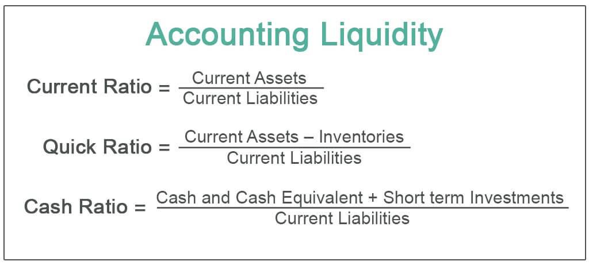

Understanding the financial health of a business is essential for its long-term sustainability and growth. One of the primary metrics utilized in this assessment is the liquidity ratio, which evaluates a company's capacity to meet its short-term debt commitments. This metric serves as a vital component in financial analysis, offering insights into a firm's operational stability and financial security. 

The liquidity ratio is a critical measure for investors and creditors as it signals a company's ability to manage its immediate obligations without compromising its financial stability. It provides a quantitative basis for business decision-making processes by highlighting the firm's financial flexibility. However, the importance of maintaining an optimal liquidity ratio cannot be understated. An excessively low liquidity ratio may indicate potential financial distress, suggesting that the company might struggle to meet its short-term liabilities. Conversely, a high liquidity ratio, while generally seen as a sign of financial robustness, can also suggest inefficiencies, as the company might be holding onto assets that could otherwise be deployed towards growth and investment opportunities.

This article will also explore how liquidity ratios intersect with algorithmic trading, a sophisticated tool that has revolutionized modern financial markets. Algorithmic trading relies on automated, high-speed transactions that are often influenced by a firm's liquidity position. Understanding this relationship can provide insights into how liquidity ratios can affect market behavior and trading strategies. 

Overall, liquidity ratios serve as a cornerstone of both traditional and modern financial analysis, playing a key role in the ongoing assessment of a company's financial health and strategic decision-making capabilities.

## Table of Contents

## Understanding Liquidity Ratios in Business Finance

Liquidity ratios are essential financial metrics that assess a company's ability to meet its short-term obligations using its most liquid assets. They provide insights into the financial stability of a business by comparing its current assets to its current liabilities. The two most common liquidity ratios are the current ratio and the quick ratio, also known as the acid-test ratio.

### Current Ratio

The current ratio is calculated by dividing a company's current assets by its current liabilities:

$$
\text{Current Ratio} = \frac{\text{Current Assets}}{\text{Current Liabilities}}
$$

This ratio indicates how well a company can cover its short-term liabilities with its short-term assets. A current ratio greater than one suggests that the company has more assets than liabilities, which typically signals good financial health. However, the ideal value for the current ratio can vary significantly depending on industry standards and the nature of a business's operations.

### Quick Ratio (Acid-Test Ratio)

The quick ratio offers a more stringent test of [liquidity](/wiki/liquidity-risk-premium) by excluding inventory from current assets. It is calculated as follows:

$$
\text{Quick Ratio} = \frac{\text{Current Assets} - \text{Inventory}}{\text{Current Liabilities}}
$$

This ratio measures a company's ability to meet its short-term obligations with its most liquid assets—those that can be quickly converted to cash. A quick ratio greater than one indicates that a company can instantly pay off its current liabilities without depending on the sale of inventory.

### Significance to Investors and Analysts

Investors and financial analysts focus on liquidity ratios to assess the risk and performance potential of a business. These ratios provide valuable insight into a firm's operational efficiency and financial health. A higher ratio generally reflects better liquidity and suggests that a company is less likely to face financial distress in the short term. However, extremely high liquidity ratios might indicate that a company is not effectively utilizing its assets to grow and generate returns.

Analyzing liquidity ratios involves not only assessing standalone values but also comparing them with industry norms and historical data. This comparative analysis helps in identifying trends, potential financial weaknesses, and opportunities for improvement. Consequently, liquidity ratios serve as a fundamental tool for decision-making in business finance. 

In summary, liquidity ratios are crucial indicators of a company's financial position, assisting stakeholders in evaluating how well a company can handle its short-term obligations while maintaining operational stability.

## Financial Analysis: Importance of Liquidity Ratios

Liquidity ratios are crucial in financial analysis as they assess a business's ability to cover its short-term debts. This assessment is essential for maintaining operations, especially during economic [volatility](/wiki/volatility-trading-strategies). Two primary liquidity ratios, the current ratio and the quick ratio, serve as benchmarks for evaluating a company's short-term financial health. The formula for the current ratio is: 

$$
\text{Current Ratio} = \frac{\text{Current Assets}}{\text{Current Liabilities}}
$$

This ratio helps stakeholders determine if a company has enough short-term assets to cover its short-term liabilities. Industries requiring rapid asset conversion to cash, such as retail and hospitality, particularly rely on maintaining optimal liquidity ratios to manage operational fluctuations efficiently.

Beyond the ratios themselves, comparing a business's liquidity ratio against industry standards and competitor benchmarks is crucial for a comprehensive analysis. While a current ratio above 1 indicates that current assets exceed current liabilities, the context is vital; certain industries might require higher ratios due to their unique operational dynamics. Moreover, historical data analysis of a company's liquidity ratios can reveal trends that signal either strengthening or weakening financial stability.

Analyzing liquidity ratios provides insights into not just a company's current financial standing but also its ability to withstand financial stress. These ratios, when contextualized with market information, help in identifying potential financial weaknesses. For example, a declining quick ratio over consecutive periods may highlight a company's increasing reliance on inventory sales to meet liabilities, suggesting potential liquidity issues.

In conclusion, liquidity ratios serve as a foundational element in financial analysis, enabling stakeholders to make informed decisions about a company's financial health and strategic direction. Understanding and evaluating these ratios within industry contexts and historical trends provides a deeper understanding of a company's financial stability and operational efficiency.

## The Role of Liquidity Ratios in Algorithmic Trading

Algorithmic trading relies on the rapid and precise execution of transactions in financial markets, which necessitates a comprehensive understanding of liquidity. Liquidity, in this context, refers to the ease with which assets can be bought or sold in the market without significantly affecting their prices. Liquidity ratios, which assess a company's ability to meet its short-term obligations, play a vital role in informing trading strategies.

Trading algorithms utilize liquidity ratios to gauge market conditions and assess the potential impact of trades. Algorithms designed for strategies such as [market making](/wiki/market-making) and statistical [arbitrage](/wiki/arbitrage) leverage the insights provided by liquidity ratios to determine optimal entry and [exit](/wiki/exit-strategy) points, ensuring efficient market participation and maintaining price stability. For instance, market makers require a thorough understanding of liquidity to provide buying and selling prices that are beneficial yet sustainable, avoiding significant slippage.

In [statistical arbitrage](/wiki/statistical-arbitrage), liquidity ratios help identify mispricings between correlated securities, allowing traders to capitalize on temporary discrepancies. This approach demands a balance between speed and accuracy, as market conditions can change rapidly. Algorithmic models need to be sophisticated enough to incorporate real-time liquidity assessments accurately.

Considerations of liquidity in [algorithmic trading](/wiki/algorithmic-trading) are not limited to maintaining operational efficiency; they also play a critical role in risk management. Understanding liquidity's influence on market behavior is fundamental to establishing reliable decision-making protocols in trading algorithms. This includes determining the size of trade orders to execute without causing excessive market impact, which is crucial for minimizing trading costs and maintaining profitability.

Incorporating liquidity insights requires advanced computing and analytical capabilities. Programming languages like Python offer tools that allow traders to build and test models that integrate liquidity data. For instance, Python libraries such as Pandas and NumPy can be used to compute liquidity ratios and analyze trends over time, while [machine learning](/wiki/machine-learning) techniques can optimize algorithmic responses to liquidity changes.

Thus, liquidity ratios are indispensable in shaping algorithmic trading strategies, affecting both the efficiency of trade executions and the robustness of risk management practices. Understanding liquidity dynamics empowers traders to design algorithms that are not only responsive to market conditions but also innovative in leveraging liquidity-driven opportunities.

## Challenges and Risks of High Liquidity Ratios

High liquidity ratios, often interpreted as indicators of a company's robust financial health, present a paradox when viewed through the lens of growth potential and resource efficiency. While they assure creditors and investors of a firm's ability to meet short-term obligations, they can signal an underutilization of assets, resulting in missed opportunities for expansion and innovation.

In scenarios where liquidity ratios significantly exceed industry norms, a company might be criticized for hoarding excess cash or marketable securities instead of channeling resources into projects that could drive growth. For instance, surplus liquidity could be invested in technological advancements, market expansion, or even research and development activities that promise higher returns. Failing to do so can lead to stagnation, especially in fast-evolving sectors where agility and innovation are key.

Balancing liquidity ratios is not merely a matter of maintaining a buffer for operational needs; it requires strategic financial planning. Companies must evaluate the opportunity cost of holding onto liquid assets versus investing them in growth opportunities. This involves a nuanced understanding of market conditions and industry dynamics. For example, companies might employ forecasting models and scenario analyses to predict cash flow requirements and identify potential investment avenues with optimal risk-reward profiles.

Strategic asset allocation becomes paramount in this context. By judiciously managing their balance sheet, companies can optimize their asset structure. A possible strategy could include earmarking a portion of excess liquidity for strategic ventures while maintaining a satisfactory buffer for unforeseen contingencies. This ensures that the company remains nimble enough to capitalize on market opportunities while safeguarding day-to-day operations.

In conclusion, while high liquidity ratios suggest financial security in the short term, they necessitate a strategic approach to resource management to prevent missed growth opportunities. A balanced liquidity strategy integrates both security and growth, positioning the company to thrive in a competitive market landscape.

## Conclusion

Liquidity ratios are a cornerstone of financial analysis, indispensable for offering insights into a company's capability to handle its short-term obligations effectively. By comparing current assets to current liabilities, these ratios, such as the current ratio and quick ratio, help assess financial health and liquidity, which are crucial for sustaining business operations and gaining the confidence of investors and lenders. A well-maintained liquidity ratio acts as a safeguard against financial distress, ensuring companies can meet immediate liabilities, thereby enhancing operational certainty.

Beyond traditional finance, liquidity ratios also hold significance in algorithmic trading strategies. Algorithmic trading demands a nuanced understanding of market liquidity to optimize trade execution and influence market strategies effectively. Liquidity parameters are integral in forming strategies like market making and statistical arbitrage, where an understanding of liquidity dynamics can lead to more informed decision-making protocols. This integration underscores the broad utility of liquidity ratios, bridging conventional financial analysis with cutting-edge trading technologies.

For businesses, the challenge lies in sustaining an optimal liquidity ratio that not only offers financial flexibility but also maximizes growth opportunities. A balanced liquidity ratio aligns with strategic financial planning, allowing companies to respond swiftly to liabilities while capitalizing on market opportunities as they present themselves. This equilibrium is essential for long-term growth and stability, by harmonizing the need for liquidity with the pursuit of strategic investments.

## References & Further Reading

[1]: ["Financial Ratios for Executives: How to Assess Company Strength, Fix Problems, and Make Better Decisions"](https://link.springer.com/book/10.1007/978-1-4842-0731-4) by Michael Rist

[2]: ["Algorithmic Trading and DMA: An Introduction to Direct Access Trading Strategies TradeTech Specialist Books"](https://archive.org/details/algorithmictradi0000john) by Barry Johnson

[3]: ["Liquidity Risk: Managing Funding and Asset Risk"](https://link.springer.com/book/10.1057/9781137374400) by E. Banks

[4]: ["Liquidity Risk and Asset-Liability Management"](https://prmia.org/common/Uploaded%20files/MLARM/PRMIA_MLARM_Guidebook.pdf) by Hong Kong Institute of Bankers

[5]: ["The Handbook of Fixed Income Securities"](https://www.amazon.com/Handbook-Fixed-Income-Securities-Ninth/dp/1260473899) by Frank J. Fabozzi

[6]: ["High-Frequency Trading: A Practical Guide to Algorithmic Strategies and Trading Systems"](https://www.ahmetbeyefendi.com/wp-content/uploads/2020/07/High-Frequency-Trading-Irene-Aldridge.pdf) by Irene Aldridge